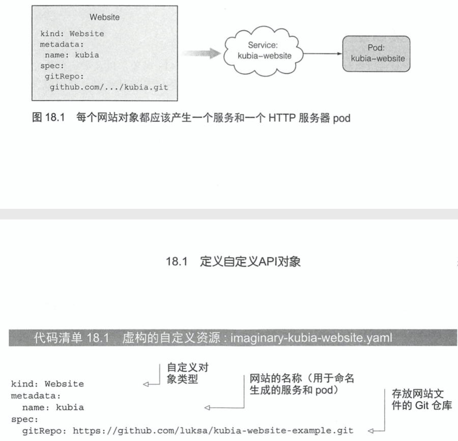
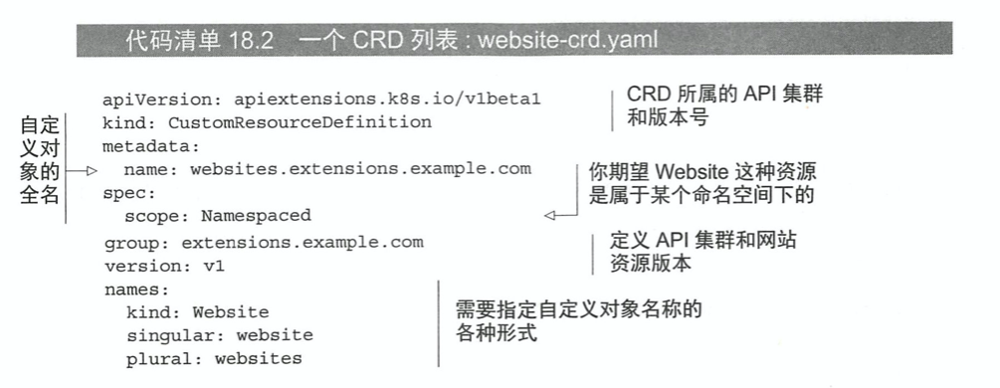
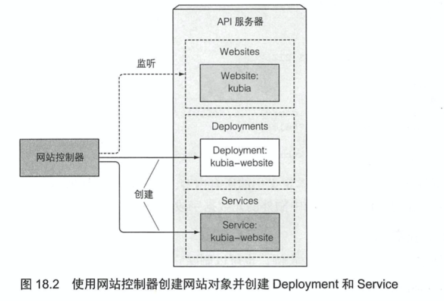

# KubernetesInAction学习笔记（18）

## 第18章 Kubernetes应用扩展

本章将介绍如何自定义 API 对象，并为这些对象添加控制器，除此以外还会了解基于 K8S 的 PaaS 概念（saas，soft-as-a-service 的升级版，platform-as-a-service 平台即服务）。

### 18.1 定义自定义 API 对象

目前 K8S 用户使用的大多是是代表相对底层、通用概念的对象，但是随着 K8S 生态系统的持续发展，越来越多的高层次对象资源将会不断涌现。使用这些高级对象，开发者将不需要逐一进行 Deployment、Service、ConfigMap 这些底层资源的管理和创建，而只需要使用自定义控件观察这些高阶对象就可以了。

#### 18.1.1 CustomResourceDefinitions 介绍（简称为 CRD）

向 K8S API 服务器提交 CRD 对象，可以用于定义新的资源类型。成功提交 CRD 之后，就能通过 API 服务器提交 JSON 清单或者 YAML 清单的方式创建自定义资源，以及其他的 K8S 资源实例。

##### CRD 范例介绍

接下来会创建一种名为 Website 的资源，它可以让创建该资源的用户不必处理 pod、服务以及其他 K8S 资源，而只需要确认网站域名以及网站中的文件，就能在 K8S 上运行一个静态网站。

总体的思路是，使用一个 Git 存储库当作这些文件的来源，当用户创建 Website 资源实例时，同时创建一个 web 服务器的 pod，并通过 service 将其公开，流程和 manifest 如下所示：



确认目标之后，就需要创建一个 CRD 对象，让 K8S 识别该资源，并通过`kubectl create`命令来创建该资源。

##### 创建一个 CRD 对象



```yaml
names:
    # 名称的复数形式，用于 URL：/apis/<组>/<版本>/<名称的复数形式>
    plural: crontabs
    # 名称的单数形式，作为命令行使用时和显示时的别名
    singular: crontab
    # kind 通常是单数形式的驼峰编码（CamelCased）形式。你的资源清单会使用这一形式。
    kind: CronTab
    # shortNames 允许你在命令行使用较短的字符串来匹配资源
    shortNames:
    - ct
```

```shell
$ kubectl create -f website-crd.yaml
```

创建 crd 对象后，API 服务器就会接收并存储自定义对象，换句话说，现在的 K8S 已经可以识别并创建 Website 资源了（尽管现在这个对象其实还没有做什么，只存储了一些基础的字段）。

```shell
$ kubectl create -f kubia-website.yaml
```

创建完成后，就可以检索或删除已有的 websites 资源了。

```shell
$ kubectl get websites

$kubectl delete website kubia
```

#### 18.1.2 使用自定义控制器自动定制资源

可以看到上面的对象在创建之后并不会做任何事，这是正常的，因为**某些自定义对象仅用于存储数据，而不是使用更通用的机制（例如 ConfigMap）**，在 pod 内运行的应用程序可以查询这些对象的 API 服务器并读取存储在其中的值。

但是如果我们期望这个自定义对象可以为我们做一些事，比如说启动 pod，启动服务等等，就需要做一些额外的动作：构建和部署一个自定义控制器，用于观察并监听 API 服务器创建 WebSite 资源对象的过程，然后为每一个对象创建 pod 和对应的服务。



在上面的例子中，控制器将会创建 Deployment 资源，而不是直接创建非托管 pod，这样就能确保 pod 既能被管理，还能在遇到节点故障时继续正常工作。

##### 了解网站控制器的功能


> 本次应阅读至 P522 了解网站控制器的功能 533