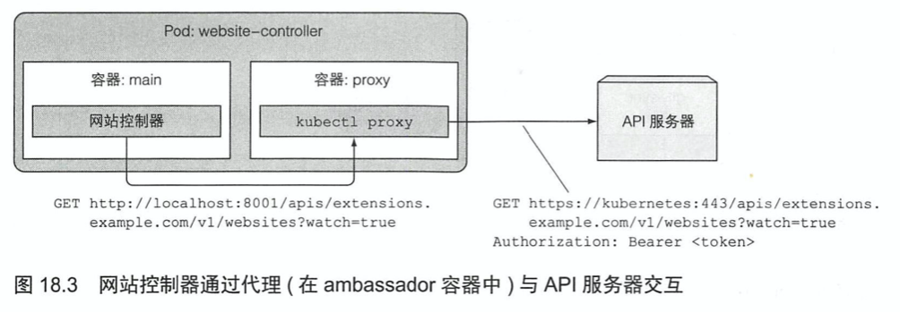
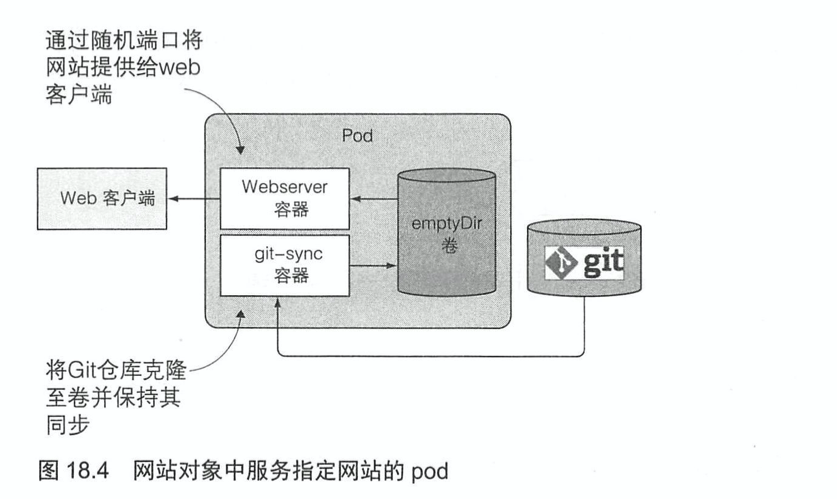
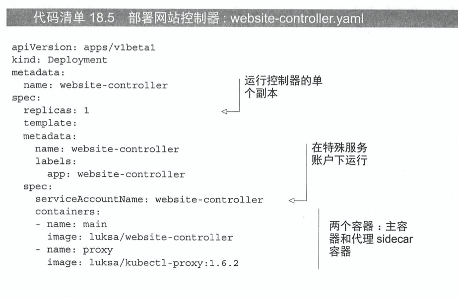
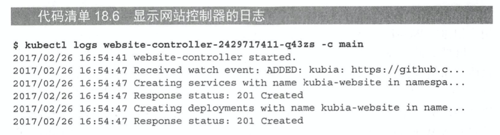
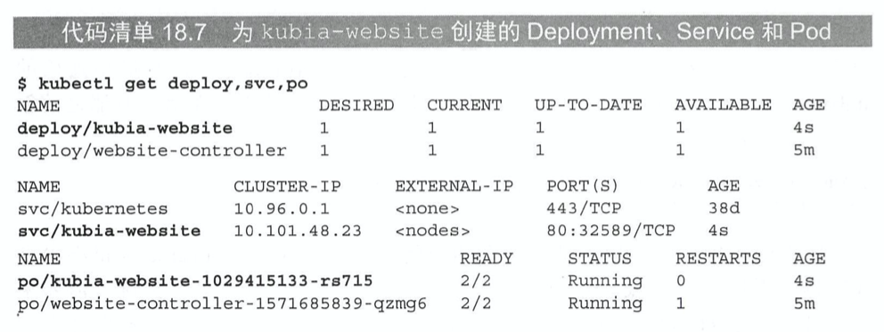
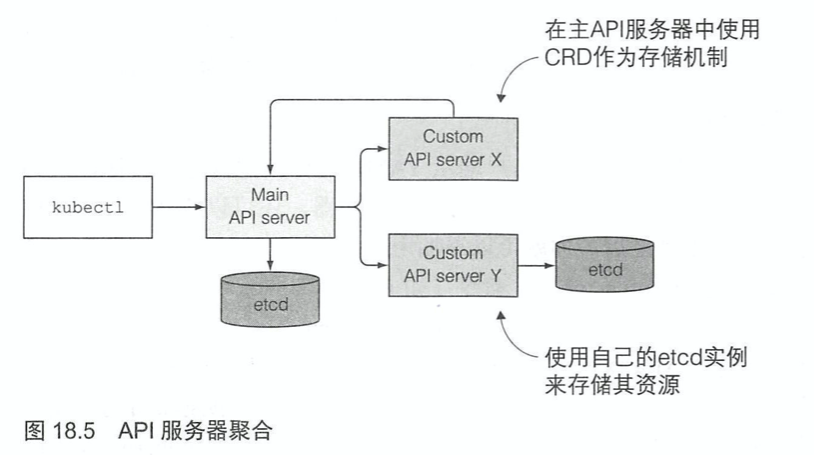
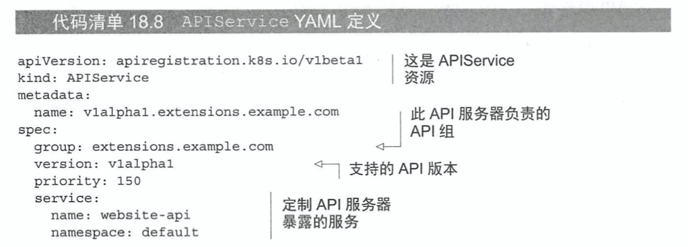

# KubernetesInAction学习笔记（18）

## 第18章 Kubernetes应用扩展

本章将介绍如何自定义 API 对象，并为这些对象添加控制器，除此以外还会了解基于 K8S 的 PaaS 概念（saas，soft-as-a-service 的升级版，platform-as-a-service 平台即服务）。

### 18.1 定义自定义 API 对象

目前 K8S 用户使用的大多是是代表相对底层、通用概念的对象，但是随着 K8S 生态系统的持续发展，越来越多的高层次对象资源将会不断涌现。使用这些高级对象，开发者将不需要逐一进行 Deployment、Service、ConfigMap 这些底层资源的管理和创建，而只需要使用自定义控件观察这些高阶对象就可以了。

#### 18.1.1 CustomResourceDefinitions 介绍（简称为 CRD）

向 K8S API 服务器提交 CRD 对象，可以用于定义新的资源类型。成功提交 CRD 之后，就能通过 API 服务器提交 JSON 清单或者 YAML 清单的方式创建自定义资源，以及其他的 K8S 资源实例。

##### CRD 范例介绍

接下来会创建一种名为 Website 的资源，它可以让创建该资源的用户不必处理 pod、服务以及其他 K8S 资源，而只需要确认网站域名以及网站中的文件，就能在 K8S 上运行一个静态网站。

总体的思路是，使用一个 Git 存储库当作这些文件的来源，当用户创建 Website 资源实例时，同时创建一个 web 服务器的 pod，并通过 service 将其公开，流程和 manifest 如下所示：


确认目标之后，就需要创建一个 CRD 对象，让 K8S 识别该资源，并通过`kubectl create`命令来创建该资源。

##### 创建一个 CRD 对象


```yaml
names:
    # 名称的复数形式，用于 URL：/apis/<组>/<版本>/<名称的复数形式>
    plural: crontabs
    # 名称的单数形式，作为命令行使用时和显示时的别名
    singular: crontab
    # kind 通常是单数形式的驼峰编码（CamelCased）形式。你的资源清单会使用这一形式。
    kind: CronTab
    # shortNames 允许你在命令行使用较短的字符串来匹配资源
    shortNames:
    - ct
```

```shell
$ kubectl create -f website-crd.yaml
```

创建 crd 对象后，API 服务器就会接收并存储自定义对象，换句话说，现在的 K8S 已经可以识别并创建 Website 资源了（尽管现在这个对象其实还没有做什么，只存储了一些基础的字段）。

```shell
$ kubectl create -f kubia-website.yaml
```

创建完成后，就可以检索或删除已有的 websites 资源了。

```shell
$ kubectl get websites

$kubectl delete website kubia
```

#### 18.1.2 使用自定义控制器自动定制资源

可以看到上面的对象在创建之后并不会做任何事，这是正常的，因为**某些自定义对象仅用于存储数据，而不是使用更通用的机制（例如 ConfigMap）**，在 pod 内运行的应用程序可以查询这些对象的 API 服务器并读取存储在其中的值。

但是如果我们期望这个自定义对象可以为我们做一些事，比如说启动 pod，启动服务等等，就需要做一些额外的动作：构建和部署一个自定义控制器，用于观察并监听 API 服务器创建 WebSite 资源对象的过程，然后为每一个对象创建 pod 和对应的服务。


在上面的例子中，控制器将会创建 Deployment 资源，而不是直接创建非托管 pod，这样就能确保 pod 既能被管理，还能在遇到节点故障时继续正常工作。

> 该控制器的容器镜像源码存放在 github 上，地址为：https://github.com/luksa/k8s-website-controller

##### 了解网站控制器的功能

该网站控制镜像容器在启动后，会做以下事情：

- 通过在同一个 pod 中运行的 sidecar 容器中运行的`kubectl proxy`进程，对集群中的 websites 对象进行查询，方法为查询 API 服务器的对应 URL：http://localhost:8001/apis/extensions.example.com/v1/websites?watch=true，其中，watch 的 query 用于订阅该资源的状态

  

- 通过此 HTTP GET 请求打开的连接，API 服务器将针对任何网站对象的每个更改发送监听事件（watch event）

- 每次创建新的 WebSite 资源时，API 服务器就会发送 ADDED 监听事件。控制器收到这样的事件后，就会提取该监听事件传过来的网站名称和 Git 存储库的 URL，并自动创建对应的 Deployment 和 Service 对象。

  

- 当 WebSites 资源实例被删除时，API 服务器会发送 DELETED 监听事件。通知起同样会关闭并删除为该网站提供的相应 Deployment 和 Service

> PS：当我们通过 API 服务器查看对象时，还要定期重新列出所有对象，以防止监听事件被错过

##### 将控制器作为 pod 运行

在开发期间，开发者会使用本地运行的 kubectl proxy 进程作为 API 服务器的 ambassador，而不是作为 pod 运行。这样能够更快地完成开发，因为不需要在每次修改源代码之后构建一个容器镜像，然后再 K8S 内运行它。

但是当要将控制器部署到生产环境中时，最好的方法就是在 K8S 内部运行控制器，就像其他所有核心控制器那样，也就是通过 pod 的方式进行部署。

可以建立一个控制器的 Deployment 来部署控制器资源。



在部署这个控制器之前，记得创建一个特殊的 serviceaccount 并为它绑定一个特有的角色，并赋予该角色查看网站资源、创建 Deployment 或 Service 的权限。

```shell
$ kubectl create serviceaccount website-controller

$ kubectl create clusterrolebinding website-controller --clusterrole=cluster-admin --serviceaccount=default:website-controller
```

然后就可以通过准备好的 Deployment 定义文件创建资源了。

```shell
$ kubectl create -f kubia-websiste.yaml
```

##### 观察运行中的控制器

使用 kubectl logs 命令可以检查控制器的日志。





#### 18.1.3 验证自定义对象

在本节之前，CRD 没有对字段进行任何校验，这意味着用户可以在 WebSite 对象的 YAML 文件中包含他们想要的任何字段。由于 API 服务器并不会验证 YAML 的内容，那么用户创建的 Website 对象就有可能是无效对象（例如说没有 gitRepo 字段）

如果希望 API 服务器在验证自定义对象时立即拒绝无效对象，就需要在 API 服务器中启用 CustomResourceValidation 特性，并在 CRD 中指定一个 JSON schema。

#### 18.1.4 为自定义对象提供自定义 API 服务器

如果想要更好地支持在 K8S 中添加自定义对象，最好的方式是使用自己的 API 服务器，并让它直接与客户端进行交互。

##### API 服务器聚合

通过 API 服务器聚合，可以将自定义 API 服务器与主 Kubernetes 服务器进行聚合。1.7 版本以后，K8S API 服务器甚至支持在同一个域名聚合多个 API 服务器，如此一来客户端甚至不会察觉到有多个 API 服务器正在处理不同的对象。



因此，可以创建一个专门负责处理 Website 资源对象的 API 服务器，并使它参照 K8S API 服务器的方式来验证请求，这样就不必再创建 CRD 来表示这些对象，而是可以直接将 WebSite 对象类型实现到你的自定义 API 服务器中。

##### 注册一个自定义 API 服务器

要将自定义 API 服务器添加到集群中，可以将其部署为一个 pod 并通过 Service 暴露，下一步为了将它集成到主 API 服务器中，需要部署一个 APIService 资源的 YAML 列表，如下所示：



创建该 APIService 资源后，被发送到主 API 服务器的包含`extensions.example.com`API 组任何资源的客户端请求，都会被转发到通过`website-api`Service 公开的自定义 API 服务器 pod。

##### 创建自定义客户端

除了上述如此复杂的方式以外，还可以通过自定义像`kubectl`这样的 CLI 工具来达到目的。

### 18.2 使用 K8S 服务目录来扩展 Kubernetes

**PS：看不懂的一节...个人理解大概就是无服务（serverless）的底层原理**？比如说 K8S 平台通过服务目录提供一个通用的 node 服务，开发者只要按照其对应的规则进行配置就能基于集群启动一个应用。

用户可以浏览服务目录并自行设置目录中所列出的服务实例，而无需处理服务运行所需要的任何 K8S 底层资源（如 Pod、Service、ConfigMap 等）。

#### 18.2.6 服务目录给我们带来了什么

服务提供者可以通过在任何 K8S 集群中注册代理，在该集群中暴露服务，这就是服务目录的最大作用。

### 18.3 基于 Kubernetes 搭建的平台


> 本次应阅读至 P536 18.3 基于 Kubernetes 搭建的平台 548