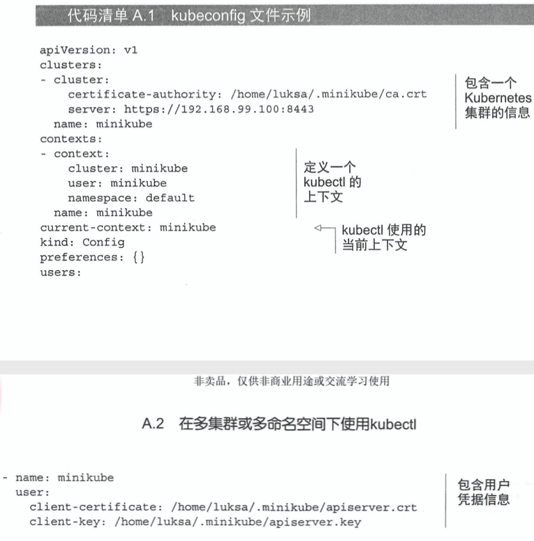
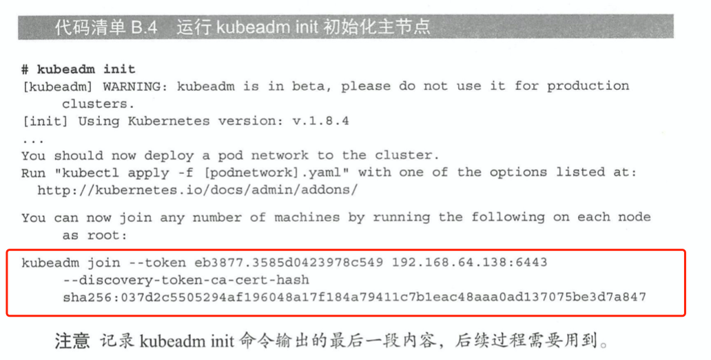
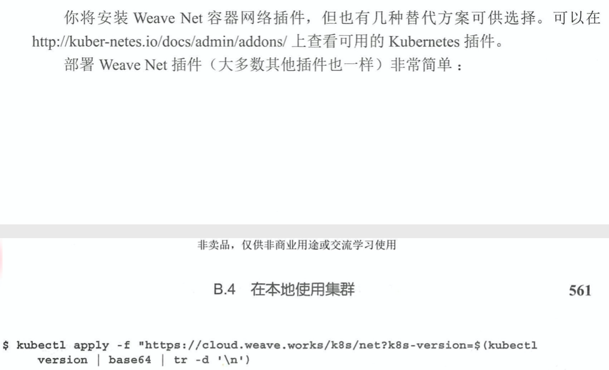
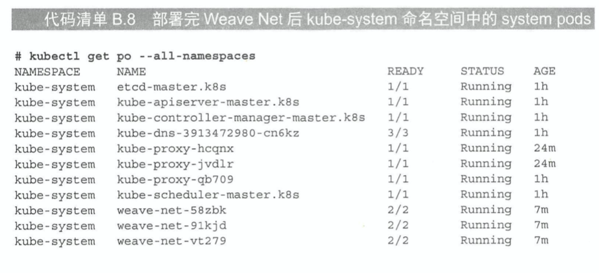

# KubernetesInAction学习笔记（18）

## 第18章 Kubernetes应用扩展

本章将介绍如何自定义 API 对象，并为这些对象添加控制器，除此以外还会了解基于 K8S 的 PaaS 概念（saas，soft-as-a-service 的升级版，platform-as-a-service 平台即服务）。

### 18.1 定义自定义 API 对象

目前 K8S 用户使用的大多是是代表相对底层、通用概念的对象，但是随着 K8S 生态系统的持续发展，越来越多的高层次对象资源将会不断涌现。使用这些高级对象，开发者将不需要逐一进行 Deployment、Service、ConfigMap 这些底层资源的管理和创建，而只需要使用自定义控件观察这些高阶对象就可以了。

#### 18.1.1 CustomResourceDefinitions 介绍（简称为 CRD）

向 K8S API 服务器提交 CRD 对象，可以用于定义新的资源类型。成功提交 CRD 之后，就能通过 API 服务器提交 JSON 清单或者 YAML 清单的方式创建自定义资源，以及其他的 K8S 资源实例。

##### CRD 范例介绍

接下来会创建一种名为 Website 的资源，它可以让创建该资源的用户不必处理 pod、服务以及其他 K8S 资源，而只需要确认网站域名以及网站中的文件，就能在 K8S 上运行一个静态网站。

总体的思路是，使用一个 Git 存储库当作这些文件的来源，当用户创建 Website 资源实例时，同时创建一个 web 服务器的 pod，并通过 service 将其公开，流程和 manifest 如下所示：


确认目标之后，就需要创建一个 CRD 对象，让 K8S 识别该资源，并通过`kubectl create`命令来创建该资源。

##### 创建一个 CRD 对象


```yaml
names:
    # 名称的复数形式，用于 URL：/apis/<组>/<版本>/<名称的复数形式>
    plural: crontabs
    # 名称的单数形式，作为命令行使用时和显示时的别名
    singular: crontab
    # kind 通常是单数形式的驼峰编码（CamelCased）形式。你的资源清单会使用这一形式。
    kind: CronTab
    # shortNames 允许你在命令行使用较短的字符串来匹配资源
    shortNames:
    - ct
```

```shell
$ kubectl create -f website-crd.yaml
```

创建 crd 对象后，API 服务器就会接收并存储自定义对象，换句话说，现在的 K8S 已经可以识别并创建 Website 资源了（尽管现在这个对象其实还没有做什么，只存储了一些基础的字段）。

```shell
$ kubectl create -f kubia-website.yaml
```

创建完成后，就可以检索或删除已有的 websites 资源了。

```shell
$ kubectl get websites

$kubectl delete website kubia
```

#### 18.1.2 使用自定义控制器自动定制资源

可以看到上面的对象在创建之后并不会做任何事，这是正常的，因为**某些自定义对象仅用于存储数据，而不是使用更通用的机制（例如 ConfigMap）**，在 pod 内运行的应用程序可以查询这些对象的 API 服务器并读取存储在其中的值。

但是如果我们期望这个自定义对象可以为我们做一些事，比如说启动 pod，启动服务等等，就需要做一些额外的动作：构建和部署一个自定义控制器，用于观察并监听 API 服务器创建 WebSite 资源对象的过程，然后为每一个对象创建 pod 和对应的服务。


在上面的例子中，控制器将会创建 Deployment 资源，而不是直接创建非托管 pod，这样就能确保 pod 既能被管理，还能在遇到节点故障时继续正常工作。

> 该控制器的容器镜像源码存放在 github 上，地址为：https://github.com/luksa/k8s-website-controller

##### 了解网站控制器的功能

该网站控制镜像容器在启动后，会做以下事情：

- 通过在同一个 pod 中运行的 sidecar 容器中运行的`kubectl proxy`进程，对集群中的 websites 对象进行查询，方法为查询 API 服务器的对应 URL：http://localhost:8001/apis/extensions.example.com/v1/websites?watch=true，其中，watch 的 query 用于订阅该资源的状态

  

- 通过此 HTTP GET 请求打开的连接，API 服务器将针对任何网站对象的每个更改发送监听事件（watch event）

- 每次创建新的 WebSite 资源时，API 服务器就会发送 ADDED 监听事件。控制器收到这样的事件后，就会提取该监听事件传过来的网站名称和 Git 存储库的 URL，并自动创建对应的 Deployment 和 Service 对象。

  

- 当 WebSites 资源实例被删除时，API 服务器会发送 DELETED 监听事件。通知起同样会关闭并删除为该网站提供的相应 Deployment 和 Service

> PS：当我们通过 API 服务器查看对象时，还要定期重新列出所有对象，以防止监听事件被错过

##### 将控制器作为 pod 运行

在开发期间，开发者会使用本地运行的 kubectl proxy 进程作为 API 服务器的 ambassador，而不是作为 pod 运行。这样能够更快地完成开发，因为不需要在每次修改源代码之后构建一个容器镜像，然后再 K8S 内运行它。

但是当要将控制器部署到生产环境中时，最好的方法就是在 K8S 内部运行控制器，就像其他所有核心控制器那样，也就是通过 pod 的方式进行部署。

可以建立一个控制器的 Deployment 来部署控制器资源。


在部署这个控制器之前，记得创建一个特殊的 serviceaccount 并为它绑定一个特有的角色，并赋予该角色查看网站资源、创建 Deployment 或 Service 的权限。

```shell
$ kubectl create serviceaccount website-controller

$ kubectl create clusterrolebinding website-controller --clusterrole=cluster-admin --serviceaccount=default:website-controller
```

然后就可以通过准备好的 Deployment 定义文件创建资源了。

```shell
$ kubectl create -f kubia-websiste.yaml
```

##### 观察运行中的控制器

使用 kubectl logs 命令可以检查控制器的日志。


#### 18.1.3 验证自定义对象

在本节之前，CRD 没有对字段进行任何校验，这意味着用户可以在 WebSite 对象的 YAML 文件中包含他们想要的任何字段。由于 API 服务器并不会验证 YAML 的内容，那么用户创建的 Website 对象就有可能是无效对象（例如说没有 gitRepo 字段）

如果希望 API 服务器在验证自定义对象时立即拒绝无效对象，就需要在 API 服务器中启用 CustomResourceValidation 特性，并在 CRD 中指定一个 JSON schema。

#### 18.1.4 为自定义对象提供自定义 API 服务器

如果想要更好地支持在 K8S 中添加自定义对象，最好的方式是使用自己的 API 服务器，并让它直接与客户端进行交互。

##### API 服务器聚合

通过 API 服务器聚合，可以将自定义 API 服务器与主 Kubernetes 服务器进行聚合。1.7 版本以后，K8S API 服务器甚至支持在同一个域名聚合多个 API 服务器，如此一来客户端甚至不会察觉到有多个 API 服务器正在处理不同的对象。


因此，可以创建一个专门负责处理 Website 资源对象的 API 服务器，并使它参照 K8S API 服务器的方式来验证请求，这样就不必再创建 CRD 来表示这些对象，而是可以直接将 WebSite 对象类型实现到你的自定义 API 服务器中。

##### 注册一个自定义 API 服务器

要将自定义 API 服务器添加到集群中，可以将其部署为一个 pod 并通过 Service 暴露，下一步为了将它集成到主 API 服务器中，需要部署一个 APIService 资源的 YAML 列表，如下所示：


创建该 APIService 资源后，被发送到主 API 服务器的包含`extensions.example.com`API 组任何资源的客户端请求，都会被转发到通过`website-api`Service 公开的自定义 API 服务器 pod。

##### 创建自定义客户端

除了上述如此复杂的方式以外，还可以通过自定义像`kubectl`这样的 CLI 工具来达到目的。

### 18.2 使用 K8S 服务目录来扩展 Kubernetes

**PS：看不懂的一节...个人理解大概就是无服务（serverless）的底层原理**？比如说 K8S 平台通过服务目录提供一个通用的 node 服务，开发者只要按照其对应的规则进行配置就能基于集群启动一个应用。

用户可以浏览服务目录并自行设置目录中所列出的服务实例，而无需处理服务运行所需要的任何 K8S 底层资源（如 Pod、Service、ConfigMap 等）。

#### 18.2.6 服务目录给我们带来了什么

服务提供者可以通过在任何 K8S 集群中注册代理，在该集群中暴露服务，这就是服务目录的最大作用。

### 18.3 基于 Kubernetes 搭建的平台

基于 K8S 构建的最著名的 PaaS 系统包括 Deis Workflow 和 Red Hat 的 OpenShift。

#### 18.3.1 红帽 OpenShift 容器平台

Red Hat OpenShift 作为一个 PaaS 平台，旨在帮助开发者实现应用程序的快速开发、便捷部署、轻松扩展以及长期维护。在 K8S 发布之后，OpenShift 容器平台抛弃了原有的架构，基于 K8S 重新开发了第三版。

#### 18.3.2 Deis Workflow 与 Helm

另一个基于 K8S 开发的优秀 PaaS 产品案例是 Deis 的 Workflow，除了 Workflow，还有一个名为 Helm 的工具。

在 K8S 社区里，Helm 已经成了部署现有应用的标准方式，具有了极大的知名度。

##### Deis Workflow 简介

可以将 Deis Workflow 部署到任何现有的 K8S 集群中（OpenShift 是一个包含修改后的 API 服务器和其他 K8S 组件的完整集群）。Workflow 会创建一组 Service 和 ReplicationConroller，为开发人员提供一个简单、友好的开发环境。

只需要通过`git push deis master`推送更改就可以触发应用程序新版本的更新，而剩下的工作都会由 Workflow 来完成。与 OpenShift 类似，Workflow 也为核心 K8S 中的镜像机制、应用部署和回滚、边缘路由、日志聚合、指标监控和告警提供了源。

##### 通过 Helm 部署资源

Helm 是一个 K8S 的包管理器（类似于 yum、apt、homegrew 等等 OS 包管理器），由两部分组成：

- 一个 helm CLI 工具（客户端）
- Tiller，一个作为 K8S 集群内 pod 运行的服务器组建

这两个组件用于在 K8S 集群中部署和管理应用程序包，Helm 应用程序包被称为**图表**，这些图表通过与 Tiller 服务器交互，可以直接在集群中创建所有图表中定义的必需 K8S 资源。


比如说，想要在 K8S 集群中运行 MySQL，只需要将图表 Git 仓库克隆到你的本地，然后运行以下命令（确保你的集群中运行了 Helm 的 CLI 工具和 Tiller）：

```shell
$ helm install --name my-database stable/mysql
```

这样就能够创建在集群中运行 MySQL 所需要的 Deployment、Service、Secret 和 PersistentVolumeClaim，而不需要关心自己需要什么组件，以及如何配置它们。

## 附录A 在多个集群中使用 kubectl

### A.2 在多集群或多命名空间下使用 kubectl

如果想要在默认命名空间之外的命名空间下操作，但又不想在每次运行 kubectl 时指定 --namespace 选项，可以对 kubectl 进行配置。

#### A.2.1 配置 kubeconfig 文件的路径

kubectl 使用的配置通常存储在`~/.kube/config`文件中。如果存储在其他位置，环境变量 KUBECONFIG 需要指向配置文件的位置。

> 可以通过在 KUBECONFIG 环境变量中指定多个配置文件（使用冒号来分隔），让 kubectl 一次性加载全部配置。

#### A.2.2 了解 kubeconfig 文件中的内容



kubeconfig 文件由以下四部分组成：

- 集群列表（clusters）：代表 K8S 集群，并包含 API 服务器的 URL、证书颁发机构（CA）文件，以及可能与通过 API 服务器进行通信相关的一些其他配置选项。CA 证书可以存储在单独的文件中并引用，也可以直接将其包含在 kubeconfig 文件的`certificate-authority-data`字段中。
- 用户列表（users）：定义了在与 API 服务器交谈时使用的凭据，证书和密钥可以包含在 kubeconfig 文件中（通过`client-certificate-data`和`client-key-data`属性），或是存储在单独的文件中并在配置文件中引用
- 上下文列表（contexts）：上下文将 kubectl 执行命令时应该使用的集群、用户以及默认命名空间关联在一起
- 当前上下文名称（current-context）：虽然可以定义多个上下文，但在同一时间，只有一个是当前上下文

每个集群、用户和上下文都有一个名称用于区分。

#### A.2.3 查询、添加和修改 kube 配置条目

既可以通过手动编辑 kubeconfig 文件来修改集群、用户和上下文的信息，也可以通过`kubectl config`命令进行这些操作：

- 添加或修改一个集群：

  ```shell
  $ kubectl config set-cluster my-other-cluster --server=https://k8s.example.com:6443 --certificate-authority=path/to/the/cafile
  ```

  如果指定的集群名称已存在，则`set-cluster`命令会覆盖该同名集群的配置

- 添加或修改用户凭据：

  ```shell
  # 添加基于密码和用户名的用户
  $ kubectl config set-credentials foo --username=foo --password=pass
  # 添加基于 token 的认证方式
  $ kubectl config set-credentials foo --token=asfadsfxcgsdfsad
  ```

- 将集群和用户凭据联系到一起，同时也可以定义 kubectl 应该使用的命名空间

  ```shell
  # 创建新的上下文，并将集群和你创建的用户联系在一起
  $ kubectl config set-context some-context --cluster=my-other-cluster --user=foo --namespace=bar
  # 切换当前上下文
  $ kubectl config use-context my-other-context
  
  # 获取当前上下文的名称
  $ kubectl config current-context
  my-other-context
  # 修改指定上下文的默认命名空间
  $ kubectl config set-context my-other-context --namespace=another-namespace
  
  # 自定义一个别名方便地在不同命名空间中切换
  alias kcd='kubectl config set-context $(kubectl config current-context)--namespace'
  ```

#### A.2.4 在不同的集群、用户和上下文中使用 kubectl

运行 kubectl 命令时，可以使用以下命令行选项覆盖某些值：

- --user：指定一个 kubeconfig 文件中不同的用户
- --username 和 --password 分别指定不同的用户名和密码，除此以外还可以使用 --client-key、--client-certificate 和 --token 选项
- --cluster：指定一个在 kubeconfig 文件中预先定义好的集群
- --server：指定一个不同服务器的 URL（可以是 kubeconfig 配置文件中不存在的）
- --namespace：指定一个不同的命名空间

#### A.2.6 列出上下文和集群

```shell
# 查看所有上下文
$ kubectl config get-contexts
# 列出类似集群
$ kubectl config get-clusters
```

#### A.2.7 删除上下文和集群

清理上下文和集群同理，可以手动删除 kubeconfig 文件中的条目，也可以使用命令

```shell
# 删除上下文
$ kubectl config delete-context my-unused-context
# 删除集群
$ kubectl config delete-cluter my-old-cluster
```


## 附录 B 使用 kubeadm 配置多节点集群

本章介绍在本机使用 VirtualBox 来模拟多节点的 K8S，意义不大，略过大部分。

### 正经安装 K8S 而不是通过 Minikube 的方法

#### 1. 安装必要组件

在主节点和子节点上都安装：

```shell
$ yum install -y docker kubelet kubeadm kubectl kubernetes-cni
```

这些软件包分别是：

- docker：容器运行时
- kubelet：Kubernetes 节点代理，运行一切
- kubeadm：用于部署多节点 K8S 集群的工具
- kubectl：用于和 K8S 交互的命令行工具
- kubernetes-cni：K8S 容器网络接口

安装完成后，手动启动 docker 和 kubelet 服务：

```shell
$ systemctl enable docker && systemctl start docker
$ systemctl enable kubelet && systemctl start kubelet
```

#### 2. 使用 kubeadm 配置主节点

在主节点机器上使用`kubeadm init`进行主节点的初始化工作。



#### 3. 使用 kubeadm 配置工作节点

在两个工作节点上使用特定的 token，以及主节点的 IP 地址、端口信息执行`kubeadm join`命令，然后节点会把自己的信息注册到主节点，然后就可以在主节点上再次执行`kubectl get node`命令来检查注册是否完成了。

#### 4. 配置容器网络

即使加入了节点，通过`kubectl get node`命令查看节点时，也会发现节点一直处于 Not Ready 状态。这是因为容器网络（CNI）插件没有准备好。



该插件会部署一个 DaemonSet 和一些安全相关的资源，并且让所有节点的状态变成 Ready 状态。


经过以上步骤以后，就能拥有一个功能齐全的三节点 K8S 集群了，**除了 Kubelet 本身以外，所有必需的组件都作为 pod 运行，由 Kubelet 管理**。



#### 5. 在本地使用集群

除了主节点，还可以在任何可以访问集群的主机上通过 kubectl 工具来与集群进行通信，假设 master 节点的 kubeconfig 存在于 /etc/kubernetes/admin.conf，ip 地址为 192.168.64.138，则可以将该文件复制到本地计算机：

```shell
$ scp root@192.168.64.138:/etc/kubernetes/admin.conf ~/.kube/config2
# 为本地计算机的 kubectl 设置 KUBECONFIG 环境变量（前提是本地计算机也安装了 kubectl）
$ export KUBECONFIG=~/.kube/config2
```

现在就可以在本地计算机上使用集群了，若要切换回之前的配置文件，重置该环境变量即可。


全书完。