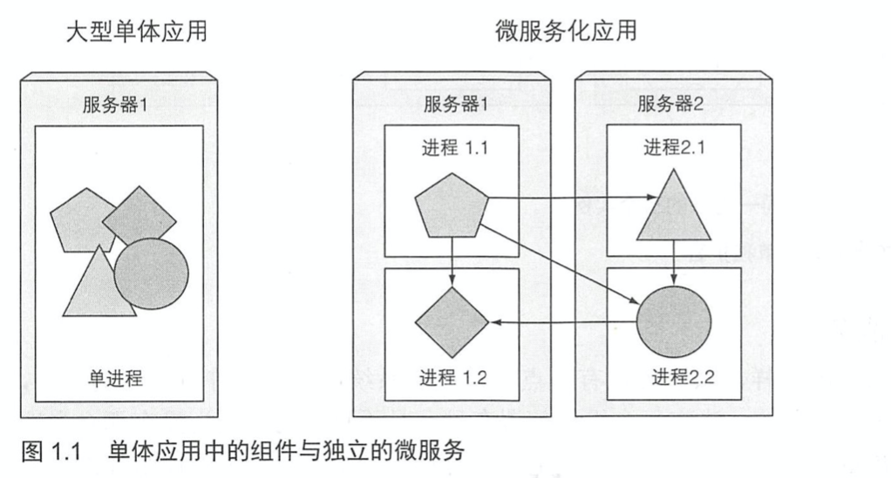

# KubernetesInAction学习笔记（1）

> 资料下载地址:
>
> [百度网盘](https://pan.baidu.com/s/1cK2u5gcYwGk_5u4rzQYLRg)
>
> 提取码: j5nv
>
> **本资料仅用于学习交流，如有能力请到各大销售渠道支持正版 !**

## 第 1 章 Kubernetes 介绍

内容涵盖：

- 应用的开发和部署方式发展趋势
- 容器如何保障应用间的隔离性，以及减少应用对部署环境的依赖性
- Docker 容器如何在 Kubernetes 系统中应用
- Kubernetes 如何提高开发人员和系统管理员的工作效率

在过去多数的应用都是大型单体应用以单个进程或几个进程的方式运行于几台服务器上，每个发布周期结束前开发者会将应用程序打包后交付给运维团队。

今天，大型单体应用正被逐渐分解成小的、可独立运行的组件，彼此之间解耦，所以它们可以被独立开发、部署、升级、伸缩。这使得我们可以对每一个微服务实现快速迭代。

但是随着部署组件的增多和数据中心的增长，配置、管理并保持系统正常运行变得越来越困难。**如果我们想要获得足够高的资源利用率并降低硬件成本，就需要一些自动化的措施，包括自动调度、配置、监管和故障处理，这正是 Kubernetes 的用武之地**。

Kubernetes 使得开发者可以自主部署应用并且控制部署的频率，完全脱离运维团队的帮助。Kubernetes 同时能让运维团队监控整个系统，并且在硬件故障时重新调度应用。这也让系统管理员的工作重心从监管应用转移到了监管 Kubernetes，以及剩余的系统资源。

此外，如果是类似云厂商提供的那种超大型数据中心，通过 Kubernetes，云厂商提供给开发者的是一个可部署且可运行的任何类型应用的简易化云平台。

### 1.1 Kubernetes 系统的需求

#### 1.1.1 从单体应用到微服务

运行一个单体应用，通常需要一台能为整个应用提供足够资源的高性能服务器，为了应对不断增长的系统负荷，需要通过增加 CPU、内存或其他系统资源的方式来对服务器做垂直扩展。虽然不需要应用程序做任何变化，但成本很快就会越来越高，而且通常会有瓶颈。而水平拓展的改动也比较大，有时甚至是不可行的。所以将应用拆解为多个微服务势在必行。

多个微服务之间可以通过 HTTP 这样的同步协议通信，或者通过像 AMQP 这样的异步协议通信。这些协议能够被大多数开发者所理解，并且不局限于某种编程语言，每个服务都可以使用最适合的开发语言来实现。

相比于单体应用，微服务的扩展显得很有优势，可以很方便地进行水平扩展。

但微服务也有缺点，当组件数量增加时，部署相关的决定就变得越来越困难，而且组件间依赖的组合数也在以更大的因素增加，由于各组件独立开发，各应用间的依赖冲突也变得更加明显。

#### 1.1.3 迈向持续交付：DevOps 和 NoOps

DevOps 意味着开发者、QA 和运维团队彼此之间的合作贯穿整个产品开发流程，让开发者更多地在生产环境中运行应用，而为了达到这个目的就需要运维团队简化部署流程，让开发人员能够持续地将自己的应用部署上线而不需要交付给运维人员操作。

但是，部署应用往往需要具备对数据中心底层设备和硬件架构的理解，但开发人员却通常不想知道这些细节。

理想情况是，开发者部署程序时不需要知道硬件基础设施的任何情况，也不需要和运维团队交涉，这被叫作 NoOps。而 K8S 正是一个能让我们实现这些想法的工具，通过对实际硬件做抽象，将自身暴露成一个平台用于部署和运行应用程序。允许开发者自己配置和部署应用程序而不需要系统管理员的任何帮助。

### 1.2 介绍容器技术

Kubernetes 使用 Linux 容器技术来提供应用的隔离，通过熟悉容器的基本知识可以更加深入地理解 K8S，包括认识到存在的容器技术分支，诸如 Docker 或者 rkt。

#### 1.2.1 什么事容器

在容器技术出现之前，如果想解决不同环境需求的隔离，需要为每个组件分配专用的虚拟机，但每个虚拟机都需要单独配置和管理会造成硬件资源和人力资源的浪费，容器技术应运而生。

容器类似迅即，但开销小很多，一个容器里运行的进程实际上依旧是运行在宿主机上的，但在容器内的进程依旧与宿主机的进程隔离。对于容器内进程本身而言，就好像是在机器和操作系统上运行的唯一一个进程。

和虚拟机相比较，容器更加轻量级，CPU 无需像虚拟机那样进行不同操作系统指令的虚拟化，每个虚拟机运行在自己的 Linux 内核上，而容器则都是调用宿主机的内核。这自然会有一定的安全隐患，但如果你的硬件资源有限又有大量被隔离的进程，那么容器的低消耗就成为了一个更好的选择。

**总结下来，核心的不同点就是，每个虚拟机运行一组它自己的系统服务，而容器则不会，也就不需要进行开机，进程可以很快被启动**。

但是容器技术也有自己的局限性，一个在特定硬件架构之上编译的容器化应用，只能在相同的架构上运行，而不能将一个 x86 架构编译的应用容器化后，又期望它能运行在 ARM 架构的机器上，你仍然需要一台虚拟机来做这件事情。

**容器实现隔离机制介绍**

多个进程运行在同一个操作系统上，Linux 要对其进行隔离可以用到两个机制：

- 命名空间，使每个进程只能看到自己的系统视图（文件、进程、网络接口、主机名等）
- Linux 控制组，限制了进程能使用的资源量

#### 1.2.2 Docker 容器平台介绍

（PS：根据最新声明，K8S 已经要放弃 Docker 作为其底层技术了）

Docker 是一个打包、分发和运行应用程序的平台。提供了关于容器/镜像/镜像仓库的相关概念，基于镜像可以创建一个独立的容器，并运行二进制可执行文件将其指定其作为镜像的一部分。

#### 1.2.3 rkt——一个Docker的替代方案

虽然 Docker 是第一个使容器成为主流的容器平台，但它本身并不提供进程隔离，依旧需要依靠 Linux 内核提供的功能。

而 rkt（发音为"rock-it"）作为一种新型容器平台，强调安全性，可构建性并遵从开放标准的 Linux 容器引擎，使用 OCI（开放容器计划，一种在 Docker 之后创立的开放工业标准）容器镜像，甚至可以运行常规的 Docker 容器镜像。

这里提到 rkt 的原因是，**不应该错误地认为 Kubernetes 是一个专为 Docker 容器设计的容器编排系统，Kubernetes 的核心远不止是编排容器，只不过容器恰好是在不同集群节点上运行应用的最佳方式**。

### 1.3 Kubernetes 介绍

Kubernetes 会把底层基础设施抽象化，在部署应用程序时，开发者无需关心自己的应用程序会被具体地部署到哪台机器上，集群规模也不会造成什么差异。

#### 1.3.3 Kubernetes 集群架构

Kubernetes 集群由以下两种节点组成：

- 主节点：集群系统的控制面板，承载着 Kubernetes 的控制作用
- 工作节点：运行用户实际部署的应用

##### 控制面板

控制面板节点包含多个组件，这些组件可以运行在单节点上或者通过副本分别部署在多个主节点以确保高可用：

- Kubernetes API 服务器：其他控制面板的组件都要和它通信
- Scheculer：调度应用，为应用的每个可部署组件分配一个工作节点
- Controller Manager：它执行集群级别的功能，如复制组件、持续跟踪工作节点、处理节点失败等
- etcd：一个可靠的分布式数据存储，持久化存储集群的配置

控制面板并不运行应用，但会持有并控制集群状态。

##### 工作节点

工作节点是运行容器化应用的机器，拥有以下组件：

- Docker、rtk 或其他的容器类型
- Kubelet，它与 API 服务器通信，并管理它所在节点的容器
- Kubernetes Service Proxy(kube-proxy)，负责组件之间的负载均衡网络流量

在第 11 章，本书会详细的解释所有这些组件的工作原理。但首先本书会先教会读者怎样使用这些组件。

#### 1.3.4 在 Kubernetes 中运行应用

> 本次阅读应至 P18 37 1.3.4 在 Kubernetes 中运行应用

