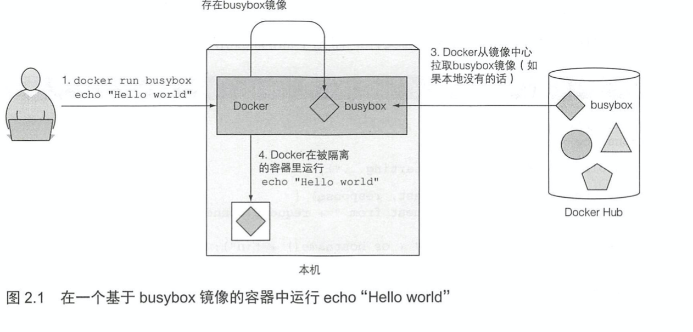
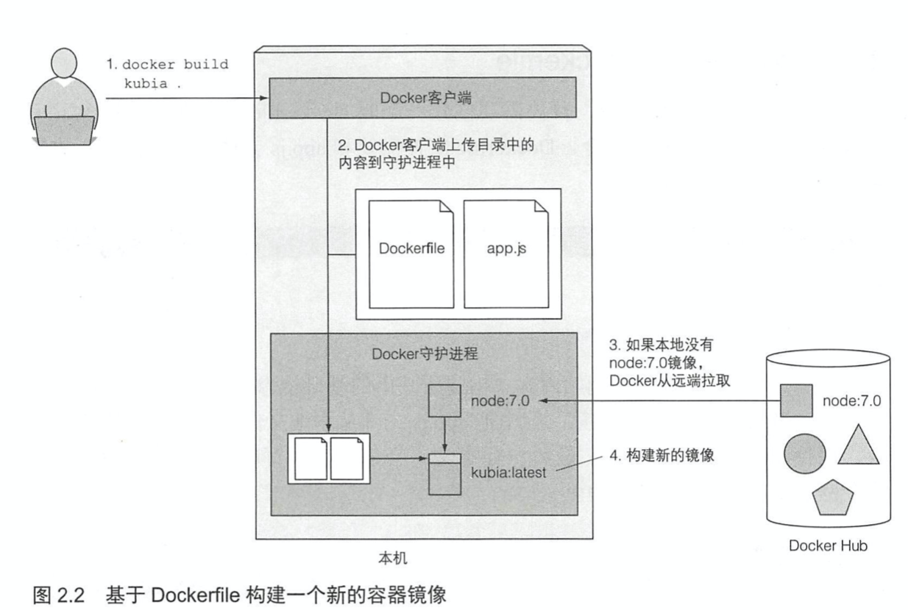
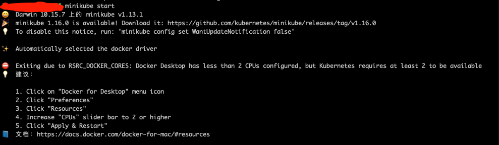
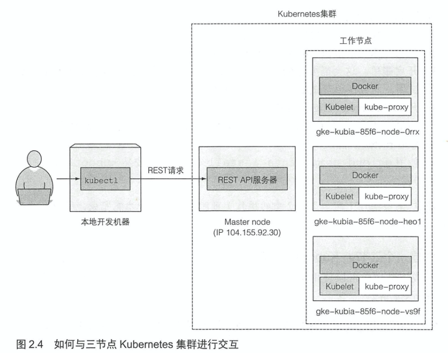
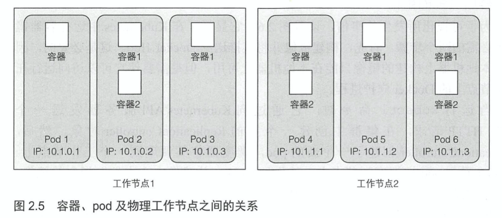
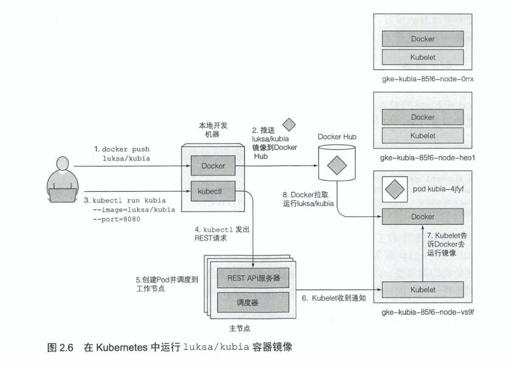
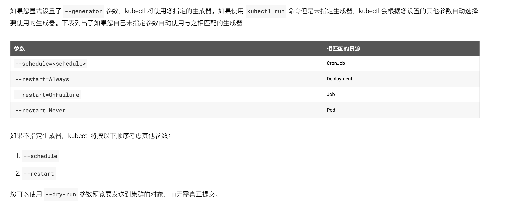
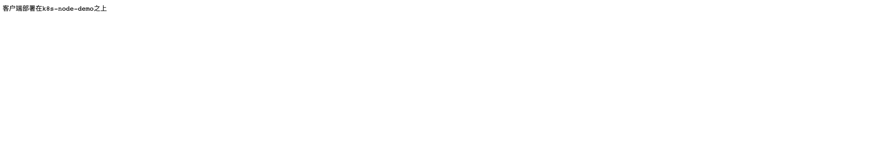
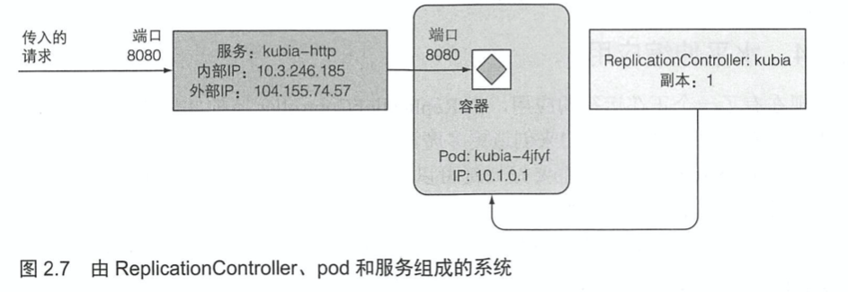
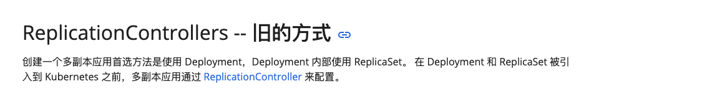

# KubernetesInAction学习笔记（2）

## 第2章 开始使用Kubernetes和Docker

本章学习如何创建一个简单的应用，将其打包成镜像并在远端的 Kubernetes 集群或本地单节点集群中运行。

Mac 开发环境下，首先通过 homebrew 安装一个 docker，然后跑一个简单的镜像。

```shell
brew cask install docker
docker run busybox echo "Hello world"
# Hello world
```

busybox 是一个简单的镜像，可以用于运行最简单的命令，上面的命令会自动拉取 busybox 镜像，并启动一个执行 echo 命令的容器。



此外，还可以基于 Dockerfile 构建一个新的容器镜像。



##### 镜像是如何构建的

构建过程并不是由 Docker 客户端进行的，而是将整个目录的文件上传到 Docker 守护进程并在那里运行的（Docker 客户端和守护进程不要求在同一台机器上）。如果你在一台非 Linux 操作系统中使用 Docker，那么客户端就运行在你的宿主操作系统中，**但守护进程运行在一个虚拟机内**。

#### 2.1.6 探索运行容器的内部

1. 使用 run 命令可以拉起一个容器：
   
   ```shell
   docker run --name container-name -p 8080:8080 -d image-name
   ```
   
   上面的命令参数为：
   
   - --name，容器名称
   - -p，端口映射，宿主端口:容器端口
   - -d，代表容器与命令行分离，意味着在后台运行
   
2. 使用 ps 命令和 inspect 命令可以看到容器的基础信息。

   ```shell
   docker ps
   docker inspect container-name
   ```

3. 使用 exec 命令可以在包含 shell 的容器内运行 shell 命令行。

   ```shell
   docker exec -it container-name bash
   ```

   上面的 -it 选项是下面两个选项的简写：

   - -i：确保标准输入流保持开放，需要在 shell 中输入命令
   - -t：分配一个伪终端（TTY）

   如果希望像平常一样使用 shell，需要同时使用这两个选项（如果缺少`-i`选项就无法输入任何命令。如果缺少`-t`选项，那么命令提示符不会显示，并且一些命令会提示 TERM 变量没有设置）

4. 进入容器后，使用`exit`命令来退出容器返回宿主机

5. 可以通过告知 Docker 停止容器来停止应用，并使用相关命令删除容器。

   ```shell
   docker stop container-name
   docker ps -a
   docker rm container-name
   ```

6. 要向 Docker Hub 推送镜像，需要先使用 login 命令使用自己的用户 ID 登录，在登录之后可以使用 tag 命令来对镜像进行命名，然后使用 push 命令向 Docker Hub 推送。

   ```shell
   docker login -u username
   # 将 image-name 镜像添加一个 user/image-name 的 tag
   docker tag image-name username/image-name
   docker push username/image-name
   ```

### 2.2 配置 Kubernetes 集群

现如今被打包在容器镜像中的应用，可以将它部署到 Kubernetes 集群中，而不是直接在 Docker 中运行。要达成这一目标，需要先设置集群。

一个适当的 Kubernetes 安装需要包含多个物理或虚拟机，并需要正确地设置网络，以便 Kubernetes 集群内运行的所有容器都可以在相同的扁平网络环境内相互连通。

在本章中介绍两种简单的方法构建可运行的 Kubernetes 集群，用于运行单节点的 Kubernetes，以及如何访问运行在 Google Kubernetes Engine（GKE）上面的托管集群。

此外还有别的选择：使用`kubeadm`工具安装一个三节点的 Kubernetes 集群，或是直接在亚马逊的 AWS 上安装 Kubernetes。

### 2.2.1 用 Minikube 运行一个本地单节点 Kubernetes 集群

Minikube 是运行 Kubernetes 集群最简单、最快捷的途径，Minikube 是一个构建单节点集群的工具。在本书中，本节点集群足以探索本书中讨论的大多数主题。

**安装 Minikube**

```shell
curl -Lo minikube https://storage.googleapis.com/minikube/releases/v0.23.0/minikube-darwin-amd64 && chmod +x minikube && sudo mv minikube /usr/local/bin/
```

此外，在 Mac 上，也可以通过`brew`来安装。

```shell
brew install minikube
```

安装完以后可以立即使用`start`命令启动 Kubernetes 集群。

```shell
minikube start
# 使用 --image-repository 可以用于指定镜像仓库
# 下面的命令使用阿里云的镜像
minikube start --image-repository='registry.cn-hangzhou.aliyuncs.com/google_containers'
```



如提示所示，要注意先开启 Docker Desktop 并为其分配两个以上的内核，并且最好有 2.25GB 以上的内存，然后才能对 Kubernetes 集群进行操作。

安装成功后，可以使用下列命令：

- minikube status：查看命令状态
- minikube stop：停止 minikube
- minikube delete：删除 minikube 集群

**安装 Kubernetes 客户端（kubectl）**

要与 Kubernetes 进行交互，还需要安装 kubectl CLI 客户端。

```shell
curl -LO https://storage.googleapis.com/kubernetes-release/release/$(curl -s https://storage.googleapis.com/kubernetes-release/release/stable.txt)/bin/darwin/amd64/kubectl && chmod +x kubectl && sudo mv kubectl /usr/local/bin/
```

或者使用`brew`安装。

```shell
brew install kubernetes-cli
# 或者
brew install kubectl
```

要验证集群是否正常工作，可以使用`kubectl cluster-info`命令。

```shell
kubectl cluster-info
# Kubernetes master is running at https://192.168.64.2:8443
# KubeDNS is running at https://192.168.64.2:8443/api/v1/namespaces/kube-system/services/kube-dns:dns/proxy

# To further debug and diagnose cluster problems, use 'kubectl cluster-info dump'.
```

#### 2.2.2 使用 Google Kubernetes Engine 托管 Kubernetes 集群

使用 Google Kubernetes Engine 可以无需手动设置所有的集群节点和网络，可以方便的创造出一个三节点的 Kubernetes 集群。

```shell
# 在 gcloud 安装 kubectl 命令行工具
gcloud components install kubectl
# 创建一个三节点 Kubernetes 集群
gcloud container clusters create kubia --num-nodes 3 --machine-type f1-micro
```



可以使用`kubectl get nodes`命令来列出各种 Kubernetes 对象。可以看到这些节点的基本信息。

```shell
kubectl get nodes
```

使用`kubectl describe node xxx`可以获得关于对象的更详细信息。

```shell
kubectl describe node minikube
```

#### 2.2.3 为 kubectl 配置别名和命令行补齐

```shell
# 在 ~/.bashrc 等文件中可以配置命令别名
alias k=kubectl
```

> 如果已经在用 gcloud 配置集群，就已经有可执行文件 k 了。

即便使用别名，kubectl 这个命令天生也是不带自动补全的，如需要这个功能，需要先安装一个叫 bashcompletion 的包来启用 bash 的 tab 命令补全，然后在类似 ~/.bashrc 的文件中加入：

```shell
source <(kubectl completion bash)
```

> PS: 如果是 zsh 的话，则需要安装 zsh-completions，并且用 source <(kubectl completion zsh) 命令来激活。
>
> 此外，对于 minikube 也可以使用 source <(minikube completion zsh) 来进行命令补全。

### 2.3 在 Kubernetes 上运行第一个应用

通常来说需要准备一个 JSON 或者 YAML，包含想要部署的所有组件描述的配置文件。但也可以使用一个简单的单行命令来运行应用。

#### 2.3.1 部署 Node.js 应用

部署应用程序最简单的方式是使用`kubectl run`命令，首先需要一个镜像，我们可以基于 node 构建一个简单的网络服务镜像。

> 拓展阅读：[DockerFIle 中 CMD 和 ENTRYPOINT 的区别](https://blog.csdn.net/abc8286946/article/details/41380539)

```dockerfile
# Dockerfile
# docker build -f Dockerfile -t k8s-node-demo-image .
FROM node
ADD app.js /app.js
ENTRYPOINT ["node", "app.js"]
```

```javascript
// app.js 会把客户端的 IP 打印到标准输出，并返回当前域名
const http = require('http')
const os = require('os')

console.log('server starting')
const handler = function (request, response) {
  console.log(request.connection.remoteAddress)
  response.writeHead(200, { 'Content-Type': 'text/plain; charset=utf-8' })
  response.end(`客户端部署在${os.hostname()}之上`)
}
const www = http.createServer(handler)
www.listen(8080)
```

下面是在 Kubernetes 中拉容器的代码：

```shell
$ kubectl run k8s-node-demo --image=k8s-node-demo-image --port=8080 --generator=run/v1
# Flag --generator has been deprecated, has no effect and will be removed in the future.
# pod/k8s-node-demo created
```

以下是指定的参数：

- --image 显示的是指定要运行的容器镜像

- --posrt 选项告诉 Kubernetes 应用正在监听的端口

- --generator 通常并不会使用到（根据提示在笔者这个版本已经被废弃了），它让 Kubernetes 创建一个 ReplicationController 而不是 Deployment。

  > - [生成器失效问题](https://kubernetes.io/zh/docs/reference/kubectl/conventions/#%E7%94%9F%E6%88%90%E5%99%A8)
  > - [kubectl --generator 参数被弃用问题解决](https://blog.csdn.net/CANGYE0504/article/details/106179563)

接下来可以使用 exec 命令进入 pod 的指定容器中。

exec 指定格式：`kubectl exec ${POD_NAME} -c ${CONTAINER_NAME} -- ${CMD} ${ARG1} ${ARG2} ... ${ARGN}`

```shell
# 旧版本
$ kubectl exec -it k8s-custom-node-demo-pod -c k8s-custom-node-demo-container bash
# 新版本 -- 符号代表后面是传递给容器的参数
kubectl exec -it k8s-custom-node-demo-pod -c k8s-custom-node-demo-container -- bash
```

> PS： `-c ${CONTAINER_NAME}` 是可选择的。如果Pod中仅包含一个容器，就可以忽略它。

**介绍 pod**

Kubernetes 并不直接处理单个容器，它使用多个共存容器的概念，这组容器就叫作 pod。

一个 pod 是一组紧密相关的容器，它们总是一起运行在同一个工作节点上，以及同一个 Linux 命名空间中。每个 pod 就像一个独立的逻辑机器拥有自己的 IP、主机名、进程等，运行一个独立的应用程序。应用程序可以是单个进程，运行在单个容器中，也可以是一个主应用进程或者其他支持进程，每个进程都在自己的容器中运行，而 pod 分布在不同的工作节点上。



**列出 pod**

不能列出单个容器，但是可以列出 pod，使用`kubectl get pods`可以达成这一点。

```shell
kubectl get pods
# NAME            READY   STATUS             RESTARTS   AGE
# k8s-node-demo   0/1     ImagePullBackOff   0          11m
```

上面的信息说明 pod 仍然处于挂起状态，pod 的单个容器显示为还未就绪（0/1）的状态，而还没有运行的原因有很多，根据 STATUS 的状态可以分为：

- PENDING：镜像正在拉取
- ImagePullBackOff：镜像拉取失败
- ErrImagePull：镜像拉取失败
- ContainerCreating：创建中

失败的时候可以使用`kubectl describe pod xxxx`来查看具体节点。

这里拉取镜像失败的原因是我们使用了本地的镜像，而 minikube 中的 docker 运行在一个单独的虚拟机中，与宿主机的 docker 并不在一个环境。我们可以使用`eval $(minikube docker-env)`命令将 minikube 的 docker 环境与宿主机的 docker 环境链接起来。

然后再将本地的 image 打包一遍，使用`kubectl delete pod xxxx`来删除节点后使用`kubectl run hello-foo --image=xxxx --image-pull-policy=Never`来重新拉起容器。

> 参考资料：
>
> - [kubectl run local docker image- ImagePullBackOff status](https://stackoverflow.com/questions/43462384/kubectl-run-local-docker-image-imagepullbackoff-status)
> - [How to use local docker images with Minikube?](https://stackoverflow.com/questions/42564058/how-to-use-local-docker-images-with-minikube)

```shell
$ kubectl run k8s-node-demo --image=k8s-node-demo-image --port=8080 --image-pull-policy=Never --restart=Always
# pod/k8s-node-demo created
$ kubectl get pod
# NAME            READY   STATUS    RESTARTS   AGE
# k8s-node-demo   1/1     Running   0          4s
```

kubenetes 根据一个镜像拉起一个容器的流程大致如下图：



#### 2.3.2 访问 Web 应用

每个 pod 都有自己的 IP 地址，但是这个地址是集群内部的，不能从外部访问，如果要让 pod 能够从外部访问，需要通过服务对象公开它，要创建一个特殊的 LoadBalancer 类型的服务。因为如果你创建一个常规服务（一个 ClusterIP 服务），比如 pod，也只能从集群内部访问。

通过创建 LoadBalancer 类型服务，将创建一个外部的负载均衡，可以通过负载均衡的公共 IP 访问 pod。

##### 创建一个服务对象

要创建服务，首先需要告知 Kubernetes 对外暴露之前创建的 ReplicationController（在新版本中由于无法创建 ReplicationController 所以只能暴露 pod 了。）：

> [kubectl --generator 参数被弃用问题解决](https://blog.csdn.net/CANGYE0504/article/details/106179563)

```shell
# 旧版本
kubectl expose rc k8s-node-demo  --type=LoadBalancer --name=k8s-node-http
# 新版本
kubectl expose pod k8s-node-demo  --type=LoadBalancer --name=k8s-node-http
```

PS：2021/1/1 update

新版本使用了 Deployment 资源代替了 ReplicationController 控制器，如果想要创建一个自动重新运行的 pod，可以加上`--restart=Always`参数，这样就会默认使用 deployment 资源了。

> 参考资料：
>
> [生成器](https://v1-17.docs.kubernetes.io/zh/docs/reference/kubectl/conventions/)
>
> 

**列出服务**

使用`kubectl get services`命令可以查看新创建的服务对象。

```shell
# kubectl get services
# NAME            TYPE           CLUSTER-IP      EXTERNAL-IP   PORT(S)          AGE
# k8s-node-http   LoadBalancer   10.105.140.43   <pending>     8080:31614/TCP   3m1s
# kubernetes      ClusterIP      10.96.0.1       <none>        443/TCP          21h
```

如上所示，EXTERNAL-IP 就是外部 IP，处于 PENDING 状态是由于云基础设施创建负载均衡需要一段时间，创建完成后就可以通过外部 IP 访问了。

> 但 Minikube 不支持 LoadBalancer 类型的服务，因此服务不会有外部 IP，但是可以通过外部端口访问服务。（PORTS：31614）
>
> 运行命令`minikube service k8s-node-http`获取可以访问服务的 IP 和端口。



访问的时候可以看到应用已经将 pod 的名称作为它的主机名了。这也证明了每个 pod 都像一个独立的机器。

#### 2.3.3 系统的逻辑部分

Kubernetes 的基本结构是 pod，但是开发者并没有真正的创建出任何 pod，至少不是直接创建，通过`kubectl run`命令，可以创建一个 controller，它用于创建 pod 实例。为了使该 pod 能够从集群外部访问，需要让 Kubernetes 将该 controller 管理的所有 pod 由一个服务对外暴露，下图是这三种元素组合的大致情况。



##### pod 和它的容器

在上面的例子中，pod 只包含了一个容器，但是通常一个 pod 可以包含任意数量的容器。pod 有自己独立的私有 IP 地址和主机名。

##### controller 的角色

ReplicationController 确保始终存在一个运行中的 pod 实例，可以用于创建 pod 的多个副本并让它们保持运行，因为上面的命令没有指定需要多少个 pod 副本，所以 controller 只创建了一个副本，如果 pod 因为任何原因消失了，那么 ReplicationController 将创建一个新的 pod 来替换消失的 pod。

（PS：个人理解，controller 就是一个类似带守护进程功能的用于构建 pod 的 docker-compose.yml）

**增加期望的副本数**

```shell
kubectl scale rc k8s-node-demo --replicas=3
```

PS：因为新版本的 kubectl 弃用了 --generation，默认采用 deployment，所以没法学习 ReplicationController 扩容相关的了...Google 工具的尿性...



##### 为什么需要服务

逻辑系统的第三个组件是服务，要理解为什么需要服务，需要学习有关 pod 的关键细节。一个 pod 可能会在任何时候因为任何原因消失。当发生这种情况的时候，pod 将被 controller 替换为新的 pod。新的 pod 与替换它的 pod 具有不同的 IP 地址。这时候就需要**服务**来解决不断变化的 pod IP 地址的问题，以及在一个固定的 IP 和端口对上对外暴露多个 pod。

当一个服务被创建时会得到一个静态的 IP，在服务的生命周期中这个 IP 不会发生改变，客户端可以通过固定 IP 地址连接到服务，而不是直接连接到 pod。服务会确保其中一个 pod 接收连接而不关心 pod 当前运行在哪里。

服务表示一组或多组提供服务的 pod 的静态地址。到达服务 IP 和端口的请求将被转发到属于该服务的一个容器的 IP 和端口。

#### 2.3.5 查看应用运行在哪个节点上

虽然在 Kubernetes 的世界里 pod 运行在哪个节点并不重要，但依然可以使用`kubectl get pods -o wide`或者`kubectl describe`命令来查看节点所在位置（Node）。

#### 2.3.6 介绍 Kubernetes dashboard

到目前为止，只使用了 kubectl 命令行工具，但其实 kubectl 也提供了一个不错的图形化界面 web dashboard。

```shell
kubectl cluster-info ｜ grep dashboard
```

在 Kubernetes 集群上使用上面这条命令可以找到面板的地址，但这里由于使用的是 minikube，所以只能使用`minikube dashboard`来打开。

```shell
minikube dashboard
# 🔌  正在开启 dashboard ...
# 🤔  正在验证 dashboard 运行情况 ...
# 🚀  Launching proxy ...
# 🤔  正在验证 proxy 运行状况 ...
# 🎉  Opening http://127.0.0.1:50895/api/v1/namespaces/kubernetes-dashboard/services/http:kubernetes-dashboard:/proxy/ in your default browser...
```


> **为 minikube docker 添加国内镜像源**
>
> 参考资料：[minikube拉取镜像时使用国内源](https://blog.csdn.net/tinyjian/article/details/109699420)
>
> ```shell
> $ minikube start --image-repository='registry.cn-hangzhou.aliyuncs.com/google_containers'
> 
> $ minikube ssh
> $ sudo mkdir -p /etc/docker
> $ sudo tee /etc/docker/daemon.json <<-'EOF'
> > {
> >   "experimental": false,
> >   "registry-mirrors": [
> >     "http://hub-mirror.c.163.com"
> >   ],
> >   "features": {
> >     "buildkit": true
> >   }
> > }
> > EOF
> $ sudo systemctl daemon-reload
> $ sudo systemctl restart docker
> $ exit
> 
> $ eval $(minikube docker-env)
> # 测试拉取镜像速度
> $ docker pull nginx
> ```
>
> ```json
> {
>    "experimental": false,
>    "registry-mirrors": [
>      "http://hub-mirror.c.163.com"
>    ],
>    "features": {
>      "buildkit": true
>    }
> }
> ```