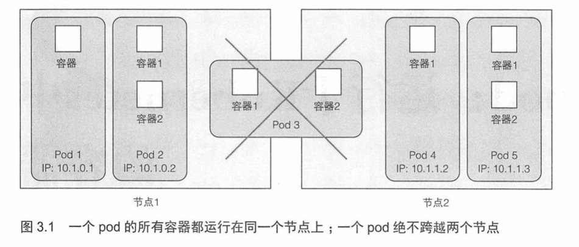
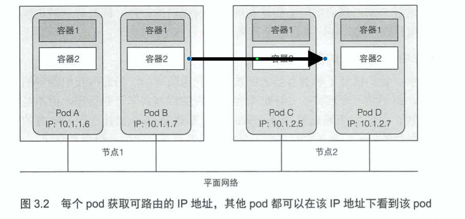
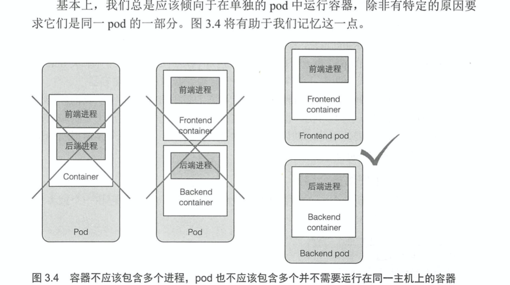
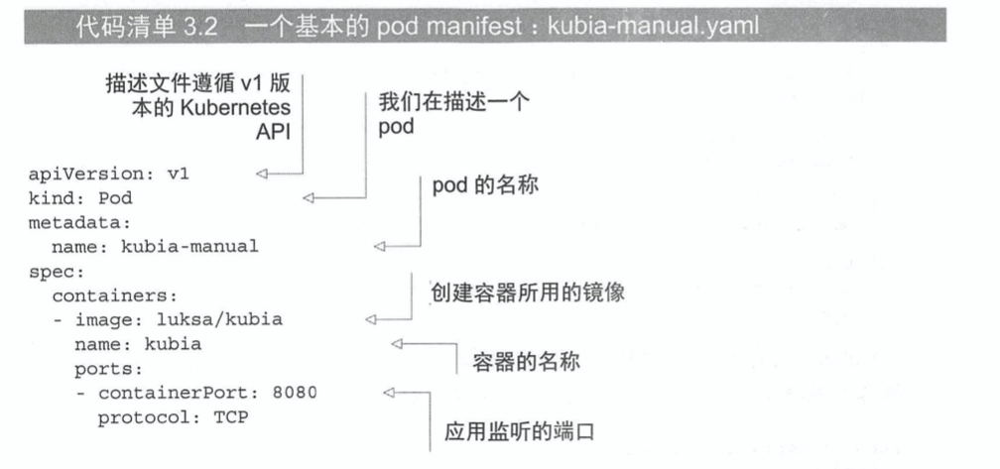

# KubernetesInAction学习笔记（3）

## 第 3 章 pod：运行于Kubernetes中的容器

本章将更加详细地介绍所有类型的 Kubernetes 对象（或资源），以便于理解在何时、如何以及为何要使用每一个对象。

pod 是 Kubernetes 中最为重要的核心概念，而其他对象仅仅是在管理、暴露 pod 或被 pod 使用。

### 3.1 介绍 pod

pod 是 Kubernetes 中基本构建模块，在实际应用中并不会单独部署容器，更多的是针对一组 pod 的容器进行部署和操作。

当一个 pod 包含多个容器时，这些容器总是运行于同一个工作节点上——一个 pod 绝不会跨越多个工作节点。



#### 3.1.1 为何需要 pod

为何需要 pod 这个概念？为何不直接使用容器？为何甚至需要同时运行多个容器？难道不能简单地把所有进程都放在一个单独的容器中吗？

##### 为何多个容器比单个容器中包含多个进程要好

虽然每一个容器都非常像一台独立的机器，所以可能会让人觉得在单个容器中运行多个进程是合乎逻辑的，但是这种做法其实并不合理，因为这会让日志的管理变得困难。

不能将多个进程聚集在一个单独的容器中，就需要另一种更高级的结构来将容器绑定在一起，并将它们作为一个单元进行管理，这就是 pod 背后的根本原理。

#### 3.1.2 了解 pod

在包含容器的 pod 下，我们可以同时运行一些密切相关的进程，并为它们提供几乎相同的环境。这些进程就好像全部运行于单个容器一样，同时又保持着一定的隔离。这样一来便能全能利用容器所提供的特性，同时对这些进程来说它们就像运行在一起一样的效果。

##### 同一 pod 中容器之间的部分隔离

**一个 pod 中所有的容器都在相同的 network 和 UTS 命名空间下运行，因此它们共享相同的 IP 地址和端口空间**。这意味着同一 pod 中，多个容器运行的多个进程需要注意不能绑定到相同的端口号（个人理解：这里就不像传统的 docker 容器了，这意味着容器中的端口就是 pod 的端口，也就是不存在多一层的 pod 和容器之间的端口转发）。容器也可以通过 localhost 与同一 pod 中的其他容器进行通信。

##### 介绍平坦 pod 间网络

K8S 集群中所有的 pod 都在同一个共享网络地址空间中，每个 pod 都可以通过其他 pod 的 IP 地址来实现相互访问。



#### 3.1.3 通过 pod 合理管理容器

对于一个由前端应用服务器和后端数据库组成的多层应用程序，应该将其配置为单个 pod 还是两个 pod 呢？

虽然我们可以在单个 pod 中同时运行前端服务器和数据库这两个容器，但这种方式其实并不值得推荐，因为同一 pod 的所有容器总是运行在一起，但对于 Web 服务器和数据库来说，它们并不需要放在一起，除非你只有一个工作节点。

另一个不应该将应用程序都放到单一 pod 中国呢的原因就是扩容和缩容，pod 是扩容的基本单位，对于 Kubernetes 来说，它不能横向扩缩单个容器，只能扩缩整个 pod。

##### 何时在 pod 中使用多个容器

将多个容器添加到单个 pod 的主要原因可能是应用需要由一个主进程和多个辅助进程组成。



### 3.2 以 YAML 或 JSON 描述文件创建 pod

pod 和其他 Kubernetes 资源通常是通向 Kubernetes REST API 提供 JSON 或 YAML 来创建，此外可以通过`kubectl run`命令来创建，但这个命令通常只允许你配置一些有限的属性。

因此，为了配置各种类型资源的各种属性，我们需要了解 Kubernetes API 的对象定义。

#### 3.2.1 检查现有 pod 的 YAML 描述文件

```shell
kubectl get pod k8s-node-demo -o yaml
```

使用上述命令可以获取指定 pod 的整个 YAML 定义。

```yaml
apiVersion: v1
items:
- apiVersion: v1
  kind: Pod
  metadata:
    creationTimestamp: "2020-12-26T15:22:00Z"
    labels:
      run: k8s-node-demo
    managedFields:
    - apiVersion: v1
      fieldsType: FieldsV1
      fieldsV1:
        f:metadata:
          f:labels:
            .: {}
            f:run: {}
        f:spec:
          f:containers:
            k:{"name":"k8s-node-demo"}:
              .: {}
              f:image: {}
              f:imagePullPolicy: {}
              f:name: {}
              f:ports:
                .: {}
                k:{"containerPort":8080,"protocol":"TCP"}:
                  .: {}
                  f:containerPort: {}
                  f:protocol: {}
              f:resources: {}
              f:terminationMessagePath: {}
              f:terminationMessagePolicy: {}
          f:dnsPolicy: {}
          f:enableServiceLinks: {}
          f:restartPolicy: {}
          f:schedulerName: {}
          f:securityContext: {}
          f:terminationGracePeriodSeconds: {}
      manager: kubectl
      operation: Update
      time: "2020-12-26T15:22:00Z"
    - apiVersion: v1
      fieldsType: FieldsV1
      fieldsV1:
        f:status:
          f:conditions:
            k:{"type":"ContainersReady"}:
              .: {}
              f:lastProbeTime: {}
              f:lastTransitionTime: {}
              f:status: {}
              f:type: {}
            k:{"type":"Initialized"}:
              .: {}
              f:lastProbeTime: {}
              f:lastTransitionTime: {}
              f:status: {}
              f:type: {}
            k:{"type":"Ready"}:
              .: {}
              f:lastProbeTime: {}
              f:lastTransitionTime: {}
              f:status: {}
              f:type: {}
          f:containerStatuses: {}
          f:hostIP: {}
          f:phase: {}
          f:podIP: {}
          f:podIPs:
            .: {}
            k:{"ip":"172.17.0.3"}:
              .: {}
              f:ip: {}
          f:startTime: {}
      manager: kubelet
      operation: Update
      time: "2020-12-26T15:22:02Z"
    name: k8s-node-demo
    namespace: default
    resourceVersion: "26468"
    selfLink: /api/v1/namespaces/default/pods/k8s-node-demo
    uid: 7390a976-44eb-4306-9151-39fe41c826dc
  spec:
    containers:
    - image: k8s-node-demo-image
      imagePullPolicy: Never
      name: k8s-node-demo
      ports:
      - containerPort: 8080
        protocol: TCP
      resources: {}
      terminationMessagePath: /dev/termination-log
      terminationMessagePolicy: File
      volumeMounts:
      - mountPath: /var/run/secrets/kubernetes.io/serviceaccount
        name: default-token-rv7d4
        readOnly: true
    dnsPolicy: ClusterFirst
    enableServiceLinks: true
    nodeName: minikube
    preemptionPolicy: PreemptLowerPriority
    priority: 0
    restartPolicy: Always
    schedulerName: default-scheduler
    securityContext: {}
    serviceAccount: default
    serviceAccountName: default
    terminationGracePeriodSeconds: 30
    tolerations:
    - effect: NoExecute
      key: node.kubernetes.io/not-ready
      operator: Exists
      tolerationSeconds: 300
    - effect: NoExecute
      key: node.kubernetes.io/unreachable
      operator: Exists
      tolerationSeconds: 300
    volumes:
    - name: default-token-rv7d4
      secret:
        defaultMode: 420
        secretName: default-token-rv7d4
  status:
    conditions:
    - lastProbeTime: null
      lastTransitionTime: "2020-12-26T15:22:00Z"
      status: "True"
      type: Initialized
    - lastProbeTime: null
      lastTransitionTime: "2020-12-26T15:22:02Z"
      status: "True"
      type: Ready
    - lastProbeTime: null
      lastTransitionTime: "2020-12-26T15:22:02Z"
      status: "True"
      type: ContainersReady
    - lastProbeTime: null
      lastTransitionTime: "2020-12-26T15:22:00Z"
      status: "True"
      type: PodScheduled
    containerStatuses:
    - containerID: docker://d452f73071c66897fa6ecee6d3547df3fe22a35b8263fe6d095d1d0c61e7cdfe
      image: k8s-node-demo-image:latest
      imageID: docker://sha256:2606fbefd46a68ab98ca72aa1cabe7f9500e3a84e661061201fc81e7d8cd7614
      lastState: {}
      name: k8s-node-demo
      ready: true
      restartCount: 0
      started: true
      state:
        running:
          startedAt: "2020-12-26T15:22:02Z"
    hostIP: 192.168.64.2
    phase: Running
    podIP: 172.17.0.3
    podIPs:
    - ip: 172.17.0.3
    qosClass: BestEffort
    startTime: "2020-12-26T15:22:00Z"
kind: List
metadata:
  resourceVersion: ""
  selfLink: ""
```

该命令的输出内容看上去较为复杂，但对于创建一个 pod 来说，需要写的 YAML 则简短得多。

##### 介绍 pod 定义的主要部分

pod 定义由几个部分组成：首先是 YAML 中使用的 K8S API 版本和 YAML 描述的资源类型，其次是几乎在所有 K8S 资源中都能找到的组成部分：

- metadata：包括名称、命名空间、标签和关于该容器的其他信息。
- spec：包含 pod 内容的实际说明，例如 pod 的容器、卷和其他数据。
- status：包含运行中的 pod 的当前信息，例如 pod 所处的条件、每个容器的描述和状态，以及内部 IP 和其他基本信息

在上面输出的 yaml 中展示了一个正在运行的 pod，所以会有 status 字段，但在创建 pod 时，永远不需要提供 status 部分。

#### 3.2.2 为 pod 创建一个简单的 YAML 描述文件



该描述文件遵循 Kubernetes API 的 v1 版本，我们描述的资源类型是 pod，名称为 kubia-manual，该 pod 有一个基于 luksa/kubia 的容器，监听 8080 端口。

##### 指定容器端口

在 pod 定义中，指定端口存粹是展示性的，忽略它们对于客户端是否可以通过端口连接到 pod 不会带来任何影响。如果容器通过绑定到地址 0.0.0.0 的端口接收连接，那么即便端口没有列出，其他 pod 也依旧能够连接到该端口。

但在 yml 中定义端口更方便管理，还允许你为每个端口指定一个名称。

> 使用 kubectl explain 命令来获取每个 API 对象支持哪些属性，比如想要创建一个 pod 的 yaml 文件，就可以使用`kubectl explain pods`查看可以使用哪些字段，也可以使用`kubectl explain pod.spec`查看特定的属性。

#### 3.2.3 使用 kubectl create 来创建 pod

我所使用的 demo yaml 文件为：

```yaml
# demo-manual.yaml
apiVersion: v1
kind: Pod
metadata:
  name: k8s-custom-node-demo-pod
spec:
  containers:
  - image: k8s-node-demo-image
    name: k8s-custom-node-demo-container
    imagePullPolicy: Never
    ports:
    - containerPort: 8080
      protocol: TCP
```

```shell
kubectl create -f demo-manual.yaml
# pod/k8s-custom-node-demo-pod created
```

创建完成后，可以请求 K8S 来获得完整的 YAML 或 JSON。

```shell
kubectl get pod k8s-custom-node-demo-pod -o yaml
# or
kubectl get pod k8s-custom-node-demo-pod -o json
```

#### 3.2.4 查看应用程序日志

使用 ssh 命令登录到 pod 正在运行的节点，并使用`docker logs`命令来查看容器日志，但 Kubernetes 提供了一种更为简单的方法。

```shell
kubectl logs k8s-custom-node-demo-pod
# server starting
```

可以看到该 log 打印出了容器中运行的 node 应用所打印输出的日志。

##### 获取多容器 pod 的日志时指定容器名称

如果这个 pod 中有多个容器，则需要通过`-c 容器名称`来查看特定容器的日志。

```shell
kubectl logs k8s-custom-node-demo-pod -c k8s-custom-node-demo-container
# server starting
```

> 要注意的是，当一个 pod 被删除时，它的日志也会被删除，在后续可以设置中心化的日志系统，将所有的日志存储到中心去。

#### 3.2.5 向 pod 发送请求

在前一章节中，可以通过`kubectl expose`命令创建一个 service，在外部访问该 pod。但在这里不打算使用 service 来与 pod 通信，而是采用**端口转发**的方式。

##### 将本地网络端口转发到 pod 中的端口

通过`kubectl port-forward`命令可以将本地机器的端口转发到 pod 的端口。（注意这个命令不是在后台运行，而是直接在前台运行）

```shell
# 将本地 8888 端口绑定到 pod 的 8080 端口
kubectl port-forward k8s-custom-node-demo-pod 8888:8080
# Forwarding from 127.0.0.1:8888 -> 8080
# Forwarding from [::1]:8888 -> 8080
```


### 3.3 使用标签组织 pod


> 本次阅读至P66 85 3.3 使用标签组织 pod