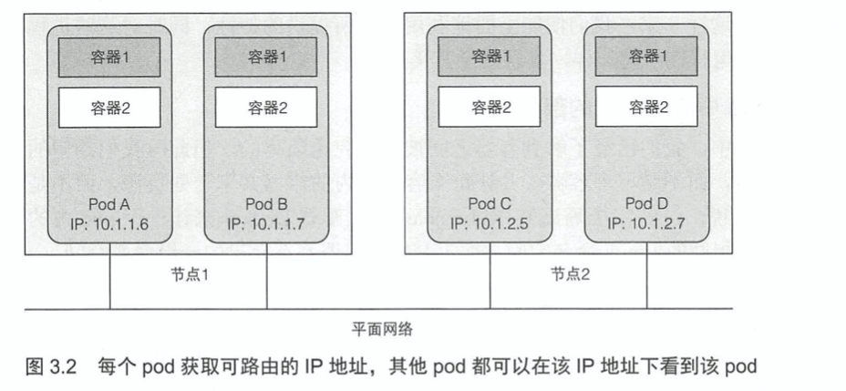
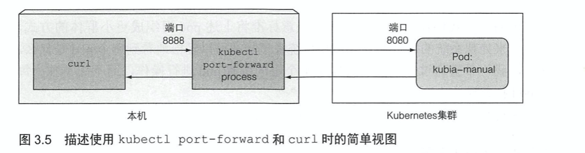
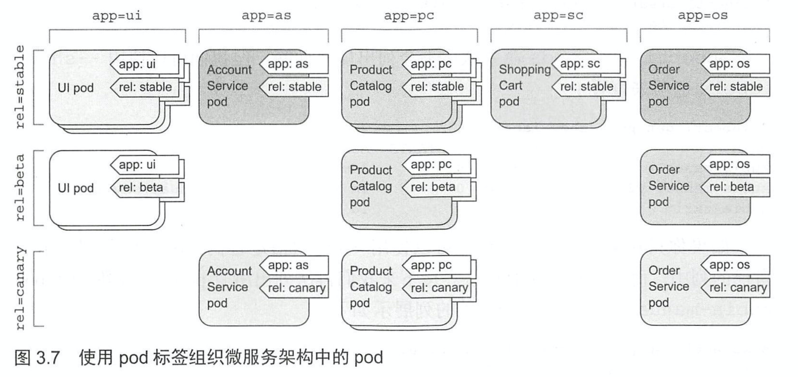
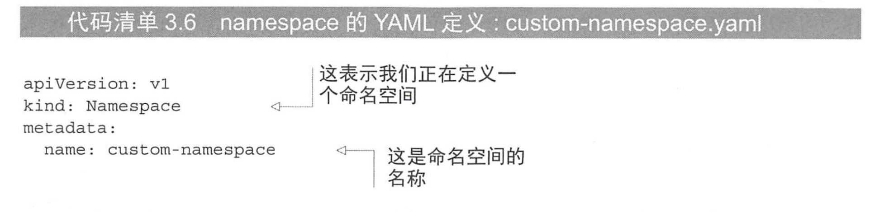

# KubernetesInAction学习笔记（3）

## 第 3 章 pod：运行于Kubernetes中的容器

本章将更加详细地介绍所有类型的 Kubernetes 对象（或资源），以便于理解在何时、如何以及为何要使用每一个对象。

pod 是 Kubernetes 中最为重要的核心概念，而其他对象仅仅是在管理、暴露 pod 或被 pod 使用。

### 3.1 介绍 pod

pod 是 Kubernetes 中基本构建模块，在实际应用中并不会单独部署容器，更多的是针对一组 pod 的容器进行部署和操作。

当一个 pod 包含多个容器时，这些容器总是运行于同一个工作节点上——一个 pod 绝不会跨越多个工作节点。


#### 3.1.1 为何需要 pod

为何需要 pod 这个概念？为何不直接使用容器？为何甚至需要同时运行多个容器？难道不能简单地把所有进程都放在一个单独的容器中吗？

##### 为何多个容器比单个容器中包含多个进程要好

虽然每一个容器都非常像一台独立的机器，所以可能会让人觉得在单个容器中运行多个进程是合乎逻辑的，但是这种做法其实并不合理，因为这会让日志的管理变得困难。

不能将多个进程聚集在一个单独的容器中，就需要另一种更高级的结构来将容器绑定在一起，并将它们作为一个单元进行管理，这就是 pod 背后的根本原理。

#### 3.1.2 了解 pod

在包含容器的 pod 下，我们可以同时运行一些密切相关的进程，并为它们提供几乎相同的环境。这些进程就好像全部运行于单个容器一样，同时又保持着一定的隔离。这样一来便能全能利用容器所提供的特性，同时对这些进程来说它们就像运行在一起一样的效果。

##### 同一 pod 中容器之间的部分隔离

**一个 pod 中所有的容器都在相同的 network 和 UTS 命名空间下运行，因此它们共享相同的 IP 地址和端口空间**。这意味着同一 pod 中，多个容器运行的多个进程需要注意不能绑定到相同的端口号（个人理解：这里就不像传统的 docker 容器了，这意味着容器中的端口就是 pod 的端口，也就是不存在多一层的 pod 和容器之间的端口转发）。容器也可以通过 localhost 与同一 pod 中的其他容器进行通信。

##### 介绍平坦 pod 间网络

K8S 集群中所有的 pod 都在同一个共享网络地址空间中，每个 pod 都可以通过其他 pod 的 IP 地址来实现相互访问。



#### 3.1.3 通过 pod 合理管理容器

对于一个由前端应用服务器和后端数据库组成的多层应用程序，应该将其配置为单个 pod 还是两个 pod 呢？

虽然我们可以在单个 pod 中同时运行前端服务器和数据库这两个容器，但这种方式其实并不值得推荐，因为同一 pod 的所有容器总是运行在一起，但对于 Web 服务器和数据库来说，它们并不需要放在一起，除非你只有一个工作节点。

另一个不应该将应用程序都放到单一 pod 中国呢的原因就是扩容和缩容，pod 是扩容的基本单位，对于 Kubernetes 来说，它不能横向扩缩单个容器，只能扩缩整个 pod。

##### 何时在 pod 中使用多个容器

将多个容器添加到单个 pod 的主要原因可能是应用需要由一个主进程和多个辅助进程组成。


### 3.2 以 YAML 或 JSON 描述文件创建 pod

pod 和其他 Kubernetes 资源通常是通向 Kubernetes REST API 提供 JSON 或 YAML 来创建，此外可以通过`kubectl run`命令来创建，但这个命令通常只允许你配置一些有限的属性。

因此，为了配置各种类型资源的各种属性，我们需要了解 Kubernetes API 的对象定义。

#### 3.2.1 检查现有 pod 的 YAML 描述文件

```shell
kubectl get pod k8s-node-demo -o yaml
```

使用上述命令可以获取指定 pod 的整个 YAML 定义。

```yaml
apiVersion: v1
items:
- apiVersion: v1
  kind: Pod
  metadata:
    creationTimestamp: "2020-12-26T15:22:00Z"
    labels:
      run: k8s-node-demo
    managedFields:
    - apiVersion: v1
      fieldsType: FieldsV1
      fieldsV1:
        f:metadata:
          f:labels:
            .: {}
            f:run: {}
        f:spec:
          f:containers:
            k:{"name":"k8s-node-demo"}:
              .: {}
              f:image: {}
              f:imagePullPolicy: {}
              f:name: {}
              f:ports:
                .: {}
                k:{"containerPort":8080,"protocol":"TCP"}:
                  .: {}
                  f:containerPort: {}
                  f:protocol: {}
              f:resources: {}
              f:terminationMessagePath: {}
              f:terminationMessagePolicy: {}
          f:dnsPolicy: {}
          f:enableServiceLinks: {}
          f:restartPolicy: {}
          f:schedulerName: {}
          f:securityContext: {}
          f:terminationGracePeriodSeconds: {}
      manager: kubectl
      operation: Update
      time: "2020-12-26T15:22:00Z"
    - apiVersion: v1
      fieldsType: FieldsV1
      fieldsV1:
        f:status:
          f:conditions:
            k:{"type":"ContainersReady"}:
              .: {}
              f:lastProbeTime: {}
              f:lastTransitionTime: {}
              f:status: {}
              f:type: {}
            k:{"type":"Initialized"}:
              .: {}
              f:lastProbeTime: {}
              f:lastTransitionTime: {}
              f:status: {}
              f:type: {}
            k:{"type":"Ready"}:
              .: {}
              f:lastProbeTime: {}
              f:lastTransitionTime: {}
              f:status: {}
              f:type: {}
          f:containerStatuses: {}
          f:hostIP: {}
          f:phase: {}
          f:podIP: {}
          f:podIPs:
            .: {}
            k:{"ip":"172.17.0.3"}:
              .: {}
              f:ip: {}
          f:startTime: {}
      manager: kubelet
      operation: Update
      time: "2020-12-26T15:22:02Z"
    name: k8s-node-demo
    namespace: default
    resourceVersion: "26468"
    selfLink: /api/v1/namespaces/default/pods/k8s-node-demo
    uid: 7390a976-44eb-4306-9151-39fe41c826dc
  spec:
    containers:
    - image: k8s-node-demo-image
      imagePullPolicy: Never
      name: k8s-node-demo
      ports:
      - containerPort: 8080
        protocol: TCP
      resources: {}
      terminationMessagePath: /dev/termination-log
      terminationMessagePolicy: File
      volumeMounts:
      - mountPath: /var/run/secrets/kubernetes.io/serviceaccount
        name: default-token-rv7d4
        readOnly: true
    dnsPolicy: ClusterFirst
    enableServiceLinks: true
    nodeName: minikube
    preemptionPolicy: PreemptLowerPriority
    priority: 0
    restartPolicy: Always
    schedulerName: default-scheduler
    securityContext: {}
    serviceAccount: default
    serviceAccountName: default
    terminationGracePeriodSeconds: 30
    tolerations:
    - effect: NoExecute
      key: node.kubernetes.io/not-ready
      operator: Exists
      tolerationSeconds: 300
    - effect: NoExecute
      key: node.kubernetes.io/unreachable
      operator: Exists
      tolerationSeconds: 300
    volumes:
    - name: default-token-rv7d4
      secret:
        defaultMode: 420
        secretName: default-token-rv7d4
  status:
    conditions:
    - lastProbeTime: null
      lastTransitionTime: "2020-12-26T15:22:00Z"
      status: "True"
      type: Initialized
    - lastProbeTime: null
      lastTransitionTime: "2020-12-26T15:22:02Z"
      status: "True"
      type: Ready
    - lastProbeTime: null
      lastTransitionTime: "2020-12-26T15:22:02Z"
      status: "True"
      type: ContainersReady
    - lastProbeTime: null
      lastTransitionTime: "2020-12-26T15:22:00Z"
      status: "True"
      type: PodScheduled
    containerStatuses:
    - containerID: docker://d452f73071c66897fa6ecee6d3547df3fe22a35b8263fe6d095d1d0c61e7cdfe
      image: k8s-node-demo-image:latest
      imageID: docker://sha256:2606fbefd46a68ab98ca72aa1cabe7f9500e3a84e661061201fc81e7d8cd7614
      lastState: {}
      name: k8s-node-demo
      ready: true
      restartCount: 0
      started: true
      state:
        running:
          startedAt: "2020-12-26T15:22:02Z"
    hostIP: 192.168.64.2
    phase: Running
    podIP: 172.17.0.3
    podIPs:
    - ip: 172.17.0.3
    qosClass: BestEffort
    startTime: "2020-12-26T15:22:00Z"
kind: List
metadata:
  resourceVersion: ""
  selfLink: ""
```

该命令的输出内容看上去较为复杂，但对于创建一个 pod 来说，需要写的 YAML 则简短得多。

##### 介绍 pod 定义的主要部分

pod 定义由几个部分组成：首先是 YAML 中使用的 K8S API 版本和 YAML 描述的资源类型，其次是几乎在所有 K8S 资源中都能找到的组成部分：

- metadata：包括名称、命名空间、标签和关于该容器的其他信息。
- spec：包含 pod 内容的实际说明，例如 pod 的容器、卷和其他数据。
- status：包含运行中的 pod 的当前信息，例如 pod 所处的条件、每个容器的描述和状态，以及内部 IP 和其他基本信息

在上面输出的 yaml 中展示了一个正在运行的 pod，所以会有 status 字段，但在创建 pod 时，永远不需要提供 status 部分。

#### 3.2.2 为 pod 创建一个简单的 YAML 描述文件


该描述文件遵循 Kubernetes API 的 v1 版本，我们描述的资源类型是 pod，名称为 kubia-manual，该 pod 有一个基于 luksa/kubia 的容器，监听 8080 端口。

##### 指定容器端口

在 pod 定义中，指定端口存粹是展示性的，忽略它们对于客户端是否可以通过端口连接到 pod 不会带来任何影响。如果容器通过绑定到地址 0.0.0.0 的端口接收连接，那么即便端口没有列出，其他 pod 也依旧能够连接到该端口。

但在 yml 中定义端口更方便管理，还允许你为每个端口指定一个名称。

> 使用 kubectl explain 命令来获取每个 API 对象支持哪些属性，比如想要创建一个 pod 的 yaml 文件，就可以使用`kubectl explain pods`查看可以使用哪些字段，也可以使用`kubectl explain pod.spec`查看特定的属性。

#### 3.2.3 使用 kubectl create 来创建 pod

我所使用的 demo yaml 文件为：

```yaml
# demo-manual.yaml
apiVersion: v1
kind: Pod
metadata:
  name: k8s-custom-node-demo-pod
spec:
  containers:
  - image: k8s-node-demo-image
    name: k8s-custom-node-demo-container
    imagePullPolicy: Never
    ports:
    - containerPort: 8080
      protocol: TCP
```

```shell
kubectl create -f demo-manual.yaml
# pod/k8s-custom-node-demo-pod created
```

创建完成后，可以请求 K8S 来获得完整的 YAML 或 JSON。

```shell
kubectl get pod k8s-custom-node-demo-pod -o yaml
# or
kubectl get pod k8s-custom-node-demo-pod -o json
```

#### 3.2.4 查看应用程序日志

使用 ssh 命令登录到 pod 正在运行的节点，并使用`docker logs`命令来查看容器日志，但 Kubernetes 提供了一种更为简单的方法。

```shell
kubectl logs k8s-custom-node-demo-pod
# server starting
```

可以看到该 log 打印出了容器中运行的 node 应用所打印输出的日志。

##### 获取多容器 pod 的日志时指定容器名称

如果这个 pod 中有多个容器，则需要通过`-c 容器名称`来查看特定容器的日志。

```shell
kubectl logs k8s-custom-node-demo-pod -c k8s-custom-node-demo-container
# server starting
```

> 要注意的是，当一个 pod 被删除时，它的日志也会被删除，在后续可以设置中心化的日志系统，将所有的日志存储到中心去。

#### 3.2.5 向 pod 发送请求

在前一章节中，可以通过`kubectl expose`命令创建一个 service，在外部访问该 pod。但在这里不打算使用 service 来与 pod 通信，而是采用**端口转发**的方式。

##### 将本地网络端口转发到 pod 中的端口

通过`kubectl port-forward`命令可以将本地机器的端口转发到 pod 的端口。（注意这个命令不是在后台运行，而是直接在前台运行）

```shell
# 将本地 8888 端口绑定到 pod 的 8080 端口
kubectl port-forward k8s-custom-node-demo-pod 8888:8080
# Forwarding from 127.0.0.1:8888 -> 8080
# Forwarding from [::1]:8888 -> 8080
```



### 3.3 使用标签组织 pod

当 pod 数量变多且变得难以整理的时候，我们需要使用标签来组织 pod 和所有其他 Kubernetes 对象。

#### 3.3.1 介绍标签

标签是一种可以附加到任意资源（包括节点，pod，服务等）的任意键值对，只要标签在资源内是唯一的，一个资源便可以拥有多个标签。

可以将同一个项目的不同版本的 pod 通过添加横向和纵向两个维度的标签，在开发过程中对其进行区分。



可以看到，上面将标签分成了两类：

- app：属于 pod 的哪个应用、组件或微服务
- rel：显示在 pod 中运行的应用程序版本是 stable、beta 还是 cannary。

#### 3.3.2 创建 pod 时指定标签

```shell
apiVersion: v1
kind: Pod
metadata:
  name: k8s-custom-node-demo-pod
  # 两个标签被附加到 pod 上
  labels:
  	creation_method: manual
  	env: prod
spec:
  containers:
  - image: k8s-node-demo-image
    name: k8s-custom-node-demo-container
    imagePullPolicy: Never
    ports:
    - containerPort: 8080
      protocol: TCP
```

使用`kubectl get pod --show-labels`来显示所有 pod 的标签。

此外也可以使用`-L`参数来将具有特定标签的 pod 列出。

#### 3.3.3 修改现有 pod 标签

```shell
# 标签指定
kubectl label pod k8s-custom-node-demo-pod env=debug
# 标签覆盖
kubectl label pod k8s-custom-node-demo-pod env=production --overwrite
```

使用`kubectl label pod k8s-custom-node-demo-pod env=debug`来进行标签指定，通过添加`--overwrite`参数可以更改覆盖现有标签。

### 3.4 通过标签选择器列出 pod 子集

- ```shell
  kubectl get pod -l env
  ```

  列出所有包含 env 标签的所有 pod

- ```shell
  kubectl get pod -l '!env'
  ```

  列出没有 env 标签的 pod

  PS：确保使用单引号来圈引，这样 bash shell 才不会解释感叹号。

- ```shell
  kubectl get pod -l 'env == production'
  kubectl get pod -l 'env != production'
  ```

  选择带有 env 且值等于（不等于） production 的 pod

- ```shell
  kubectl get pod -l 'env in (prod, devel)'
  ```

  选择带有 env 标签且值为 prod 或 devel 的 pod。

- ```shell
  kubectl get pod -l 'env notin (prod, devel)'
  ```

### 3.5 使用标签和选择器来约束 pod 调度

在某些情况下，我们希望对将 pod 调度到哪台具体的机器上持一定的发言权，因为某些机器的硬件设施并不一致，而某些应用如果运行在了配置低的机器上则可能会拖慢整个系统。

K8S 不会给出具体的方法让 pod 调度到某个特定节点上，因为这会使应用程序与基础架构强耦合，违背了 K8S 的初衷。**如果想要做到这一点，那就不应该直接指定一个确切的节点，而应该以某种方式描述对节点的需求，使得 K8S 选择一个符合这些需求的节点**。而这恰恰可以通过节点标签和节点标签选择器完成。

#### 3.5.1 使用标签分类工作节点

使用`kubectl get nodes`可以得知当前集群所拥有的节点。

```shell
kubectl get nodes
# NAME       STATUS   ROLES    AGE     VERSION
# minikube   Ready    master   6d22h   v1.19.2
```

可以为这个节点添加标签。

```shell
# 添加一个gpu为true的标签
kubectl label node minikube gpu=true
# node/minikube labeled
```

筛选并获取对应标签节点

```shell
kubectl get nodes -L gpu
```

#### 3.5.2 将 pod 调度到特定节点

在 yaml 文件中添加 nodeSelector 选项，这样在使用 create 命令根据 yaml 创建 pod 的时候，调度器就会在包含下列 tag 的节点中选择进行 pod 的部署和调度。

```yaml
apiVersion: v1
kind: Pod
metadata:
  name: k8s-custom-node-demo-pod
spec:
  # 选择包含 gpu=true 标签的节点中进行部署
  nodeSelector:
    gpu: "true"
  containers:
  - image: k8s-node-demo-image
    name: k8s-custom-node-demo-container
    imagePullPolicy: Never
    ports:
    - containerPort: 8080
      protocol: TCP
```

#### 3.5.3 调度到一个特定节点

同样的，我们可以用这个逻辑来将 pod 部署到特定的节点，**因为每个节点天生都有一个唯一标签，键值对为 kubernetes.io/hostname=实际主机名**。

但要注意的是，一旦你这么做，如果这个节点处于离线状态，那么通过 hostname 标签将该节点设定为唯一部署节点的 pod 将会不可调度。

在实际开发中，我们决不应该考虑单个节点，而应该通过标签选择器考虑符合特定标准的逻辑节点组。

### 3.6 注解 pod

注解和标签 label 一样都是键值对，但与标签不一样的事注解并不会用来对 pod 进行分组，而是起到**注释**的功能，为每个 pod 或其他 API 对象添加说明。

#### 3.6.1 查找对象的注解

要查看 pod 的注解，可以使用`kubectl get pod xxxx -o yaml`命令或是`kubectl describe`命令。

一个注解可以包含不超过 256KB 大小的数据。

#### 3.6.2 添加和修改注解

通过`kubectl annotate`命令或将配置添加到 yaml 文件中即可添加注解。

```yaml
apiVersion: v1
kind: Pod
metadata:
  name: k8s-custom-node-demo-pod
  annotations:
    demo/myDemo: foo-bar
spec:
  nodeSelector:
    gpu: "true"
  containers:
  - image: k8s-node-demo-image
    name: k8s-custom-node-demo-container
    imagePullPolicy: Never
    ports:
    - containerPort: 8080
      protocol: TCP
```

或是使用命令：

```shell
kubectl annotate pod k8s-custom-node-demo-pod demo/myDemo="foo bar"
```

随后使用 describe 命令即可看到：

```shell
kubectl describe pod k8s-custom-node-demo-pod
# ...
# Annotations:  demo/myDemo: foo bar
# ...
```

### 3.7 使用命名空间对资源进行分组

使用标签可以将 pod 和其他对象组织成组，由于每个对象都可以有多个标签，所以这些对象组可以重叠。如果没有明确指定标签选择器，我们总能看到所有对象。

但当企图将对象分割成完全独立且不重叠的组时，又该如何呢？K8S 允许开发者将对象分组到命名空间 namespace 中，K8S 命名空间简单地为对象名称提供了一个作用域，用以区分不同命名空间中的同名资源。

#### 3.7.1 了解对命名空间的需求

namespace 可以提供独立的命名空间，因此可以实现部分的环境隔离。（但仍有一些资源是无法被命名空间约束的，比如说节点 node 资源）

#### 3.7.2 发现其他命名空间以及其 pod

发现集群中所有命名空间可用：

```shell
kubectl get ns

# NAME                   STATUS   AGE
# default                Active   7d3h
# kube-node-lease        Active   7d3h
# kube-public            Active   7d3h
# kube-system            Active   7d3h
# kubernetes-dashboard   Active   5d22h
```

默认情况下，未明确指定命名空间时，kubectl 总是默认为 default 命名空间。

在列表中还可以看到其他的命名空间，那些都属于 kubenetes 系统内部所使用的。

可以查看每个命名空间下的 pod：

```shell
# 也可以使用 -n 来替代 --namespace
kubectl get pod --namespace kube-system

# NAME                               READY   STATUS    RESTARTS   AGE
# coredns-6c76c8bb89-qqjql           1/1     Running   4          7d3h
# etcd-minikube                      1/1     Running   4          7d3h
# kube-apiserver-minikube            1/1     Running   4          7d3h
# kube-controller-manager-minikube   1/1     Running   4          7d3h
# kube-proxy-7xkk6                   1/1     Running   4          7d3h
# kube-scheduler-minikube            1/1     Running   4          7d3h
# storage-provisioner                1/1     Running   8          7d3h
```

除了隔离资源，命名空间还可用于仅允许某些用户访问某些特定资源，甚至限制单个用户可用的计算资源数量。

#### 3.7.3 创建一个命名空间

##### 从 YAML 文件创建命名空间

跟 pod 资源类似，namespace 资源也可以通过 yaml 文件创建。



然后使用 create 命令将文件提交到 Kubernetes API 服务器：

```shell
kubectl create -f custom-namespace.yaml
# namespace/custom-namespace created
```

此外，还可以使用专门的`kubectl create namespace`命令来创建命名空间。

```shell
kubectl create namespace custom-namespace
```

> PS：命名空间的名称不允许包含 . 号

#### 3.7.4 管理其他命名空间中的对象

如果想要在 custom-namespace 命名空间中创建资源，可以选择在 metadata 字段中添加`namespace: custom-namespace`属性，也可以使用 create 命令创建时指定命名空间。

```shell
kubectl create -f demo-manual.yaml -n custom-namespace
# pod/k8s-custom-node-demo-pod created

# 使用 -n 选项就可以列出特定命名空间中的资源
# kubectl get pod -n custom-namespace
# NAME                       READY   STATUS    RESTARTS   AGE
# k8s-custom-node-demo-pod   1/1     Running   0          43s
```

如果不指定命名空间，`kubectl`将在当前上下文中配置的默认命名空间中执行操作，当前上下文的命名空间可以通过`kubectl config`命令进行修改。默认为 default。

> 可以使用`alias kcd='kubectl config set-context $(kubectl config current-context) --namespace'`命令进行别名设置。
>
> 然后就可以使用`kcd some-namespace`在命名空间中进行切换了。

#### 3.7.5 命名空间提供的隔离

尽管命名空间将对象分隔到任何组，但实际上命名空间之间并不提供对正在运行的对象进行隔离。

例如，当不同的用户在不同的命名空间中部署 pod 时，这些 pod 并不会因为在不同的命名空间中就彼此隔离，无法通信。

### 3.8 停止和移除 pod

```shell
kubectl get pod --show-labels
# NAME                       READY   STATUS    RESTARTS   AGE     LABELS
# k8s-custom-node-demo-pod   1/1     Running   1          5d17h   env=production
# k8s-node-demo              1/1     Running   1          6d2h    run=k8s-node-demo
kubectl get pod --show-labels -n custom-namespace
# NAME                       READY   STATUS    RESTARTS   AGE   LABELS
# k8s-custom-node-demo-pod   1/1     Running   0          34m   <none>
```

#### 3.8.2 使用标签选择器删除 pod

通过标签选择器可以一次性批量删除所有对应标签的 pod。

```shell
kubectl delete pod -l env=production
```

#### 3.8.3 通过删除整个命名空间来删除 pod

同理，可以通过删除整个命名空间（pod 将会伴随命名空间自动删除）来删除其名下的所有 pod。

```shell
kubectl delete ns custom-namespace
```

#### 3.8.4 删除命名空间中的所有 pod，但保留命名空间

```shell
kubectl delete pod --all
```

可以使用该命令来删除当前命名空间下的所有 pod。

```shell
kubectl delete pod -n custom-namespace --all
```

使用该命令来删除指定命名空间下的 pod。

> 但要注意的是，使用`kubectl run`命名生成的 pod 由于被 controller 控制，无法被简单删除（删除之后会立马重建），如果想要删除该 pod，则需要删除这个 controller（PS：新版本并不能通过 run 命令来创建这个 controller...所以无法实践）。

#### 3.8.5 删除命名空间中的（几乎）所有资源

想要删除包括 controller、service 在内的所有资源，可以使用 all 来指定。

```shell
kubectl delete all --all
```

上述命令的第一个 all 指定所有资源，而 --all 则指定删除所有的实例而不指定命名。