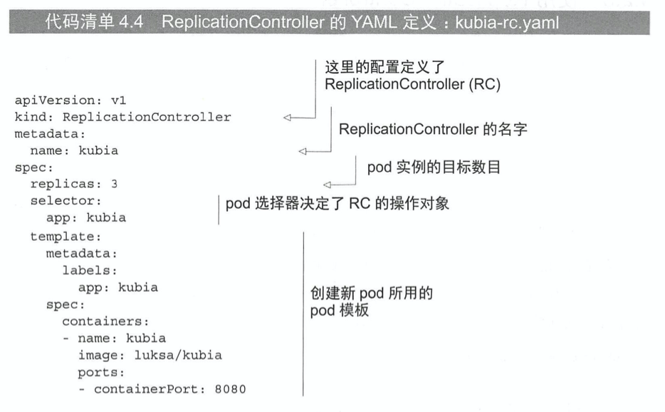

# KubernetesInAction学习笔记（4）

## 第4章 副本机制和其他控制器：部署托管的pod

在实际的使用中，开发者几乎不会直接创建 pod，而是创建 ReplicationController 或 Deployment 这样的资源，由它们来创建并管理实际的 pod，以达到让部署自动运行、保持健康无虚手动干预的目标。

### 4.1 保持 pod 健康

Kubernetes 中，只要将 pod 调度到某个节点，该节点上的 Kubelet 就会运行 pod 中包含的容器，从此只要该 pod 存在，就会保持运行。如果容器的主进程崩溃，Kubelet 将重启容器。所以即便应用程序本身没做任何特殊的事情，在 Kubernetes 中运行也将自动获得自我修复的能力。

但有时候也会出现应用程序没有崩溃，而是出于某些情况“卡死”了的情况，比如说由于内存泄漏而导致的 Error，应用程序不会停止，但已经停止了响应。为确保在这种情况下应用可以重新启动，必须从外部检查应用的运行状况，而不是依赖于应用的内部检测。

#### 4.1.1 介绍存活探针

存活探针（liveness probe）用于检查容器是否还在运行，可以为 pod 中的每个容器单独指定存活探针。如果探测失败，Kubernetes 将定期执行探针并重启容器。

有以下几种探测容器的机制：

- HTTP GET 探针，针对容器的 IP 地址（你指定的端口和路径）执行 GET 请求，若返回错误码或者没有响应则容器将被重新启动
- TCP 套接字探针，尝试与容器指定端口建立 TCP 连接，若连接不成功则容器重新启动。
- EXEC 探针，在容器内执行任意命令并检查该命令的退出状态码。如果状态码不为 0，则被认为失败。

#### 4.1.2 创建基于 HTTP 的存活探针

创建一个 demo-app-unhealth 文件和对应 Dockerfile，该服务应用将会在第五次请求之后爆出 500 错误，随后在探针的作用下重启容器。

```javascript
// app.js 会把客户端的 IP 打印到标准输出，并返回当前域名
// 前 5 次请求都正常，第 5 次之后将会返回 500 错误
const http = require('http')
const os = require('os')

let errorCount = 0

console.log('server starting')
const handler = function (request, response) {
  console.log(request.connection.remoteAddress)
  if (errorCount++ <= 4) {
    response.writeHead(200, { 'Content-Type': 'text/plain; charset=utf-8' })
    response.end(`客户端部署在${os.hostname()}之上`)
  } else {
    response.writeHead(500, { 'Content-Type': 'text/plain; charset=utf-8' })
    response.end(`服务端内部错误`)
  }
  
}
const www = http.createServer(handler)
www.listen(8080)
```

```dockerfile
# Dockerfile
# docker build -f Dockerfile -t k8s-node-demo-unhealth-image .
FROM node
ADD app-unhealth.js /app.js
ENTRYPOINT ["node", "app.js"]
```

```shell
docker build -t k8s-node-demo-unhealth-image .
```

随后创建一个新的 pod 资源的 yaml 文件，使用 create 命令来创建它。


```yaml
apiVersion: v1
kind: Pod
metadata:
  name: k8s-node-demo-unhealth-pod
spec:
  containers:
  - image: k8s-node-demo-unhealth-image
    imagePullPolicy: Never
    name: k8s-node-demo-unhealth-container
    livenessProbe:
      httpGet:
        path: /
        port: 8080
```

```shell
# 创建对应 pod
kubectl create -f demo-liveness-probe.yaml
# pod/k8s-node-demo-unhealth-pod created
```

该 pod 的描述文件定义了一个 httpGet 存活探针，会定期在端口 8080 路径上执行 HTTP GET 请求，当请求返回 500 状态码时，K8S 就会认为探测失败并重启容器。

#### 4.1.3 使用存活探针

使用 port-forward 命令绑定上面 k8s-node-demo-unhealth-pod 的 8080 端口并进行访问，多次之后触发 500 告警，此时再使用 get 命令查看，会发现 k8s-node-demo-unhealth-pod 对应的 RESTARTS 列的次数已经增加了。

```shell
kubectl port-forward k8s-node-demo-unhealth-pod 8888:8080
# 多次触发返回 500 后
kubectl get pod
```


> 当容器重启后，使用`kubectl logs`命令只会显示当前容器的日志，如果想要知道前一个容器为什么终止时，可以通过添加`kubectl logs k8s-node-demo-unhealth-pod --previous`

可以通过查看`kubectl describe`的内容来了解为什么必须重启容器。

```shell
$ kubectl describe pod k8s-node-demo-unhealth-pod
```

```txt
Name:         k8s-node-demo-unhealth-pod
Namespace:    default
Priority:     0
Node:         minikube/192.168.64.2
Start Time:   Sat, 02 Jan 2021 04:25:55 +0800
Labels:       <none>
Annotations:  <none>
Status:       Running
IP:           172.17.0.2
IPs:
  IP:  172.17.0.2
Containers:
  k8s-node-demo-unhealth-container:
    Container ID:   docker://dbed127f2f9759e007135aab8567980497e37727ac6b03e12f1348b25af02c41
    Image:          k8s-node-demo-unhealth-image
    Image ID:       docker://sha256:d6749622b58457ebab44f26791230e4963a765c7589a3f62a5942de216884eed
    Port:           <none>
    Host Port:      <none>
    State:          Waiting
      Reason:       CrashLoopBackOff
    Last State:     Terminated
      Reason:       Error
      Exit Code:    137
      Started:      Sat, 02 Jan 2021 04:57:31 +0800
      Finished:     Sat, 02 Jan 2021 04:59:20 +0800
    Ready:          False
    Restart Count:  11
    Liveness:       http-get http://:8080/ delay=0s timeout=1s period=10s #success=1 #failure=3
    Environment:    <none>
    Mounts:
      /var/run/secrets/kubernetes.io/serviceaccount from default-token-rv7d4 (ro)
Conditions:
  Type              Status
  Initialized       True
  Ready             False
  ContainersReady   False
  PodScheduled      True
Volumes:
  default-token-rv7d4:
    Type:        Secret (a volume populated by a Secret)
    SecretName:  default-token-rv7d4
    Optional:    false
QoS Class:       BestEffort
Node-Selectors:  <none>
Tolerations:     node.kubernetes.io/not-ready:NoExecute for 300s
                 node.kubernetes.io/unreachable:NoExecute for 300s
Events:
  Type     Reason     Age                 From               Message
  ----     ------     ----                ----               -------
  Normal   Scheduled  <unknown>                              Successfully assigned default/k8s-node-demo-unhealth-pod to minikube
  Normal   Killing    40h (x3 over 40h)   kubelet, minikube  Container k8s-node-demo-unhealth-container failed liveness probe, will be restarted
  Normal   Pulled     40h (x4 over 40h)   kubelet, minikube  Container image "k8s-node-demo-unhealth-image" already present on machine
  Normal   Created    40h (x4 over 40h)   kubelet, minikube  Created container k8s-node-demo-unhealth-container
  Normal   Started    40h (x4 over 40h)   kubelet, minikube  Started container k8s-node-demo-unhealth-container
  Warning  Unhealthy  39h (x31 over 40h)  kubelet, minikube  Liveness probe failed: HTTP probe failed with statuscode: 500
  Warning  BackOff    39h (x74 over 40h)  kubelet, minikube  Back-off restarting failed container
```

可以看到容器的退出代码为 137，该代码有特殊的含义——表示该进程由外部信号终止。

137 是两个数字的总和：128 + x，其中 x 是终止进程的信号编号，在这个例子中，x 等于 9，这是 SIGKILL 的信号编号，意味着这个进程被强行终止。

在底部列出的事件也显示了容器为什么终止。

> 当容器被强行终止时，会创建一个全新的容器——而不是重启原来的容器。

#### 4.1.4 配置存活探针的附加属性

在 describe 中可以看到这一行：`Liveness: http-get http://:8080/ delay=0s timeout=1s period=10s #success=1 #failure=3`，除了明确指定的存活探针选项，还可以看到其他属性，例如 delay、timeout、period 等。定义探针时可以自定义下面这些属性：

- delay：在容器启动后多少秒开始探测，delay=0s 则表示立即开始探测
- timeout：发出探测后，容器必须在多少秒内进行响应，比如说 timeout=1 则发出探测后若 1s 后没有响应则记为探测关系。
- period：每多少秒进行一次探测。
- failure：在多少次探测失败后重启容器。

例如要设置初始延迟，请将`initialDelaySeconds`属性Tina驾到存活探针的配置中，如下所示：

```yaml
livenessProbe:
  httpGet:
    path: /
    port: 8080
  # Kubernetes 会在第一次探测前等待 15 秒
  initialDelaySeconds: 15
```

如果没有设置初始延迟，探针将在启动时立即开始探测容器，对于一些复杂的容器来说很可能会失败，这样就可能会导致容器陷入无限循环重启的过程中，所以在设置了探针时，一定要设置好初始延迟。

#### 4.1.5 创建有效的存活探针

创建探针可以遵循以下几点：

- 存活探针应该检查什么

  可以为探针配置为特定的 URL 路径（例如，/health），并让应用从内部运行的所有重要组件执行状态检查，以确保它们都没有终止或停止响应。

- 保持探针轻量

  存活探针不应该消耗太多计算资源，而且运行不应该花太长时间，默认情况下，如果探测器执行频率相对高，就必须在一秒之内执行完毕。

  > 如果你在容器中运行 JAVA 应用程序，请确保一定要使用 HTTP GET 存活探针。而不是启动全新 JVM 以获取存活信息的 Exec 探针，因为 JVM 的启动需要消耗大量的计算资源。

- 无须在探针中实现重试循环

### 1.2 了解 ReplicationController

ReplicationController 是一种 Kubernetes 资源，可确保它的 pod 始终保持运行状态。如果 pod 因任何原因消失，则会创建替代的 pod。


#### 4.2.1 ReplicationController 的操作

ReplicationController 会持续监控正在运行的 pod 列表，并保证相应“类型”（其实就是是否匹配某个标签 label 选择器）的 pod 的树木与期望相符。

如果 pod 太少，将会根据模板创建新的副本，如果 pod 太多，将会删除多余的副本。


##### 了解 ReplicationController 的三部分

- label selector（标签选择器），用于确定 ReplicationController 作用域中有哪些 pod
- replica count（副本个数），指定应运行的 pod 数量
- pod template（pod 模板），用于创建新的 pod 副本


如果更改标签选择器和 pod 模板，对现有的 pod 运行没有影响，但会使他们脱离 ReplicationController 的范围，因此控制器会停止关注它们。

##### 使用 ReplicationController 的好处

ReplicationController 提供了以下的功能：

- 确保一个 pod 持续运行
- 集群节点发生故障时，可以为故障节点上运行的所有的受 ReplicationController 控制的 pod 创建替代副本
- 轻松实现 pod 的水平伸缩——手动和自动都可以

#### 4.2.2 创建一个 ReplicationController

可以通过上传 JSON 或 YAML 描述文件来创建 ReplicationController。



```yaml
# demo-replication-controller.yaml
apiVersion: v1
kind: ReplicationController
metadata:
  name: k8s-node-demo-replication-controller
spec:
  replicas: 3
  selector:
    app: k8s-node-demo-replication-controller-label
  template:
    metadata:
      labels:
        app: k8s-node-demo-replication-controller-label
    spec:
      containers:
      - name: k8s-node-demo-replication-controller-pod
        image: k8s-node-demo-image
        imagePullPolicy: Never
        ports:
        - containerPort: 8080
```

```shell
kubectl create -f demo-replication-controller.yaml
# replicationcontroller/k8s-node-demo-replication-controller created
kubectl get pod
#NAME                                         READY   STATUS    RESTARTS   AGE
#k8s-custom-node-demo-pod                     1/1     Running   2          8d
#k8s-node-demo-replication-controller-6zbcl   1/1     Running   0          68s
#k8s-node-demo-replication-controller-p7rbr   1/1     Running   0          68s
#k8s-node-demo-replication-controller-smvjc   1/1     Running   0          68s
#k8s-node-demo-unhealth-pod                   1/1     Running   29         2d15h
```

如上所示，Kubernetes 会创建一个新的 controller，它确保符合标签选择器的 pod 实例始终是 3 个。当没有足够的 pod 时，根据提供的 pod 模版创建新的 pod。

**PS：模板中的 pod 标签显然必须和 ReplicationController 的标签选择器匹配，否则控制器将无休止地创建新的容器**。为了防止出现这种情况，API 服务会校验 ReplicationController 的定义，不会接收错误配置。

#### 4.2.3 使用 ReplicationController

可以尝试手动删除其中一个 pod，并查看 ReplicationController 如何立即启动新容器将匹配容器的数量恢复为三。

```shell
$ kubectl delete pod k8s-node-demo-replication-controller-6zbcl
# pod "k8s-node-demo-replication-controller-6zbcl" deleted
$ kubectl get pod
# NAME                                         READY   STATUS             RESTARTS   AGE
# k8s-custom-node-demo-pod                     1/1     Running            2          8d
# k8s-node-demo-replication-controller-6zbcl   1/1     Terminating        0          14m
# k8s-node-demo-replication-controller-p7rbr   1/1     Running            0          14m
# k8s-node-demo-replication-controller-pncv4   1/1     Running            0          25s
# k8s-node-demo-replication-controller-smvjc   1/1     Running            0          14m
```

重新列出的 pod 会显示四个，其中包含一个正在删除的 pod。

##### 获取有关 ReplicationController 的信息

```shell
$ kubectl get ReplicationController
# or
$ kubectl get rc
# NAME                                   DESIRED   CURRENT   READY   AGE
# k8s-node-demo-replication-controller   3         3         3       51m
```

三列消息分别显示了所需的 pod 数量、实际的 pod 数量，以及其中有多少 pod 已经准备就绪。

可以通过`kubectl describe rc xxxx`来看到 ReplicationController 的附加信息。

```shell
$ kubectl describe rc k8s-node-demo-replication-controller
```

```txt
Name:         k8s-node-demo-replication-controller
Namespace:    default
Selector:     app=k8s-node-demo-replication-controller-label
Labels:       app=k8s-node-demo-replication-controller-label
Annotations:  <none>
Replicas:     3 current / 3 desired
Pods Status:  3 Running / 0 Waiting / 0 Succeeded / 0 Failed
Pod Template:
  Labels:  app=k8s-node-demo-replication-controller-label
  Containers:
   k8s-node-demo-replication-controller-pod:
    Image:        k8s-node-demo-image
    Port:         8080/TCP
    Host Port:    0/TCP
    Environment:  <none>
    Mounts:       <none>
  Volumes:        <none>
Events:
  Type    Reason            Age   From                    Message
  ----    ------            ----  ----                    -------
  Normal  SuccessfulCreate  54m   replication-controller  Created pod: k8s-node-demo-replication-controller-6zbcl
  Normal  SuccessfulCreate  54m   replication-controller  Created pod: k8s-node-demo-replication-controller-p7rbr
  Normal  SuccessfulCreate  54m   replication-controller  Created pod: k8s-node-demo-replication-controller-smvjc
  Normal  SuccessfulCreate  40m   replication-controller  Created pod: k8s-node-demo-replication-controller-pncv4
```

##### 控制器如何创建新的 pod


ReplicationController 真正的价值在于 node 下线或者断网的时候，K8S 可以检测到节点是否下线，然后就会把该节点的状态标为 NotReady，然后由 ReplicationController 重新创建这些节点（在重新调度之前 K8S 会等待一段时间，以确定节点是否真的不能访问）。当节点再次启动时，其状态会返回到 Ready，且状态为 Unknown 的 pod 将被删除。

#### 4.2.4 将 pod 移入或移出 ReplicationController 的作用域

**通过更改 pod 的标签，可以将它从 ReplicationController 的作用域中添加或删除，甚至可以从一个移动到另外一个**。

```shell
$ kubectl label pod k8s-custom-node-demo-pod app=k8s-node-demo-replication-controller-label
# pod/k8s-custom-node-demo-pod labeled
$ kubectl get pod
# NAME                                         READY   STATUS        RESTARTS   AGE
# k8s-custom-node-demo-pod                     1/1     Running       2          8d
# k8s-node-demo-replication-controller-p7rbr   1/1     Running       0          66m
# k8s-node-demo-replication-controller-pncv4   1/1     Terminating   0          51m
# k8s-node-demo-replication-controller-smvjc   1/1     Running       0          66m
```

##### 更改已托管的 pod 的标签

```shell
$ kubectl label pod k8s-custom-node-demo-pod app=foo --overwrite
# pod/k8s-custom-node-demo-pod labeled
$ kubectl get pod
# NAME                                         READY   STATUS    RESTARTS   AGE
# k8s-custom-node-demo-pod                     1/1     Running   2          8d
# k8s-node-demo-replication-controller-p7rbr   1/1     Running   0          68m
# k8s-node-demo-replication-controller-smvjc   1/1     Running   0          68m
# k8s-node-demo-replication-controller-wf484   1/1     Running   0          5s
```

要注意上面的`--overwrite`参数是必要的，否则 kubectl 将只会打印出警告而不会更改标签。

#### 4.2.5 修改 pod 模板

对于一个 ReplicationController 来说，永远不会修改标签选择器，但会时不时更改它的 pod 模板。但要注意更改了模板之后并不会影响现有的 pod，只会影响它后续创建出来的 pod。


```shell
$ kubectl edit rc k8s-node-demo-replication-controller 
```

使用上面的命令可以实时在编辑器中打开 yaml 配置文件，保存退出后便会应用 controller 的配置。

> PS：可以通过配置`export KUBE_EDITOR="/usr/bin/nana"来修改 kubectl 默认的编辑器路径`

#### 4.2.6 水平缩放 pod

```shell
$ kubectl scale rc k8s-node-demo-replication-controller --replicas=10
```

这个命令可以快捷的使 ReplicationController 将 pod 副本拓展为 10 个。

此外，还可以通过 edit 命令，修改 replicas 行。

```shell
$ kubectl edit rc k8s-node-demo-replication-controller
```

#### 4.2.7 删除一个 ReplicationController

当你通过`kubectl delete`删除 ReplicationController 时，pod 也会被删除。但是也可以添加`--cascade=false`选项来保持 pod 的运行，仅使他们脱离管理并删除 ReplicationController。这在接下来使用 ReplicaSet 替换 ReplicationController 的操作中会显得很有用。

```shell
$ kubectl delete rc k8s-node-demo-replication-controller --cascade=false
# replicationcontroller "k8s-node-demo-replication-controller" deleted
```

### 4.3 使用 ReplicaSet 而不是 ReplicationController

ReplicaSet 是新一代的 ReplicationController，并且将其完全替换掉。从现在开始，应该始终创建 Replica 而不是 ReplicationController。它们几乎完全相同，所以不会碰到任何麻烦。

但通常也不会直接创建它们，而是在创建更高层级的 Deployment 资源时（第 9 章）自动创建。本章仅作介绍了解的用途。

#### 4.3.1 比较 ReplicaSet 和 ReplicationController

ReplicaSet（简称 rs）的行为与 ReplicationController（简称 rc）完全相同，但 pod 选择器的表达能力更强。rc 的选择器只允许包含某个标签的匹配 pod，但 rs 的选择器还允许匹配缺少某个标签的 pod，或包含特定标签名的 pod，而不需要该标签的值相同。

举例，rc 无法将标签`env=production`和`env=devel`的 pod 同时匹配。但是 rs 就可以匹配两组 pod 并将它们视为一个大组，可以理解为`env=*`

#### 4.3.2 定义 ReplicaSet


PS：但是在笔者的 K8S 版本 apiVersion 需要用 apps/v1，否则会报出`no matches for kind "ReplicaSet" in version "apps/v1beta1"`的错误。

```yaml
apiVersion: apps/v1
kind: ReplicaSet
metadata:
  name: k8s-node-demo-replica-set
spec:
  replicas: 3
  selector:
    matchLabels:
      app: k8s-node-demo-replica-set-label
  template:
    metadata:
      labels:
        app: k8s-node-demo-replica-set-label
    spec:
      containers:
      - name: k8s-node-demo-replica-set-pod
        image: k8s-node-demo-image
        imagePullPolicy: Never
        ports:
        - containerPort: 8080
```

> 关于 API 版本的属性
>
> apiVersion 属性指定两件事情：
>
> - API 组（在这种情况下是 apps）
> - 实际的 API 版本（v1）
>
> 对于某些位于核心 API 中的 Kubernetes 资源，则并不需要指定 API 组（例如 pod）

随后使用 create 命令创建 ReplicaSet，随后便能用`kubectl get pods`来查看 rs 创建的 pod，使用`kubectl get rs`来查看 ReplicaSet。

#### 4.3.4 使用 RepliaSet 的更富表达力的标签选择器

在上面的 yaml 文件中，使用较简单的 matchLabels 选择器来匹配，与 rc 是没有区别的。但是 rs 还支持更强大的 matchExpressions 属性。


如上通过`matchExpressions`可以给选择器添加额外的表达式（PS：有点像规则引擎），每个表达式必须包含以下的属性：

- key
- operator：运算符，有以下属性：
  - In：Label 的值必须与其中一个指定的 values 匹配
  - NotIn：Label 的值与指定的 values 不匹配
  - Exists：pod 必须包含一个指定名称的标签（值不重要）。使用此运算符时，不应指定 values 字段。
  - DoesNotExist：pod 不得包含有指定名称的标签，values 属性不得指定。
- values：可能有该项，取决于运算符的属性

如果你指定了多个表达式，则所有这些表达式必须都通过才能使选择器和 pod 匹配，此外还可以同时配置 matchLabels 和 matchExpressions 字段。

### 4.4 使用 DaemonSet 在每个节点上运行一个 pod

rc 和 rs 都用于在 K8S 集群上运行部署特定数量的 pod。但是，当你希望 pod 在集群中的每个节点上运行（并且每个节点刚好运行一个 pod），就力不从心了，为此就需要用到 DaemonSet。


#### 4.4.1 使用 DaemonSet 在每个节点上运行一个 pod

DaemonSet（简称 ds）很像 rc 或 rs，但并没有期望的副本数的概念，因为它的工作是确保一个 pod 匹配它的选择器并在每个节点上运行。

如果节点下线，ds 不会再其他地方重新创建 pod，但当一个新节点添加到集群中，ds 会立刻部署一个新的 pod 实例。和 rs、rc 一样同样是从 pod 模板中创建 pod。

#### 4.4.2 使用 DaemonSet 只在特定的节点上运行 pod

DaemonSet 将 pod 部署到集群中的所有节点上，除非指定这些 pod 只在部分节点上运行。这是通过 pod 模板中的`NodeSelector`属性指定的。

> 注意：默认情况下，DemonSet 甚至会将 pod 部署到被设置为不允许调度的 node 节点上，因为无法调度的属性只会被调度器使用，而 DaemonSet 管理的 pod 则完全绕开调度器。这是因为 DaemonSet 的目的是运行系统服务，即便是在不可调度的节点上，通常也需要系统服务。


如上，ds 将会在所有标签为`disk=ssd`的节点上进行对应 pod 的部署。

##### 创建 DaemonSet


```yaml
apiVersion: apps/v1
kind: DaemonSet
metadata:
  name: demo-daemon-set
spec:
  selector:
    matchLabels:
      app: demo-daemon-set-label
  template:
    metadata:
      name: demo-daemon-set-pod
      labels:
        app: demo-daemon-set-label
    spec:
      nodeSelector:
        disk: ssd
      containers:
      - name: demo-daemon-set-container
        image: k8s-node-demo-image
        imagePullPolicy: Never
        ports:
        - containerPort: 8080
```

```shell
$ kubectl create -f demo-daemon-set.yaml
# daemonset.apps/demo-daemon-set created

# 为节点打上标签
$ kubectl label node minikube disk=ssd
# node/minikube labeled
$ kubectl get pod
# NAME                              READY   STATUS    RESTARTS   AGE
# k8s-custom-node-demo-pod          1/1     Running   4          10d
```

此外，还可以使用下列命令修改标签，DaemonSet 会对应处理标签的 pod。

```shell
# 删除标签
$ kubectl label node minikube disk-
# or 修改标签
$ kubectl label node minikube disk=hdd --overwrite

$ kubectl get pod
```

### 4.5 运行执行单个任务的 pod

RC、RS 和 DS 会持续运行任务，如果有一些 pod 中的任务是只运行一次的就关闭进程的，它们在这些调度器的管理下会无限地重新启动。

为了解决这个问题，可以使用 Job 资源。

#### 4.5.1 介绍 Job 资源

Job 资源允许你运行一种 pod，在内部进程成功结束时，不重启容器。一旦任务完成，pod 就会被认为处于完成状态。

当节点发生故障，由 Job 管理的 ReplicaSet 的 pod 方式重新安排到其他节点，如果进程本身异常退出，可以将 Job 配置为重新启动容器。

Job 对于临时任务很有用，但前提是任务要以正确的方式结束。当然也可以不使用 Job，在未托管的 pod 中运行任务，并等待它完成，但是这样一来万一节点发生异常或是 pod 在执行任务时被逐出节点，就需要重新手动创建该任务了。所以对于临时任务，使用 Job 是一种比较合理的方式。


#### 4.5.1 定义 Job 资源


首先需要一个一次性执行的容器镜像，Dockerfile 如下：

> Busybox 是一个集成了一百多个最常用Linux命令和工具的软件工具箱，它在单一的可执行文件中提供了精简的Unix工具集。BusyBox可运行于多款POSIX环境操作系统中，如Linux（包括Andoroid）、Hurd、FreeBSD等。
>
> Busybox既包含了一些简单实用的工具，如cat和echo，也包含了一些更大，更复杂的工具，如grep、find、mount以及telnet。可以说BusyBox是Linux系统的瑞士军刀。

```dockerfile
# Dockerfile
# docker build -f Dockerfile -t k8s-onetime-echo-demo-image .
# docker run --name wow onetime-echo-image 输出内容
FROM busybox:latest
CMD [ "onetime-echo-image" ]
ENTRYPOINT [ "echo" ]
```

manifest 文件如下：

```yaml
apiVersion: batch/v1
kind: Job
metadata:
  name: demo-onetime-job
spec:
  template:
    metadata:
      name: demo-one-time-job-pod
      labels:
        apps: demo-one-time-job-label
    spec:
      restartPolicy: OnFailure
      containers:
      - name: demo-one-time-job-container
        image: k8s-onetime-echo-demo-image
        imagePullPolicy: Never
```

```shell
$ kubectl create -f demo-onetime-job.yaml
# job.batch/demo-onetime-job created
$ kubectl get pod
# NAME                       READY   STATUS      RESTARTS   AGE
# demo-onetime-job-4p8mb     0/1     Completed   0          5s
$ kubectl logs demo-onetime-job-4p8m
# onetime-echo-image
```

上面的 YAML 定义了一个 Job 类型的资源，在该 pod 的定义中，可以指定在容器中运行的进程结束时，K8S 会做什么，这是通过 pod 配置的属性 restartPolicy 完成的，默认为 Always。在 Job 中管理时，需要明确地将重启策略设置为 OnFailure 或 Never，以防止容器在完成任务时重新启动。

#### 4.5.3 看 Job 运行一个 pod

```shell
$ kubectl get job
# NAME               COMPLETIONS   DURATION   AGE
# demo-onetime-job   1/1           2s         8m37s
```

已完成的 pod 可以直接删除，或者在删除创建它的 Job 时被连带删除。

#### 4.5.4 在 Job 中运行多个 pod 实例

通过在 Job 配置中设置 completions 和 parallelism 属性可以创建多个 pod 实例，并以并行或串行方式运行它们。

##### 顺序运行 Job pod

如果你需要一个 Job 运行多次。可以设定 completions 来设置运行多少次。

```yaml
apiVersion: batch/v1
kind: Job
metadata:
  name: demo-onetime-job
spec:
	# 设定执行数量
  completions: 5
  template:
    metadata:
      name: demo-one-time-job-pod
      labels:
        apps: demo-one-time-job-label
    spec:
      restartPolicy: OnFailure
      containers:
      - name: demo-one-time-job-container
        imagePullPolicy: Never
        image: k8s-onetime-echo-demo-image
```

```shell
$ kubectl create -f demo-onetime-job.yaml
$ kubectl get pod
# NAME                       READY   STATUS      RESTARTS   AGE
# demo-onetime-job-2f86t     0/1     Completed   0          14s
# demo-onetime-job-868n8     0/1     Completed   0          7s
# demo-onetime-job-n7wfg     0/1     Completed   0          12s
# demo-onetime-job-qd49t     0/1     Completed   0          16s
# demo-onetime-job-xs2gh     0/1     Completed   0          9s
# k8s-custom-node-demo-pod   1/1     Running     5          11d
```

创建之后会串行的进行 pod 的创建。

##### 并行运行 Job pod

除了串行创建以外，还可以使用 parallelism 来设定并行创建的数量。

```yaml
apiVersion: batch/v1
kind: Job
metadata:
  name: demo-onetime-job
spec:
  # 设定执行数量
  completions: 5
  # 设定最多可以并行运行几个
  parallelism: 5
  template:
    metadata:
      name: demo-one-time-job-pod
      labels:
        apps: demo-one-time-job-label
    spec:
      restartPolicy: OnFailure
      containers:
      - name: demo-one-time-job-container
        imagePullPolicy: Never
        image: k8s-onetime-echo-demo-image
```

##### Job 的缩放

使用`kubectl scale`命令与 ReplicaSet 或 ReplicationController 类似，可以对 job 的`--replicas`的属性进行修改（但不知道为什么在笔者的版本不起作用...），或是使用 edit 命令也可以。

```shell
$ kubectl scale job demo-onetime-job --replicas 6
```

#### 4.5.5 限制 Job pod 完成任务的时间

通过在 pod 中设置 activeDeadlineSeconds 属性，可以限制 pod 的运行时间，超过此时间的 pod 将被尝试终止并将 Job 标记失败。

此外通过配置 Job 的 spec.backoffLimit 字段，可以配置 Job 在被标记为失败之前重试的次数，默认为 6。

### 4.6 安排 Job 定期运行或在将来运行一次

Job 资源会在创立时立即运行 pod，但有很多批处理任务需要在特定的时间运行，又或者是在指定的时间间隔内重复运行。在 Linux 中这些任务被称为 cron 任务，而 K8S 中也支持这种任务。

#### 4.6.1 创建一个 CronJob


> 允许用特定值、取值范围（比如1~5）或者是通配符（星号）来指定条目
> 可以用三字符的文本值（mon、tue、wed、thu、fri、sat、sun）或数值（0为周日，6为周六）来指定 dayofweek 表项
> `min hour dayofmonth month dayofweek`
> `15 10 * * *`
> 由于无法设置 dayofmonth 的值来涵盖所有的月份，可能有人会问如何设置一个在每个月的最后一天执行的命令，一般来说可以加一条使用 date 命令的 if-then 语句来检查明天的日期是不是01
> 00 12 * * * if [`date +%d -d tomorrow` = 01 ] ; then ; command

```yaml
apiVersion: batch/v1beta1
kind: CronJob
metadata:
  name: demo-cron-job
spec:
  schedule: "0,15,30,45 * * * *"
  jobTemplate:
    spec:
      template:
        metadata:
          labels:
            app: demo-cron-job-label
        spec:
          restartPolicy: OnFailure
          containers:
          - name: demo-cron-job-container
            imagePullPolicy: Never
            image: k8s-onetime-echo-demo-image
```

```shell
$ kubectl create -f demo-cron-job.yaml
# cronjob.batch/demo-cron-job created
$kubectl get cronjobs
# NAME            SCHEDULE             SUSPEND   ACTIVE   LAST SCHEDULE   AGE
# demo-cron-job   0,15,30,45 * * * *   False     0        <none>          99s
```

#### 4.6.2 了解计划任务的运行方式

只要到达了计划的时间，CronJob 资源会创建 Job 资源，然后由 Job 创建 Pod。

除了定时以外，还可以通过 CronJob.spce.startingDeadlineSeconds 字段来指定最迟的执行时间。


### 4.7 本章小结

- 存活探针
- ReplicationController
- ReplicaSet
- DaemonSet
- Job
- CronJob


