# KubernetesInAction学习笔记（5）

## 第5章 服务：让客户端发现pod并与之通信

在没有 K8S 的世界，运维需要明确指出服务的精确的 IP 地址或者主机名，来为每个客户端应用配置，但在 K8S 中，提供了一种专门的资源类型 —— 服务（service）来解决这一场景。主要原因有几点：

- pod 是短暂的——它们会随时启动或关闭或异常
- Kubernetes 在 pod 启动前会给已经调度到节点上的 pod 分配 IP 地址——因此客户端并不能提前知道提供服务的 pod 的 IP 地址。
- 水平伸缩意味着多个 pod 可能会提供相同的服务，而对于客户端来说它们无需关心 pod 的数量以及他们的 ip 地址，相反，所有的 pod 应该都通过一个单一的 IP 地址进行负载平衡式的访问。

### 5.1 介绍服务

Service 能够通过标签 Selector，为一组功能相同的 pod 提供单一不变的接入点资源。当服务存在时，它的 IP 地址和端口就不会改变。

通过创建服务，能够让前端的 pod 通过环境变量或 DNS 以及服务名来访问后端服务。

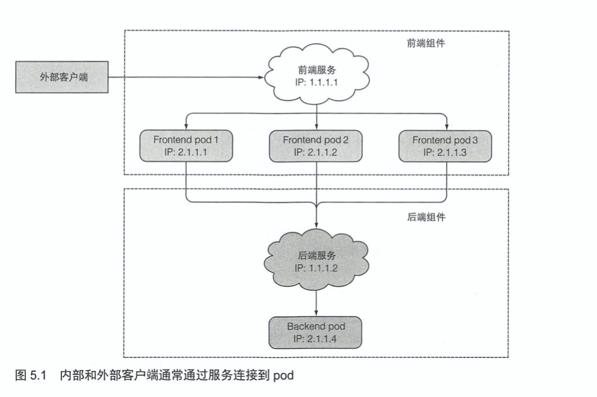

#### 5.1.1 创建服务

创建服务最简单的办法是通过`kubectl expose`，但想要准确定义哪些 pod 属于服务哪些不属于，最好还是通过 yaml 文件启动服务。

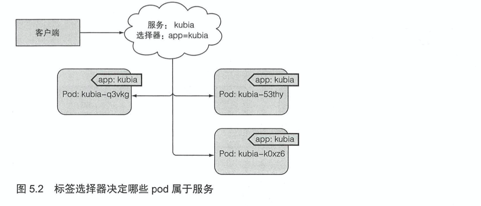

##### 通过 YAML 描述文件创建服务

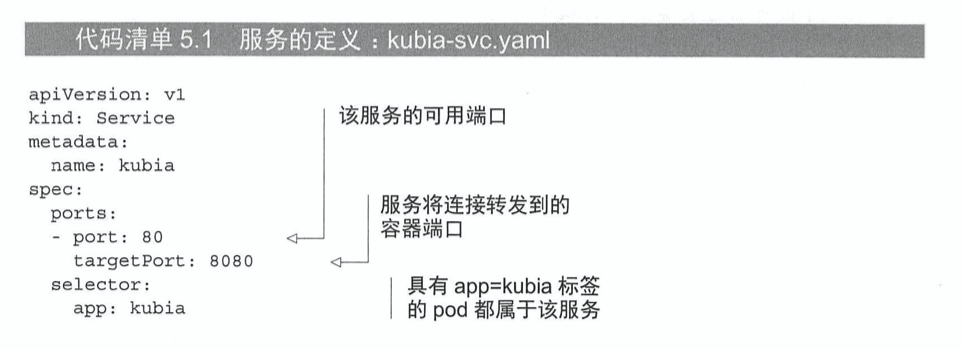

```yaml
apiVersion: v1
kind: Service
metadata:
  name: demo-service
spec:
  selector:
    app: k8s-node-demo-replication-controller-label
  ports:
  - port: 80
    targetPort: 8080
```

```shell
$ kubectl create -f demo-service.yaml
# service/demo-service create
$ kubectl get svc
# NAME            TYPE           CLUSTER-IP      EXTERNAL-IP   PORT(S)          AGE
# demo-service    ClusterIP      10.98.191.226   <none>        80/TCP           71s
# kubernetes      ClusterIP      10.96.0.1       <none>        443/TCP          18d
```

如上列表显示分配给服务的 IP 地址是 10.98.191.226，**因为只是集群的 IP 地址，只是在集群内部可以被访问**。

服务的主要目标就是使集群内部的其他 pod 可以访问当前这组 pod，但通常也希望向外暴露服务，该部分可以在之后讲解。

##### 从内部集群测试服务

可以通过以下几种方法向服务发送请求：

- 创建一个 pod，将请求发送到服务的集群 IP 并记录响应
- 使用 ssh 远程登录到其中一个 K8S 节点上，然后使用 curl 命令
- 通过`kubectl exec`命令在一个已有的 pod 中执行 curl 命令

此处使用第三种方法，顺带介绍`exec`命令。

##### 在运行的容器中远程执行命令

```shell
$ kubectl exec k8s-node-demo-replication-controller-42nkj -- curl -s http://10.98.191.226
# 客户端部署在k8s-node-demo-replication-controller-zjv22之上

# or
$ kubectl exec k8s-node-demo-replication-controller-42nkj -- curl -s http://demo-service
# 客户端部署在k8s-node-demo-replication-controller-zjv22之上
```

> 为什么是双横杠？
>
> 双横杠（--）代表着 kubectl 命令项的结束，两个横杠之后的内容指的是在容器内部需要执行的命令（如果 pod 中有多个容器，可以在双横杠之前使用`-c`参数进行指定容器，如果没有，则不需要指定）。
>
> 但双横杠也不是必须的，如果在容器内需要执行的命令并没有以横杠开始的参数，那么这条命令就可以不加。

上面 exec 命令的访问过程如下图：

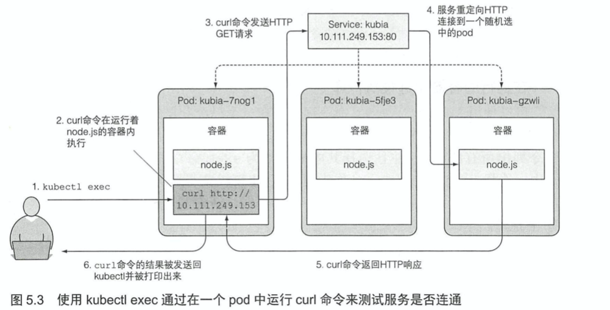

由于服务天生是负载均衡的，所以如果多次调用上面的命令，会发现每次返回的响应都执行在不同的 pod 上。**如果希望特定客户端产生的请求每次都指向同一个 pod，可以设置服务的 sessionAffinity 属性为 ClientIP**（而不是None，None 是默认值）

```yaml
apiVersion: v1
kind: Service
metadata:
  name: demo-service
spec:
  sessionAffinity: ClientIP
  ...
```

这种方式将会让服务代理将来自同一个 IP 的所有请求转发到同一个 Pod 上。

K8S 仅支持两种形式的会话亲和性（？？啥翻译）服务：None 和 ClientIP，由于并不是在 HTTP 层面工作而是直接处理 TCP 和 UDP 包，并不关心其荷载的内容，所以并不支持基于 cookie 的会话亲和性选项。

##### 同一个服务暴露多个端口/使用命名的端口

创建的服务可以暴露一个端口，也可以暴露多个端口（**在创建一个有多个端口的服务的时候，必须给每个端口指定 name 字段**）。此外，还可以通过在 pod 的模板中通过命名来指定端口，将端口的控制权反转，交还给 Pod。

```yaml
# 使用多个端口
...
ports:
  - name: http
    port: 80
    targetPort: http
  - name: https
    port: 443
    targetPort: https
```

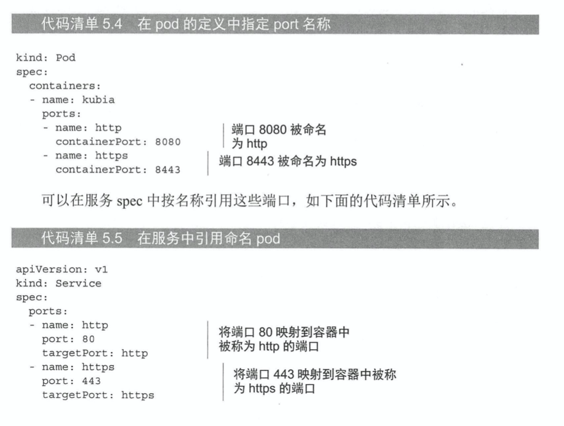

```yaml
apiVersion: v1
kind: ReplicationController
metadata:
  name: k8s-node-demo-replication-controller
spec:
  replicas: 3
  selector:
    app: k8s-node-demo-replication-controller-label
  template:
    metadata:
      name: k8s-node-demo-replication-controller-pod
      labels:
        app: k8s-node-demo-replication-controller-label
    spec:
      containers:
      - name: k8s-node-demo-replication-controller-container
        image: k8s-node-demo-image
        imagePullPolicy: Never
        ports:
        - name: http
          containerPort: 8080
        - name: https
          containerPort: 8443
```

```yaml
apiVersion: v1
kind: Service
metadata:
  name: demo-service
spec:
  # 同一个 IP 的客户端发起的请求将会被转发到同一个 pod
  sessionAffinity: ClientIP
  selector:
    app: k8s-node-demo-replication-controller-label
  ports:
  - name: http
    port: 80
    targetPort: http
  - name: https
    port: 443
    targetPort: https
```


> PS：标签选择器（selector）应用于整个服务，不能对每个端口做单独的配置，如果不同的 pod 有不同的端口映射，则需要创建两个服务。

为什么要命名端口？最大的好处就是即使更换端口号也无须更改服务的 spec，假如现在的 pod 的 http 服务用的是 80 端口，想要切换到其他端口，只要通过修改 pod 模板就可以了。

#### 5.1.2 服务发现

虽然在客户端外部可以通过`kubectl get svc`来查看服务所获得的内部 ip 地址和端口，但在 pod 内部要如何知道这些信息呢？为解决这个问题，K8S 为 pod 内部提供了发现服务的 IP 和端口的方式。

##### 通过环境变量发现服务

当 pod 开始运行，K8S 会初始化一系列环境变量指向存在的服务，当新的服务被创建，新的环境变量也会被注入到现有的 pod 中。

可以在 pod 的容器中运行`env`命令来查看当前的环境变量。

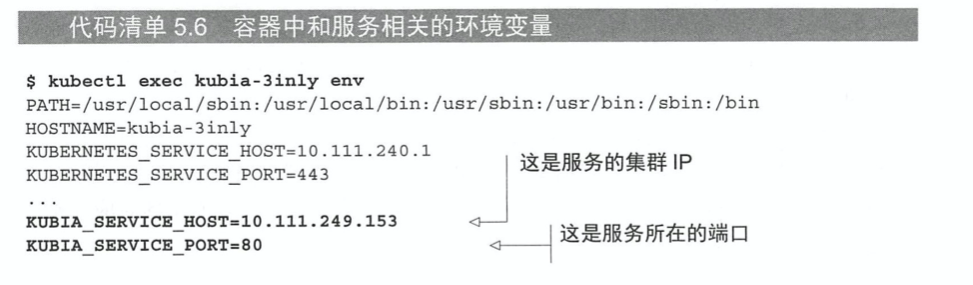

```shell
$ kubectl exec -it k8s-node-demo-replication-controller-2fb2d -- bash
root@k8s-node-demo-replication-controller-2fb2d:/# env
# ...
# HOSTNAME=k8s-node-demo-replication-controller-2fb2d
# DEMO_SERVICE_SERVICE_HOST=10.105.106.251
# KUBERNETES_SERVICE_HOST=10.96.0.1
```

当 pod 需要访问服务时，可以通过`服务名称大写_SERVICE_HOST`和`服务名称大写_SERVICE_PORT`去获取 IP 地址和端口信息。

> 对于注入的服务环境变量，服务名称中的横杠会被转换为下划线，且所有字母都是大写

##### 通过 DNS 发现服务

除了环境变量，还可以通过 DNS 来发现服务的 IP 地址和端口。

在 kube-system 命名空间中，有一个用于管理 dns 的 pod（coredns-xxxxxx），这个 pod 会将集群中的其他 pod 都配置成使用 coredns 来作为 dns 查询的服务。（Kubernetes 通过修改每个容器的 /etc/resolv.conf 文件实现这个功能）。所有运行在 pod 上的进程的 DNS 查询都会被 Kubernetes 自身的 DNS 服务器响应。

> PS：pod 是否使用内部的 DNS 服务器是根据 pod 中 dpec 的 dnsPolicy 属性来决定的

每个服务会从内部的 DNS 服务器中获得一个 DNS 条目，pod 在知道服务名称的情况下可以通过全限定域名（FQDN）来访问，而不是诉诸于环境变量。

##### 通过 FQDN 连接服务

```shell
$ kubectl exec -it k8s-node-demo-replication-controller-k6rdr -- bash
root@k8s-node-demo-replication-controller-k6rdr:/# curl -s http://demo-service.default.svc.cluster.local
# 客户端部署在k8s-node-demo-replication-controller-t7xn2之上
```

FQDN 的格式为：demo-service.default.svc.cluster.local，其中：

- demo-service 对应服务名称
- default 代表服务在其中定义的命名空间
- svc.cluster.local 是所有集群本地服务名称中使用的可配置集群的后缀

连接一个服务可能比这更简单，如果要连接的服务的 pod 和发起请求的 pod 在同一个命名空间下，甚至可以省略`svc.cluster.local`的后缀和命名空间，也就是说只需要 demo-service 这个服务名称就可以。

造成这个的原因是由于 pod 容器的 DNS 解析配置的方式，可以将这些省略掉。

```shell
root@k8s-node-demo-replication-controller-k6rdr:/# cat /etc/resolv.conf
# nameserver 10.96.0.10
# search default.svc.cluster.local svc.cluster.local cluster.local
# options ndots:5
```

```shell
root@k8s-node-demo-replication-controller-k6rdr:/# curl -s http://demo-service
# 客户端部署在k8s-node-demo-replication-controller-t7xn2之上
```

> 客户端仍然必须知道服务的端口号，上面的命令只是因为 http 的默认端口刚好是服务暴露出来的 80 端口。如果并不是标准端口，则还是需要从环境变量中获取端口号。

##### 无法 ping 通服务 IP 的原因

服务的集群 IP 是一个虚拟 IP，并且只有在与服务端口结合时才有意义，因此会出现明明可以 curl 访问却无法 ping 通的情况，因为 pod 容器并没有对应 ping 功能的服务。这个现象是正常的。

### 5.2 连接集群外部的服务

对于发送到服务的请求，K8S 还有一种处理是：不将这个请求发送到集群中的 pod，而是将它重新转发到外部的 IP 和端口，并实现负载平衡。

妥善利用这个功能，**可以让想要访问外部 IP 的 pod 通过服务提供的 service 进行转发，像连接到内部服务一样连接到外部的地址**，充分利用服务发现功能。

#### 5.2.1 介绍服务 endpoint

要声明的是，服务并不是和 pod 直接相连的。有一种名为 EndPoint 的资源介于两者之间。

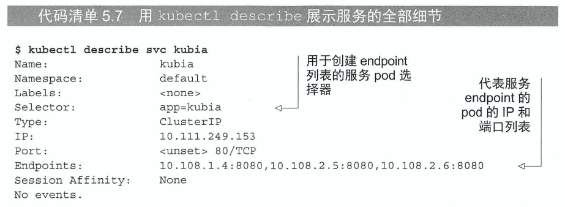

EndPoint 资源是一个暴露服务 IP 地址和端口的列表，和其他资源一样，EndPoint 也可以使用`kubectl get`来获取它的基本信息。

```shell
$ kubectl get endpoints demo-service
# NAME           ENDPOINTS                                                     AGE
# demo-service   172.17.0.4:8443,172.17.0.5:8443,172.17.0.7:8443 + 3 more...   45h
```

在重定义的场景下，无需定义 Service 的 pod Selector，相反，选择器会用于构建 IP 和端口列表，然后存储在 EndPoint 资源中。当客户端连接到服务时，服务代理会选择这些 IP 和端口对中的一个，并将传入连接重定向到该位置监听的服务器。

#### 5.2.2 手动配置服务的 endpoint

如果创建不包含 pod selector 选择器的服务，就意味着 Kubernetes 在创建 service 的时候不会创建 Endpoint 资源（没有选择器就不知道服务会包含哪些 pod，Endpoint 的值也就无从谈起）。于是就可以手动创建 Endpoint 资源并指定该服务的 endpoint 列表了。

##### 创建没有选择器的服务

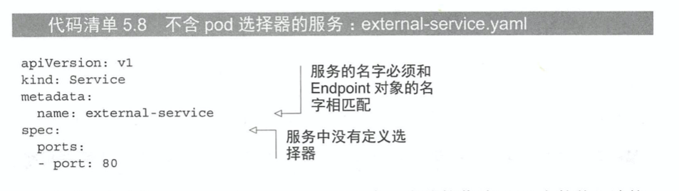

```yaml
apiVersion: v1
kind: Service
metadata:
  name: demo-external-service
spec:
  # 依靠外部指定 endpoint 的服务没有 selector 项
  ports:
    - port: 80
```

##### 为没有选择器的服务创建 Endpoint 资源

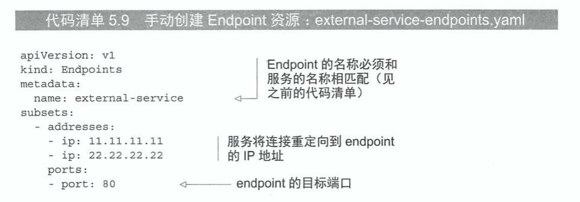

```yaml
apiVersion: v1
kind: Endpoints
metadata:
  name: demo-external-service
subsets:
  - addresses:
    - ip: 11.11.11.11
    - ip: 22.22.22.22
    ports:
    - port: 80
```

```shell
$ kubectl create -f demo-external-service.yaml
# service/demo-external-service created
$ kubectl create -f demo-external-service-endpoints.yaml
# endpoints/external-service created

$ kubectl get service
#NAME                    TYPE           CLUSTER-IP       EXTERNAL-IP   PORT(S)          AGE
#demo-external-service   ClusterIP      10.99.144.37     <none>        80/TCP           2m24s

$ kubectl get endpoints
#NAME                    ENDPOINTS                                                     AGE
#demo-external-service   11.11.11.11:80,22.22.22.22:80                                 26s
```

**Endpoint 对象需要与服务具有相同的名称**，并包含该服务的目标 IP 地址和端口列表，发布服务和 Endpoint 后，该服务可以像具有 pod 选择器的服务那样正常使用。**而在服务创建之后创建的所有 pod 都将包含服务的环境变量，并且根据 endpoints 中配置的多个 addresses 服务端点之间进行负载均衡**。

在此之后可以随时修改服务，添加 pod selector 让其对 Endpoint 进行自动管理。反之，随时将 selector 移除，手动生成的 Endpoint 又将重新接管服务。这样就可以达到服务的 IP 地址保持不变，但是其实际的功能却发生了改变的效果。

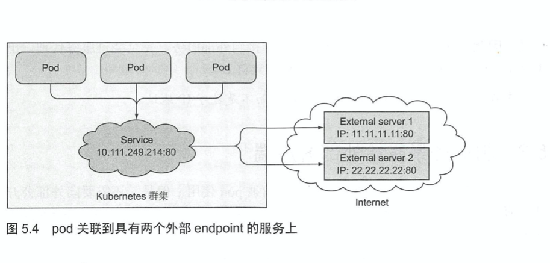

#### 5.2.3 为外部服务创建别名

除了手动配置 Endpoint 以外，Service 资源还可以通过设定 type 为 ExternalName，并通过其完全限定域名（FQDN）来访问外部服务。

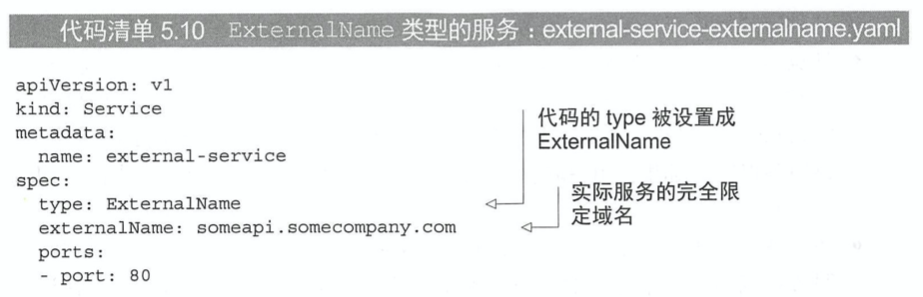

```yaml
apiVersion: v1
kind: Service
metadata:
  name: demo-external-name-type-service
spec:
  type: ExternalName
  externalName: www.baidu.com
  ports:
    - port: 80
```

通过 externalName，Service 可以在 DNS 级别创建一个 CNAME 记录，pod 可以通过 demo-external-name-type-service 这个域名来访问 externalName 中指定的 CNAME。type 为 ExternalName 的服务甚至不会获得集群 IP，pod 对它的访问完全绕过服务代理。

> externalName 记录只会指向域名而不是数字 IP 地址

> **笔者有趣的 debug 过程**：
>
> 使用上面的映射为 www.baidu.com 的 externalName 创建服务，随后随便进入一个 pod 使用`curl -s http://demo-external-name-type-service`企图验证结果时，返回了一个空结果，这是为什么呢？
>
> 替换阿里源，使用`apt update --allow-insecure-repositories && apt install -y host`安装 host 工具后，使用`host demo-external-name-type-service`命令来查看 dns 查询结果，结果发现它导向了另一个神奇的域名...结果如下：
>
> ```shell
> $ host demo-external-name-type-service
> #demo-external-name-type-service.default.svc.cluster.local is an alias for www.baidu.com.
> #www.baidu.com is an alias for www.a.shifen.com.
> #www.a.shifen.com has address 14.215.177.39
> #www.a.shifen.com has address 14.215.177.38
> ```
>
> www.a.shifen.com 最早是百度做的一个竞价排名系统，dns 具体的查询流程可以查看[这里](https://www.jianshu.com/p/8c318314f2f0)，简而言之出现这个错误事正常现象，就算使用`ping`命令去 ping www.baidu.com 这个地址，也会返回这个结果，自然 crul 命令也就无法获得正确的网页。如果想要获得正确的跳转，可以把服务的 externalName 换成 jianshu.com 试试。

### 5.3 将服务暴露给外部客户端

目前为止，只讨论了 pod 如何利用服务进行内网 pod 和外网转发代理的访问，但服务还有一个重要功能，就是让 pod 向外部公开内部的服务进程以便外部客户端可以进行访问。

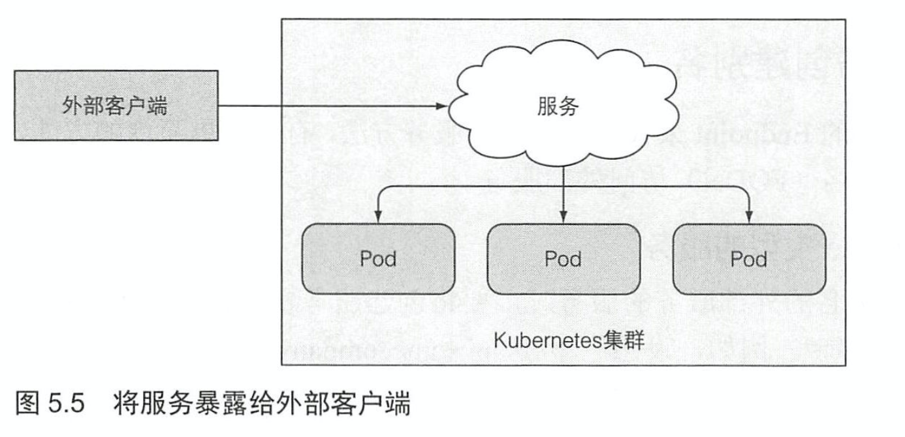

暴露服务可以有几种方式：

- 将服务的类型设置为 NodePort，这种类型会让服务在每个节点上打开同一个端口，并监听该端口上的流量，转发回 pod。
- 将服务的类型设置为 LoadBalance，LoadBalance 是 NodePort 的一种扩展，K8S 会使用一个负载均衡器将流量重定向到跨所有节点的节点端口，客户端会通过负载均衡器的 IP 连接到服务。
- 创建一个 Ingress 资源，这是一个完全不同的机制，可以通过一个 IP 地址公开多个服务——它运行在 HTTP 上，将在第 5 章详细介绍。

#### 5.3.1 使用 NodePort 类型的服务

通过创建 NodePort 服务，可以让 K8S 在其所有节点上保留一个端口（所有节点上都使用相同的端口号），并将传入的连接转发给作为服务部分的 pod。

##### 创建 NodePort 类型的服务

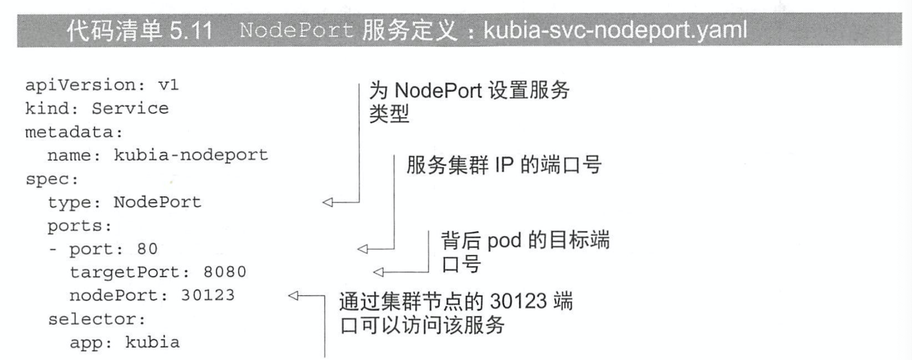

```yaml
apiVersion: v1
kind: Service
metadata:
  name: demo-service
spec:
  # 同一个 IP 的客户端发起的请求将会被转发到同一个 pod
  # sessionAffinity: ClientIP
  type: NodePort
  selector:
    app: k8s-node-demo-replication-controller-label
  ports:
  - name: http
    port: 80
    targetPort: http
    nodePort: 30080
  - name: https
    port: 443
    targetPort: https
    nodePort: 30443
```

```shell
$ kubectl create -f demo-service.yaml
service/demo-service created
$ kubectl get svc
NAME                              TYPE           CLUSTER-IP       EXTERNAL-IP   PORT(S)                      AGE
demo-service                      NodePort       10.100.229.104   <none>        80:30080/TCP,443:30443/TCP   20s
$ kubectl get node -o wide
NAME       STATUS   ROLES    AGE   VERSION   INTERNAL-IP    EXTERNAL-IP   OS-IMAGE               KERNEL-VERSION   CONTAINER-RUNTIME
minikube   Ready    master   22d   v1.19.2   192.168.64.2   <none>        Buildroot 2019.02.11   4.19.114         docker://19.3.12
$ curl -s http://192.168.64.2:30080
客户端部署在k8s-node-demo-replication-controller-lqljv之上
```

如上，minikube 节点部署在 ip 192.168.64.2 上，创建服务后，该 ip 的 30080 端口将被暴露出来，就可以通过该端口访问服务，再由服务将请求转发到其控制的 pod 之上。

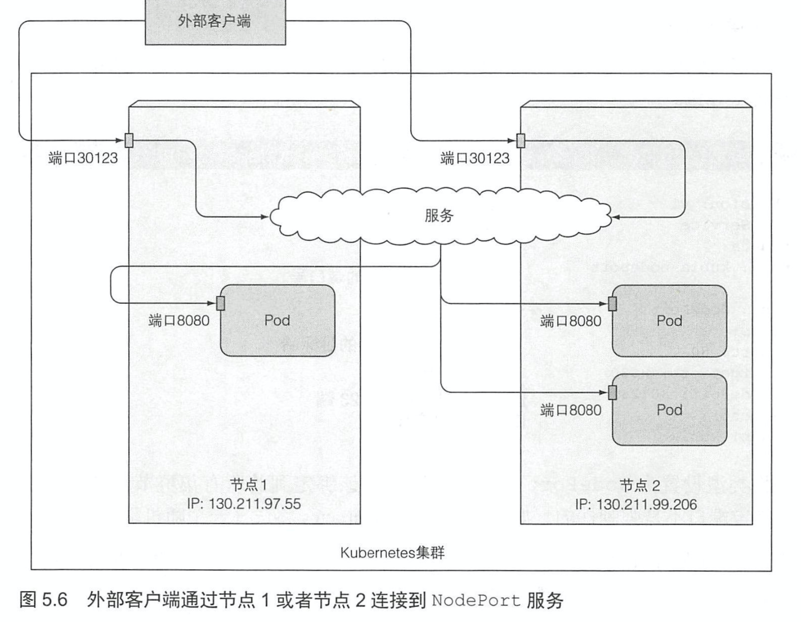

> 在一些提供 K8S 服务的云服务器供应商的平台上，将端口暴露之后往往还需要配置节点的防火墙，让其允许对应暴露端口访问。

#### 5.3.2 通过负载均衡器将服务暴露出来

使用 NodePort 可以让整个互联网通过任何节点上的对应端口访问到你的 pod，并且通过服务的配置，能够让这些流量在多个 pod 中进行负载均衡。

可是，对于请求的客户端而言，节点并不是负载均衡的，如果访问的节点发生了故障，那么客户端就无法再访问该服务，负载均衡也就无效了。也就是说，在节点的层面还需要再加一层负载均衡器，来让请求访问到不同的节点，而这一步在 K8S 中可以通过创建一个 Load Badancer 来完成。

如果 K8S 在不支持 Load Badancer 服务的环境中运行，则不会调配负载平衡起，服务仍然会表现得像一个 NodePort 服务。负载均衡器拥有自己独一无二的可公开访问的 Ip 地址（公网 IP），并将所有连接重定向到服务。

##### 创建 LoadBalance 服务

minikube 不支持 LoadBalancer 负载均衡器，会自动降为 NodePoint 模式（若 nodePoint 未指定，会随机分配 nodePoint）。

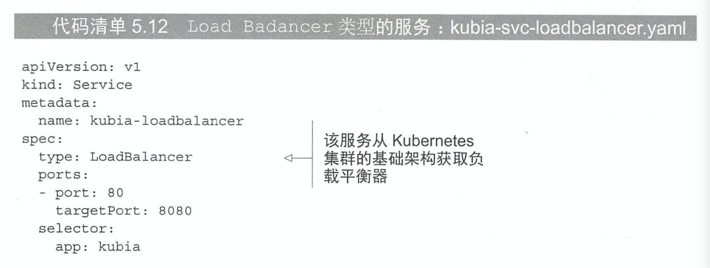

```yaml
apiVersion: v1
kind: Service
metadata:
  name: demo-service
spec:
  # 同一个 IP 的客户端发起的请求将会被转发到同一个 pod
  # sessionAffinity: ClientIP
  # type: NodePort
  type: LoadBalancer
  selector:
    app: k8s-node-demo-replication-controller-label
  ports:
  - name: http
    port: 80
    targetPort: http
    # nodePort: 30080
  - name: https
    port: 443
    targetPort: https
    # nodePort: 30443
```

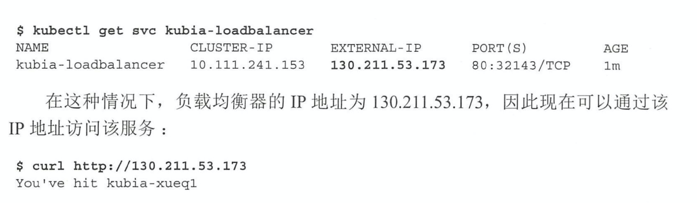

minikube 中的情况：

```shell
$ kubectl create -f demo-service.yaml
service/demo-service created
$ kubectl get svc
NAME                              TYPE           CLUSTER-IP     EXTERNAL-IP   PORT(S)                      AGE
demo-service                      LoadBalancer   10.105.82.65   <pending>     80:30369/TCP,443:31417/TCP   5s
$ curl http://192.168.64.2:30369
客户端部署在k8s-node-demo-replication-controller-g9ggs之上
```

> PS：当 Service 的 sessionAffinity 未指定为 ClusterIP 时，使用 curl 命令请求服务经常会返回不同的 pod，但如果你打开浏览器访问，由于有 keep-alive 的存在，用户还是会使用相同的 Pod（直至连接关闭）

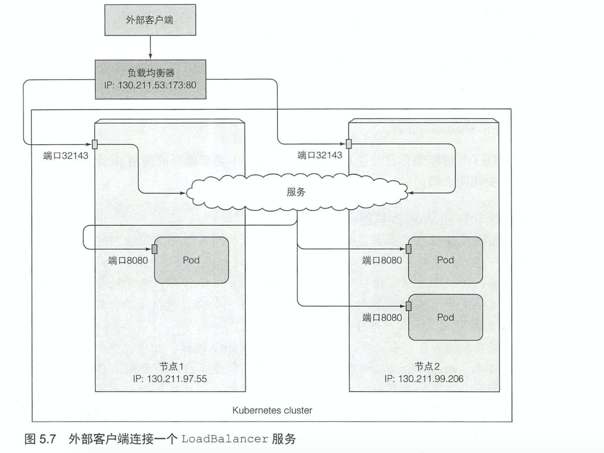

#### 5.3.3 了解外部连接的特性

##### 防止不必要的网络跳数

随机选择的 pod 并不一定在接受连接的同一节点上运行，可能需要额外的网络跳转才能到达 pod，为了防止这种情况，可以在服务`spec`中设置：

```yaml
spec:
	externalTrafficPolicy: Local
```

该选项为 Local 时，服务对于请求只会选择本地运行的 pod，如果没有本地 Pod 存在，则会将请求挂起。因此需要确保至少具有一个 pod 的节点。

**但使用该选项还有一个额外的缺点**，激活该选项后，流量的负载平衡将会基于 Node 数量而不是 Pod 数量，也就是说当 pod 在几个节点中的分配并不均匀时，可能会出现这种情况：

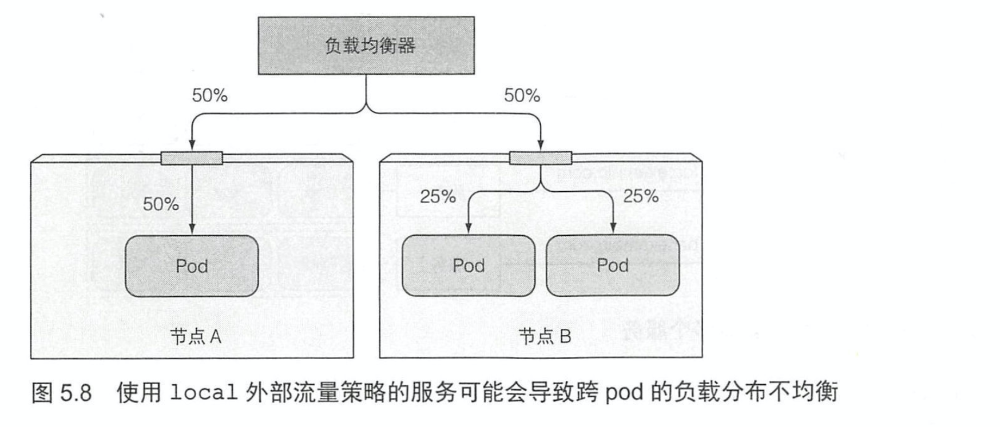

虽然有三个 pod，但由于不均匀分配在两个 pod 中，导致流量并没有被均匀分配。

##### 记住客户端 IP 是不记录的

当集群内的客户端连接到服务时，支持服务的 pod 可以获取客户端的 IP 地址，**但是当 pod 通过 NodePoint 服务接收到请求时，由于对数据包执行了源网络地址转换（SNAT），因此数据包的源 IP 将会发生更改**。

这意味着对于某些 Web 服务来说，其访问日志会无法显示浏览器的 IP。

但如果将 externalTrafficPolicy 设为 local，则服务内部并不会执行 SNAT 操作（并不会跳转到其他节点的 pod 中），IP 地址也就有可能能得到保留。

### 5.4 通过 Ingress 暴露服务

> Ingress ——指进入或进入的行为；进入的权利；进入的手段或地点；入口

##### 为什么需要 Ingress

上面介绍的 LoadBalancer 服务其缺点在于，每一个服务都需要自己的负载均衡器，以及独有的公网 IP 地址。而 Ingress 只需要一个公网 IP 就能为许多服务提供访问。

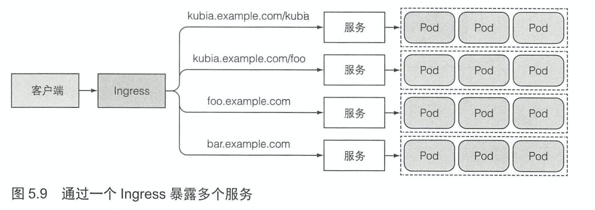

Ingress 会根据请求的主机名和路径决定请求转发到的服务。

Ingress 基于 HTTP 协议和应用层，因此能提供一些高级的功能，诸如基于 coookie 的会话亲和性（session affinity）等。

##### Ingress 控制器必不可少

只有当 Ingress 控制器在集群中运行，Ingress 资源才能正常工作。不同的 K8S 环境会使用不同的控制器，但有些并不提供默认限制器。

像 Google 的云平台就会使用 HTTP 负载平衡模块来提供 Ingress 功能，如果要使用 minikube 来运行，则要确保已经启用了 Ingress 附加组件。

```shell
# 列出所有附加组件
$ minikube addons list
|-----------------------------|----------|--------------|
|         ADDON NAME          | PROFILE  |    STATUS    |
|-----------------------------|----------|--------------|
| dashboard                   | minikube | enabled ✅   |
| default-storageclass        | minikube | enabled ✅   |
| ingress                     | minikube | disabled     |
| ingress-dns                 | minikube | disabled     |
|-----------------------------|----------|--------------|
# 启用 Ingress 附加组件，并查看正在运行的 Ingress
$ minikube addons enable ingress
$ kubectl get pod --all-namespaces | grep ingress
kube-system            ingress-nginx-admission-create-hkw4h         0/1     Completed      0          20h
```

在输出的底部会看到 Ingress 控制器 Pod，可以看到 minikube 的 Ingress 的功能其实是通过开启一个 Nginx 服务器的 pod 来提供的。

> [minikube 设置代理](https://minikube.sigs.k8s.io/docs/handbook/vpn_and_proxy/)
>
> 1. 注意一定要设置 NO_PROXY，然后再重启 minikube
> 2. 使用`minikube addons enable ingress`要在新开的窗口执行`kubectl`命令（第一步设置的代理会导致 kubectl 命令找不到对应的 K8S API 服务器）

#### 5.4.1 创建 Ingress 资源

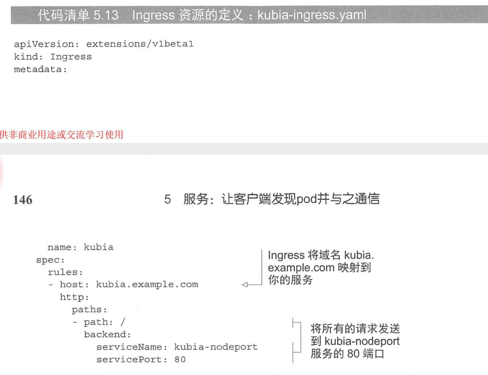

```yaml
apiVersion: extensions/v1beta1
kind: Ingress
metadata:
  name: demo-ingress
spec:
  rules:
  - host: nodeservice.demo.com
    http:
      paths:
      - path: /
        backend:
          serviceName: demo-service
          servicePort: 80
```

```shell
$ kubectl get ingress
NAME           CLASS    HOSTS                  ADDRESS        PORTS   AGE
demo-ingress   <none>   nodeservice.demo.com   192.168.64.2   80      5m19s
```

创建的 Ingress 会确保控制器能够收到所有对应域名`nodeservice.demo.com`的 HTTP 请求，并将它们转发到`demo-service`的 80 端口上。

#### 5.4.2 通过 Ingress 访问服务

通过`kubectl get ingress`能够看到 ingress 被网卡分配的 IP 地址（有可能会需要等一段时间才能生成 IP 地址），如果需要通过注册的域名访问服务，就需要先在宿主机上添加一条 host 记录。

```txt
192.168.64.2 nodeservice.demo.com
```

接下来就可以通过 nodeservice.demo.com 来进行访问 pod 了。

```shell
$ curl http://nodeservice.demo.com
客户端部署在k8s-node-demo-replication-controller-mtx2n之上
```

##### 了解 Ingress 的工作原理

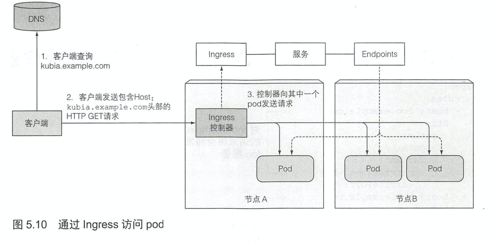

如上图所示，客户端通过 host（第 2。步）访问到 Ingress 控制器的 IP，然后再发送 HTTP 请求，控制器从头部的域名确定客户端正在尝试访问哪个服务，通过与该服务关联的 Endpoint 对象查看 pod IP，并将客户端的请求转发给其中的一步 pod。

#### 5.4.3 通过相同的 Ingress 暴露多个服务

一个 Ingress 可以将多个主机和路径映射到多个服务。

##### 将不同的服务映射到相同主机的不同路径

PS：其实就相当于是 nginx 一个 conf 配置里不同的反向代理映射...

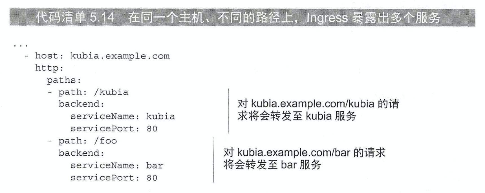

```yaml
apiVersion: extensions/v1beta1
kind: Ingress
metadata:
  name: demo-ingress
spec:
  rules:
  - host: nodeservice.demo.com
    http:
      paths:
      - path: /demo
        backend:
          serviceName: demo-service
          servicePort: 80
      - path: /demo2
        backend:
          serviceName: demo2-service
          servicePort: 80
```

##### 将不同的服务映射到不同的主机上

PS：其实就是 nginx 的多个 conf 配置文件，不同的 server 配置...

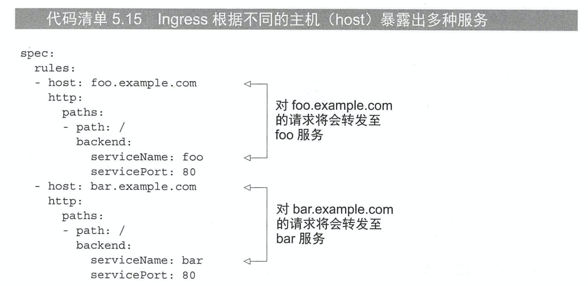

```yaml
apiVersion: extensions/v1beta1
kind: Ingress
metadata:
  name: demo-ingress
spec:
  rules:
  - host: nodeservice.demo.com
    http:
      paths:
      - path: /
        backend:
          serviceName: demo-service
          servicePort: 80
  - host: nodeservice.bar.com
    http:
      paths:
      - path: /
        backend:
          serviceName: demo-service
          servicePort: 80
```

但这种方式本地测试时还是需要添加额外的 hosts 文件记录。

#### 5.4.4 配置 Ingress 处理 TLS 传输

接下来了解如何配置 Ingress 以支持 TLS。

##### 为 Ingress 创建 TLS 认证

当客户端创建到 Ingress 控制器的 TLS 连接时，**客户端和控制器之间的通信是加密的，而控制器和后端 pod 之间的通信则不是**。运行在 pod 上的应用程序不需要支持 TLS。

要使控制器能够负责处理与 TLS 相关的所有内容，需要将证书和私钥附加到 Ingress。这两个必需资源存储在成为 Secret 的 K8S 资源中，然后在 Ingress 的 manifest yaml 文件中引用它。Secret 资源的详细介绍将会留在第七章。

首先先创建私钥和证书：

```shell
$ openssl genrsa -out demo-tls.key 2048
Generating RSA private key, 2048 bit long modulus
............................+++
................................................................+++
e is 65537 (0x10001)


$ openssl req -new -x509 -key demo-tls.key -out demo-tls.cert -days 360 -subj /CN=nodeservice.demo.com
```

然后使用私钥和证书来创建 Secret：

```shell
$ kubectl create secret tls demo-tls-secret --cert=demo-tls.cert --key=demo-tls.key
secret/demo-tls-secret created

$ kubectl get secrets
NAME                  TYPE                                  DATA   AGE
demo-tls-secret       kubernetes.io/tls                     2      4m33s
```

> 也可以不通过自己签发证书，而是通过创建 CertificateSigningRequest（CSR） 资源来签署。
>
> ```shell
> $ kubectl certificate approve <name of the CSR>
> ```
>
> 但要注意，使用这种方法集群中必须运行证书签署者组件，否则证书签发命令将不起作用。

现在私钥和证书都存储在 demo-tls-secret 中，接下来可以更新 Ingress 对象让它接收 nodeservice.demo.com 发过来的 HTTPS 请求。

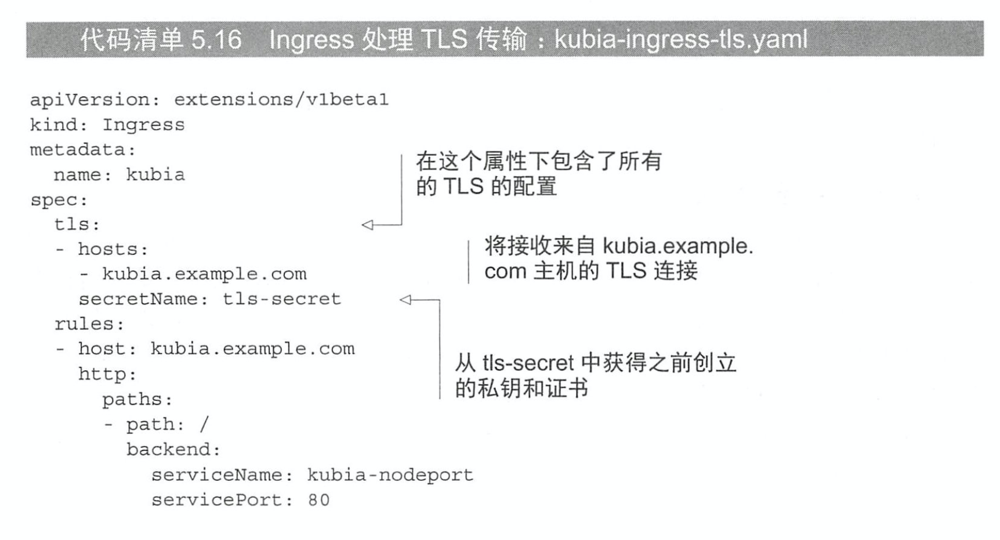

```yaml
apiVersion: extensions/v1beta1
kind: Ingress
metadata:
  name: demo-ingress
spec:
  tls:
  - hosts:
    - nodeservice.demo.com
    secretName: demo-tls-secret
  rules:
  - host: nodeservice.demo.com
    http:
      paths:
      - path: /
        backend:
          serviceName: demo-service
          servicePort: 80
```

**PS: 可以通过`kubectl apply -f xxx.yaml`的方式来更新指定的资源，而不是通过删除并重新创建资源的方式。**

```shell
$ kubectl apply -f demo-ingress.yaml
ingress.extensions/demo-ingress configured
```

之后就可以通过`https://nodeservice.demo.com`来访问 TLS 加密过的服务了，可以使用`curl -k`命令来测试（浏览器可能会因为自签证书而被浏览器的安全策略拦截请求，如果是 chrome，可以通过在白屏界面上输入`thisisunsafe`这个小彩蛋来进行访问）

> 拓展阅读：[小技巧 : Chrome 绕过 HSTS 限制](https://blog.saltradio.org/archives/chrome-hsts-bypass.html)

```shell
$ curl -k https://nodeservice.demo.com/
客户端部署在k8s-node-demo-replication-controller-mtx2n之上
```

> Ingress 是一个相对较新的 K8S 功能，在将来会有更多的改进和新功能。

### 5.5 pod 就绪后发出信号

pod 可能需要时间来加载配置或数据，在这段启动时间内可能也会有请求被从服务转发到 pod，而这会导致用户请求被挂起，影响体验。所以通常不希望 pod 在被创建以后立即开始接收请求，为此则需要一种新型的探针对其进行状态检测：就绪探针。

#### 5.5.1 介绍就绪探针

之前介绍过存活探针，可以确保异常容器自动重启来保持应用程序的正常运行。而本节介绍的就绪探测器会定期调用，并确定特定的 pod 是否接收客户端请求。当容器的准备就绪探测返回成功时，表示容器已经准备好接收请求。

就绪探针跟存活探针一样有三种类型，Exec 探针、HTTP GET 探针、TCP socket 探针。

##### 了解就绪探针的操作

启动容器时，可以为 Kubernetes 配置一个等待时间，经过等待时间以后它会周期性地调用探针，并根据就绪探针的结果采取行动：

1. 如果某个 pod 尚未准备就绪，则会从服务中删除该 pod（请求不会转发到 pod 中）
2. 如果 pod 再次准备就绪，则重新添加 pod

与存活探针不同的是，如果容器未通过准备检查，不会被终止或重新启动，这是两种探针之间的重要区别。

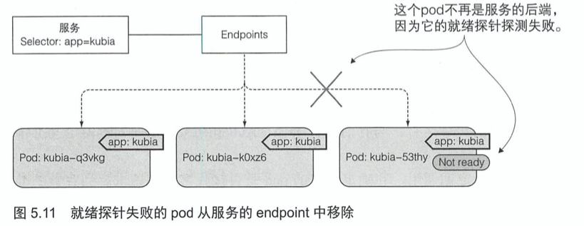

##### 了解就绪探针的重要性

就绪探针可以确保客户端永远只与正常的 pod 交互，因为如果任何一个 pod 的内部出现问题，就绪探针都会发现并将其移出 service，这样客户端的请求就永远（几乎？）不会被转发到有问题的 pod 上。

#### 5.5.2 向 pod 添加就绪探针

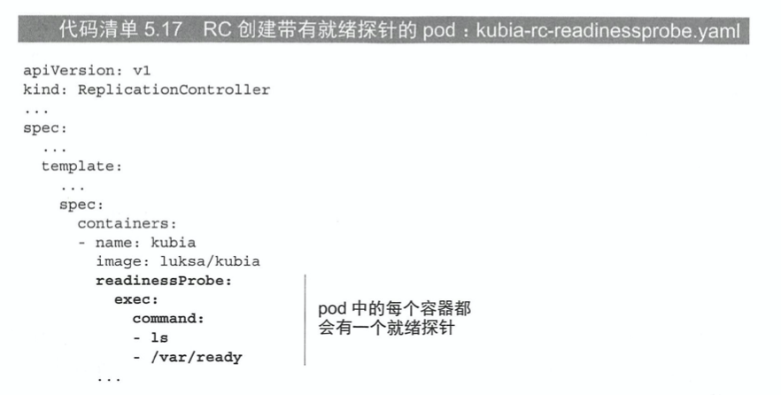

```yaml
apiVersion: v1
kind: ReplicationController
metadata:
  name: demo-readiness-probe-replication-controller
spec:
  replicas: 3
  selector:
    app: demo-readiness-probe-replication-controller-label
  template:
    metadata:
      name: demo-readiness-probe-replication-controller-pod
      labels:
        app: demo-readiness-probe-replication-controller-label
    spec:
      containers:
      - image: k8s-node-demo-image
        imagePullPolicy: Never
        name: demo-readiness-probe-replication-controller-pod-container
        ports:
        - name: http
          containerPort: 8080
        - name: https
          containerPort: 8443
        readinessProbe:
          exec:
            command:
            - ls
            - /var/ready
```

就绪探针将定期在容器内执行`ls /var/ready`命令，如果文件存在，则就绪探针将会成功，否则将会失败。

定义这样一个探针的原因就是可以通过创建或删除有问题的文件来触发结果。

```shell
$ kubectl create -f demo-readiness-probe.yaml
replicationcontroller/demo-readiness-probe-replication-controller created
$ kubectl get pod
NAME                                                READY   STATUS    RESTARTS   AGE
demo-readiness-probe-replication-controller-r5bf2   0/1     Running   0          4s
demo-readiness-probe-replication-controller-trxvl   0/1     Running   0          4s
demo-readiness-probe-replication-controller-wp6wb   0/1     Running   0          4s
```

可以看到 READY 列显示没有一个容器是准备就绪的，可以模拟`exec`命令来创建一个 READY 文件使其创建成功。

```shell
$ kubectl exec demo-readiness-probe-replication-controller-92fhs -- touch /var/ready
$ kubectl get pod demo-readiness-probe-replication-controller-92fhs
NAME                                                READY   STATUS    RESTARTS   AGE
demo-readiness-probe-replication-controller-92fhs   1/1     Running   0          3m11s
```

该 pod 已准备就绪，可以通过上文创建的 Ingress： `https://nodeservice.demo.com/`来进行访问。

可以使用 describe 命令来获取更多更详细的关于 pod 的信息。

```shell
$ kubectl describe pod demo-readiness-probe-replication-controller-92fhs | grep Readiness
    Readiness:      exec [ls /var/ready] delay=0s timeout=1s period=10s #success=1 #failure=3
```

默认情况下，就绪探针会每 10 秒检查一次。

如果现在删除该文件，则会再次从服务中删除该容器。

#### 5.5.3 了解就绪探针的实际作用

在实际应用中，如果没有将就绪探针添加到 Pod 中，它们几乎立即就会成为服务端点，所以请务必定义就绪探针，否则服务将会有可能接收到 503 报错（服务暂不可用）。

此外，不要将停止 pod 的逻辑纳入就绪探针中，停止 pod 并不需要就绪探针的参与，只要使用`kubectl delete`或访问 K8S 的删除 API 就行了。

### 5.6 使用 headless 服务来发现独立的 pod

> 本节对 headless 的作用阐述的不好，建议看下面这篇博文拓展阅读：
>
> [K8S容器编排之Headless浅谈](https://zhuanlan.zhihu.com/p/54153164)


> 本次阅读至 P153 5.5.2 向 pod 添加就绪探针 170
