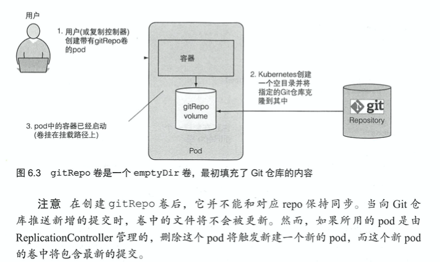

# KubernetesInAction学习笔记（6）

## 第6章 卷：将磁盘挂载到容器

 本章介绍 pod 中的容器是如何访问外部磁盘存储的，以及如何在它们之间共享存储空间。

之前介绍过，pod 中的各个容器共享诸如 CPU、RAM、网络接口等资源，**但是，其中并不包括磁盘资源，pod 中的每个容器都有自己的独立的文件系统，因为文件系统来自容器镜像**。

每个新容器都是通过在构建镜像时加入的详细配置文件来启动的，并不会识别前一个容器的状态，但在某些场景下，可能希望新的容器可以在之前容器结束的位置继续运行。

这种情况下并不需要整个文件系统被持久化，但又希望能保存实际数据的目录。这种情况可以通过定义存储卷来满足这个需求，它们被定义为 pod 的一部分，并与 pod 共享相同的生命周期。这意味着在 pod 启动时创建卷，并在删除 pod 时销毁卷。因此，在容器重新启动期间，卷的内容将保持不变，新容器可以识别前一个容器写入卷的所有文件。另外，如果一个 pod 包含多个容器，那么这个卷也可以同时被所有的容器使用。

### 6.1 介绍卷

K8S 中的卷不是一个单独的资源，而是包含在 pod 的规范中。pod 中的所有容器都可以使用卷，但必须先将它挂在在每个需要访问它的容器中，每个容器都可以在其文件系统的任意位置挂载卷。

> 创建 demo 镜像：每 10 秒在一个文件夹中生成包含一句随机谚语的 html 文件镜像，基于 ubuntu。
>
> 对应 Dockerfile 文件：
>
> ```dockerfile
> FROM ubuntu
> RUN apt-get update ; apt-get -y install fortune
> ADD fortuneloop.sh /bin/fortuneloop.sh
> RUN chmod a+x /bin/fortuneloop.sh
> ENTRYPOINT /bin/fortuneloop.sh
> ```
>
> 对应入口文件 fortuneloop.sh ：
>
> ```shell
> #!/bin/bash
> # 可以用 tee 命令生成文件
> # 阻止脚本中断信号
> trap "exit" SIGINT
> mkdir /var/htdocs
> while :
> do
>   echo $(TZ=UTC-8 date) writing fortune to /var/htdocs/index.html
>   echo "$(TZ=UTC-8 date)  $(/usr/games/fortune)" > /var/htdocs/index.html
>   sleep 10
> done
> ```
>
> 构建命令：
>
> ```shell
> $ docker build -f ./Dockerfile -t fortune-demo-image .
> ```
>
> 可通过下列命令查看效果：
>
> ```shell
> $ docker run -dit --name fortune-demo-container fortune-demo-image && docker exec -it fortune-demo-container bash
> root@ede6a2768569:/# cat /var/htdocs/index.html
> ```

#### 6.1.1 卷的应用示例

以下的例子中，将两个卷添加到 pod 中，并在三个容器的适当路径上挂载它们，这样的话三个容器就可以一起工作，数据互通，并发挥作用。


一般来讲，卷被绑定到 pod 的生命周期中，只有在 pod 存在时才会存在，但取决于卷的类型，即便在 pod 和卷消失之后，**卷的文件**也有可能保持原样，并可以挂载到新的卷中，这取决于卷的类型。

#### 6.1.2 介绍可用的卷类型

以下是几种可用的卷类型：

- emptyDir：用于存储临时数据的简单空目录
- hostPath：用于将目录从工作节点的文件系统挂载到 pod 中
- gitRepo：通过检出 Git 仓库的内容来初始化的卷
- nfs：挂载到 pod 中的 NFS 共享卷
- gcePersistentDisk（google）、awsElasticBlockStore（亚马逊）、azureDisk（微软）：用于挂载云服务商提供的特定存储类型
- configMap、secret、downwardAPI：用于将 K8S 部分资源和集群信息公开给 pod 的特殊类型的卷
- persistentVolumeClaim：一种使用预置或着动态配置的持久存储类型

单个容器可以同时使用不同类型的多个卷。

### 6.2 通过卷在容器之间共享数据

最简单的类型就是 emptyDir 卷，这种类型对于在同一个 pod 中几个容器之间共享文件特别有用，也可以被单个容器用于将数据写入磁盘。（数据也可以写入容器的文件系统本身，但有时候容器的文件系统甚至是不可写的，所以使用挂载卷成为了另一种选择）

在下面的例子中，将使用 nginx 镜像搭配上面构建的 fortune 镜像，构建一个基于共同的卷返回一个随机内容的 html 文件的 pod。

##### 在 pod 中使用 emptyDir 卷&&创建 pod


```yaml
apiVersion: v1
kind: Pod
metadata:
  name: demo-fortune-pod
spec:
	volumes:
  - name: html
    emptyDir: {}
  containers:
  - image: fortune-demo-image
    imagePullPolicy: Never
    name: html-generator
    volumeMounts:
    - name: html
      mountPath: /var/htdocs
  - image: nginx:alpine
    imagePullPolicy: Never
    name: web-server
    volumeMounts:
    - name: html
      mountPath: /usr/share/nginx/html
      readOnly: true
    ports:
    - name: http
      containerPort: 80
      protocol: TCP
```

该 pod 包含两个容器和一个挂载在两个容器中的公用的卷，但却挂载在不同的容器内路径上。达成的效果就是由 html-generator 在 mountPath 生成的 html 文件会通过卷，更新在 web-server 的 mountPath 路径中。

```shell
$ kubectl create -f demo-fortune-pod.yaml
pod/demo-fortune-pod created
# 通过 port-forward 进行端口映射，随后可以使用浏览器访问节点端口测试
$ kubectl port-forward demo-fortune-pod 8080:80
Forwarding from 127.0.0.1:8080 -> 80
Forwarding from [::1]:8080 -> 80
```

##### 指定用于 EMPTYDIR 的介质

作为卷来使用的 emptyDir，是在 pod 所在的工作节点的实际磁盘上创建的，因此卷的性能也就取决于节点的磁盘性能。但也可以通知 K8S 在内存而不在硬盘上创建 emptyDir，只要设置 medinum 项为 Memory 就可以。


emptyDir 卷是最简单的卷类型，其他类型的卷都是在它的基础上预填充数据构建的。

#### 6.2.2 使用 Git 仓库作为存储卷

gitRepo 卷基本上也是一个 emptyDir 卷，但会通过克隆 Git 仓库并在 pod 启动时检出特定版本来填充数据。




上面的配置中，值得注意的是 directory 被设置为 .（句号），它代表存储库将会被克隆到根目录中，而不是另起一个文件夹存储仓库的数据。

但要注意的是，**gitRepo 卷不支持私有仓库**，正确来说，应该是卷不支持任何通过 SSH 协议克隆私有仓库的方法。想要实现私有仓库同步这个目标，应该使用一个额外的容器（比如说 gitsync sidecar 这类镜像）来保持同步，而不是使用 gitRepo 卷。

### 6.3 访问工作节点文件系统上的文件

大多数 pod 应该忽略它们的主机节点，也不应该访问节点文件系统傻姑娘的任何文件，但是某些系统级别的 pod （通常由 DaemonSet 管理）会有这个需求，K8S 通过 hostPath 卷实现了这一点。

#### 6.3.1 介绍 hostPath 卷

hostPath 卷指向节点的文件系统上的特定文件或目录。


hostPath 是一种持久性存储，不像 gitRepo 和 emptyDir 的内容会在 pod 删除时同时删除，hostPath 卷的内容指向主机上的一个路径，如果一个 pod 被删除了，下一个被创建的相同的 pod 会发现上一个 pod 留下的数据（前提是新的 pod 被调度到了相同的节点上）

但是无论如何，常规的 pod 都不应该使用 hostPath 卷作为存储数据的目录，因为当 pod 被安排在另一个节点时，会找不到数据。（PS：除非你用 nodeSelector 通过标签把节点和 pod 强绑定）

### 6.4 使用持久化存储


> 本次阅读至 P173 6.4 使用持久化存储 189