# KubernetesInAction学习笔记（7）

## 第7章 configMap 和 Secret：配置应用程序

几乎所有的应用都需要配置信息，比如不同部署示例间的区分设置，访问外部系统的证书等等。这些配置数据不应该被嵌入应用本身，K8S 允许传递配置给运行在 K8S 上的应用程序。

### 7.1 配置容器化应用程序

用于存储配置数据的 K8S 资源被称为 ConfigMap，但无论是否使用 ConfigMap 存储，以下方法均可以被用作配置你的应用程序：

- 向容器传递命令行参数
- 为每个容器设置自定义环境变量
- 通过特殊类型的卷将配置文件挂载到容器中

### 7.2 向容器传递命令行参数

##### 了解 Dockerfile 中的 ENTRYPOINT 与 CMD

- ENTRYPOINT：定义容器启动时（即`docker run`时）被调用的可执行程序
- CMD：用于指定传递给 ENTRYPOINT 的参数

尽管可以直接使用 CMD 指令指定镜像运行时想要执行的命令，但正确的用法依然是使用 ENTRYPOINT 指定命令，用 CMD 指定所需的默认参数，这样就可以通过`docker run`直接运行默认的指令，也可以通过传入不同的 CMD 参数来覆盖默认参数值。

```shell
# 以默认的 CMD 参数运行 ENTRYPOINT 中指定的命令
$ docker run <image>
# 添加一些参数，使用这些参数覆盖默认的 CMD 来运行 ENTRYPOINT 中指定的命令
$ docker run <image> <arguments>
```

##### 了解 shell 与 exec 形式的区别

Dockerfile 中，ENTRYPOINT 与 CMD 都接受以下两种写法：

- shell 形式的写法，如：`ENTRYPOINT node app.js`
- exec 形式的写法，如：`ENTRYPOINT ["node", "app.js"]`

两种形式的区别是，exec 的形式会直接运行 node 进程，而并非在 shell 中执行。也就是说 shell 形式下的主进程是 shell 进程而非 node 进程。

通常情况下，shell 进程往往是多余的，因此通常可以直接采用 exec 形式的 ENTRYPOINT 指令。

#### 7.2.2 在 K8S 中覆盖命令和参数

在 K8S 中定义容器时，镜像的 ENTRYPOINT 和 CMD 均可以被覆盖，只需要在容器中设置属性 command 和 args 的值即可。

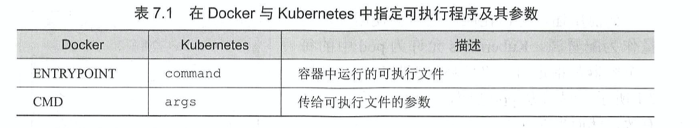

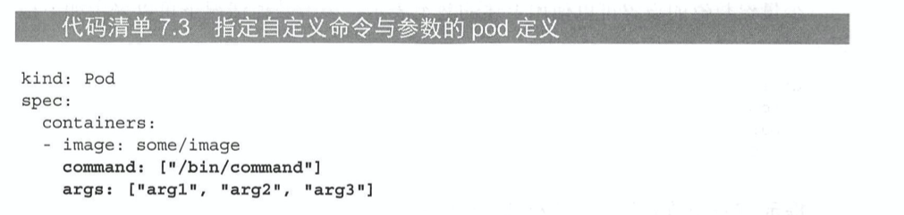

一般来说 command 字段很少被覆盖，被覆盖的一般都是 args 字段，除非是像 busybox 那样没有指定 ENTRYPOINT 的镜像。

要注意的是，command 和 args 字段在 pod 创建后无法被修改。

##### 用自定义间隔值运行 fortune pod

首先对之前 fortune image 进行一些修改，准备一个根据输入参数，输出不同结果的 image。

```shell
#!/bin/bash
# 可以用 tee 命令生成文件
# 阻止脚本中断信号
trap "exit" SIGINT
INTERVAL=$1
echo "every $INTERVAL seconds to generate new fortune"
mkdir /var/htdocs
while :
do
  echo $(TZ=UTC-8 date) writing fortune to /var/htdocs/index.html
  echo "$(TZ=UTC-8 date)  $(/usr/games/fortune)" > /var/htdocs/index.html
  sleep $INTERVAL
done
```

```dockerfile
FROM ubuntu
RUN apt-get update ; apt-get -y install fortune
ADD fortuneloop.sh /bin/fortuneloop.sh
RUN chmod a+x /bin/fortuneloop.sh
ENTRYPOINT ["/bin/fortuneloop.sh"]
CMD ["10"]
```

```shell
$ docker build -t fortune-input-demo-image .
[+] Building 42.7s (9/9) FINISHED
$ docker run --name test-fortune-input fortune-input-demo-image 2
every 2 seconds to generate new fortune
Thu Jan 28 06:01:42 UTC 2021 writing fortune to /var/htdocs/index.html
Thu Jan 28 06:01:44 UTC 2021 writing fortune to /var/htdocs/index.html
Thu Jan 28 06:01:46 UTC 2021 writing fortune to /var/htdocs/index.html
$ docker rm test-fortune-input
```

然后就可以使用该镜像进行 pod 的创建了。

```yaml
apiVersion: v1
kind: Pod
metadata:
  name: demo-fortune-input-pod
spec:
  containers:
  - image: fortune-input-demo-image
    imagePullPolicy: Never
    name: html-generator
    # 覆盖参数为 2s
    args: ["2"]
    volumeMounts:
    - name: html
      mountPath: /var/htdocs
  - image: nginx:alpine
    imagePullPolicy: Never
    name: web-server
    volumeMounts:
    - name: html
      mountPath: /usr/share/nginx/html
      readOnly: true
    ports:
    - name: http
      containerPort: 80
      protocol: TCP
  volumes:
  - name: html
    emptyDir: {}
```

```shell
$ kubectl create -f demo-fortune-input-pod.yaml
pod/demo-fortune-input-pod created
$ kubectl port-forward demo-fortune-input-pod 8080:80
Forwarding from 127.0.0.1:8080 -> 80
Forwarding from [::1]:8080 -> 80
```

此后使用浏览器访问，表现为 2s 刷新一次不同的 fortune，覆盖验证成功。

### 7.3 为容器设置环境变量

容器化应用通常会使用环境变量作为配置源，K8S 允许为 pod 中的每一个容器都指定自定义的环境变量合集。

比如上面的脚本，只要去掉输入，INTERVAL 变量就会变为读取环境变量。

```shell
#!/bin/bash
# 可以用 tee 命令生成文件
# 阻止脚本中断信号
trap "exit" SIGINT
# 去掉下面这行
# INTERVAL=$1
echo "every $INTERVAL seconds to generate new fortune"
mkdir /var/htdocs
while :
do
  echo $(TZ=UTC-8 date) writing fortune to /var/htdocs/index.html
  echo "$(TZ=UTC-8 date)  $(/usr/games/fortune)" > /var/htdocs/index.html
  sleep $INTERVAL
done
```

#### 7.3.1 在容器定义中指定环境变量

使用上面的新脚本构建新镜像 fortune-input-demo-image:env。

```shell
$ docker build -t fortune-input-demo-image:env .
[+] Building 1.2s (9/9) FINISHED
$ docker images | grep fortune
fortune-input-demo-image                                                      env                 c4be699c7418        2 days ago          96.8MB
fortune-input-demo-image                                                      latest              370b07725e45        2 days ago          96.8MB
```

随后可以在 pod 配置文件的容器中加入 env 字段指定环境变量。

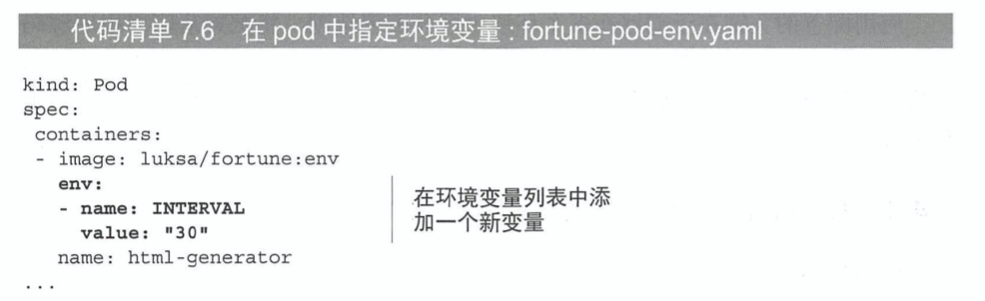

```yaml
apiVersion: v1
kind: Pod
metadata:
  name: demo-fortune-input-env-pod
spec:
  containers:
  - image: fortune-input-demo-image:env # 指定 tag，否则默认用 latest 镜像
    imagePullPolicy: Never
    # 设置环境变量
    env:
    - name: INTERVAL
      value: "5" # 要注意环境变量只能是字符串形式
    name: html-generator
    volumeMounts:
    - name: html
      mountPath: /var/htdocs
  - image: nginx:alpine
    imagePullPolicy: Never
    name: web-server
    volumeMounts:
    - name: html
      mountPath: /usr/share/nginx/html
      readOnly: true
    ports:
    - name: http
      containerPort: 80
      protocol: TCP
  volumes:
  - name: html
    emptyDir: {}
```

#### 7.3.2 在环境变量值中引用其他环境变量

在多个 env 变量中，后一个定义的变量名可以包含第一个环境变量的值，一样通过 $ 符号来进行引用。

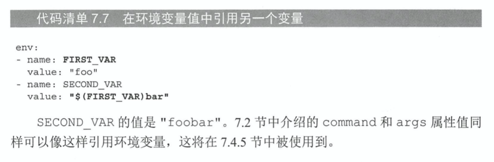

#### 7.3.3 了解硬编码环境变量的不足之处

硬编码意味着需要为生产环境和开发环境维护两套 pod 定义。为了能在多个环境下复用，K8S 提供一种叫做 ConfigMap 的资源对象对环境变量完成解耦，用 ValueFrom 字段替代 value 字段即可使 ConfigMap 成为环境变量值的来源。

### 7.4 利用 ConfigMap 解耦配置

K8S 允许将配置选项分离到单独的资源对象 ConfigMap 中，本质上就是一个键值对，值即可以是短字面量，也可以是完整的配置文件。

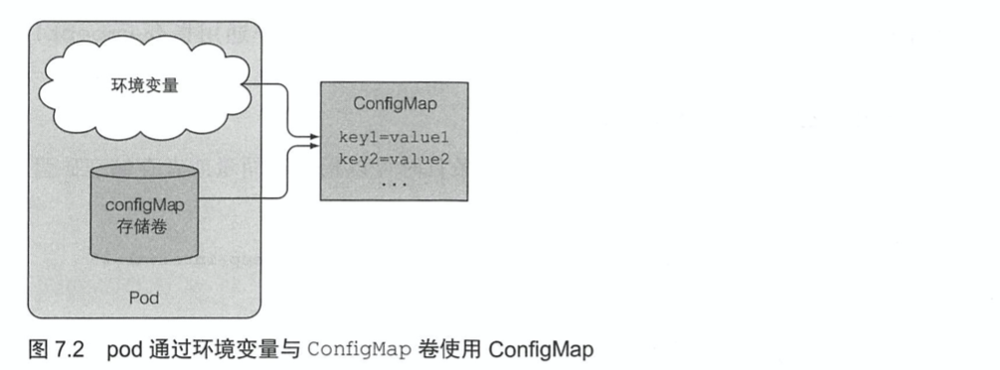

pod 是通过名称引用 ConfigMap 的，因此可以在多环境（命名空间）下使用相同的 pod 定义描述，以适应不同的环境。

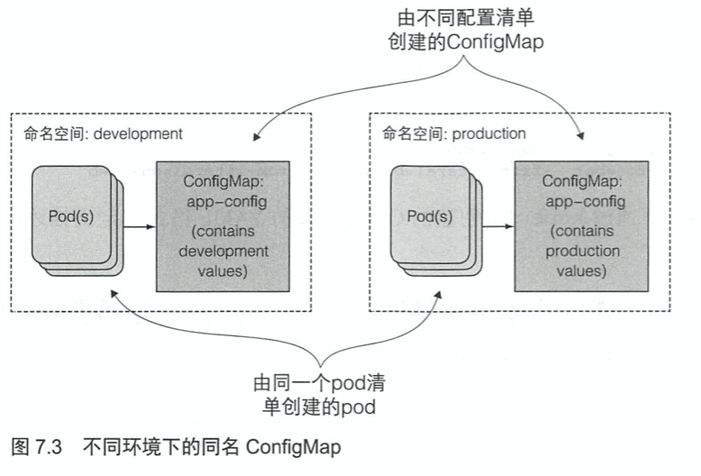

#### 7.4.2 创建 ConfigMap

##### 使用指令创建 ConfigMap

```shell
$ kubectl create configmap fortune-config --from-literal=sleep-interval=25
```

上面的命令创建了一个名为 fortune-config 的 ConfigMmap，包含一个键值对`sleep-interval=25`。

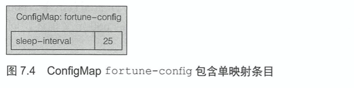

通过添加多个 --from-literal 参数可以创建包含多个条目的 ConfigMap。

```shell
$ kubectl create configmap fortune-config --from-literal=sleep-interval=25 --from-literal=foo=bar --from-literal=one=tow
configmap/fortune-config created
```

> PS：ConfigMap 中的键名必须是一个合法的 DNS 子域，仅包含数字字母、破折号、下划线以及圆点。首位的圆点符号可选。

##### 通过 yaml 文件创建

```shell
$ kubectl get configmaps fortune-config -o yaml
apiVersion: v1
data:
  foo: bar
  one: tow
  sleep-interval: "25"
kind: ConfigMap
metadata:
  creationTimestamp: "2021-01-28T01:12:41Z"
  managedFields:
  - apiVersion: v1
    fieldsType: FieldsV1
    fieldsV1:
      f:data:
        .: {}
        f:foo: {}
        f:one: {}
        f:sleep-interval: {}
    manager: kubectl
    operation: Update
    time: "2021-01-28T01:12:41Z"
  name: fortune-config
  namespace: default
  resourceVersion: "292471"
  selfLink: /api/v1/namespaces/default/configmaps/fortune-config
  uid: a1602f0a-2e5d-4991-ba1b-6f1418de9309
```

如上所示，ConfigMap 可以这样子定义然后通过`create -f`命令创建，其中 metadata 中的字段在创建时其实只要指定 name 和 namespace 就可以。

##### 从文件/文件夹创建 ConfigMap 条目

```shell
# 从文件内容创建 ConfigMap
$ kubectl create configmap my-config --from-file=config-file.conf
# 从文件夹创建 ConfigMap
$ kubectl create config my-config --from-file=/path/to/dir
```

这两条命令会将文件（文件夹下每个文件）的内容全部引入并创建条目——仅限于文件名可以作为合法 ConfigMap 键名的情况下。当然也可以自行指定键名，仅读取文件内容作为值。

##### 合并不同选项

创建 ConfigMap 时可以混合使用`from-literal`和`from-file`。

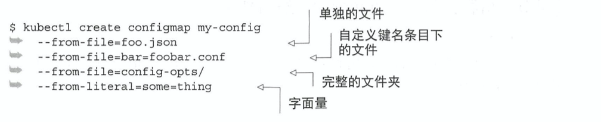

效果如下：

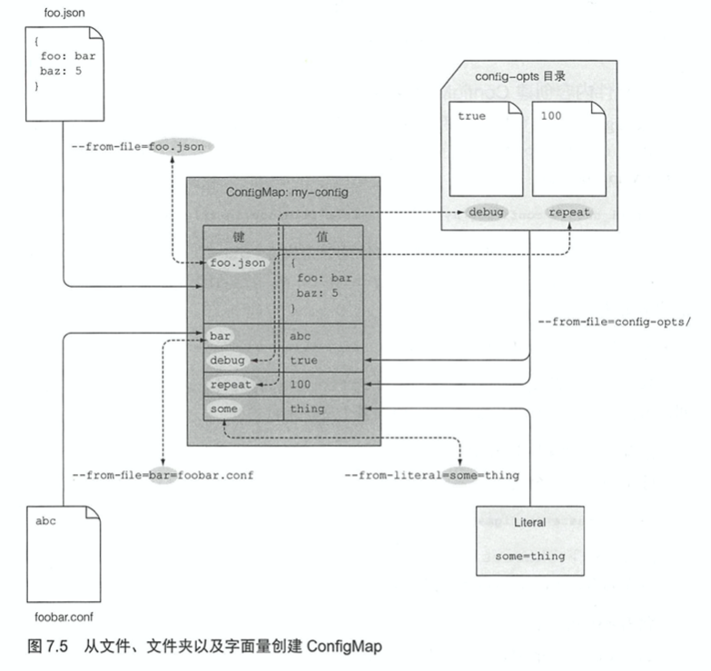

#### 7.4.3 给容器传递 ConfigMap 条目作为环境变量

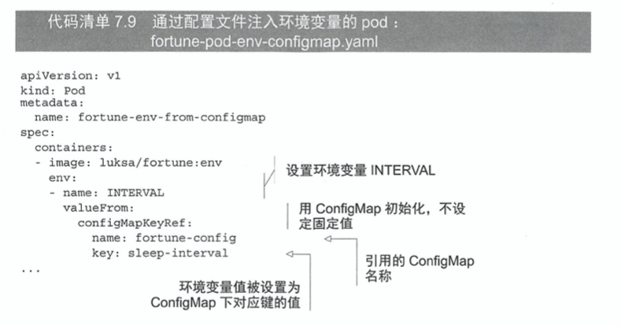

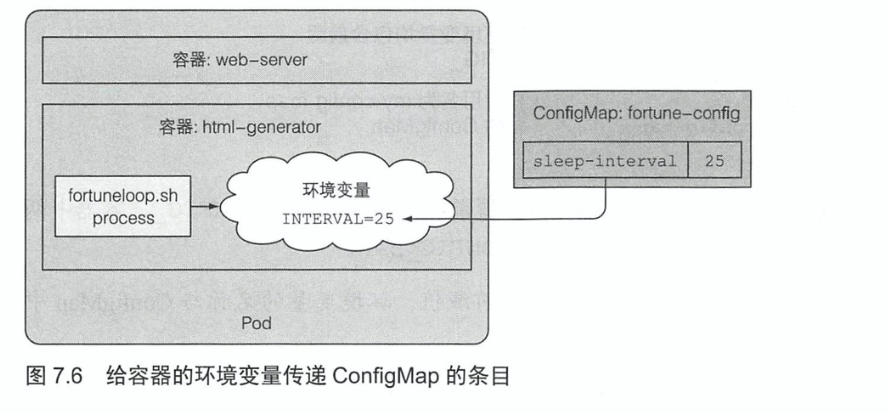

```yaml
apiVersion: v1
kind: Pod
metadata:
  name: demo-fortune-input-env-pod
spec:
  containers:
  - image: fortune-input-demo-image:env
    imagePullPolicy: Never
    # 设置环境变量
    env:
    - name: INTERVAL
      valueFrom:
        configMapKeyRef:
          name: fortune-config # 制定 configmap 名称
          key: sleep-interval # 指定 fortune-config 中定义的键
    name: html-generator
    volumeMounts:
    - name: html
      mountPath: /var/htdocs
  - image: nginx:alpine
    imagePullPolicy: Never
    name: web-server
    volumeMounts:
    - name: html
      mountPath: /usr/share/nginx/html
      readOnly: true
    ports:
    - name: http
      containerPort: 80
      protocol: TCP
  volumes:
  - name: html
    emptyDir: {}
```

##### 在 pod 中引用不存在的 ConfigMap

如果 pod 在启动容器时遇到了不存在的 ConfigMap，那么该容器将会启动失败，其余容器正常启动。如果之后创建了这个缺失的 CofnigMap，pod 会侦测到并重启失败容器，无须重新创建 pod。

当然，也可以在 env 中通过配置`configMapKeyRef.optional: true`来规避这种情况，即便 ConfigMap 不存在，容器也会正常启动。

#### 7.4.4 一次性传递 ConfigMap 的所有条目作为环境变零

使用`envFrom`代替`env`可以将 ConfigMap 中的所有条目暴露为环境变量。

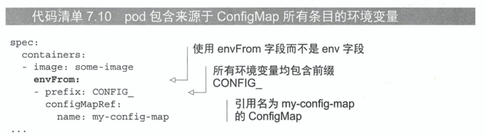

> PS：前缀设置是可选的，若不设置前缀，环境变量名称与 ConfigMap 中的键名相同

要注意 K8S 的 envfrom 字段并不会主动转换键名，对于作为环境变量不合法的键名，K8S 会直接忽略相应的条目，且不会发出任何事件通知。（比如说能识别出 foo、one 这两个变量名，却因为破折号而无法识别出 sleep-interval 这个变量）

#### 7.4.5 传递 ConfigMap 条目作为命令行参数

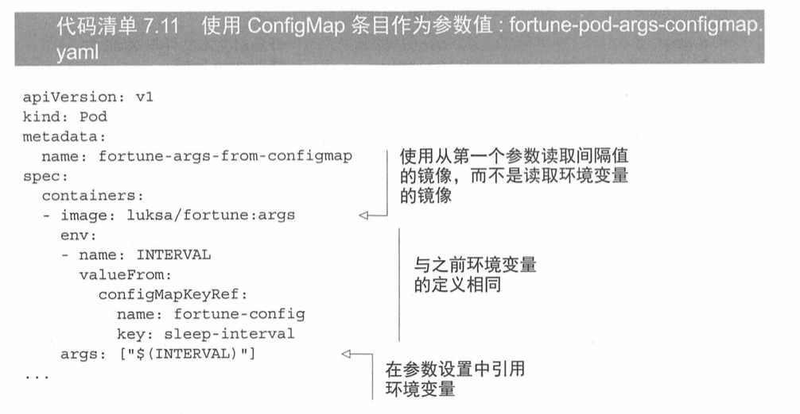

利用 ConfigMap 在条目中初始化某个环境变量，然后参数字段中就能引用该环境变量了。

#### 7.4.6 使用 configMap 卷将条目暴露为文件

环境变量或者命令行参数值作为配置值通常适用于变量值较短的场景，**但 ConfigMap 作为一种配置资源，并不仅限于在 env 字段使用**。由于 ConfigMap 中可以包含完整的配置文件，所以当你想要暴露给容器时，可以借助前面章节提到过的 configMap 卷。

configMap 卷会将 ConfigMap 中的每个条目都暴露成一个文件，**运行在容器中的进程可以通过读取文件内容获得对应的条目值**。该方法适用于那些环境变量的值很长的场景。（PS：其实是适用于将一些配置文件塞进容器里面的场景，比如说 nginx 容器的配置文件，虽然不是环境变量但也希望能够通过变量的形式配置在 configMap 中，通过卷来便于管理）

##### 创建 ConfigMap

通过在一个文件夹下创建 my-nginx-config.conf 和其他环境变量文件对 configmap 进行定义，然后通过`--from-file`进行 ConfigMap 资源的创建。

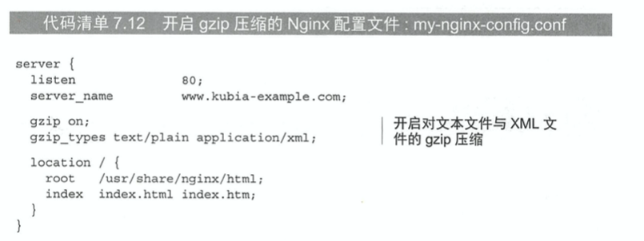

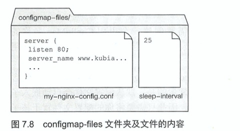

```shell
$ kubectl create configmap fortune-config --from-file=configmap-demo-nginx-config
configmap/fortune-config created
$ kubectl get configmaps fortune-config -o yaml
apiVersion: v1
data:
  my-nginx-config.conf: |-
    server {
      listen *:80 | *:8000;
      server_name "nodeservice.demo.com";

      gzip on;
      gzip_types text/plain application/xml;

      location / {
        root /usr/share/nginx/html;
        index index.html index.htm;
      };
    }
  sleep-interval: "3"
kind: ConfigMap
metadata:
  creationTimestamp: "2021-01-28T04:38:51Z"
  managedFields:
  - apiVersion: v1
    fieldsType: FieldsV1
    fieldsV1:
      f:data:
        .: {}
        f:my-nginx-config.conf: {}
        f:sleep-interval: {}
    manager: kubectl
    operation: Update
    time: "2021-01-28T04:38:51Z"
  name: fortune-config
  namespace: default
  resourceVersion: "302859"
  selfLink: /api/v1/namespaces/default/configmaps/fortune-config
  uid: 03330346-183f-4145-bf37-4e0d73c7251c
```

接下来就可以在 pod 容器中使用该 ConfigMap 了。

##### 在卷内使用 ConfigMap 条目

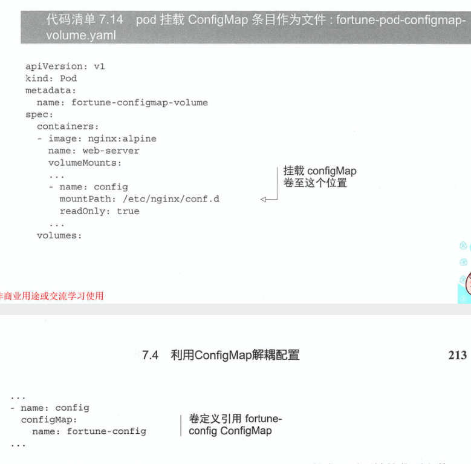

```yaml
apiVersion: v1
kind: Pod
metadata:
  name: demo-fortune-configmap-volume-pod
  labels:
    # 配合之前创建的 demo-service 和 demo-ingress 使用，设置 hosts 后可直接通过 https://nodeservice.demo.com 访问
    app: k8s-node-demo-replication-controller-label
spec:
  containers:
  - image: fortune-input-demo-image:env
    imagePullPolicy: Never
    # 设置环境变量
    env:
    - name: INTERVAL
      valueFrom:
        configMapKeyRef:
          optional: true
          name: fortune-config
          key: sleep-interval
    name: html-generator
    volumeMounts:
    - name: html
      mountPath: /var/htdocs
  - image: nginx:alpine
    imagePullPolicy: Never
    name: web-server
    volumeMounts:
    # 将配置文件放到 nginx 读取配置的文件夹中
    - name: config
      mountPath: /etc/nginx/conf.d
      readOnly: true
    - name: html
      mountPath: /usr/share/nginx/html
      readOnly: true
    ports:
    - name: http
      containerPort: 80
      protocol: TCP
  volumes:
  - name: config
    # 指定 configMap
    configMap:
      name: fortune-config
  - name: html
    emptyDir: {}
```

##### 检查被挂载的 configMap 卷的内容

```shell
$ kubectl exec demo-fortune-configmap-volume-pod -c web-server -- ls /etc/nginx/conf.d
my-nginx-config.conf
sleep-interval
```

可以看到两个条目都已经被放在这一文件夹下了。

##### 卷内暴露指定的 ConfigMap

对于刚才的例子而言，并不希望 sleep-interval 条目被放到 nginx 的配置文件夹下，此时虽然可以选择创建两个不同的 ConfigMap，然而同一个 pod 原则上来讲最好只使用一个 ConfigMap。

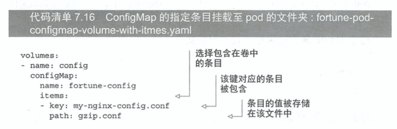

使用的上述的 items 属性就能够指定哪些条目会被暴露作为 configMap 卷中的文件，并且还可以指定其对应的文件名。 

```yaml
volumes:
  - name: config
    # 指定 configMap
    configMap:
      name: fortune-config
      items:
      - key: my-nginx-config.conf
        path: wow.conf
```

```shell
$ kubectl exec demo-fortune-configmap-volume-pod -c web-server -- ls /etc/nginx/conf.d
wow.conf
```

##### 普通的 volumes 挂载文件夹会隐藏该文件夹中已存在的文件/ConfigMap 独立条目作为文件被挂载可以不隐藏文件夹中的其他文件

如果不使用 configMap 卷，将卷挂载至某个文件夹，意味着该镜像挂载目录原本存在的文件会被挂载目录覆盖掉。

比如说此时想在 /etc 目录下挂载一个文件，如果用普通的方式挂载，就会导致整个 /etc 文件夹被抹掉，这无疑是错误的做法。

此时可以选择使用`volumeMounts.subpath`指定 configMap 中的条目，并且将其指定挂载到某个文件中，以避免覆盖，如下所示：

```yaml
volumeMounts:
    # 将配置文件放到 nginx 读取配置的文件夹中
    - name: config
      mountPath: /etc/wow1.conf # 确定要挂载的文件路径
      subPath: wow.conf # 配置在 volumes.configMap 的 items.path 中的名字，如没有配置就是 key 的名字
      readOnly: true
```

**但要注意的是，这种独立文件的挂载方式会带来文件更新上的缺陷**。

#### 为 configMap 卷中的文件设置权限

configMap 卷中所有文件的权限默认为 644（-rw-r--r--）。可以通过`volumes.configMap.defaultMode`属性来改变文件默认的权限。

#### 7.4.7 更新应用配置且不重启应用程序


> 本次阅读至 P216 7.4.7 更新应用配置且不重启应用程序 231

