# KubernetesInAction学习笔记（8）

## 第8章 从应用访问 pod 元数据以及其他资源

本章将介绍特定的 pod 和容器元数据如何被传递到容器，了解其中的应用如何便捷地与 K8S API 服务器进行交互。

### 8.1 通过 Downward API 传递元数据

通过 Kubernetes Downward API，可以允许通过环境变量或文件（在 downwardAPI 卷中）传递 pod 的元数据，比如说 pod 的 ip、主机名等等。

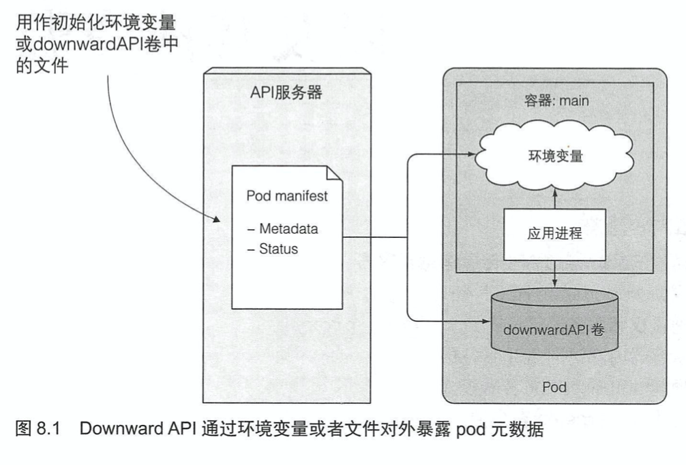

#### 8.1.1 了解可用的元数据

以下 pod 的元数据可以传递容器：

- pod 名称
- pod 的 IP
- pod 所在的命名空间
- pod 运行节点的名称
- pod 运行所归属的服务账号的名称
- 每个容器请求的 CPU 和内存的使用量
- 每个容器可以使用的 CPU 和内存的限制
- pod 的标签
- pod 的注解

#### 8.1.2 通过环境变量暴露元数据

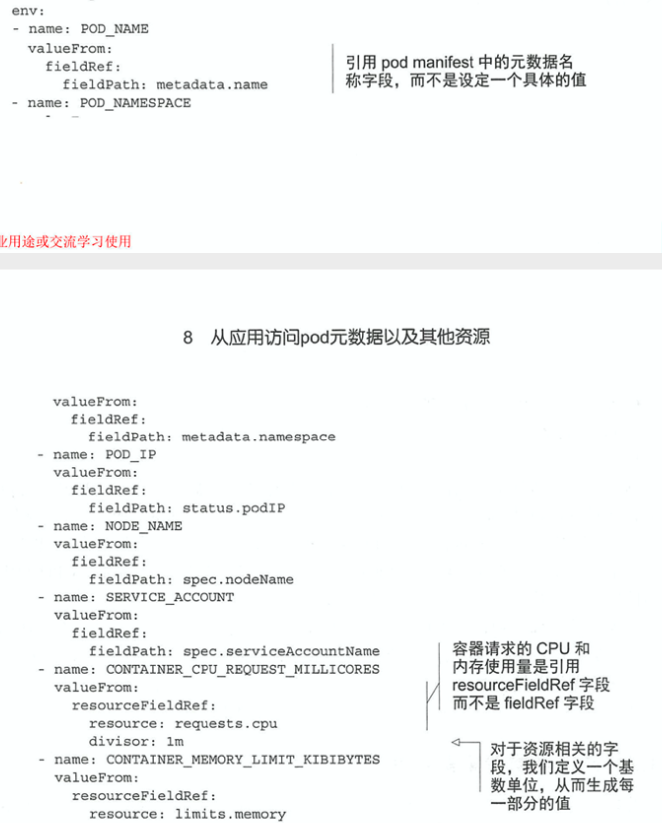

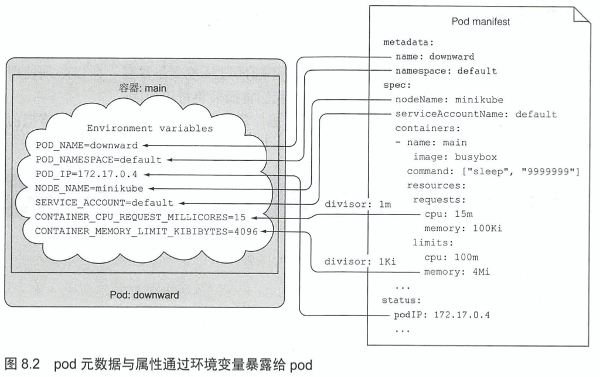

像这样，pod 的 yaml 配置文件的数据就可以在容器创建的时候被反向传递到容器中去了。

#### 8.1.3 通过 downwardAPI 卷来传递元数据

创建一个 downwardAPI 卷并挂载到容器中，可以使用文件的方式而不是环境变量的方式暴露元数据。

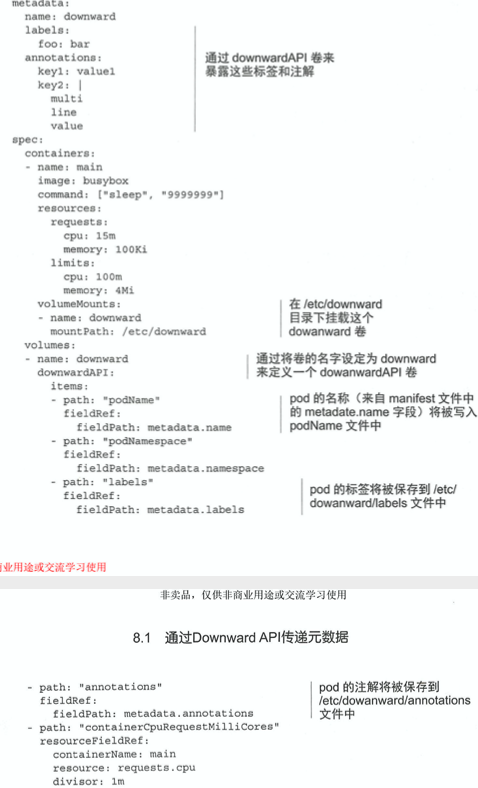

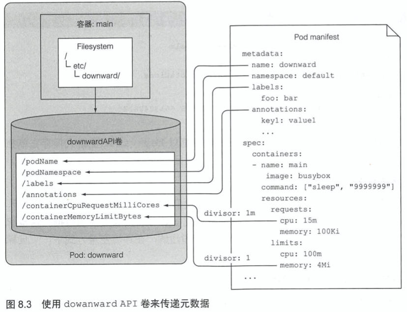

将 pod 信息作为文件挂载的好处是，**当 pod 的元信息被修改后，K8S 会更新存有相关信息的文件，从而使 pod 可以获取最新的数据**。

通过 Downward API 的方式获取的元数据还是相当有限的，如果需要获取更多的元数据，需要使用直接访问 K8S API 服务器的方式。

### 8.2 与 K8S API 服务器交互

#### 8.2.1 探究 Kubernetes REST API

通过`kubectl cluster-info`命令来得到服务器的 URL。然后执行`kubectl proxy`命令通过代理与服务器交互。

```shell
$ kubectl cluster-info
Kubernetes master is running at https://192.168.64.2:8443
KubeDNS is running at https://192.168.64.2:8443/api/v1/namespaces/kube-system/services/kube-dns:dns/proxy

To further debug and diagnose cluster problems, use 'kubectl cluster-info dump'.
```

##### 通过 kubectl proxy 访问 API 服务器

proxy 命令会启动一个代理服务来接受来自本机的 HTTP 连接并转发至转发至 API 服务器。

```shell
$ kubectl proxy
Starting to serve on 127.0.0.1:8001
```

这样就可以通过本地的 8001 端口来访问 API 服务器了。

```shell
$ curl localhost:8001
{
  "paths": [
    "/api",
    "/api/v1",
    "/apis",
    "/apis/",
    ...
```

##### 通过 Kubectl proxy 研究 Kubernetes API

通过代理端口访问可以看到 API 接口的类型。

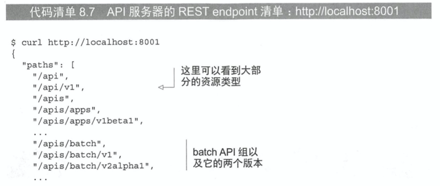

##### 研究批量（batch）API 组的 REST endpoint

访问`http://localhost:8001/apis/batch`

```json
{
  "kind": "APIGroup",
  "apiVersion": "v1",
  "name": "batch",
  "versions": [
    {
      "groupVersion": "batch/v1",
      "version": "v1"
    },
    {
      "groupVersion": "batch/v1beta1",
      "version": "v1beta1"
    }
  ],
  "preferredVersion": {
    "groupVersion": "batch/v1",
    "version": "v1"
  }
}
```

响应消息会展示包括可用版本，客户推荐使用版本在内的批量 API 组消息。

##### 列举集群中所有的 Job 实例

```shell
$ curl http://localhost:8001/apis/batch/v1/jobs
```

##### 通过名称恢复一个指定的 Job 实例

```shell
$ curl http://localhost:8001/apis/batch/v1/namespaces/default/jobs/my-job
```

通过这个 API 获取的结果与`kubectl get job my-job -o json`完全一致。

#### 8.2.2 从 pod 内部与 API 服务器进行交互

要达成这个目的需要关注三件事：

- 确定 API 服务器的位置
- 确保是与 API 服务器进行交互而不是一个冒名者
- 通过服务器的认证，否则将不能查看任何内容以及进行操作

##### 发现 API 服务器的地址

第 5 章时提到，在 pod 中每个服务都被配置了对应的环境变量，在容器中，可以通过查询 KUBERNETES_SERVICE_HOST 和 KUBERNETES_SERVICE_PORT 这两个环境变量，就可以获取 API 服务器的 IP 地址和端口。

```shell
$ kubectl exec -it demo-fortune-secret-volume-pod -- bash
root@demo-fortune-secret-volume-pod:/# env | grep KUBERNETES_SERVICE
KUBERNETES_SERVICE_PORT_HTTPS=443
KUBERNETES_SERVICE_PORT=443
KUBERNETES_SERVICE_HOST=10.96.0.1
```

又或者，可以直接在容器中尝试访问`https://kubernetes`，该地址会通过 DNS 默认解析到 K8S API 服务器中。

 ##### 验证服务器身份

名为 default-token-xyz 的 Secret 会在每个 pod 创建时被创建，并自动挂载到 /var/run/secrets/kubernetes.io/serviceaccount 目录下，该文件夹下有三个文件，其中包括了 CA 的证书，用来对 Kubernetes API 服务器证书进行签名。

通过设置 CURL_CA_BUNDLE 这个环境变量，或是直接在 curl 命令中指定该证书即可。

```shell
$ curl --cacert /var/run/secrets/kubernetes.io/serviceaccount/ca.crt https://kubernetes
{
  "kind": "Status",
  "apiVersion": "v1",
  "metadata": {

  },
  "status": "Failure",
  "message": "forbidden: User \"system:anonymous\" cannot get path \"/\"",
  "reason": "Forbidden",
  "details": {

  },
  "code": 403
}
```

现在客户端信任 API 服务器了，接下来需要由客户端使用 default-token 来登陆 API 服务器。

##### 获得 API 服务器授权

只有获得了 API 服务器的授权才可以从 pod 内部读取并进一步修改或删除部署在集群中的 API 对象。为了获得授权，我们需要认证的凭证，而这个凭证由 default-token Secret 来产生并默认传入 pod 中，挂载在`/var/run/secrets/kubernetes.io/serviceaccount/token`下。

使用 curl 命令可以带上这个 token

```shell
# 将证书的地址设为环境变量
root@demo-fortune-secret-volume-pod:/# export CURL_CA_BUNDLE=/var/run/secrets/kubernetes.io/serviceaccount/ca.crt

# 将 token 的内容作为环境变量
root@demo-fortune-secret-volume-pod:/# export TOKEN=$(cat /var/run/secrets/kubernetes.io/serviceaccount/token)

root@demo-fortune-secret-volume-pod:/# curl -H "Authorization: Bearer $TOKEN" https://kubernetes
{
  "kind": "Status",
  "apiVersion": "v1",
  "metadata": {

  },
  "status": "Failure",
  "message": "forbidden: User \"system:serviceaccount:default:default\" cannot get path \"/\"",
  "reason": "Forbidden",
  "details": {

  },
  "code": 403
}
```

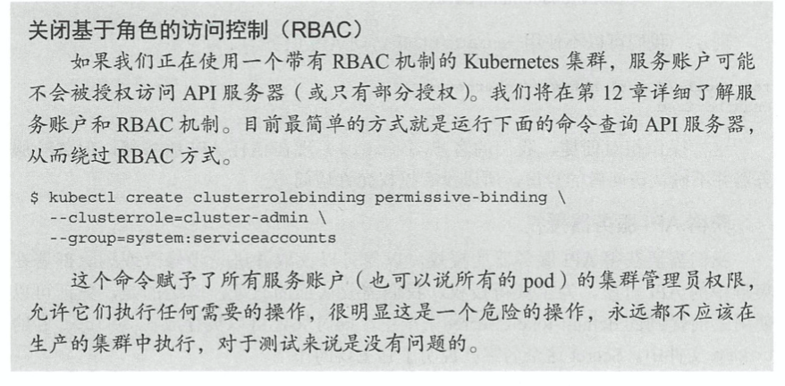

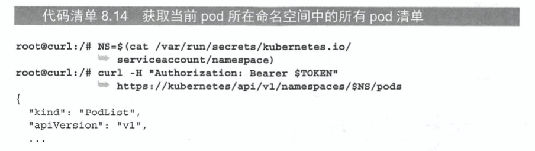

##### 简要说明如何 pod 如何与 Kubernetes 交互

简要总结 pod 中运行的应用如何正确访问 Kubernetes 的 API：

- 应用应该验证 API 服务器的证书，这个证书是默认 default-token 的 ca.crt 文件
- 应用应该将它在 default-token 中的 token 文件中持有的凭证通过 Authorization header 来获得 API 服务器的授权。
- 当对 pod 所在命名空间的 API 对象进行 CRUD 操作时，应该使用 namespace 文件来传递命名空间信息到 API 服务器

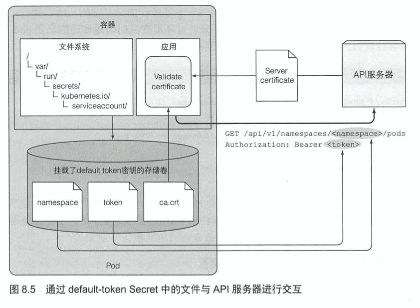

#### 8.2.3 通过 ambassador 容器简化与 API 服务器的交互

有一种更简单的方法可以跳过 HTTPS、证书、授权凭证这几个步骤，直接与 API 服务器进行交互。它与之前提到的`kubectl proxy`命令的原理一样，向代理发送请求，通过代理来处理授权，加密和服务器验证。

##### ambassador 容器模式介绍

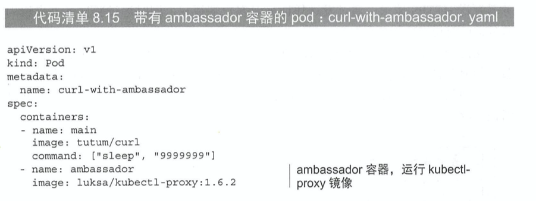

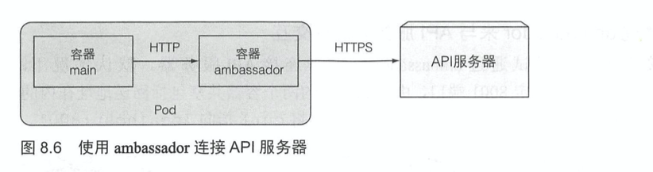

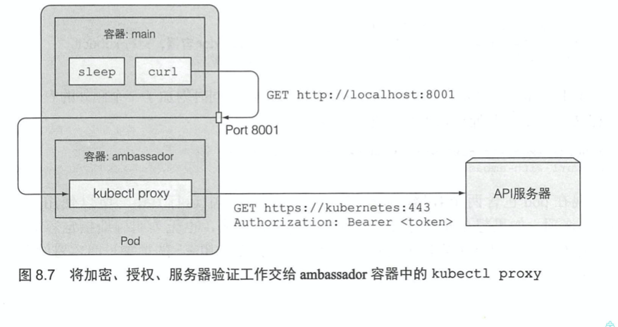

curl 向 ambassador 容器运行的代理发送普通的 HTTP 请求，然后由代理向 API 服务器发送 HTTPS 请求，通过发送凭证来对客户端授权，同时通过验证证书来识别服务器的身份。

#### 8.2.4 使用客户端库与 API 服务器交互

如果应用仅仅需要在 API 服务器执行一些简单的操作，往往可以使用一些标准的客户端库来执行 HTTP 请求。K8S 社区有很多这样的客户端库，用于给不同语言的客户端调用。


