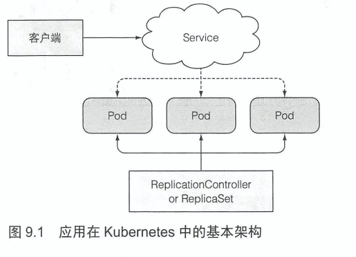
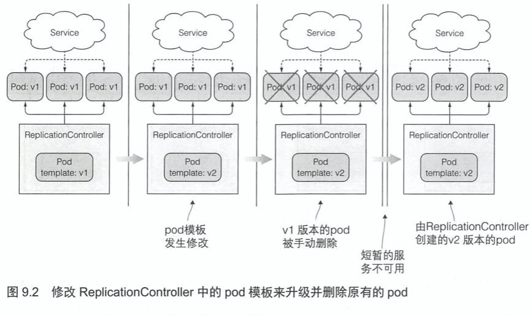
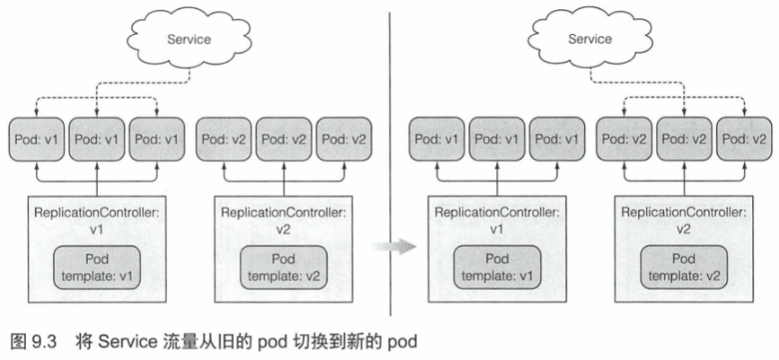
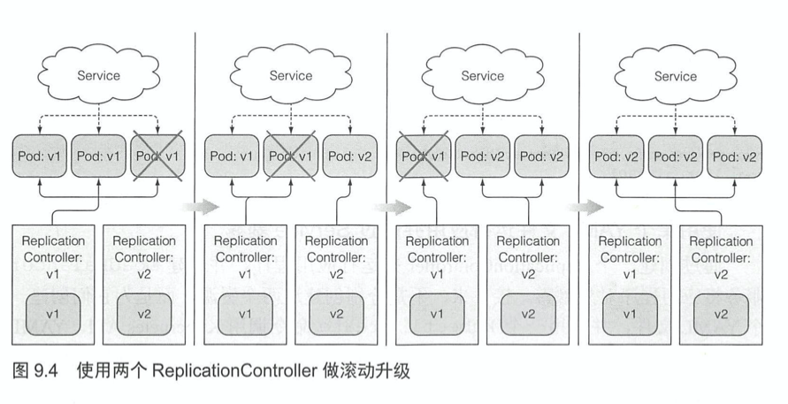
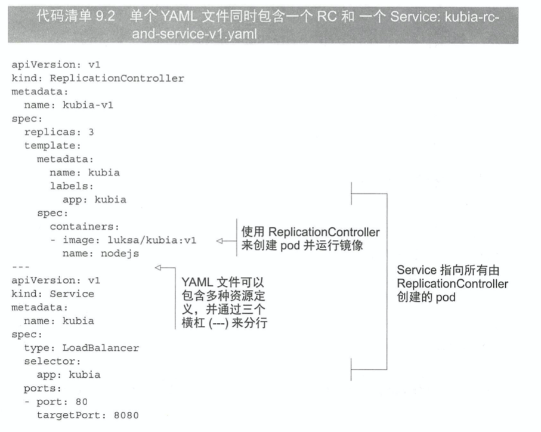
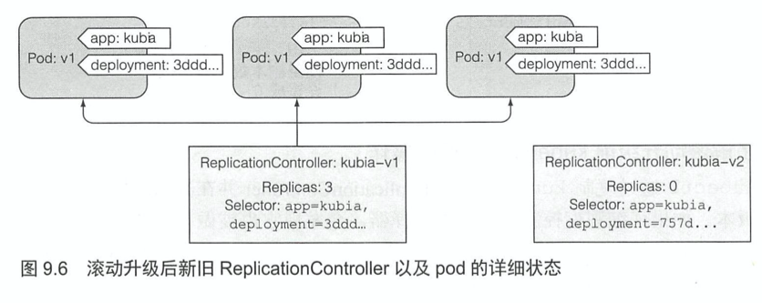
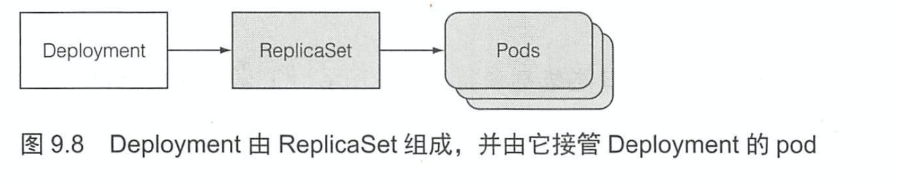
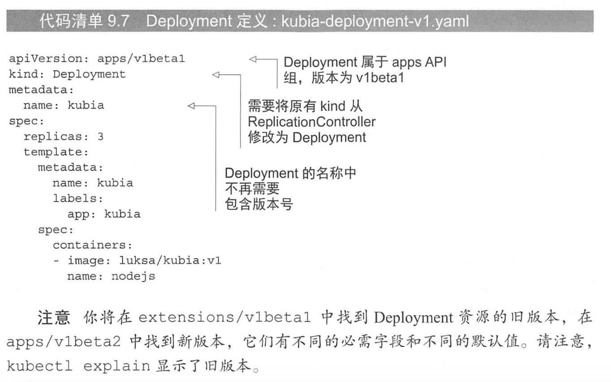

# KubernetesInAction学习笔记（9）

## 第9章 Deployment: 声明式地升级应用

Deployment 是一种基于 ReplicaSet 的更高级的资源，之前使用 RC 和 RS 管理 pod 的时候，只能通过让 RC 或 RS 删除重建 pod 来重启存在于 pod 内的应用程序，而 Deployment 支持声明式地更新。

### 9.1 更新运行在 pod 内的应用程序

K8S 中一个典型的应用程序的运行方式如下：



现在假设 pod 一开始使用 v1 版本的镜像运行第一个版本的应用。然后开发了一个新版本的应用打包成镜像，并将其推送到了镜像仓库，标记为 v2，接下来想用这个新版本替换所有的 pod。如果不允许直接修改镜像，只能通过删除原有 pod 并使用新的镜像创建新的 pod 替换。

有以下方法可以更新所有的 pod：

- 直接删除所有现有的 pod，然后创建新的 pod。
- 也可以先创建新的 pod，并等待它们运行成功后，再删除旧的 pod，或者按顺序创建新的 pod，然后逐渐删除旧的 pod。

第一种方法将会导致应用程序在一定时间内不可用，第二种方法会要求应用程序能够支持两个版本并同时对外提供服务。

#### 9.1.1 删除旧版本 pod，使用新版本 pod 替换

rc 和 rs 会将原有的 pod 实例替换成新版本的 pod。并且 rc 内的 pod 模板一旦发生更新之后，rc 会使用更新后的 pod 模板来创建新的实例。如果可以接受从旧的 pod 到启动新 pod 之间短暂的服务不可用，那么这将是更新一组 pod 的最简单方式。



#### 9.1.2 先创建新 pod 再删除旧版本 pod

如果完全不能接受短暂的服务不可用，且应用程序支持多个版本同时对外服务，那么就可以先创建新的 pod 再删除原有的 pod。相当于在这段时间内将会运行两杯数量的 pod。

该方法相比于前一种较为复杂，需要使用到 Service 的协助。

##### 从旧版本立即切换到新版本

pod 通常通过 Service 来暴露，一旦新版本的 pod 被创建并且正常运行之后，就可以修改服务的标签选择器将 Service 的流量切换到新的 pod。这就是所谓的**蓝绿部署**。在切换之后，一旦确定了新版的功能运行正常，就可以通过删除旧的 rc 来删除旧版本的 pod。

> PS：可以使用`kubectl set selector`命令来修改 Service 的 pod 选择器。
>
> ```shell
> $ kubectl set selector (-f FILENAME | TYPE NAME) EXPRESSIONS [--resource-version=version]
> ```



##### 执行滚动升级操作

当然除此以外还可以通过对旧版本的 rc 进行缩容并对新版本的 rc 进行扩容来实现上述操作，不过这种方式相对较繁琐，手动执行根据副本数量的不同，需要以正确的顺序运行十几条甚至更多的命令来执行整个升级流程，更何况 K8S 其实提供了通过一个命令来滚动升级的命令，因此在此略过该方法。

### 9.2 使用 RC 实现自动的滚动升级



不用手动地创建 RC 来执行滚动升级，可以直接使用`kubectl rolling-update`来执行。（虽然这也是一种相对过时的升级方式）

#### 9.2.2 使用 kubectl 来执行滚动式升级



```javascript
// app.js v1版本
// app.js 会把客户端的 IP 打印到标准输出，并返回当前域名
const http = require('http')
const os = require('os')

console.log('server starting')
const handler = function (request, response) {
  console.log(request.connection.remoteAddress)
  response.writeHead(200, { 'Content-Type': 'text/plain; charset=utf-8' })
  response.end(`客户端 v1 版本部署在${os.hostname()}之上`)
}
const www = http.createServer(handler)
www.listen(8080)
```

```javascript
// app.js v2版本
// app.js 会把客户端的 IP 打印到标准输出，并返回当前域名
const http = require('http')
const os = require('os')

console.log('server starting')
const handler = function (request, response) {
  console.log(request.connection.remoteAddress)
  response.writeHead(200, { 'Content-Type': 'text/plain; charset=utf-8' })
  response.end(`客户端 v2 版本部署在${os.hostname()}之上`)
}
const www = http.createServer(handler)
www.listen(8080)
```

```dockerfile
# Dockerfile
# docker build -f Dockerfile -t demo-rollupdate-image:v1 .
# docker run -d --name demo-rollupdate-container demo-rollupdate-image:v1
FROM node
ADD app.js /app.js
ENTRYPOINT ["node", "app.js"]

# Dockerfile
# docker build -f Dockerfile -t demo-rollupdate-image:v2 .
# docker run -d --name demo-rollupdate-container demo-rollupdate-image:v2
FROM node
ADD app.js /app.js
ENTRYPOINT ["node", "app.js"]
```

```yaml
apiVersion: v1
kind: ReplicationController
metadata:
  name: demo-rollupdate-rc-v1
spec:
  replicas: 3
  template:
    metadata:
      name: demo-rollupdate-rc-pod
      labels:
        app: demo-rollupdate-rc
    spec:
      containers:
      - image: demo-rollupdate-image:v1
        imagePullPolicy: Never
        name: demo-rollupdate-rc-pod-container
        ports:
        - name: http
          containerPort: 8080
---
apiVersion: v1
kind: Service
metadata:
  name: demo-rollupdate-service
spec:
  type: NodePort
  selector:
    app: demo-rollupdate-rc
  ports:
  - name: http
    port: 80
    # The Service "demo-rollupdate-service" is invalid: spec.ports[0].nodePort: Invalid value: 29980: provided port is not in the valid range. The range of valid ports is 30000-3276
    nodePort: 30180
    targetPort: http
```

准备工作完成后即可开始创建：

```shell
$ kubectl create -f demo-rollupdate-rc-and-service.yaml
replicationcontroller/demo-rollupdate-rc-v1 created
service/demo-rollupdate-service created

$ kubectl get node -o wide
NAME       STATUS   ROLES    AGE   VERSION   INTERNAL-IP    EXTERNAL-IP   OS-IMAGE               KERNEL-VERSION   CONTAINER-RUNTIME
minikube   Ready    master   34d   v1.19.2   192.168.64.2   <none>        Buildroot 2019.02.11   4.19.114         docker://19.3.12

$ curl http://192.168.64.2:30180/
客户端 v1 版本部署在demo-rollupdate-rc-v1-86dxm之上
```

#### 9.2.2 使用 kubectl 来执行滚动式升级

保持不停的 curl 循环，打开另一个终端，开始使用`kubectl rolling-update`命令来执行升级操作。

```shell
$ while true; do curl http://192.168.64.2:30180/; echo ; sleep 5; done
```

```shell
$ kubectl rolling-update demo-rollupdate-rc-v1 demo-rollupdate-rc-v2 --image=demo-rollupdate-image:v2
```



PS：在笔者这个版本 rolling-update 命令已经被移除了，所以很遗憾无法测试。

#### 9.2.3 为什么 kubectl rolling-update 已经过时

rolling-update 命令的原理就是不停缩小原有的 pod，扩张新的 pod，最后达到替代的作用。但是这个过程会直接修改创建的对象。直接更新 pod 和 rc 的标签并不符合之前创建时的预期。而且这些伸缩的请求是由 kubectl 客户端执行的，而不是由 Kubernetes master 执行的。

这样会导致如果在 kubectl 执行升级时失去了网络连接，那么升级进程就会中断，pod 和 rc 最终都会处于中间状态。

### 9.3 使用 Deployment 声明式地升级应用

K8S 的理念是通过声明一种状态，然后让 K8S 自动将机器集群调整到符合该声明的状态上。于是像上面这种通过伸缩扩张 pod 的更新方式明显不合适，为此，K8S 推出了一种更高阶的资源 Deployment 用于部署应用程序并以声明的方式升级。

当创建一个 Deployment 时，ReplicaSet 资源也会随之创建（最终会有更多的资源被创建），然后再由这些 rs 创建对应的 pod。



在升级应用程序时，需要引入一个额外的 rc，并协调两个 rc 使得它们根据彼此不断修改而不会造成干扰。Deployment 资源就是用来负责处理这个问题的。

#### 9.3.1 创建一个 Deployment

创建 Deployment 与 rc 并没有任何区别，一样包括标签选择器、期望副本数、pod 模板，此外 Deployment 还包含一个字段，指定一个部署策略，定义在更新应用时的应该如何执行更新。

##### 创建一个 Deployment Manifest



Deployment 资源高于版本本身，可以同时管理多个版本的 pod，所以在命名时不需要指定应用的版本号。

```yaml
apiVersion: apps/v1
kind: Deployment
metadata:
  name: demo-deployment
spec:
  replicas: 3
  selector:
    matchLabels:
      app: demo-deployment-pod-label
  template:
    metadata:
      name: demo-deployment-pod
      labels:
        app: demo-deployment-pod-label
    spec:
      containers:
      - image: demo-rollupdate-image:v1
        imagePullPolicy: Never
        name: demo-deployment-pod-container
        ports:
        - name: http
          containerPort: 8080
```

```shell
$ kubectl create -f demo-deployment.yaml
deployment.apps/demo-deployment created
```

##### 展示 Deployment 滚动过程中的状态

可以直接使用`kubectl get deployment`和`kubectl describe deployment`命令来查看 Deployment 的详细信息，但是还有另外一个命令，专门用于查看部署状态。

```shell
$ kubectl rollout status deployment demo-deployment
deployment "demo-deployment" successfully rolled out
```

通过上述命令查看到，Deployment 已经完成了滚动升级。

##### 了解 Deployment 如何创建 Replicaset 以及 pod

```shell
$ kubectl get deployments
NAME              READY   UP-TO-DATE   AVAILABLE   AGE
demo-deployment   3/3     3            3           18m

$ kubectl get replicasets
NAME                        DESIRED   CURRENT   READY   AGE
demo-deployment-66c77c955   3         3         3       9m33s

$ kubectl get pod
NAME                              READY   STATUS    RESTARTS   AGE
demo-deployment-66c77c955-98xj7   1/1     Running   0          9m24s
demo-deployment-66c77c955-bb2mc   1/1     Running   0          9m24s
demo-deployment-66c77c955-dgk4r   1/1     Running   0          9m24s
demo-fortune-secret-volume-pod    2/2     Running   0          28h
```

可以看到 deployment 会先创建对应的 rs 资源（后缀有一个 hash 值），然后使用 rs 资源创建 pod 资源（后缀有两个 hash 值）。

Deployment 的使用和 rs 基本相同，一样可以通过 Service 的 selector 来对 pod 进行绑定，并通过 Service 进行访问。

#### 9.3.2 升级 Deployment


> 本次阅读至 P269 9.3.2 升级 Deployment 284