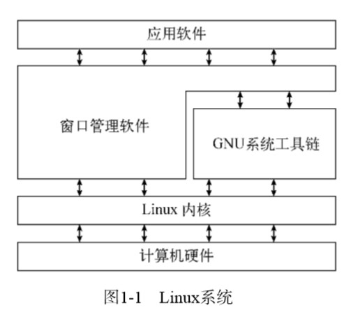
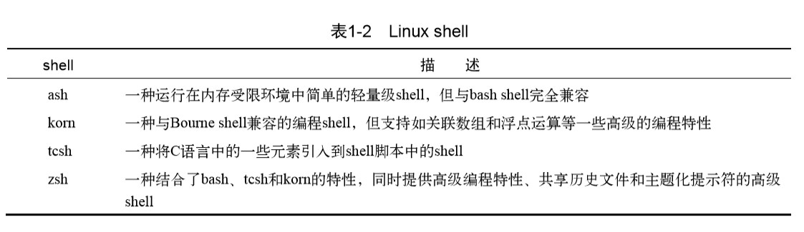

# 《Linux命令行》学习笔记（一）

> 资料下载地址(equb, mobi, awz3, pdf):
>
> [百度网盘](https://pan.baidu.com/s/1udxxT8nxB6fy8yf2pZyqfw)
>
> 提取码: 4auw
>
> **本资料仅用于学习交流，如有能力请到各大销售渠道支持正版！**

## 引言

本书将会引领你从认识 Linux 命令行基础开始，一直到写出自己的 shell 脚本。

包括以下四个部分：

- Linux shell 基础知识（2 - 10 章）
- shell 脚本编写（11 - 16 章）
- 关于 shell 的高级用法，如函数，图形化，数据库操作等（17 - 23 章）
- 如何在现实环境中使用 shell 脚本，涉及网络环境以及各类系统交互（23 - 26 章）

---

**第一部分 Linux 命令行**

---

## 第 1 章 初识 Linux shell

### 1.1 什么是 Linux

在学习命令和脚本之前，可以先来了解一下 Linux 系统的梗概。

Linux 可以划分为以下四个部分：

- Linux 内核
- GNU 工具
- 图形化桌面环境
- 应用软件

本节将详细介绍这四个部分，概述它们是如何构成一个完整的 Linux 系统的。

#### 1.1.1 深入探究 Linux 内核

Linux 系统的核心是内核。内核控制着计算机系统上的所有硬件和软件，在必要时分配硬件，并根据需要执行软件。

内核主要负责以下四种功能：

- 系统内存管理
- 软件程序管理
- 硬件设备管理
- 文件系统管理

**1. 系统内存管理**

操作系统的主要功能之一就是内存管理，其不仅管理服务器上的可用物理内存，还可以创建和管理虚拟内存。

内核通过硬盘上的存储空间来实现虚拟内存，这块区域被称为`交换空间(swap space)`。内核不断地在交换空间和物理内存之间反复交换虚拟内存中的内容，使得系统认为它拥有比物理内存更多的内存。

内核会维护一个内存页面表，决定哪些存储单元内容存在物理内存里面，哪些内容被换到了磁盘上。内核会将一些一段时间内没有被访问的内存页面放到交换空间中，当这些内容被访问时再从磁盘将其拖出来，而这个过程通常会比平常的从内存读取更耗费时间。

（PS：所以现在懂了为什么即使电脑的内存再快，显卡再好，在玩游戏的时候还是会一顿一顿的了吧，拜托把那块 5400 转的辣鸡古董机械硬盘给扔掉啊！）

**2. 软件程序管理**

Linux 操作系统将运行中的程序称为`进程`。内核控制着 Linux 系统如何管理运行在系统上的所有进程。

内核创建了第一个进程（称为 init 进程）来启动系统上所有其他进程。当内核启动时，它会将 init 进程加载到虚拟内存中，内核在启动任何其他进程时，都会在虚拟内存中给新锦成分配一块专有区域来存储该进程用到的数据和代码。

**通常 Linux 都会使用一个表来管理系统开机时要自动启动的进程，在发行版的 Linux 系统上，这个表通常位于 /etc/inittab 中，而像 Ubuntu 这种较为流行的 Linux ，则采用 /etc/init.d 目录，将开机时启动或停止某个应用的脚本放在该目录下。这些脚本通过 /etc/rcX.d 目录下的入口（entry）启动，这里的 X 代表运行级**。

Linux 操作系统有 5 个启动运行级。

运行级为 1 时，只启动基本的系统进程以及一个控制台终端进程，称之为单用户模式，通常用于系统有问题时进行紧急的文件系统维护。

常见的标准启动运行级为 3.在这个运行级上，大多数应用软件如网络支持程序都会启动。另一个比较常见的运行级是 5，在这个运行级下会启动图形化系统，允许用户通过图形化桌面窗口登录。

在第 4 章将会学习到如何使用`ps`命令查看当前运行在 Linux 系统上的进程。

**3. 硬件设备管理**

在 Linux 内核中有两种方法用于插入设备的驱动代码：

- 编译进内核的设备驱动代码
- 可插入内核的设备驱动模块

最开始插入设备驱动代码的唯一途径是重新编译内核，但随着 Linux 支持的硬件设备越来越多，这个过程变得非常低效。所以开发人员提出了内核模块的概念，允许将驱动代码插入到运行的内核中而无需重新编译。而当设备不再使用时也可以将内核模块从内核移走。

Linux 系统将硬件设备当成特殊的文件，称为**设备文件**，设备文件有三类：

- 字符型设备文件，每次只能处理一个字符的设备，如调制解调器和终端
- 块设备文件，处理大块数据的设备，比如硬盘
- 网络设备文件，采用数据包发送和接收数据的设备，比如网卡，还有一些回环设备用于使用网络编程协议与自身通信

Linux 为系统上的每个设备都创建一种称为**节点**的特殊文件，每个节点都有唯一的数值对供 Linux 标识它。数值对包括一个主设备号和一个次设备号。类似的设备被划分到同样的主设备号下。次设备号用于标识主设备组下的某个特定设备。

**4. 文件系统管理**

Linux 内核支持通过不同类型的文件系统从硬盘中读写数据。而相对应的也意味着所有插入 Linux 的硬盘都必须格式化成其能够识别的文件类型。

#### 1.1.2 GNU 工具

GNU （GNU‘s Not Unix）是一个组织，致力于模仿 Unix 操作系统开发一系列标准的计算机工具，它们与 Linux 系统一拍即合，在开源的前提下将 Linux 内核与 GNU 操作系统工具整合了起来，就产生了一款完整的、功能丰富的免费操作系统，时至今日，依然有人将 Linux 操作系统称为 GNU/Linux 系统，以此表示对 GNU 组织所作贡献的敬意。

**1. 核心GNU工具**

GNU coreutils 软件包由三个部分组成：

- 用于处理文件的工具
- 用于操作文本的工具
- 用于管理进程的工具

**2. shell**

GNU/Linux shell 是一种特殊的交互式工具，它为用户提供了启动程序、管理文件系统中的文件以及运行在 Linux 系统上的进程的途径。shell 的核心是命令行提示符，它允许你输入文本命令，然后解释命令，并在内核中执行。

> 在Linux系统上，通常有好几种Linux shell可用。不同的shell有不同的特性，有些更利于创建 脚本，有些则更利于管理进程。所有Linux发行版默认的shell都是bash shell。bash shell由GNU项 目开发，被当作标准Unix shell——Bourne shell（以创建者的名字命名）的替代品。bash shell的名 称就是针对Bourne shell的拼写所玩的一个文字游戏，称为Bourne again shell

#### 1.1.3 Linux 桌面环境

随着 Windows 的普及，电脑用户已经不再满足于对着老式的文本界面工作了，Linux 图形化桌面环境应运而生。

Windows 这类图形化桌面环境的弊端在于它们要占用相当一部分的系统资源来保证正常运行，但 Linux 的高定制性让社区开发了一些低内存开销的图形化桌面应用，提供了能够在许多低端 PC 上也能跑起来的基本桌面功能。

### 1.2 Linux 发行版

不同的 Linux 发行版通常归类为 3 种：

- 完整的核心 Linux 发行版
- 特定用途的发行版
- LiveCD测试发行版

#### 1.2.1 核心 Linux 发行版

核心 Linux 发行版包含有内核、一个或多个图形化桌面环境以及预编译好的几乎所有能看见的 Linux 应用。如 Red Hat、Debian 都属于这类。

#### 1.2.2 特定用途的 Linux 发行版

除了提供特定软件外，定制化发行版还尝试通过自动配置常见硬件来帮助新手安装 Linux。这使得 Linux 的安装过程轻松愉悦了许多。如现在常用的 CentOS、Ubuntu 都属于这一类。

#### 1.2.3 Linux LiveCD

Linux LiveCD 无需安装就可以使用并且通过 CD 来启动 PC，这是一个不弄乱 PC 就可以体验各种 Linux 发行版的绝妙方法。

### 1.3 总结

本章梗概了 Linux 系统的基本工作原理。Linux 内核是系统的核心，控制着内存、程序和硬件之间的交互。下一张将开始了解命令行和 shell 脚本编程体验所需要的基本知识。