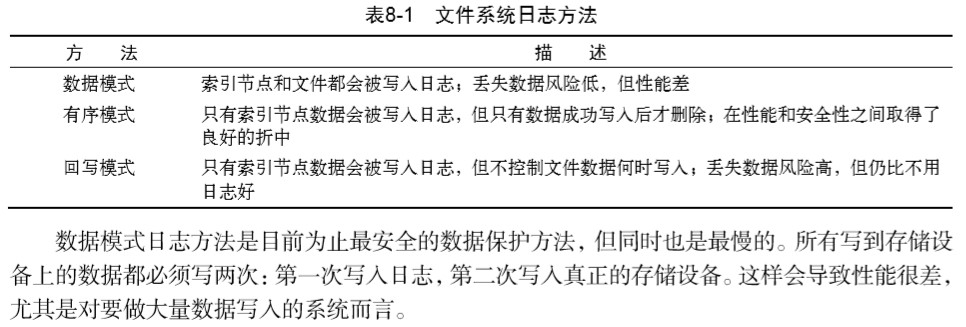
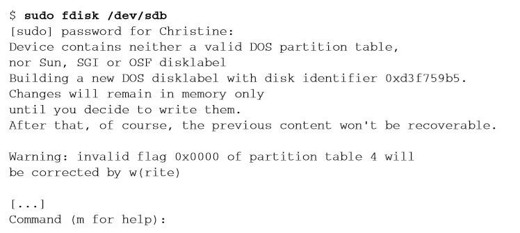
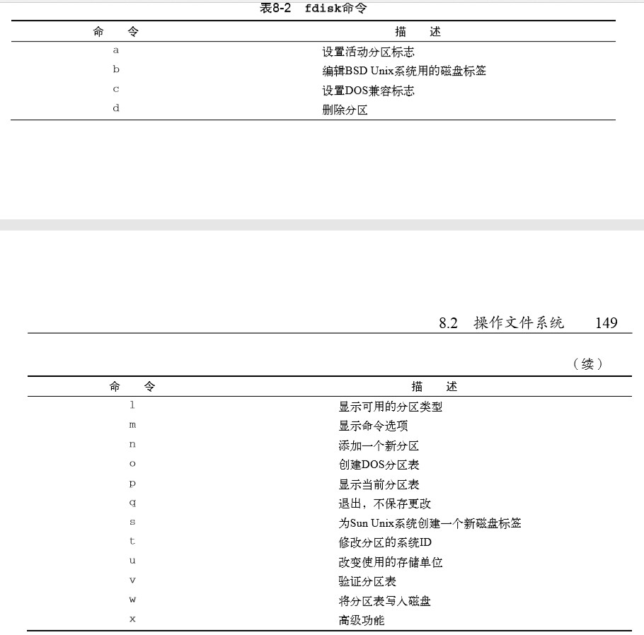
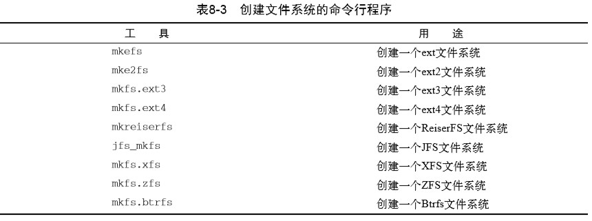
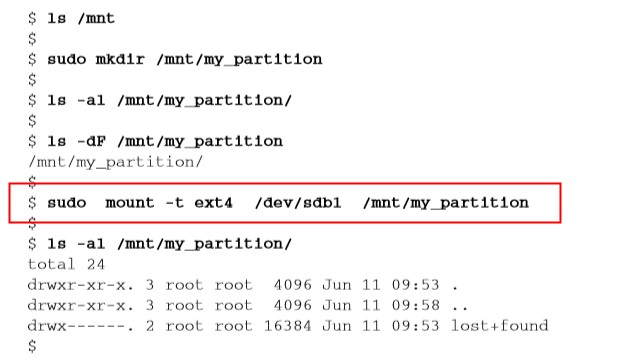
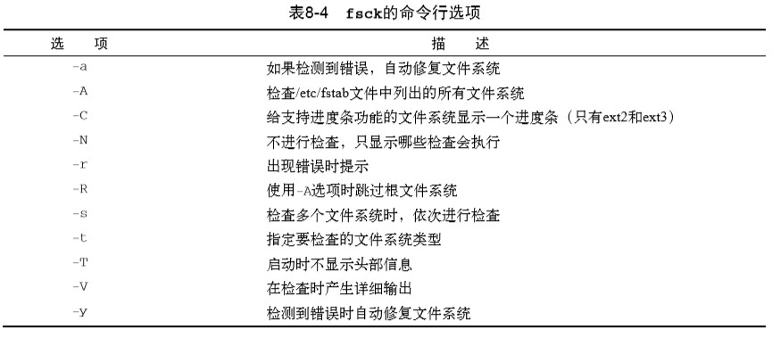
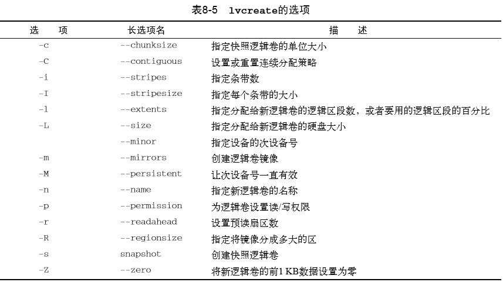
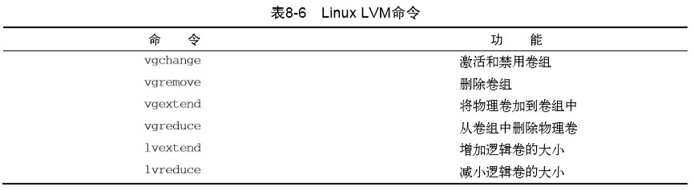

# 《Linux命令行》学习笔记（七）

## 第8章 管理文件系统

>  本章内容：
>
> - 文件系统基础
> - 日志文件系统与写时复制文件系统
> - 文件系统管理
> - 逻辑卷布局
> - 使用Linux逻辑卷管理器 

本章将探讨Linux 世界里可选用的不同文件系统，并向你演示如何在命令行上进行创建和管理。

### 8.1 探索 Linux 文件系统

每种文件系统都在存储设备上实现了虚拟目录结构。

#### 8.1.1 基本的 Linux 文件系统

1. ext 文件系统：扩展文件系统，文件系统采用名为索引节点的系统来存放虚拟目录中所存储文件的信息，文件大小不得超过 2GB
2. ext2 文件系统：ext 文件系统的升级版，容易在系统崩溃或断电时损坏而臭名昭著。即使文件数据正常保存到了物理设 备上，如果索引节点表记录没完成更新的话，文件会丢失。

#### 8.1.2 日志文件系统

不再使用之前先将数据直接写入存储设备 再更新索引节点表的做法，而是先将文件的更改写入到临时文件（称作日志，journal）中，等成功写入以后再删除相应的日志条目。



以下是一些在 Linux 上后来出现的带日志功能的文件系统：

1. ext3 文件系统：采用和ext2文件系统相同的索引节点表结构，但给每个存储设备增加了一个日志文件， 以将准备写入存储设备的数据先记入日志。 
2. ext4 文件系统：ext4文件系统在2008年受到Linux内核官方支持，现在已是大多数流行的Linux发行版采用的默认文件系统。除了支持数据压缩和加密，ext4文件系统还支持一个称作区段（extent）的特性。区段在存储设备上按块分配空间，但在索引节点表中只保存起始块的位置。
3. Reiser 文件系统：支持回写日志模式——只把索引节点表数据写到日志文件，也因此成为Linux 上快的日志文件系统之一。
4. JFS 文件系统：作为可能依然在用的老的日志文件系统之一，JFS文件系统采用的是有序日志方法，即只在日志中保存索引节点表数据，直到真正的文件数据被写进存储设备时才删除它。
5. XFS 文件系统：XFS文件系统采用回写模式的日志，在提供了高性能的同时也引入了一定的风险，因为实际 数据并未存进日志文件。XFS文件系统还允许在线调整文件系统的大小。

#### 8.1.3 写时复制文件系统

> 就文件系统而言，日志式的另一种选择是一种叫作写时复制（copy-on-write，COW）的技术。 COW利用快照兼顾了安全性和性能。如果要修改数据，会使用克隆或可写快照。修改过的数据 并不会直接覆盖当前数据，而是被放入文件系统中的另一个位置上。即便是数据修改已经完成， 之前的旧数据也不会被重写

1. ZFS 文件系统
2. Btrf 文件系统

### 8.2 操作文件系统

本节将会带你逐步了解命令行 下的文件系统交互的命令。

#### 8.2.1 创建分区

`fdisk`工具命令用于帮助管理安装在任何存储设备上的分区。





常用参数：

- `p`命令将一个存储设备的详细信息显示出来
- `n`命令在该存储设备上创建新的分区
- `w`命令将更改保存到存储设备上

#### 8.2.2 创建文件系统

本小节介绍将分区格式化的命令。



```shell
# 创建一个文件系统
sudo  mkfs.ext4 /dev/sdb1
```

此外，可以使用`type`命令来确认某个文件系统工具是否可用。

为分区创建了文件系统之后，下一步是将它挂载到虚拟目录下的某个挂载点，这样就可以将 数据存储在新文件系统中了。你可以将新文件系统挂载到虚拟目录中需要额外空间的任何位置。



`mount`命令的`-t`选项指明了要挂载的文件系统类型（ext4）。现在你可以在新分区中保存新文件和目录了

#### 8.2.3 文件系统的检查与修复

`fsck`命令能够检查和修复大部分类型的 Linux 文件系统。



### 8.3 逻辑卷管理

逻辑卷管理器（LVM）可以让 Linux 在无需重建整个文件系统的情况下，管理磁盘空间。（通俗来说就是允许多块硬盘共同管理一个虚拟目录）

#### 8.3.3 使用 Linux LVM

1. 使用`fdisk`命令的`t`命令可以改变分区类型，将硬盘上的物理分区转换为 LVM 的物理卷区段。

2. 通过`pvcreate`命令创建实际的物理卷。（`pvdisplay`查看）

   ```shell
   sudo pvcreate /dev/sdb1
   ```

3. 使用`vgcreate`命令来创建卷组（`vgdisplay`命令查看）

4. 使用`lvcreate`命令创建逻辑卷

   

   ```shell
   sudo lvcreate -l 100%FREE -n lvtest Vol1
   sudo lvdisplay Voll
   ```

5. 使用逻辑卷创建文件系统

   ```shell
    sudo mkfs.ext4 /dev/Vol1/lvtest 
    sudo mount /dev/Vol1/lvtest /mnt/my_partition 
   ```

6. 修改 LVM

   使用下面的命令可以控制 LVM 中的环境

   


> 阅读至 P147 162