# 《Linux命令行》学习笔记（三）

## 第 4 章 更多的 bash shell 命令

> 文件管理和目录管理是Linux shell的主要功能之一。不过，在开始脚本编程之前，我们还需要了解一下其他方面的知识。本章将详细介绍Linux系统管理命令，演示如何通过命令行命令来探查Linux 系统的内部信息，后介绍一些可以用来操作系统上数据文件的命令。 

### 4.1 监测程序

Linux 系统管理员可以用一些命令行工具来跟踪运行在系统中的程序。

#### 4.1.1 探查进程

当程序运行在系统上时通常被称为`进程(process)`，要监测这些进程则需要熟悉`ps`命令的用法，该命令能输出运行在系统上所有程序的许多信息。

`ps`命令有很多参数，默认不使用参数的情况下，命令并不会提供多少信息，且**只会显示运行在当前控制台下的属于当前用户的进程**。

比如下面的命令，就只运行了 bash shell 和 ps 命令本身。

```shell
ps
#   PID TTY          TIME CMD
#   3081 pts/0    00:00:00 bash
#   3209 pts/0    00:00:00 ps
```

Linux 系统中使用的 GNU ps 命令支持 3 中不同类型的命令行参数：

- Unix 风格的参数，前面加单破折线
- BSD 风格参数，前面不加破折线
- GNU 风格的长参数，前面加双破折线

**1. Unix 风格的参数**

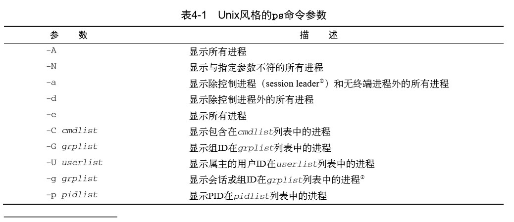

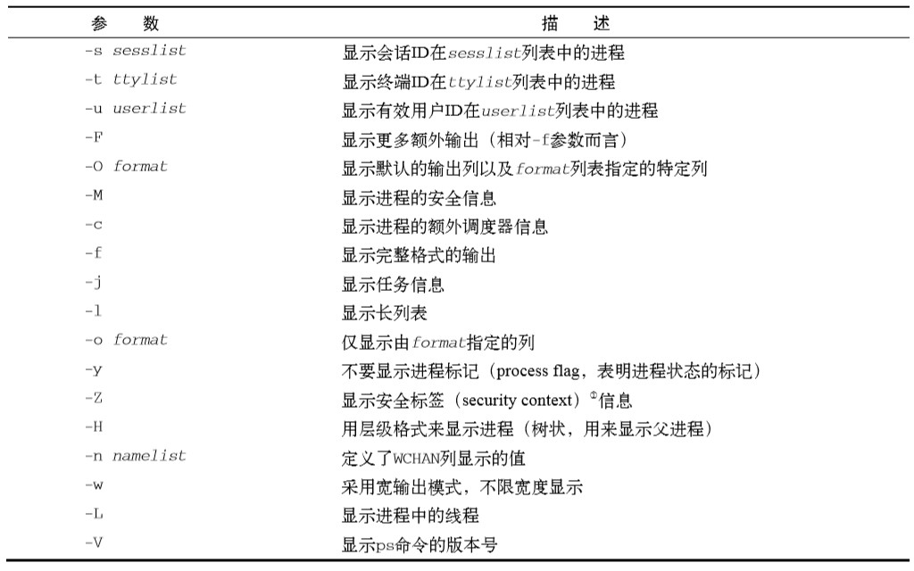

使用 ps 命令的关键不在于记住所有可用的参数，而在于记住最有用的那些参数。举个例子，使用`ps -ef`参数组合可以查看系统上的所有进程（-e 参数指定显示所有运行在系统上的进程，-f 参数则扩展了输出）

信息列包含以下内容：

- UID：启动这些进程的用户
- PID：进程的进程 ID
- PPID：父进程的进程号（如果该进程是由另一个进程启动的）
- C：进程生命周期中的 CPU 利用率
- STIME：进程启动时的系统时间
- TTY：进程启动时的终端设备
- TIME：运行进程所累积的 CPU 时间
- CMD：启动的程序名称

如果想获得更多信息，可以再加上`-l`参数，它会产生一个长格式输出。多出以下列：

- F：内核分配给进程的系统标记
- S：进程的状态码（O 代表正在运行；S 代表在休眠；R 代表可运行，正等待运行；Z 代表僵化，进程已结束但父进程已不存在；T 代表停止）
- PRI：进程的优先级（越大的数字代表越低的优先级）
- NI：谦让度值，用于参与决定优先级
- ADDR：进程的内存地址
- SZ：加入进程被换出，所需交换空间的大致大小
- WCHAN：进程休眠的内核函数的地址

**2. BSD 风格的参数**

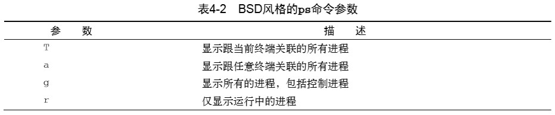

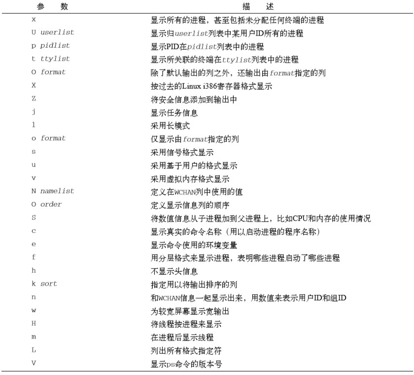

BSD 风格参数是加州伯克利分校开发的一个 Unix 版本。它和 AT&T Unix 系统有许多细小的不同，这也导致了多年的 Unix 争论。BSD 版的`ps`命令参数如上所示。

可以看到 Unix 和 BSD 类型的参数有很多重叠的地方。使用其中某种类型参数得到的信息也同样可以使用另一种来获得。大多数情况下，你只要选择自己所喜欢格式的参数类型就行了。

在使用 BSD 参数时，`ps`命令会自动改变输出以模仿 BSD 格式。

```shell
ps l
# F  UID  PID PPID PRI  NI  VSZ  RSS WCHAN  STAT TTY      TIME COMMAND
# 0  500 3081 3080  20   0 4692 1432 wait   Ss   pts/0    0:00 -bash
# 0  500 5104 3081  20   0 4468  844 -      R+   pts/0    0:00 ps l
```

大部分的输出列跟使用 Unix 风格参数时是一样的，只有一小部分不同。

- VSZ：进程在内存中的大小，以 KB 为单位
- RSS：进程在未换出时占用的物理内存
- STAT：代表当前进程状态的双字符状态码

其中双字符状态码能比 Unix 风格输出的单字符状态码能更清楚地表示进程的当前状态。

第一个字符采用了和 Unix 风格 S 列相同的值，表明进程是在休眠、运行还是在等待。第二个参数进一个说明该进程的状态。

- <：该进程运行在高优先级上
- N：该进程运行在低优先级上
- L：该进程有页面锁定在内存中
- s：该进程是控制线程
- l：该进程是多线程的
- +：该进程运行在前台

从前面的例子可以看出，bash 命令处在休眠状态，但同时它也是一个控制进程（在我的会话中，它是主要进程），而`ps`命令则运行在系统的前台。

**3. GNU 长参数**

最后，GNU 开发人员在这个新改进过的`ps`命令中加入了另外一些参数。其中一些 GNU 长参数复制了现有的 Unix 或 BSD 类型的参数，而另一些则提供了新功能。

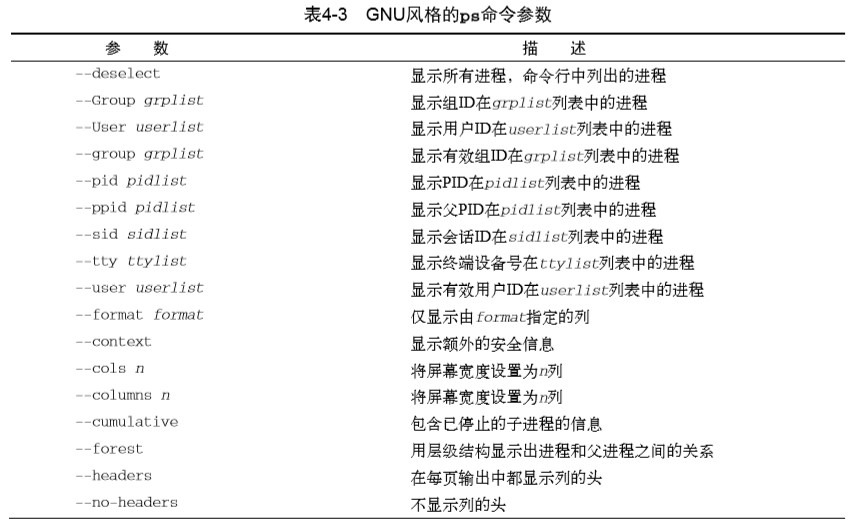

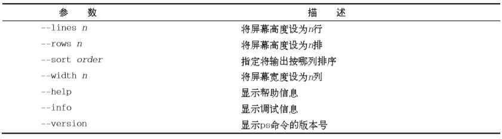

可以将 GNU 长参数和 Unix 或 BSD 风格的参数混用来定制输出。GNU 长参数中一个十分有用的功能是`--forest`参数。它会显示进程的层级信息，并用 ASCII 字符绘出图标。

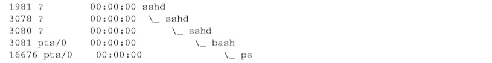

#### 4.1.2 实时监测进程

`ps`命令虽然在收集运行在系统上的进程信息时非常有用，但也有不足之处：它只能显示某个特定时间点的信息。如果想实时观测那些频繁换进换出的内存进程趋势，就需要用到`top`命令。

`top`命令和`ps`命令相似，能够显示进程信息，但它是实时显示的。

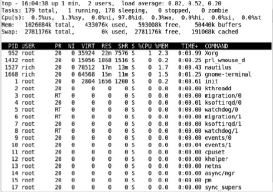

第一行显示了当前时间、系统运行时间、登录的用户数以及系统的平均负载。

平均负载有 3 个值：最近 1 分钟、最近 5 分钟和最近 15 分钟的平均负载。值越大说明系统的负载越高。

> 由于进程短期的突发性活动，出现近1分钟的高负载值也很常见，但如果近15分钟内的平均负载都很高，就说明系统可能有问题
>
> Linux系统管理的要点在于定义究竟到什么程度才算是高负载。这个值取决于系统的硬件配置以及系统上通常运行的程序。对某个系统来说是高负载的值可能对另一系统来说就 是正常值。通常，如果系统的负载值超过了2，就说明系统比较繁忙了。 

第二行显示了进程概要信息 —— `top`命令的输出中将进程叫作任务（task）：有多少进程处在运行、休眠、停止或是僵化（进程完成但父进程没有响应）状态。

第三行显示了 CPU 的概要信息。`top`根据进程的属主（用户还是系统）和进程的状态（运行、空闲还是等待）将 CPU 利用率分成几类输出。

第四行和第五行说明了内存的状态，第四行说的是系统的物理内存：总共有多少内存，当前用了多少，还有多少空闲。

第五行说的是同样的信息，不过是针对系统系统交换空间（虚拟内存）而言的。

最后一部分显示了当前运行中的进程的详细列表，跟`ps`命令的输出类似：

- PID：进程的 ID
- USER：进程属主的名字
- PR：进程的优先级
- NI：进程的谦让度值
- VIRT：进程占用的虚拟内存的总量
- RES：进程占用的物理内存总量
- SHR：进程和其他进程共享的内存共量
- S：进程的状态
  - D：可中断你的休眠状态
  - R：在运行状态
  - S：休眠状态
  - T：跟踪状态或停止状态
  - Z：僵化状态
- %CPU：进程使用的 CPU 时间比例
- %MEM：进程使用的内存占可用内存的比例
- TIME+：自进程启动到目前为止的 CPU 时间总量
- COMMAND：进程所对应的命令行名称，也就是启动的程序名

#### 4.1.3 结束进程

Linux 沿用了 Unix 进行进程间通信的方法，提供了一些能够控制进程的命令。

Linux 中，进程之间通过**信号**来通信。进程的信号就是预定义好的一个消息，进程能识别它并决定忽略还是作出反应。大多数编写完善的程序都能接收和处理 Unix 进程信号，信号如下表：

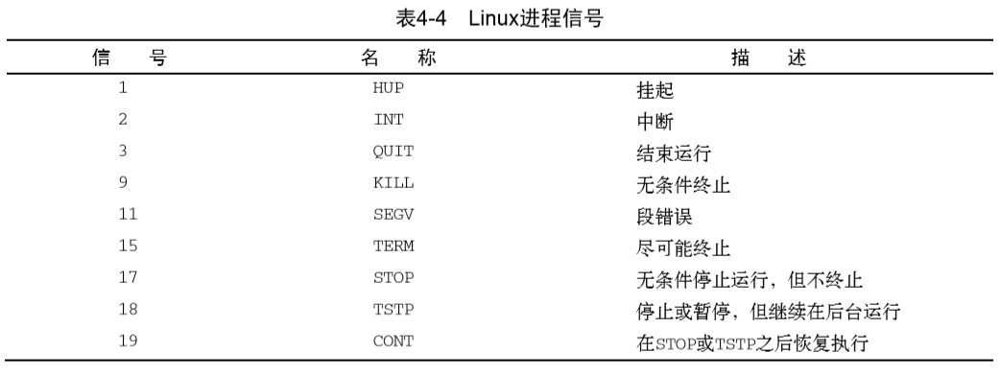

在 Linux 中有两个命令可以向运行中的进程发出进程信号。

**1. kill 命令**

`kill`命令可以通过进程（PID）给进程发信号。默认情况下，`kill`命令会向命令行中列出的全部 PID 发送一个`TERM`信号。要发送进程信号，你必须是进程的属主或登录为 root 用户，且只能用进程的 PID 而不能用命令名。

```shell
kill 3940
 # -bash: kill: (3940) - Operation not permitted 
```

`TERM`信号告诉进程可能的话就停止运行。不过，有些僵尸进程会忽略这个信号请求。如果要强制中止，`-s`参数支持指定其他信号。

```shell
kill -s HUP 3940
```

上面这条命名不会有任何输出，执行后只能通过 ps 或 top 命令来查看进程是否停止。

**2. killall 命令**

`killall`是一条强大的命令，它支持通过进程名而不是 PID 来结束进程。`killall`命令也支持通配符，但在系统因为负载过大而变得很慢时会很有用。

```shell
killall http*
```

上面这条命令会结束所有以 http 开头的进程。

> 警告 以root用户身份登录系统时，使用killall命令要特别小心，因为很容易就会误用通配符 而结束了重要的系统进程。这可能会破坏文件系统。

### 4.2 监测磁盘空间

系统管理员的另外一个重要任务就是监测系统磁盘的使用情况。Linux 提供了几个命令行命令来帮助管理存储媒体。

#### 4.2.1 挂载存储媒体

如之前所说，Linux 文件系统将所有的磁盘都并入一个虚拟目录下，所以在使用一个新的存储媒体之前，都需要将它们放到虚拟目录下。这项工作被称为**挂载**。

现如今大多数 Linux 发行版都能自动挂载特定类型的**可移动存储媒体**。如果用的发行版不支持自动挂载和卸载功能，就必须要手动完成这一步。

**1. mount 命令**

Linux 上用来挂载媒体的命令叫`mount`，默认情况下该命令会输出当前系统下挂载的设备列表。

```shell
mount
#/dev/mapper/VolGroup00-LogVol00 on / type ext3 (rw)
#proc on /proc type proc (rw)
#sysfs on /sys type sysfs (rw)
#devpts on /dev/pts type devpts (rw,gid=5,mode=620)
#/dev/sda1 on /boot type ext3 (rw)
#tmpfs on /dev/shm type tmpfs (rw)
#none on /proc/sys/fs/binfmt_misc type binfmt_misc (rw)
#sunrpc on /var/lib/nfs/rpc_pipefs type rpc_pipefs (rw)
#/dev/sdb1 on /media/disk type vfat
#(rw,nosuid,nodev,uhelper=hal,shortname=lower,uid=503)
```

`mount`命令提供四部分信息：

- 媒体的设备文件名
- 媒体挂载到虚拟目录的挂载点
- 文件系统类型
- 已挂载媒体的访问状态

```shell
#/dev/sdb1 on /media/disk type vfat
```

比如上面这一行，U 判被 GNOME 桌面自动挂载到了挂载点 /media/disk。vfat 文件系统类型说明它是在 Windows 机器上被格式化的。

要手动在虚拟目录中挂载设备，需要 root 用户权限，挂载媒体设备的基本命令如下：

```shell
mount -t type device directory
```

`type`参数制定了磁盘被格式化的文件系统类型，Linux 可以识别非常多的文件系统，如果存储设备来自于 Windows PC，那么很大概率会使用下列文件类型：

- vfat：Windows 长文件系统
- ntfs：Windows 高级文件系统
- iso9660：标准 CD-ROM 文件系统

后面两个参数定义了该存储设备的设备文件的位置以及挂载点在虚拟目录中的位置。比如要手动将 U 盘 /dev/sdb1 挂载到 /media/disk，可用下面的命令：

```shell
mount -t vfat /dev/sdb1 /media/disk
```

媒体设备挂载到虚拟目录以后，root 用户就有对该设备的所有访问权限，非 root 用户的访问会被限制，可以通过目录权限（第 7 章内容）指定用户对设备的访问权限。

此外`mount`命令还有一些高级功能。

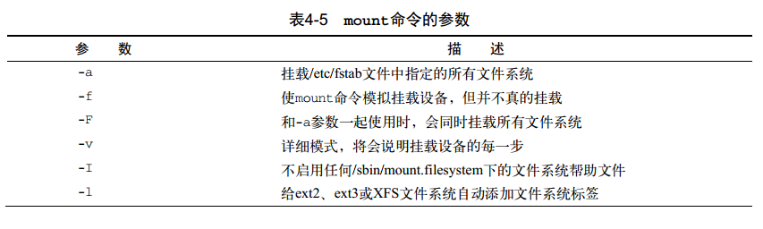

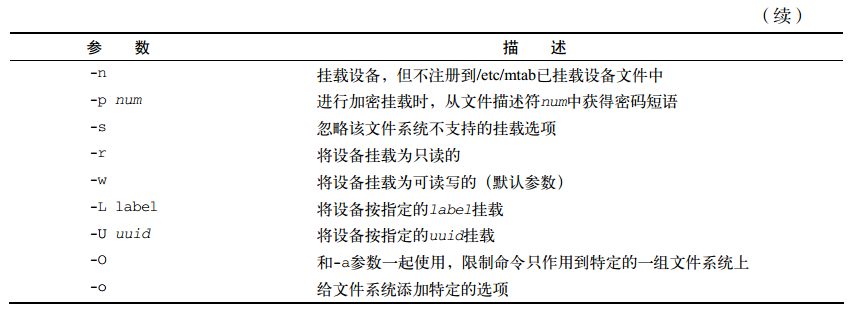

`-o`参数允许在挂载文件系统时添加一些以逗号分隔的额外选项。以下为常用的选项。

- ro：以只读形式挂载
- rw：以读写形式挂载
- user：允许普通用户挂载文件系统
- check=none：挂载文件系统时不进行完整性校验
- loop：挂载一个文件

**2. umount 命令**

`umount`命令用于卸载一个设备（PS：就是 umount 而不是 unmount，神经刀命名），其命令格式如下：

```shell
umount [directory | device]
```

`umount`命令支持通过设备文件或是挂载点来指定要卸载的设备。如果有任何程序正在使用一个设备上的文件，系统将不允许卸载。

```shell
[root@testbox mnt] umount /home/rich/mnt
#umount: /home/rich/mnt: device is busy
#umount: /home/rich/mnt: device is busy
[root@testbox mnt] cd /home/rich
[root@testbox rich] umount /home/rich/mnt
[root@testbox rich] ls -l mnt
#total 0
```

> 如果在卸载设备时，系统提示设备繁忙，无法卸载设备，通常是有进程还在访问该设备或使用该设备上的文件。 这时可用lsof命令获得使用它的进程信息，然后在应用中停止使用该设备或停止该进程。lsof命令的用法很简 单：lsof /path/to/device/node，或者lsof /path/to/mount/point。 

#### 4.2.2 使用 df 命令

`df`命令可以让你方便查看所有已挂载硬盘的使用情况，查看某个设备还有多少磁盘空间。

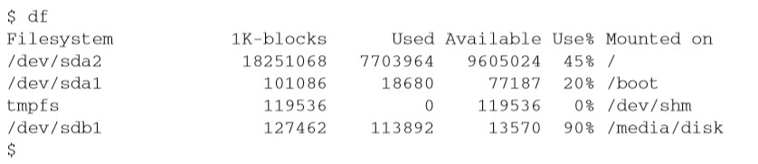

命令输出如下：

- 设备的设备文件位置
- 能容纳多少个 1024 字节（MB）大小的块
- 已用了多少个 1024 字节大小的块
- 还有多少个 1024 字节大小的块可用
- 已用空间所占比例
- 设备挂载到了哪个挂载点上

`df`命令有一些基本不会用到的命令行参数（...)，一个常用的参数是`-h`。它会把参数中的磁盘空间按照用户易读的形式显示，如下：

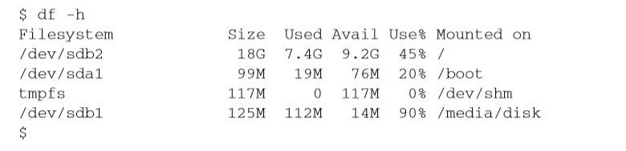

#### 4.2.3 使用 du 命令

`du`命令可以显示某个特定目录的磁盘使用情况。该方法可以快速判断系统上某个目录下是不是有超大文件。

```shell
$ du
#484     ./.gstreamer-0.10 
#8       ./Templates 
#8       ./Download 
#8       ./.ccache/7/0 
#24      ./.ccache/7 
#368     ./.ccache/a/d 
#384     ./.ccache/a
```

左边的数值是每个文件或目录占用的磁盘块数。**注意这个里诶包是从目录层级的最底部开始，然后按文件、子目录、目录逐级向上**。

`du`命令单独使用的意义并不大，想要更方便的话还需要添加下面的参数配合使用：

- -c：显示所有已列出文件总的大小
- -h：按用户易读的格式输出大小，即用 K、M、G来显示
- -s：显示每个输出参数的总计

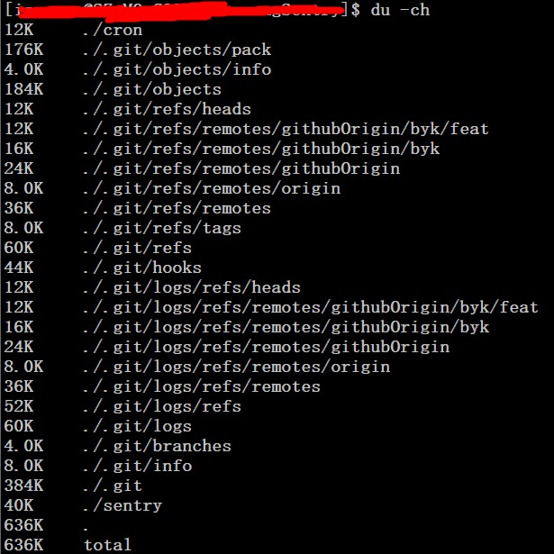

如上图所示，这之后系统管理员就可以用一些文件处理命令来操作大批量的数据了。

### 4.3 处理数据文件

Linux 系统提供了一些命令行工具来处理大量数据，能够更好的处理系统输出的大量数据。

#### 4.3.1 排序数据

处理大量数据时的一个常用命令是`sort`命令。

顾名思义，`sort`命令是对数据进行排序的，默认情况下`sort`命令会按照**会话指定的默认语言的排序规则**对文本文件中的数据进行排序。

按照字符顺序来进行排序可能会出现一些问题，如果我们要将数字排序，可以加入`-n`参数，它会告诉`sort`命令把数字识别成数字而不是字符并且按值排序。

比如在排序`du`命令的输出时就可以使用：

```shell
du -sh * | sort -nr
```

`-r`参数会将结果按降序输出，这样就更容易看到目录下的哪些文件占用空间最多。

其余的参数如下所示：

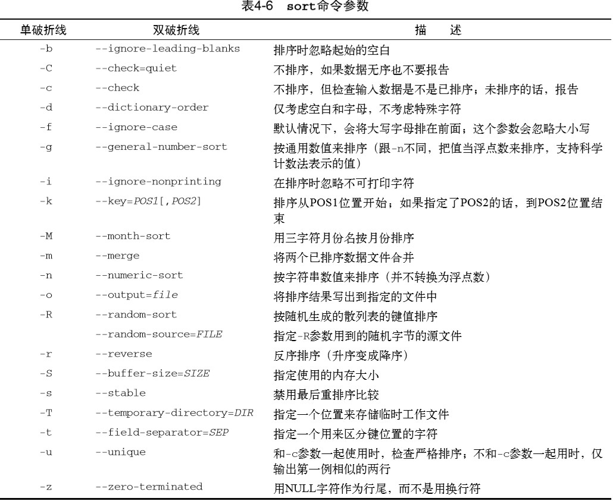

`-k`和`-t`参数在按字段分隔的数据进行排序时很有用，例如 /etc/passwd 文件。可以用`-t`参数来指定字符分隔符，然后用`-k`参数来指定排序的字段。

比如将密码文件 /etc/passwd 根据用户 ID 进行数值排序。

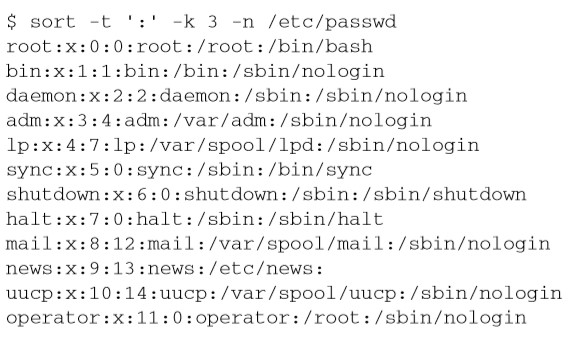

如上所示。

#### 4.3.2 搜索数据

如果你需要在大文件中寻找一行数据，你并不需要手动翻看整个文件，使用`grep`命令来帮助查找就行了。格式如下：

```shell
grep [options] pattern [file]
```

`grep`命令会在输入或指定的文件中查找包含匹配指定模式的字符的行。`grep`的输出就是包含了匹配模式的行。

```shell
grep three file1
# three
grep t file1
# two
# three
```

由于`grep`命令非常流行，其经历了大量的更新，可以通过`--help`命令查看其手册观看其功能。

- 如果要进行反向搜索（输出不匹配该模式的行），可加`-v`参数。

  ```shell
  grep -v t file1
  # one
  # four
  # five
  ```

- 如果要显示匹配模式的行所在的行号，可以加`-n`参数。

  ```shell
  grep -n t file1
  # 2:two
  # 3:three
  ```

- 如果只想知道有多少行含有匹配的模式，可以用`-c`参数

  ```shell
  grep -c t file1
  # 2
  ```

- 如果要指定多个匹配模式，可用`-e`参数来指定每个模式。

  ```shell
  grep -e t -e f file1
  # two
  # three
  # four
  # five
  ```

  该例子输出了含有字符 t 或字符 f 的所有行。

默认情况下，`grep`命令用基本的 Unix 风格正则表达式来匹配模式。Unix 风格正则表达式采用特殊字符来定义怎样查找匹配的模式。正则表达式可以参考 20 章的内容。

以下是在`grep`搜索中使用正则表达式的简单例子：

```shell
grep [tf] file
# two
# three
# four
# five
```

上面正则的方括号表示`grep`应该搜索包含 t 或者 f 字符的匹配。

`egrep`命令是`grep`的一个衍生，支持 POSIX 扩展正则表达式。POSIX 扩展正则表达式含有更多的可以用来匹配模式的字符。

`fgrep`则是另外一个版本，支持将匹配模式指定为用换行符，支持将匹配模式指定为用换行符分隔的一列固定长度的字符串，将这串字符串放到一个文件中，然后就可以在`fgrep`命令中用其在一个大型文件中搜索字符串了。

#### 4.3.3 压缩数据

Linux 下的文件压缩工具如下所示：

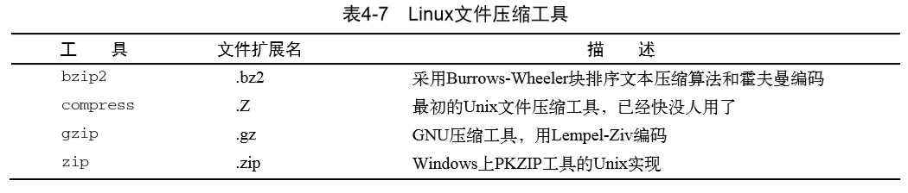

其中`comporess`工具已经很少看到了。`gzip`是目前 Linux 上流行的压缩工具。

`gzip`是 GNU 项目的产物，这个软件包含下面的工具：

- gzip：用来压缩文件
- gzcat：用来查看压缩过的文本文件的内容
- gunzip：用来解压文件

`gzip`命令会压缩你在命令行指定的文件。也可以在命令行指定多个文件名甚至用通配符来一次性批量压缩文件：

```shell
gzip my*
ls -l my*
#-rwxr--r--    1 rich     rich          103 Sep  6 13:43 myprog.c.gz  
#-rwxr-xr-x    1 rich     rich         5178 Sep  6 13:43 myprog.gz  
#-rwxr--r--    1 rich     rich           59 Sep  6 13:46 myscript.gz  
#-rwxr--r--    1 rich     rich           60 Sep  6 13:44 myscript2.gz
```

#### 4.3.4 归档数据

虽然`zip`命令能够很好地压缩和归档数据进单个文件，但目前 Unix 和 Linux 上最广泛使用的归档工具依然是`tar`命令。

`tar`命令最开始是用来将文件写到磁盘设备上归档的，但也能把输出写到文件里，这种用法在 Linux 上被普遍使用。

```shell
tar function [options] object1 object2
```

**function**参数定义了`tar`命令应该做什么，如下所示：

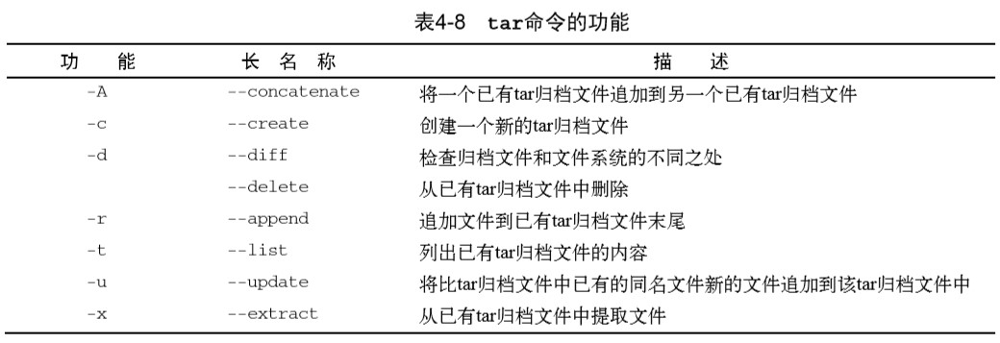

每个功能可用选项来针对`tar`归档文件定义一个特定行为。下面是和命令一起使用的常见选项：

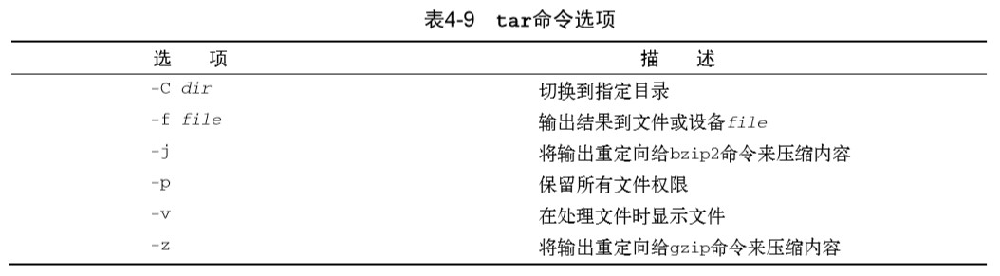

这些选项经常合并到一起使用。

```shell
# 创建一个归档文件：
tar -cvf test.tar test/ test2/
# 列出 tar 文件 test.tar 的内容
tar -tf test.tar
# 从一个归档 tar 文件中提取文件，如果tar文件是从一个目录结构创建的，那整个目录结构都会在当前目录下重新创建
tar -xvf test.tar
```

`tar`命令是给整个目录结构创建归档文件的简便方法，也是 Linux  中分发开源程序源码文件所采用的普遍方法。

> 下载了开源软件之后，你会经常看到文件名以.tgz结尾。这些是 gzip 压缩过的 tar 文件可以 用命令`tar -zxvf filename.tgz`来解压