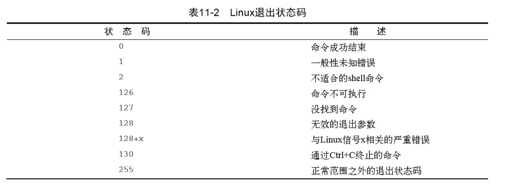

# 《Linux命令行》学习笔记（九）

---

第二部分 shell 脚本编程基础

---

## 第11章 构建基本脚本

本章开始讨论编写 shell 脚本的基础知识

### 11.1 使用多个命令

shell 可以让你将多个命令串起来一次执行完成。如果要两个命令一起运行，可以将它们放在同一行中彼此用分号隔开。

```shell
# 显示了当前日期和时间，后面紧跟着who命令的输出，显示当前是谁登录到了系统上
date ; who
```

使用这种办法就能将任意多个命令串连在一起使用了，只要不超过大命令行字符数255就行。

### 11.2 创建 shell 脚本文件

在创建 shell 脚本文件时，必须在文件的第一行指定要使用的 shell。格式为：

```shell
#!/bin/bash
```

**shell 脚本文件的第一行不会处理以 # 为开头的注释，而后面的惊叹号会告诉你 shell 用哪个 shell 来运行脚本。**

在制定了 shell 之后就可以在文件的每一行中输入命令然后加一个回车符，使用 # 号来添加注释。

也可以根据需要，使用分号将两个命令放在一行上，但在 shell 脚本中，你可以在独立的行中书写命令。

在执行 shell 之前，要让 shell 找到你所写的脚本，可以通过以下两种做法：

- 将 shell 脚本文件所处的目录添加到 PATH 环境变量中
- 在提示符中用绝对或相对文件路径来引用 shell 脚本

### 11.3 显示消息

可以使用`echo`命令来显示消息告诉用户脚本正在做什么。

```shell
echo hi
# hi
echo "hi"
# hi
echo '"hi"'
# "hi"
```

如果想要把文本字符串的命令和命令输出显示在同一行，可以使用`-n`参数（需要在字符串的两侧使用引号，保证要显示的字符串尾部有一个空格。）

```shell
#!/bin/bash
echo -n "现在的时间是: "
date
# The time and date are: Mon Feb 21 15:42:23 EST 2014 
```

如上所示。

### 11.4 使用变量

#### 11.4.1 环境变量

可以在环境变量名称之前加上美元符($)来使用这些环境变量。

```shell
echo HOME: $HOME
```

echo 命令中的环境变量会在脚本运行时替换成当前值，即便在双引号中，shell 依然能够知道并识别变量。

如果要显示 $ 符号，则需要在符号面前添加反斜线。

```shell
echo \$
# $
```

#### 11.4.2 用户变量

用户变量可以是任何由字母、数字或下划线组成的文本字符串，长度不超过20个。用户变量区分大小写。

使用等号将值赋给用户变量，但在变量、等号和值之间不能出现空格。

用户变量在定义后同样可通过美元符引用。

```shell
var1=10
var2=testing
echo "$var1 $var2"
# 10 testing
```

**引用一个变量值时需要使 用美元符，而引用变量来对其进行赋值时则不要使用美元符**。

#### 11.4.3 命令替换

有两种方法可以将命令输出赋给变量：

- 反引号(`)
- $() 格式

```shell
echo  `echo $HOSTNAME`
# or
echo $(echo $HOSTNAME)
```

shell 会运行命令替换符号中的命令。

### 11.5 重定向输入和输出

bash shell 提供了几个操作符可以将命令的输出重定向到另一个位置。重定向可以用于输入也可以用于输出，可以将文件重定向到命令输入。

#### 11.5.1 输出重定向

用大于号（>）可以将命令的输出发送到一个文件中。`command > outputfile`

如果不想覆盖文件原有内容，而是要将命令的输出追加到已有文件中，可以用双大于号（>>）来追加数据。

#### 11.5.2 输入重定向

输入重定向将文件的内容重定向到命令，而非将命令的输出重定向的文件。

重定向符号是小于号。

```shell
wc < testfile
```

`wc`命令可以对数据中的文本进行计数，默认它会输出 3 个值：

- 文本行数
- 文本词数
- 文本字节数

通过将文本文件重定向到命令中，就可以立刻得到文件中的行、词和字节计数。

另外还可以使用（<<）符号，代表内联输入重定向。这种方式无需使用文件进行重定向，只需要在命令行中指定用于重定向的数据就可以了。

除了这个符号，你必须指定一个文本标记来划分输入数据的开始和结尾。

```shell
wc << EOF
> wow
> ddd
> fafafafa
> EOF
# 3  3 17
```

如上，就制定了 EOF 为行末结束符号。

### 11.6 管道

虽然重定向可以将一个命令的输出作为另一个命令的输入，但会显得有些笨拙。

```shell
# 如下将 rpm 的输出赋给 sort
rpm -qa > rpm.list
sort < rpm.list
```

除了这种方式以外，还可以直接将其重定向到另一个命令，这个过程叫作`管道连接`。

```shell
command1 | command2
```

不要以为由管道串起的两个命令会一次执行。Linux 系统实际上会同时运行这两个命令，在系统内部将他们连接起来。第一个命令产生输出的同时，江北立即送给第二个命令，数据的传输不会用到任何中间文件或缓冲区。

```shell
rpm -qa | sort
```

> 除非你的眼神特别好，否则可能根本来不及看清楚命令的输出。由于管道操作是实时运行的， 所以只要rpm命令一输出数据，sort命令就会立即对其进行排序。等到rpm命令输出完数据，sort 命令就已经将数据排好序并显示了在显示器上。    

此外还可以用管道命令接`more`和`less`命令来进行分页。

```shell
# 搭配使用重定向和管道来将输出保存到文件中
rpm -qa | sort > rpm.list
# 通过将输出管道连接到more命令，可以强制输出在一屏数据显示后停下来
ls -alF | more
```

### 11.7 执行数学运算

shell 脚本中有两种途径来进行数学计算

- `expr`命令
- 方括号

其中方括号执行比`expr`命令方便地多。

```shell
var1=200
var2=50
var3=45
var4=$[$var1 * ($var2 - $var3)]
```

要注意的是 bash shell 只支持整数运算。若要进行任何实际的数学运算，可以使用`bc`命令，当然最好是不要用，或者考虑使用其他 shell，如 zsh。

### 11.8 退出脚本

运行完后一条命令时，脚本就结束了。其实还有另外一种更优雅的方法可以为脚本划上一个句号。 

shell 中运行的每个命令都使用`退出状态码`告诉 shell 它已经运行完毕。在命令结束运行时由命令传给 shell。

#### 11.8.1 查看退出状态码

变量`$?`用于保存上个已执行命令的退出状态码。

```shell
date
# 2020年 05月 14日 星期四 19:31:49 CST
echo $?
# 0
```

**一个成功结束的命令的退出状态码是 0，如果一个命令结束时出错，退出状态码就是一个正数值**。



其中，一般性未知错误状态码`1`代表给某个命令提供了无效参数。

#### 11.8.2 exit 命令

`exit`命令允许你在脚本结束时指定一个退出状态码。

```shell
# 指定退出状态码
exit 5
```

要注意的是，退出码最多只能是 255，如果超出，最终的结果就是指定的数值除以 256 后得到的余数。