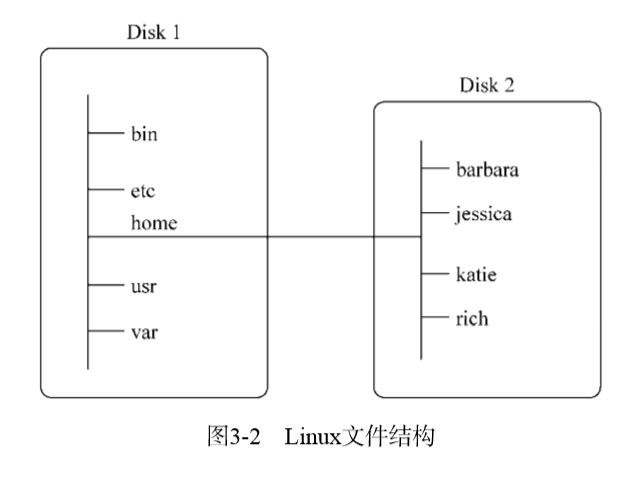
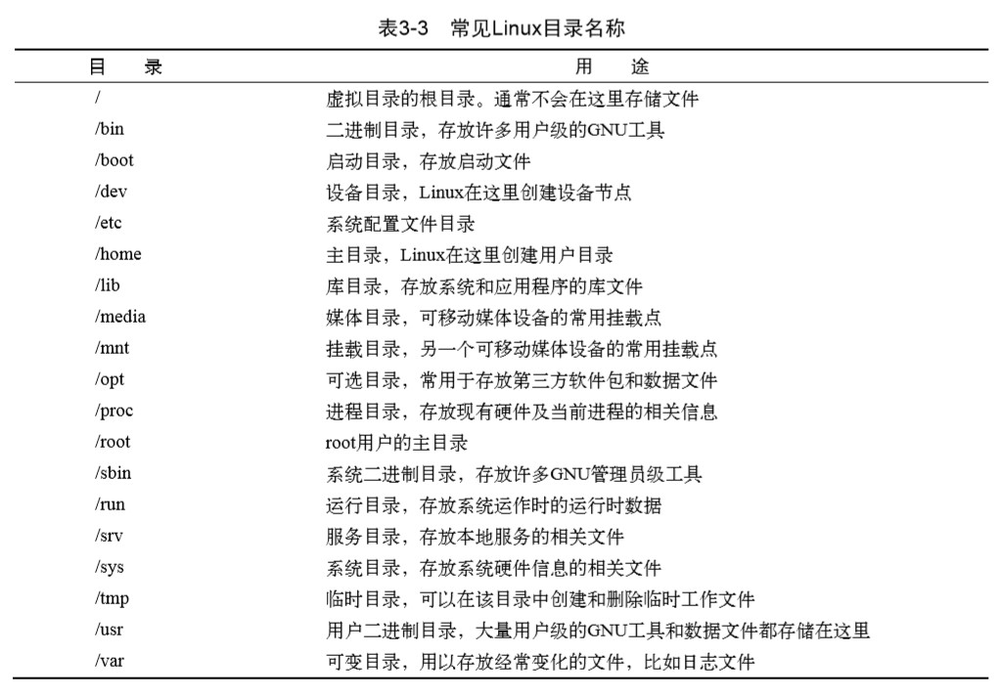
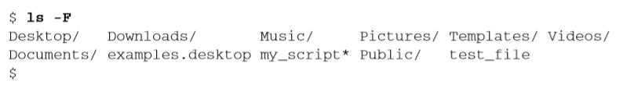
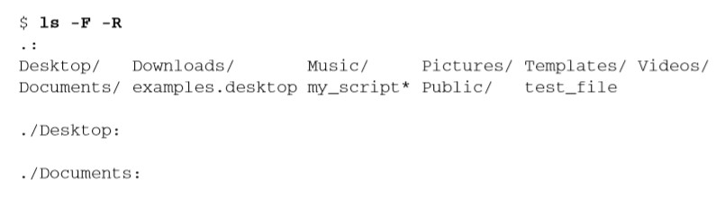
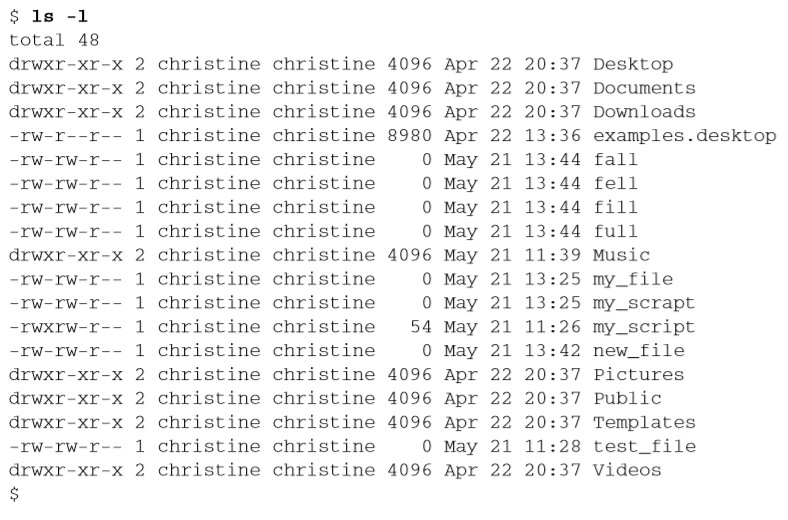

# 《Linux命令行》学习笔记（二）

## 第2章 走进shell

> Linux早期，可以用来工作的只有shell。那时，系统管理员、程序员和系统用户都端坐 在Linux控制台终端前，输入shell命令，查看文本输出。如今，伴随着图形化桌面环境 的应用，想在系统中找到shell提示符来输入命令都变得困难起来。本章讨论了如何进入命令行环 境，带你逐步了解可能会在各种Linux发行版中碰到的终端仿真软件包。

**本章内容**：

- 访问命令行
- 通过 Linux 控制台终端访问 CLI
- 通过图形化终端仿真器访问 CLI

### 2.1 进入命令行

如今 Linux 环境相较于以前只能通过 shell 命令来操纵系统，大都已经配上了某种类型的图形化桌面环境，但是 shell 命令的输入依旧需要通过 CLI 来输入。所以如何进入控制台 CLI 在现在也变得多样化了。

#### 2.1.1 控制台终端

进入 CLI 的一种方法是让 Linux 系统推出图形化桌面环境，进入文本模式，也被称为`Linux控制台`模式，因为它仿真了早期的硬接线控制台终端。

#### 2.1.2 图形化终端

Linux 图形化桌面环境还提供了一种终端仿真包，也就是我们常用的 terminal 控制台。要想在桌面中使用命令行，关键在于图形化终端仿真器。可以把图形化终端仿真器看作GUI 中（in the GUI）的CLI终端，将虚拟控制台终端看作GUI以外（outside the GUI）的CLI终端。理解各种终端及其特性能够提高你的命令行体验。

### 2.2 通过 Linux 控制台终端访问 CLI

在多数的 Linux 发行版中，你可以使用简单的按键组合来访问某个 Linux 虚拟控制台。

> 通常必须按下Ctrl+Alt组合键，然后按功能键（F1~F7）进入要使用的虚拟控制台。功能键F1生成虚拟控制台1，F2键生成虚拟控制台2，F3键生成虚拟控制台3，F4键生成虚拟控制台4，依次类推。 
>
> 说明：Linux发行版通常使用Ctrl+Alt组合键配合F1或F7来进入图形界面。Ubuntu使用F7，而 RHEL则使用F1。最好还是测试一下自己所使用的发行版是如何进入图形界面的

如果不涉及 GUI，虚拟控制台终端访问 CLI 自然是不错的选择，但有时候需要一遍访问 CLI 一边运行图形化程序。使用终端仿真软件包可以解决这个问题。

### 2.3 通过图形化终端访问 CLI

本小节介绍了各种不同的 CLI，略过。

## 第 3 章 基本的 bash shell 命令

本章内容：

- 使用 shell
- bash 手册
- 浏览文件系统
- 文件和目录列表
- 管理文件和目录
- 查看文件内容

### 3.1 启动 shell

bash shell 能提供对 Linux 系统的交互式访问，通常在登录终端时驱动。启动时登录系统启动的 shell 依赖于用户账户的配置。

/etc/passwd 文件包含了所有系统账户列表以及每个用户的基本配置信息，示例条目如下：

```shell
christine:x:501:501:Christine Bresnahan:/home/christine:/bin/bash
```

该条目有七个字段，字段之间用冒号分隔。系统使用字段中的数据来赋予账户特性。可以看到最后一个字段中，指定了用户所使用的 shell 程序。

也就是说当 christine 这个用户登录 Linux 系统后，bash shell 会自动自动。

### 3.2 shell 提示符

默认的 shell 提示符是 $ 符号，除了作为 shell 的入口，提示符还能提供其他的辅助信息。

```shell
christine@server01:~$ 
```

在上面的例子中，提示符显示了当前用户 ID 名。此外还包括系统名 server01。

### 3.3 bash 手册

`man`命令可以用于访问存储在 Linux 系统上的手册页面，在想要查找的工具的名称前面输入 man 命令，就可以找到那个工具对应的手册条目。

此外，大多数命令都可以接受 -help 或 --help 选项。用于帮助你使用该命令

### 3.4 浏览文件系统

本节介绍浏览文件的相关 shell 命令。

#### 3.4.1 Linux 文件系统

Linux 与 Windows 不同，在路径名中不使用驱动器盘符，它将文件存储在单个目录结构中，这个目录被称为`虚拟目录(virtual directory)`。虚拟目录将安装在 PC 上的所有存储设备的文件路径纳入单个目录结构中。

Linux 虚拟目录结构只包含一个称为 root(根) 的基础目录。根目录下的目录和文件会按照它们的目录路径一一列出，这点跟 Windows 类似。

Linux 虚拟目录中比较复杂的部分是其如何协调管理各个存储设备。在 Linux PC 上安装的第一块硬盘被称为**根驱动器**，包含了虚拟目录的核心，其他目录都是从这里开始构建的。

此外，Linux 会在根驱动器上创建一些特别的目录，称之为**挂载点(mount point)**。挂载点是虚拟目录中用于分配额外存储设备的目录，虚拟目录会让其他驱动器的文件和目录出现在这些挂载点目录中。



如上图，一块硬盘和虚拟目录的根目录(/)关联起来。剩下的硬盘就可以挂载到虚拟目录结构中的任何地方，向上面这样就被挂载到了 /home 的位置，用户目录都位于这个位置。

在 Linux 文件系统中，通用的目录名用于表示一些常见的功能，如下图：



常见的目录名均基于文件系统层级标准（filesystem hierarchy standard, FHS）。很多 Linux 发行版都遵循了 FHS。

#### 3.4.2 遍历目录

在 Linux 文件系统上，可以使用切换目录命令 cd 将 shell 会话切换到另一个目录。

```shell
cd destination
```

`destination`参数可以用两种方式表示：一种是使用绝对文件路径，另一种是使用相对文件路径。

**1. 绝对文件路径**

用户可在虚拟目录中采用绝对文件路径。绝对文件路径定义了在虚拟目录结构中该目录的确切位置，以虚拟目录的根目录开始(/)，相当于目录的全名。如`/usr/bin`

`pwd`命令可以显示出 shell 会话的当前目录。

**22 相对文件路径**

相对文件路径允许用户指定一个基于当前位置的目标文件路径。可以在任何包含子目录的目录中使用带有相对文件路径的`cd`命令。

- 单点符（.），用以表示当前目录
- 双点符(..)，用以表示当前目录的父目录。

### 3.5 文件和目录列表

列表命令(ls)可以列出系统中有哪些文件。

#### 3.5.1 基本列表功能

`ls`命令最基本的形式会显示当前目录下的文件和目录。

要注意的是，ls 命令输出的列表是以字母按列排序的。如果用户用的是支持彩色的终端仿真器，ls 命令会可以通过不同的颜色来区分不同类型的文件。

如果没有彩色终端仿真器，可用`-F`参数的 ls 命令来区分文件和目录。



-F 参数在目录名后面加了正斜线（/），以方便用户在输出中分辨它们，类似地它还会在可执行文件后面加上星号，一遍用户找出可在系统上运行的文件。

普通的 ls 命令默认不会显示以`.`为开头的隐藏文件（如`.git`），要显示这些文件，就要用到`-a`参数。

还有一个`-R`参数是一个递归选项。能够列出当前目录下包含的子目录中的文件。



注意在这个模式下，如果目录结构很庞大，输出内容会变得很长。

#### 3.5.2 显示长列表

在基本的输出列表中，`ls`命令并未输出每个文件的相关信息，可以用一个常用的参数`-l`来显示更多相关信息。



这种长列表格式的输出在每一行列出了单个文件或目录。除此以外还有下述信息：

- 文件类型，比如目录（d）、文件（-）、字符型文件（c）或块设备（b）
- 文件的权限（参见第 6 章）
- 文件的硬链接总数
- 文件属主的用户名
- 文件属主的组名
- 文件的大小（以字节B为单位）
- 文件的上次修改时间
- 文件名或目录名

**总结**

在进行文件管理时，ls 的命令能派上很多用处，除了单独使用以外别忘了还可以将多个参数结合起来使用。比如`ls -alF`

#### 3.5.3 过滤输出列表

`ls`命令还支持在命令行中定义过滤器，这个过滤器就是一个进行简单文本匹配的字符串。可以在要用的命令行参数之后添加这个过滤器

```shell
ls -l my_script
# -rwxrw-r-- 1 christine christine 54 May 21 11:26 my_script
```

当用户指定特定文件的名称作为过滤器时，ls 命令只会显示该文件的信息。

当然 ls 也支持使用通配符来进行模糊搜索：

- 问号（?）代表一个字符
- 星号（*）代表零个或多个字符

```shell
ls -l my_scr?pt
-rw-rw-r-- 1 christine christine  0 May 21 13:25 my_scrapt
-rwxrw-r-- 1 christine christine 54 May 21 11:26 my_script 
ls -l my*
# -rw-rw-r-- 1 christine christine  0 May 21 13:25 my_file
# -rw-rw-r-- 1 christine christine  0 May 21 13:25 my_scrapt
# -rwxrw-r-- 1 christine christine 54 May 21 11:26 my_script
```

还有更多的元字符通配符可用于文件扩展匹配，可以使用中括号，将待选的字符列出来，也可以指定字符范围，比如`[a - i]`，此外还可以使用感叹号（！）将不需要的内容排除在外。

```shell
ls -l my_scr[ai]pt
# -rw-rw-r-- 1 christine christine  0 May 21 13:25 my_scrapt
# -rwxrw-r-- 1 christine christine 54 May 21 11:26 my_script
ls -l f[a-i]ll
# -rw-rw-r-- 1 christine christine 0 May 21 13:44 fall
# -rw-rw-r-- 1 christine christine 0 May 21 13:44 fell
# -rw-rw-r-- 1 christine christine 0 May 21 13:44 fill
ls -l f[!a]ll
# -rw-rw-r-- 1 christine christine 0 May 21 13:44 fell
# -rw-rw-r-- 1 christine christine 0 May 21 13:44 fill
# -rw-rw-r-- 1 christine christine 0 May 21 13:44 full
```

### 3.6 处理文件

shell 提供了很多在 Linux 文件系统上操作文件的命令。

#### 3.6.1 创建文件

使用`touch`命令可以轻松创建文件。

```shell
touch test_one
ls -l test_one
# -rw-rw-r-- 1 christine christine 0 May 21 14:17 test_one
```

`touch`命令还可以用来改变文件的修改事件。这个操作并不需要改变文件的内容。

```shell
ls -l test_one
# -rw-rw-r-- 1 christine christine 0 May 21 14:17 test_one
touch test_one
ls -l test_one
# -rw-rw-r-- 1 christine christine 0 May 21 14:35 test_one 
```

如果想要查看文件的访问时间而不是修改事件，可以加入另外一个参数：`--time=atime`。能够显示已经更改过的文件访问时间。

#### 3.6.2 复制文件

`cp`命令用于复制文件。

```shell
cp source destination
```

当 source 和 destination 参数都是文件名时，cp 命令将源文件复制成一个新文件。并且以 destination 命名。新文件就像全新的文件一样，有新的修改时间。

如果目标文件已经存在，cp 命令可能并不会提醒这一点。好是加上`-i`选项，强制 shell 询问是否需要覆盖已有文件。

```shell
cp -i test_one  test_two
# cp: overwrite 'test_two'? n 
```

上面提到单点符表示当前工作目录，所以将一个有很长的源对象名的文件复制到当前工作目录中时，单点符能够简化该任务：

```shell
cp -i /etc/NetworkManager/NetworkManager.conf .
```

cp 命令还有一个`-R`参数，用于在一条命令中递归复制整个目录的内容。

```shell
 cp -R Scripts/  Mod_Scripts
```

还有一个`-p`参数，用于在复制文件的同时同步其修改时间。

此外，还可以在`cp`命令中使用通配符，跟`ls`命令一样。

#### 3.6.3 制表键自动补全

制表键自动补全允许你在输入文件名或者目录名时按一下制表键，让 shell 帮忙将内容补充完整。

#### 3.6.4 链接文件

如需要在系统上维护同一文件的两份或多份副本，除了保存多份单独的物理文件副本以外，还可以采用保存一份物理文件副本和多个虚拟副本的方法。这种虚拟副本称为`链接`。链接是目录中指向文件真实位置的占位符。在 Linux 中有两种不同类型的文件链接：

- 符号链接
- 硬链接

其中`符号链接`是一个实实在在的文件，它指向存放在虚拟目录结构中某个地方的另一个文件。这两个通过符号链接在一起的文件，彼此的文件大小并不相同（PS：笔者注，其实就是软链接，相当于 Windows 下的快捷方式）。

而硬链接会创建独立的虚拟文件，其中包含了原始文件的信息及位置。但是它们从根本上而言就是同一个文件。引用硬链接文件等同于引用了源文件。要创建硬链接，原始文件也必须事先存在（PS：笔者注，相当于是一个`cp -p`命令 + 同步功能）

要创建符号链接（软链接），可以使用`ln -s source_file target_file`命令。

```shell
ln -s data_file  sl_data_file

 ls -l *data_file
# -rw-rw-r-- 1 christine christine 1092 May 21 17:27 data_file
# lrwxrwxrwx 1 christine christine    9 May 21 17:29 sl_data_file -> data_file
```

要创建硬链接文件，无需加入额外命令，直接使用`ln`命令即可。

```shell
 ln code_file  hl_code_file
 ls -li *code_file
 # 296892 -rw-rw-r-- 2 christine christine 189 May 21 17:56  code_file
 # 296892 -rw-rw-r-- 2 christine christine 189 May 21 17:56  hl_code_file
```

可以看到，这两个文件共享 inode 编号，文件大小也一模一样。

> 复制链接文件的时候一定要小心。如果使用cp命令复制一个文件，而该文件又已经被链接 到了另一个源文件上，那么你得到的其实是源文件的一个副本。这很容易让人犯晕。用不着复 制链接文件，可以创建原始文件的另一个链接。同一个文件拥有多个链接，这完全没有问题。 但是，千万别创建软链接文件的软链接。这会形成混乱的链接链，不仅容易断裂，还会造成各种麻烦。
>
> PS：笔者注，**毕竟你也没见过给快捷方式创建快捷方式的吧**...

#### 3.6.5 重命名文件

在 Linux 中，重命名文件称为移动。`mv`命令可以将文件和目录移动到另一个位置或者重新命名。

`mv`命令只影响文件名，inode 编号和时间戳都保持不变。

> 和cp命令类似，也可以在mv命令中使用-i参数。这样在命令试图覆盖已有的文件时，你 就会得到提示。 

#### 3.6.6 删除文件

bash shell 中删除文件的命令非常简单是`rm`。

```shell
rm -i fall
# rm: remove regular empty file 'fall'? y 
```

注意`-i`命令参数提示你是不是要真的删除该文件。bash shell 中没有回收站或者垃圾箱，文件一旦删除就再无法找回。

如果要删除很多文件且不受提示符的打扰，可以使用`-f`参数强制删除。

此外要删除一个文件夹可以用`-r`参数，可以递归地删除一个文件夹下面的所有文件及文件夹，这个参数跟上面的参数合起来就是毁天灭地惨绝人寰的`rm -rf`删除大法了。

（PS：强烈建议使用`mv file /tmp/`来代替恐怖的`rm`命令）

### 3.7 处理目录

在 Linux 中，有些命令对文件和目录都有效，而有些则只对目录有效。

#### 3.7.1 创建目录

在 Linux 中创建目录可以使用`mkdir`命令，而如果行同时创建多个目录和子目录，则需要就如`-p`参数：

```shell
mkdir New_Dir
ls -ld New_Dir
# drwxrwxr-x 2 christine christine 4096 May 22 09:48 New_Dir
mkdir -p New_Dir/Sub_Dir/Under_Dir
ls -R New_Dir
# New_Dir: Sub_Dir 
#  
# New_Dir/Sub_Dir: Under_Dir 
#  
# New_Dir/Sub_Dir/Under_Dir: 
```

#### 3.7.2 删除目录

shell 为了尽可能防止操作人员捅娄子，所以把删除目录的操作弄得比较复杂。

删除目录的基本命令是`rmdir`，默认情况下，该命令只会删除空目录。如果是非空目录，`rmdir`命令会拒绝删除目录。

所以如果要使用`rmdir`命令来删除目录，就要在删除之前先清空该文件夹。

### 3.8 查看文件内容

Linux 中有几个命令可以查看文件内容，而不需要调用其他文本编辑器。

#### 3.8.1 查看文件类型

在显示文件内容之前，应该先了解一下文件类型。`file`命令可以探测文件内部并决定文件是什么类型：

```shell
file my_file
# my_file: ASCII text
```

上面的例子中的文件是一个 ASCII 编码的 text （文本）文件。

```shell
 file sl_data_file
 # sl_data_file: symbolic link to 'data_file'
```

上面的例子为一个类型为符号链接的文件，也可以告诉你链接到了哪个文件上。

```shell
file my_script
# my_script: Bourne-Again shell script, ASCII text executable
```

上面的类型是一个脚本文件，可以在系统上执行。

```shell
file /bin/ls
# /bin/ls: ELF 64-bit LSB  executable, x86-64, version 1 (SYSV),  dynamically linked (uses shared libs), for GNU/Linux 2.6.24, 
```

上面的类型是一个二进制可执行程序。

#### 3.8.2 查看整个文件

如果手头上有一个很大的文本文件，你想看看里面的内容，在 Linux 上有 3 个不同的命令可以完成这个任务。

**1. cat 命令**

cat 命令是显示文本文件中所有数据的得力工具。

有以下参数：

- `-n`参数，会给所有的行加上行号
- `-b`参数，可以向有文本的行加上行号
- `-T`参数，如果不想让制表符出现，加入这个参数会用 ^I 字符组合去替换文中的所有制表符

**2. more 命令**

`cat` 命令的缺陷是，一旦运行，就无法控制后面的操作。为了解决这个问题，开发人员编写了`more`命令，可以显示文本文件的内容，但会在显示每页数据之后停下来。

**3. less 命令**

`less`命令是`more`命令的升级版。它提供了一些极为实用的特性，能够实现在文本文件中的前后翻动，而且也有一些高级搜索功能。

#### 3.8.3 查看部分文件

Linux 提供了一些命令用于查看部分的文件数据。

**1. tail 命令**

tail 命令会显示文件最后几行的内容，默认显示末尾 10 行。

向 tail 命令中加入`-n`参数来修改所显示的行数。比如可以通过加入`-n 2`使 tail 命令只显示文件最后两行。

`-f`命令允许你在其他进程使用该文件时查看文件内容，`tail`命令会保持活动状态，并不断显示添加到文件中的内容。该命令通常作为实时监测系统日志的方式。

**2. head 命令**

head 命令会显示文件开头那些行的内容，默认情况下和 tail 一样，都是显示 10 行文本。

head 命令同时也支持 -n 参数，可以指定想要显示的内容行数。

要注意的是 head 命令并不支持`-f`参数特性。