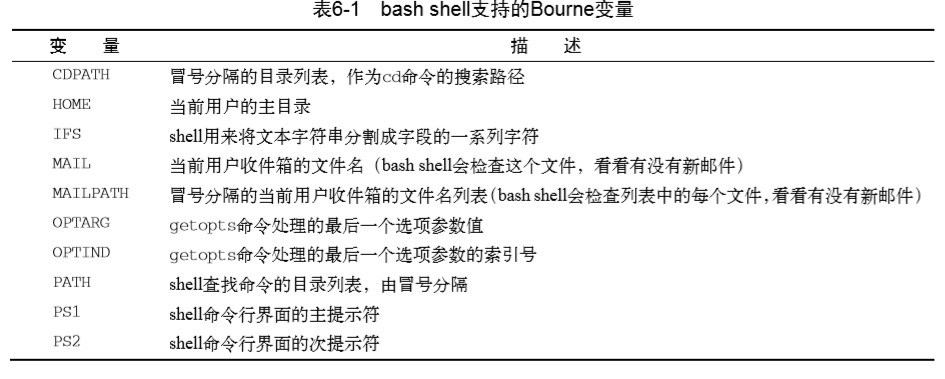
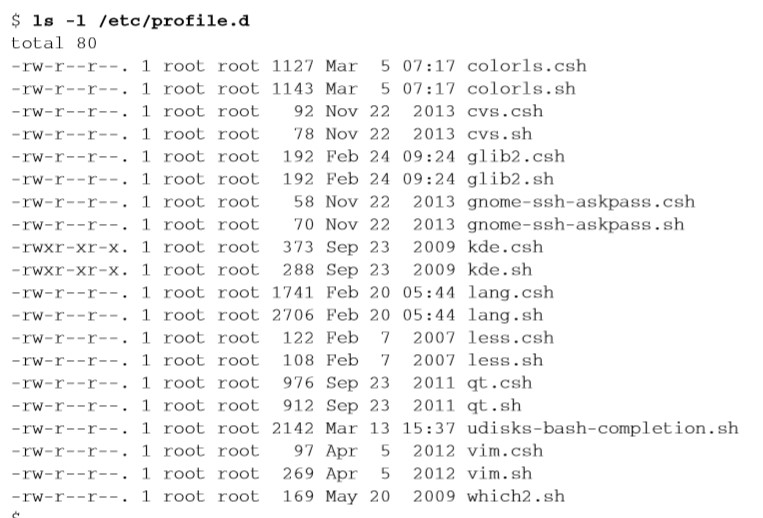

# 《Linux命令行》学习笔记（五）

## 第6章 使用Linux环境变量

> 本章内容
>
> -  什么是环境变量 
> -  创建自己的局部变量 
> -  删除环境变量 
> -  默认shell环境变量
> -  设置PATH环境变量 
> -  定位环境文件 
> -  数组变量

### 6.1 什么是环境变量

环境变量分为两类：

- 全局变量
- 局部变量

#### 6.1.1 全局环境变量

查看全局环境变量命令：

- `env`：显示所有环境变量
- `pringenv`：可以用于显示个别环境变量
- `echo $环境变量名字`：在变量前面加一个 dollar 符号用于引用某个变量的值

#### 6.1.2 局部环境变量

Linux 并没有一个只显示局部环境变量的命令。使用`set`命令会显示某个特定进程设置的所有环境变量，即包括局部、全局和用户定义变量。

### 6.2 设置用户定义变量

#### 6.2.1 设置局部用户定义变量

通过等号可以直接给环境变量赋值，注意如果值有空格，需要加上引号。

```shell
my_variable=Hello
echo $my_variable
# Hello
my_variable="Hello World" 
echo $my_variable
# Hello World
```

局部环境变量只能在当前 shell 中使用，即便是子 shell 也无法共享父 shell 的环境变量。

#### 6.2.2 设置全局变量

通过`export`命令可以将一个已经在局部变量中的环境变量导出到全局环境中。

```shell
my_variable=Hello
export my_variable
```

`export`的环境变量名前不需要加 $ 号。

子 shell 中能够读取到父 shell 中全局变量的值，但在子 shell 中修改全局变量是不会影响父 shell 中该变量的值的。

### 6.3 删除环境变量

使用`unset`命令可以用于删除已经存在的环境变量。

```shell
echo $my_variable
# Hello
unset my_variable
#
```

同样，在子shell中删除全局变量无法将效果反映到父shell中。 

### 6.4 默认的 shell 环境变量

默认情况下，shell 会有一些预定义的环境变量



要注意的是并不是所有的默认环境变量都必须要有一个值。

### 6.5 设置 PATH 环境变量

`PATH`环境变量定义了用于进行命令和程序查找的目录。使用`echo $PATH`命令可以看到当前的目录，目录之间用冒号分隔。

要定义`PATH`环境变量，你只需要引用原来的`PATH`值，然后再给这个字符串添加新目录就行了。

```shell
PATH=$PATH:/home/christine/Scripts
echo $PATH
#/usr/local/sbin:/usr/local/bin:/usr/sbin:/usr/bin:/sbin:/bin:/usr/games:/usr/local/games:/home/christine/Scripts
```

将目录添加到`PATH`环境变量后，就可以在虚拟目录中的任何位置执行程序。

如果希望在子 shell 中也能执行，记得要把修改后的 PATH 环境变量用`export`命令导出。

### 6.6 定位系统环境变量

接下来的问题是怎样让环境变量的作用持久化。

在你登入Linux系统启动一个bash shell时，默认情况下bash会在几个文件中查找命令。这些文件叫作启动文件或环境文件。

#### 6.6.1 登录 shell

当登录 Linux 系统时，bash shell 会从 5 个不同的启动文件里读取命令：

- /etc/profile
- $HOME/.bash_profile
- $HOME/.bashrc
- $HOME/.bash_login
- $HOME/.profile

其中 /etc/profile 文件是系统上默认的主启动文件。系统上的每个用户登录时都会执行这个启动文件。

另外四个则是针对用户的，可以根据个人需求定制。

**1. /etc/profile 文件**

以 Ubuntu 和 CentOS 这两个使用最广泛的发行版为例，它们的 /etc/profile 文件都用到了同一个特性：`for`语句，用于迭代 /etc/profile.d 目录下的所有文件。

这也为 Linux 系统提供了一个放置特定应用程序启动文件的地方，当用户登录时，shell 会执行该目录下的所有 shell 文件。

以下是 CentOS 下的该目录文件。



> lang.csh和lang.sh文件会尝试去判定系统上所采用的默认语言字符集，然后设置对应的LANG 环境变量。 

**2. $HOME 目录下的启动文件**


> 阅读至 P118 133