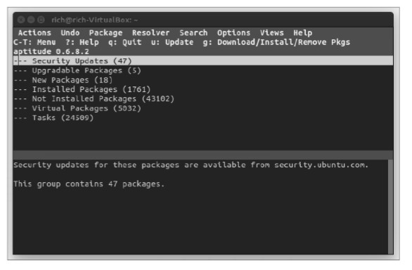
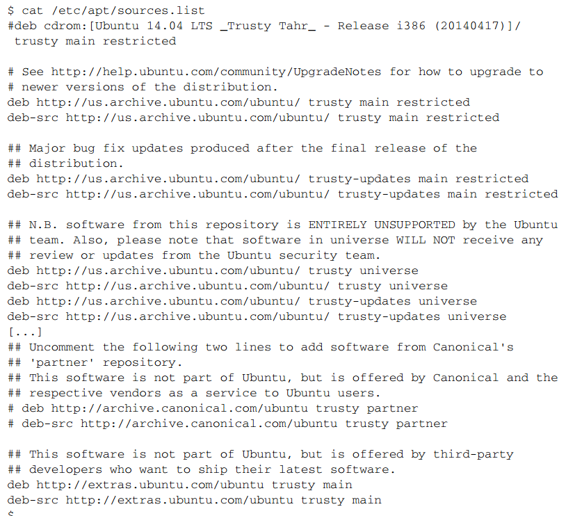
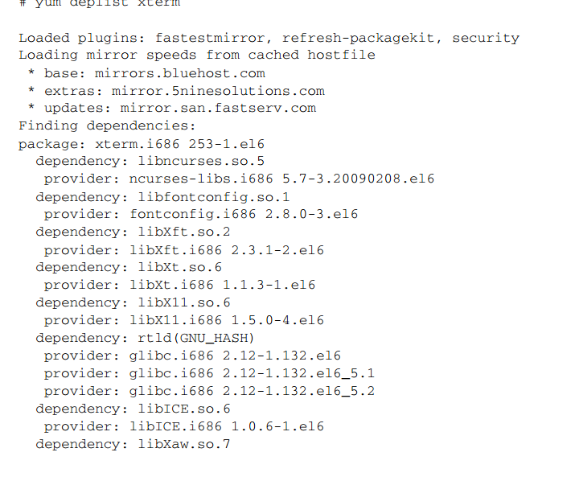
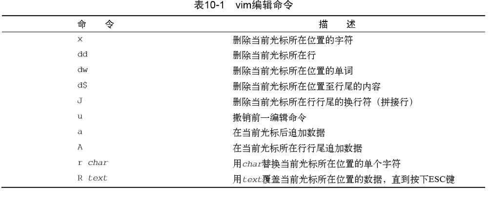
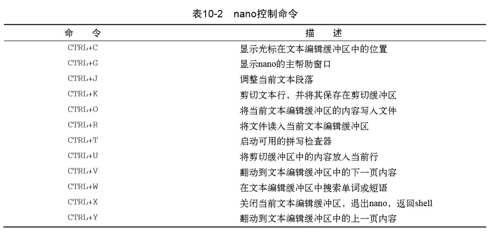

# 《Linux命令行》学习笔记（八）.md

## 第 9 章 安装软件程序

> 本章内容：
>
> - 安装软件
> - 使用 Debian 包
> - 使用 Red Hat 包

### 9.1 包管理基础

PMS（包管理系统：package management system）利用一个数据库来记录各种相关内容：

- 系统上安装了什么软件包
- 每个包安装了什么文件
- 每个已安装软件包的版本

Linux 利用 PMS 工具可以通过互联网访问存储着软件包的服务器，这些服务器称为**仓库**。可以用 PMS 工具来搜索新的软件包或者更新已安装的软件包。

PMS工具及相关命令在不同的Linux发行版上有很大的不同。Linux中广泛使用的两种主要的 PMS基础工具是`dpkg`和`rpm`。 

基于Debian的发行版（如Ubuntu和Linux Mint）使用的是`dpkg`命令，该命令会直接和 Linux 系统上的 PMS 交互。

基于Red Hat的发行版（如Fedora、openSUSE及Mandriva）使用的是`rpm`命令。

### 9.2 基于 Debian 的系统

`dpkg`命令是基于 Debian 系 PMS 工具的核心，这个 PMS 的其他工具有：

- apt-get
- apt-cache
- aptitude

其中，aptitude 是 apt 和 dpkg 的前端，命令行下使用 aptitude 有助于避免常见的软件安装问题。

#### 9.2.1 用 aptitude 管理软件包



以上是该命令的交互式界面。

```shell
aptitude show package_name
# 列出相关包所安装的全部文件
dpkg -L package_name
# 查找某个特定文件属于哪个软件包，注意，在使用的时候必须用绝对文件路径。 
dpkg --search absolute_file_name 
```

可以用上面的命令显示包的对应详情。

#### 9.2.2 用 aptitude 安装软件包

```shell
aptitute search package_name
```

通过上面这条命令可以找到特定的安装包。且可以在`package_name`周围加通配符。

随后可以通过`install`命令安装。

```shell
aptitude safe-upgrade
```

该命令会将所有已安装的包更新到软件仓库中的最新版本，safe 命令会检查包之间的依赖关系，除此以外还有不检查的`dist-upgrade`和`full-upgrade`选项。

```shell
# 只删除软件包而不删除数据和配置文件
aptitude remove package_name
# 删除软件包和相关的数据和配置文件
aptitude purge package_name
```

#### 9.2.5 aptitude 仓库

`aptitude`默认的仓库是在 Linux 发行版设置的，具体存储在 /etc/apt/sources.list 中。

> Linux发行版的开发人员下了大工夫，以保证添加到软件仓库的包版本不会互相冲突。通
> 常通过库来升级或安装软件包是最安全的。即使在其他地方有更新的版本，也应该等到
> 该版本出现在你的Linux发行版仓库中的时候再安装。 



可以看到文件会用下面的结构指定仓库源：

```shell
[deb | deb-src] address distribution_name package_type_list
```

`deb`说面这是一个已编译的程序源，而`deb-src`值则说明这是一个源代码的源。`package_type_list `可能并不止一个词，还可以看到诸如 main、restricted、universe 和 partner 这样的值。

### 9.3 基于 Red Hat 的系统

Red Hat 下常见的安装工具有三种：

- yum：在 Red Hat 和 Fedora 中使用
- urpm：在 Mandriva 中使用
- zypper：在 openSUSE 中使用

#### 9.3.1 列出已安装包

```shell
yum list installed
```

上面的命令可以找出在系统上已安装的包。

也可以用该命令找出某个特定包的详细信息或查看该包是否已安装。

```shell
# 查看安装包的详细信息
yum list xterm
# 查看该包是否已经安装
yum list installed xterm
```

同时还可以找出系统上的某个特定文件属于哪个软件包。

```shell
yum provides file_name
```

`yum`会分别查找三个仓库：base、updates 和 installed。

#### 9.3.2 用 yum 安装软件

```shell
yum install package_name
```

这条命令会从仓库中自动查找并安装包。

又或者可以手动下载 rpm 文件并用 yum 进行本地安装。

```shell
yum localinstall package_name.rpm
```

yum 可以列出所有可用更新，`update`命令用于进行更新

```shell
# 列出所有可用更新
yum list updates
# 更新包命令
yum update
```

可以使用 remove、erase 命令删除软件包

```shell
# 只删除软件包保留配置文件和数据文件
yum remove package_name
# 删除软件和它的所有文件
yum erase package_name
```

#### 9.3.5 处理损坏的包依赖关系

如果系统出现了这个问题，可以先试试下面的命令：

```shell
yum clean all
```

然后试着用`update`命令，又是只要清理了放错位置的文件就可以了。

如果还不行，可以使用`deplist`命令来确定包的安装依赖关系。


如果这样还不能解决，还可以使用`yum update --skip-broken`来忽略依赖关系损坏的包继续去更新其他软件包。

#### 9.3.6 软件仓库

```shell
yum repolist
```

该命令可以列出 /etc/yum.repos.d 文件中定义的仓库。

> 像rpmfusion.org这种优秀的仓库站点会列出必要的使用步骤。有时这些仓库网站会提供一个 可下载的rpm文件，可以用yum localinstall命令进行安装。这个rpm文件在安装过程会为你 完成所有的仓库设置工作。

## 第 10 章 使用编辑器

> 本章内容：
>
> - vim 编辑器
> - nano 编辑器
> - emacs 编辑器
> - KWrite 编辑器
> - Kate 编辑器
> - GNOME 编辑器

### 10.1 vim 编辑器

vi 编辑器是 Unix 系统最初的编辑器，使用控制台图形模式来模拟文本编辑窗口。而 vim 是 GNU 项目对其进行的改良版。

#### 10.1.1 vim 安装包

每个 linux 系统都默认安装了 vi 编辑器，但只有少部分发行版如 CentOS 会预先安装 vim ，所以需要的话最好还是手动进行安装。安装后`vi`命令将默认被`vim`取代，可以用`alias vi`命令查看。

#### 10.1.2 vim 基础

vim 编辑器有两种操作模式：

- 普通模式
- 插入模式

普通模式下，可以使用方向键或以下案件来移动光标（方便没有方向键的键盘）：

- h：左移
- j：下移
- k：上移
- l：右移

此外还有一些辅助查阅命令：

- PageDown（Ctrl + F）：下翻一屏
- PageUp（Ctrl + B）：上翻一屏
- G：移到缓冲区的最后一行
- num G：移动到缓冲区的第 num 行
- gg：移动到缓冲区的第一行

**在普通模式下，按下冒号建会进入命令模式，等待输入命令**。

- q：如果未修改数据，退出
- q!：强制不保存并退出
- w：保存
- w filename：文件另存为到一个文件中
- wq：保存并退出

> 了解了这些基本的vim命令后，你可能就理解为什么有人会痛恨vim编辑器了。要想发挥出vim 的全部威力，你必须知道大量晦涩的命令。不过只要了解了一些基本的vim命令，无论是什么环 境，你都能快速在命令行下直接修改文件。一旦适应了敲入命令，在命令行下将数据和编辑命令 一起输入就跟第二天性一样自然，再回过头使用鼠标反倒觉得奇怪了。

#### 10.1.3 编辑数据



以上是普通模式下 vim 编辑器可以对数据进行特定编辑的命令。

> 有些编辑命令允许使用数字修饰符来指定重复该命令多少次。比如，命令2x会删除从光标当 前位置开始的两个字符，命令5dd会删除从光标当前所在行开始的5行。 

#### 10.1.4 复制和粘贴

剪切命令：

- `dd`命令删除一行文本
- 光标移动到要放置该行文本的位置，使用`p`命令

复制命令：

- `yw`表示复制一个单词，`yd`表示复制一行，`y$`表示复制到行尾
- 将光标移动到复制文本的位置，使用`p`命令。

> 复制的复杂之处在于，由于不会影响到你复制的文本，你没法知道到底发生了什么。你无法 确定到底复制了什么东西，直到将它粘贴到其他地方才能明白。但vim还有另外一个功能来解决 这个问题

可以按下`v`键进入可视模式，该模式下光标移动过的所有文本都会高亮，这样你就能知道自己选中了什么了。

#### 10.1.5 查找和替换

要输入一个查找字符串，就按下斜线（/） 键,在输入你要查找的文本后，按下回车键.

要继续查找同一个单词，按下斜线键，然后按回车键。或者使用n键，表示下一个（next）。 

替换命令允许你快速用另一个单词来替换文本中的某个单词。

```shell
# 进入命令模式进行替换
:s/old/new
```

可以对替换命令作一些修改来替 换多处文本。

- `:s/old/new/g` 替换该行所有的 old
- `:n,ms/old/new/g` 替换行号 n 和 m 之间所有 old
- `:%s/old/new/g` 替换整个文件中的所有 old
- `:%s/old/new/gc` 替换整个文件中的所有 old，但在每次出现时提示

### 10.2 nano 编辑器



> 参考链接：[Linux下的Nano命令](https://www.cnblogs.com/haichuan3000/articles/2125943.html)
>
> 保存和退出
>
> 如果你要保存所做的修改，按下Ctrl+O。想要退出，按下Ctrl+X。如果你退出前没有保存所做的修改，它会提示你是否要保存。如果不要，请按N，反之，则按Y。然后它会让你确认要保存的文件名，确认或修改后按Enter即可。
>
> 如果你没有修改好而不小心按了保存键，您可以在请求确认文件名时按Ctrl+C来取消。
>
> 剪切和粘贴
>
> 要剪切一整行，请用Ctrl+K（按住Ctrl不放，再按下K键）。光标所在的行便消失了。要粘贴它，只需把光标移动到您所要粘贴的位置，然后按Ctrl+U即可。要移动多行，只需多按几次Ctrl+K把需要移动内容都剪切下来，然后按一次Ctrl+U就可以把刚剪切的内容全部粘贴上来。
>
> 如果你想使用更精确的剪切控制，则需要给文本做标记。移动光标到需要剪切文本的开头，按下Ctrl+6（或者Alt+A）。然后移动光标到待剪切文本的末尾：被做了标记的文本便会反白。要撤消文本标记，只需再按一次Ctrl+6。用Ctrl+K来剪切被标记的文本，用Ctrl+U来粘贴。
>
> 搜索特定文字
>
> 当你想搜索某特定文字时，只要想成"WhereIs"而不是"Search"，事情就简单了。只要按下Ctrl+W，键入你要搜索的字符串，再按Enter就可以了。想再次搜索相同的字符串，可以直接按Alt+W。