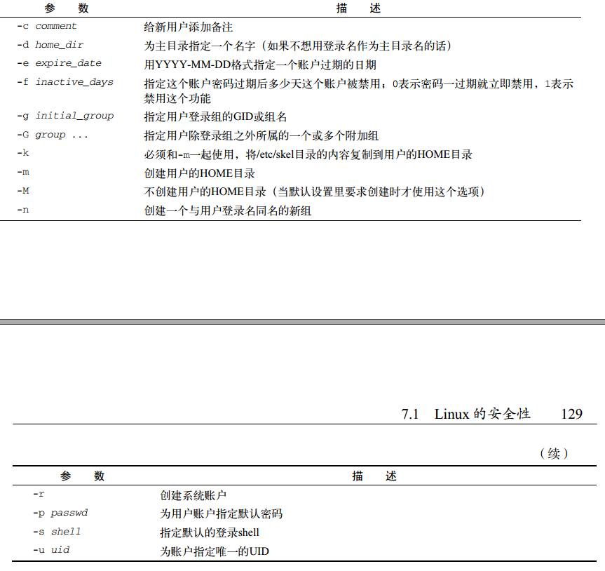
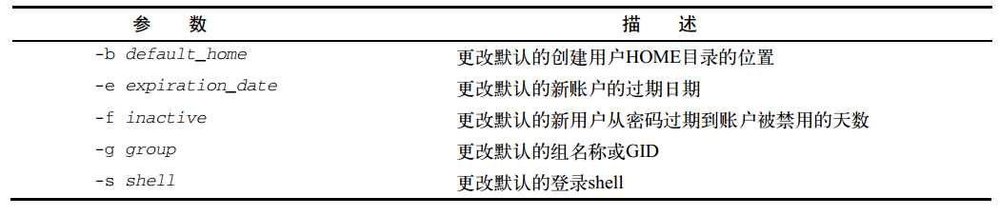
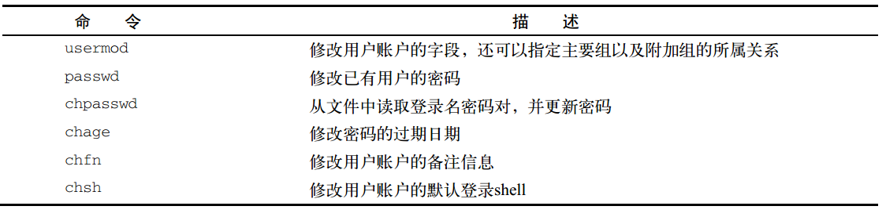
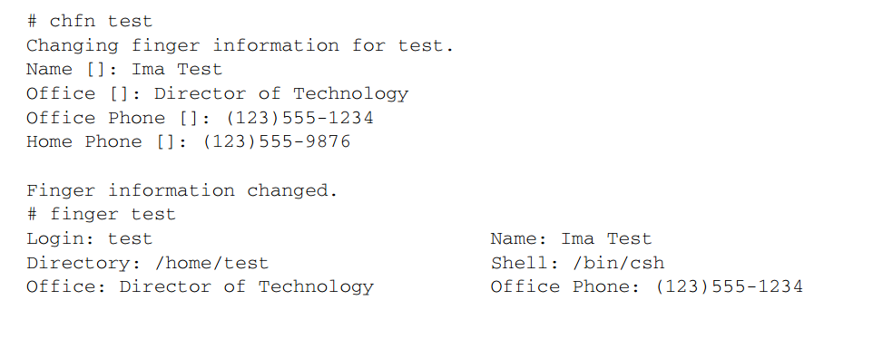
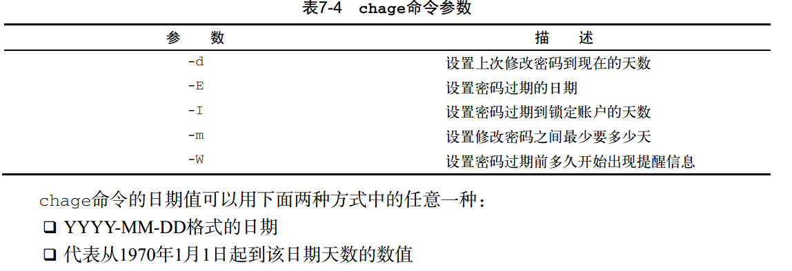
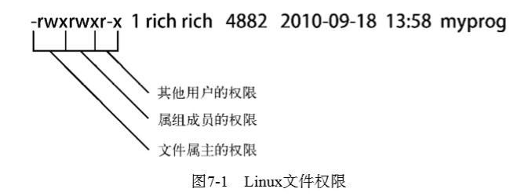
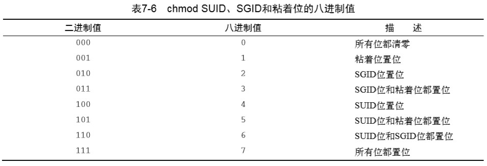

# 《Linux命令行》学习笔记（六）

## 第7章 理解Linux文件权限

> 本章内容
>
> - 理解Linux的安全性
> - 解读文件权限
> - 使用Linux组

### 7.1 Linux 的安全性

每个能进入 Linux 系统的用户都会被分配唯一的用户账户。用户对系统中各种对象的访问权限取决于他们登录系统时的账号。

用户权限是通过创建用户时分配的**用户ID**(User ID，缩写为 UID)来跟踪的。每个用户都有唯一的 UID，但用户在登录系统的时候使用的不是 UID 而是最长为 8 字符的登录名。

#### 7.1.1 /etc/passwd 文件

Linux 系统使用 /etc/paddwd 文件来将用户的登录名匹配到对应的 UID 值。

```shell
cat /etc/passwd
# root:x:0:0:root:/root:/bin/bash
# katie:x:502:502:katie:/home/katie:/bin/bash
# jessica:x:503:503:Jessica:/home/jessica:/bin/bash
# mysql:x:27:27:MySQL Server:/var/lib/mysql:/bin/bash
```

上面的字段包含了如下信息：

```shell
# 登录用户名:用户密码:用户账户的UID:用户账户的组ID:用户账户的文本描述（备注字段）:用户HOME目录的位置:用户的默认shell
```

其中 root 用户是 Linux 的系统管理员，固定分配给它的 UID 是 0。Linux 系统会为各种各样的功能创建不同的**系统账户**。

> 在安全成为一个大问题之前，这些服务经常会用root账户登录。遗憾的是，如果有非授权的 用户攻陷了这些服务中的一个，他立刻就能作为root用户进入系统。为了防止发生这种情况，现 在运行在Linux服务器后台的几乎所有的服务都是用自己的账户登录。这样的话，即使有人攻入 了某个服务，也无法访问整个系统。

Linux 为系统账户预留了 500 以下的 UID 值。有些服务甚至需要用特定的 UID 才能正常工作。而为普通用户创建账户时，他多数 Linux 系统会从 500 开始。

可以看到 /etc/passwd 文件中的密码字段都被设置成了 x，这是因为该文件中存储的密码是加密过后的用户密码。绝大多数 Linux 系统都会将用户密码保存在另一个单独的文件中（/etc/shadow），只有特定的程序才能访问这个文件。

> 你可以用任何文本编辑器在/etc/password文件里直接手动 进行用户管理（比如添加、修改或删除用户账户）。但这样做极其危险。如果/etc/passwd文件出现 损坏，系统就无法读取它的内容了，这样会导致用户无法正常登录（即便是root用户）。用标准的 Linux用户管理工具去执行这些用户管理功能就会安全许多。

#### 7.1.2 /etc/shadow 文件

只有 root 用户才能访问 /etc/shadow 文件，比起 /etc/passwd 要安全许多。

其中的记录如下所示：

```shell
# rich:$1$.FfcK0ns$f1UgiyHQ25wrB/hykCn020:11627:0:99999:7::: 
```

字段对应含义如下：

- 与/etc/passwd文件中的登录名字段对应的登录名 -> rich
- 加密后的密码 -> $1$.FfcK0ns$f1UgiyHQ25wrB
- 自上次修改密码后过去的天数密码（自1970年1月1日开始计算） -> 11627
- 多少天后才能更改密码 -> 0
- 多少天后必须更改密码 -> 99999
- 密码过期前提前多少天提醒用户更改密码 -> 7
- 密码过期后多少天禁用用户账户
- 用户账户被禁用的日期（用自1970年1月1日到当天的天数表示）
- 预留字段给将来使用 

#### 7.1.3 添加新用户

`useradd`命令可以一次性向 Linux 系统添加创建新用户账户及设置用户 HOME 目录。

默认情况下`useradd`命令使用系统的默认值以及命令行参数来设置用户账户，可以通过查看 /etc/default/useradd 文件或使用`useradd -D`来查看这些默认值。

```shell
useradd -D
# GROUP=100
# HOME=/home
# INACTIVE=-1
# EXPIRE=
# SHELL=/bin/bash
# SKEL=/etc/skel
# CREATE_MAIL_SPOOL=yes
```

> 一些Linux发行版会把Linux用户和组工具放在 /usr/sbin目录下，这个目录可能不在PATH环 境变量里。如果你的Linux系统是这样的话，可以将这个目录添加进PATH环境变量，或者用绝对文件路径名来使用这些工具。    

在创建新用户时，如果你不在命令行中指定具体的值，`useradd`命令会使用上面所示的默认值来为新用户赋值。

- 新用户会被添加到GID为100的公共组；
- 新用户的HOME目录将会位于/home/loginname；
- 新用户账户密码在过期后不会被禁用；
- 新用户账户未被设置过期日期；
- 新用户账户将bash shell作为默认shell；
- 系统会将/etc/skel目录下的内容复制到用户的HOME目录下；
- 系统为该用户账户在mail目录下创建一个用于接收邮件的文件    

关于 /etc/skel 目录，这相当于是一份默认的 HOME 目录配置，这样就能自动在每个新用户的 HOME 目录里放置默认的系统文件。

```shell
useradd -m test
ls -al /home/test
```

**默认情况下，`useradd`命令不会创建 HOME 目录，但是`-m`命令行会使其创建 HOME 目录**。这时候该命令会创建新的 HOME 目录并将 /etc/skel 目录中的文件复制过来。

要在创建用户时改变默认值或者默认行为，可以使用以下的命令行参数。



当然也可以在`-D`参数后加上下面的参数来**修改默认值的参数**。



比如像这样：

```shell
# 修改新创建用户的默认shell
useradd -D -s /bin/tsch
```

#### 7.1.4 删除用户

`userdel`可以用于删除用户，默认情况下，**userdel 命令只会删除 /etc/passwd 文件中的用户信息，而不会删除系统中属于该账户的任何文件**。

如果加上`-r`参数，`userdel`就会删除用户的 HOME 目录以及邮件目录。但此时系统上仍可能存在已删除用户的其它文件。

#### 7.1.5 修改用户

Linux 提供了以下几种不同的工具来修改已有账户的信息：



**1. usermod**

该命令是修改工具中最强大的一个，能用于修改 /etc/passwd 文件中的大部分字段，只需要用想修改的字段对应命令行参数就可以了。**参数大部分与 useradd 命令的参数一样**。

- -c 修改备注字段
- -e 修改过期日期
- -g 修改默认的登录组
- -l 修改用户账户的登录名
- -L 锁定账户，使用户无法登录
- -p 修改账户的密码
- -U 解除锁定，使用户能够登录。
- -u 改变用户的 uid。
- -s 修改用户登陆后使用的 shell。

其中`-L`选项十分实用，可以在无需删除账户和用户数据的前提下使用户无法登录。此后只要使用`-U`就可以让账户恢复正常。

```shell
# 锁定
usermod -L liubasara
# 解锁
usermod -U liubasara
```

**2. passwd 和 chpasswd**

改变用户密码的一个简便方法就是用`passwd`命令。

```shell
passwd liubasara
# New UNIX password:
# Retype new UNIX password:
# passwd: all authentication tokens updated successfully.
```

如果只用`passwd`命令会改变你自己的密码。任何用户都能改自己的密码，而 root 用户有权限改别人的密码。

`passwd -e`选项能强制用户下次登录时修改密码。

如果需要为系统中的大量用户修改密码，`chpasswd`命令可以事半功倍。`chpasswd`命令能够从标准输入自动读取登录名和密码对（由冒号分割）列表，给密码加密，然后为用户账户设置。也可以用重定向命令来将含有`userid:passwd`对的文件重定向给该命令，如下：

```shell
chpasswd < users.txt
```

**3. chsh、chfn 和 chage**

这三个工具专门用来修改特定的账户信息，`chsh`用来修改默认的用户登录 shell，使用时必须用 shell 的全路径名作为参数。

```shell
# 将默认 shell 修改为 csh
chsh -s /bin/csh test
```


`chfn`命令提供了在 /etc/passwd 文件的备注字段中存储信息的标准方法。`chfn`命令会使用交互的方式，将用于 Unix 的`finger`命令的信息存进备注字段。`finger`命令可以非常方便地查看 Linux 系统上的用户信息。



此后可以查看 /etc/passwd 文件中的记录，就能看到信息已经被更改了。

> 但由于安全考虑，很多 Linux 系统管理员会在系统上禁用`finger`命令。


最后，chage 命令可以用来管理用户账户的有效期。



### 7.2 使用 Linux 组

在涉及共享资源时，Linux 采用组(group)这一概念来允许多个用户对系统中的对象共用一组通用的权限。

有些 Linux 发行版会创建一个组，把所有用户都当成是这个组的成员。而有些发行版（比如 Ubuntu）会为每个用户创建一个单独的组以确保安全性。（在添加用户前后可通过 /etc/group 文件的内容比较）。

每个组都有唯一的 GID —— 跟 UID 类似，和唯一的组名。使用下面的工具，你可以在 Linux 系统上创建和管理你自己的组。

#### 7.2.1 /etc/group 文件

```ini
root:x:0:root
bin:x:1:root,bin,daemon
daemon:x:2:root,bin,daemon
sys:x:3:root,bin,adm
adm:x:4:root,adm,daemon
rich:x:500:
mama:x:501:
katie:x:502:
jessica:x:503:
mysql:x:27:
test:x:504:
```

上面是 /etc/group 文件中的典型例子，跟 UID 一样，GID 在分配时也采用了特定的格式。系统会分配低于 500 的 GID 值给系统账户用的组，而用户组的 GID 会从 500 开始分配。

该文件内容由四个字段组成：

- 组名
- 组密码
- GID
- 属于该组的用户列表

组密码用于**允许非组内成员通过它临时成为该组成员**。

但千万不能通过直接修改 /etc/group 来添加用户到一个组而要用`usermod`命令。

> 用户账户列表某种意义上有些误导人。你会发现，在列表中，有些组并没有列出用户。 这并不是说这些组没有成员。当一个用户在 /etc/passwd 文件中指定某个组作为默认组时， 用户账户不会作为该组成员再出现在 /etc/group 文件中。

#### 7.2.2 创建新组

`groupadd`命令可在系统上创建新组。

```shell
groupadd shared
tail /etc/group
# shared:x:505:
```

创建新组时，默认没有用户被分配到新组。

`groupadd`命令没有提供将用户添加到组中的选项，但可以用`usermod`命令来弥补这一点。

```shell
usermod -G shared rich
usermod -G shared test
tail /etc/group
# shared:x:505:rich,test
```

shared 组目前有两个成员：test 和 rich。`-G`选项会把这个新组添加到该用户账户的组列表里。

> 为用户账户分配组时要格外小心。如果加了 -g 选项，指定的组名会替换掉该账户的默认组。-G 选项则将该组添加到用户的属组的列表里，不会影响默认组。 

#### 7.2.3 修改组

`groupmod`命令可以修改已有组的 GID（加`-g`选项）或组名（加`-n`选项）。

```shell
# 将 shared 组更名为 sharing
groupmod -n sharing shared
```

修改组名时，GID 和组成员都不会改变，而所有的安全权限都是基于 GID 的。

### 7.3 理解文件权限

使用`ls -al`时，能够看到的第一列字段就是用来表示文件的权限的。

```shell
ls -alF
# total 1
# -rw-rw-r--
```

该字段的第一个字符代表了对象的类型：

- `-`代表文件
- `d`代表目录
- `l`代表链接
- `c`代表字符型设备
- `b`代表块设备
- `n`代表网络设备

之后有 3 组三字符的编码，每一组都有三种不同的权限：

- r：读权限
- w：写权限
- x：执行权限

若没有某种权限，会用`-`号在该位置代替。

三组权限分别代表了：

- 对象的所有者
- 对象所在的用户组
- 系统的其他用户



如上图所示。

#### 7.3.2 默认文件权限

`umask`命令用于设置所创文件的目录和默认权限。

```shell
umask
# 0022
umask 026
umask
# 0026
```

其中第一位代表了一项名为`黏着位`的特殊安全特性。其余三位则分别用八进制值来表示对象所有者、所在组、其他人的权限。比如说全用户全权限的值是 777（读、写、执行），所有者只读的值为 400 等等。

> 对文件来说，全权限的值是666（所有用户都有读 和写的权限）；而对目录来说，则是777（所有用户都有读、写、执行权限）。 

但要注意`umask`命令得到的值并不是默认的权限，而是其**掩码**，也就是将 777 减去其值得到的才是真正的权限。

比如说将`umask`值设为 026 后，默认的文件权限就变成 640，而目录的默认权限就变成了 751。

### 7.4 改变安全性设置

本节介绍改变权限的工具命令。

#### 7.4.1 改变权限

`chmod`命令用来改变文件和目录的安全性设置。

```shell
chmod options mode file
```

mode 参数可以直接使用八进制模式或符号模式进行设置。

```shell
chmod 760 newfile
```

此外还有符号模式。

```shell
chmod [ugoa][+-=][rwxXstugo]
```

第一组符号代表权限作用的对象：

- u：代表用户
- g：代表组
- o：代表其他
- a：代表上述所有

紧接着第二组符号代表操作：

- +：在现有权限基础上增加权限
- -：在现有权限基础上移除权限
- =：将权限设置成后面的值

最后第三组符号代表作用到设置上的权限：

- r：读权限
- w：写权限
- x：执行权限
- s：运行时重新设置 UID 或 GID
- t：保留文件或目录
- u：将权限设置为跟属主一样
- g：将权限设置为跟属主一样
- o：将权限设置为其他用户一样

使用像这样：

```shell
# 为文件的其他所有用户添加读权限
chmod o+r newFile
# 为文件的所有者移除执行权限
chmod u-x newFile
```

此外，`chmod`命令还有`-R`选项，可以让权限的改变递归地作用到文件和子目录上。

#### 7.4.2 改变所属关系

`chown`命令可以用来改变文件的所属用户和组，`chgrp`命令可以用来改变文件所属的默认组。

```shell
chown options owner[.group] file
# 改变新属主
chown dan newfile
# 改变组
chown .shared newfile
# 同时改变属主和属组
chown dan.shared newfile
# chgrp 改变属组
chgrp shared newfile
```

此外，`-R`选项配合通配符可以递归地改变子目录和文件的所属关系。`-h`选项可以改变该文件的所有符号链接文件的所属关系。

### 7.5 共享文件

> 创建新文件时，Linux会用你默认的UID和GID给文件分配权限。想 让其他人也能访问文件，要么改变其他用户所在安全组的访问权限，要么就给文件分配一个包含其他用户的新默认属组。如果你想在大范围环境中创建文档并将文档与人共享，这会很烦琐。幸好有一种简单的方法 可以解决这个问题。

Linux 为每个文件和目录存储了三个额外的信息位，一样用八进制来表示，这个信息位会加到标准的 3 位八进制之前，使得用户权限由 3 位八进制的数字变为了 4 位八进制的数字。如果是符号模式，则会在 rwx 后加入 s 字符。

这八进制对应的三个位置含义代表如下：



- SUID：设定任意用户使用该文件，都会以文件所有者的权限来执行
- SGID：设定任意用户使用该文件，都会以文件属组的权限来执行
- 黏着位：进程结束后文件还驻留在内存中，该目录下的文件只能由超级管理员删除或者所有者删除

因此，要创建一个共享目录，使目录里的新文件都能沿用目录的属组，只需将该目录的 SGID 位置位就可以了。

```shell
mkdir testdir
chgrp shared testdir
chmod g+s testdir # SGID 位置位
umask 002 # 将默认掩码改为 002，所有创建的文件都对 shared 组可写
cd testdir && touch testfile
ls -l
# total 0
# -rw-rw-r-- 1 rich shared
```

新文件会沿用目录的属组，而不是用户的默认属组。现在 shared 组的所有用户都能访问这个文件了。


