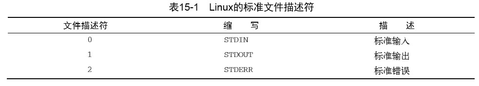

# 《Linux命令行》学习笔记（十三）

## 第15章 呈现数据

> 本章内容：
>
> - 再探重定向
> - 标准输入和输出
> - 报告错误
> - 丢弃数据
> - 创建日志文件

本章主要讲解如何将降本的输出重定向到 Linux 系统的不同位置。

### 15.1 理解输入和输出

两种输出方式：

- 在显示器屏幕上显示
- 将输出重定向到文件中

这两种都会将所有数据全部显示，然而有时候我们可以通过一些特定的命令来达到显示部分数据，存储部分数据的目的。

#### 15.1.1 标准文件描述符

> Linux用文件描述符（file descriptor）来标识每个文件对象。文件描述符是一个非负整数，可以唯一标识会话中打开 的文件。每个进程一次多可以有九个文件描述符。出于特殊目的，bash shell保留了前三个文 件描述符（0、1和2）
>
> 

**1. STDIN**

对于 shell 来说，STDIN 代表着从对应的键盘获得输入，在用户输入时处理每个字符。

如果使用重定向符号（<），Linux 会用重定向指向的文件来替换标准输入文件描述符。

**2. STDOUT**

该文件描述符代表 shell 的标准输出。对于多数 shell 来说也就是终端显示器，shell 的所有输出都会被定向到标准输出中，除非使用了输出重定向符号（>）来改变。

> 当命令生成错误消息时，shell并未将错误消息重定向到输出重定向文件。shell创建了输出重 定向文件，但错误消息却显示在了显示器屏幕上。
>
> shell对于错误消息的处理是跟普通输出分开的。如果你创建了在后台模式下运行的shell脚本，通常你必须依赖发送到日志文件的输出消息。用这种方法的话，如果出现了错误信息，这些信息是不会出现在日志文件中的。你需要换种方法来处理。 

**3. STDERR**

该描述符代表 shell 的标准错误输出。默认情况下，STDERR 会和 STDOUT 一样指向同样的地方，也就是显示器输出。如果想改变这种行为，就要人为的重定向错误。

#### 15.1.2 重定向错误

实现重定向错误有几种办法：

- 只重定向错误。将代表错误的文件描述符值 2 放在重定向符号前。

  ```shell
  ls -al notExit 2> test4
  ```

  这样的重定向正常的输出依然会发送到屏幕，但错误就会发送到指定的重定向文件中。

- 重定向错误和数据，使用两个重定向符号，将普通的输出 1 重定向到一个文件，错误的输出 2 重定向到另一个文件。

  ```shell
  ls -al notExit 2> test 1> test1
  ```

  这样就可以将脚本正常的输出和错误消息分离开了。

- 此外，还可以使用`&>`这个 bash shell 提供的特殊重定向符，类似于语法糖，可以将包括错误输出的所有输出消息重定向到一个文件里。在这个文件中，会先列出错误消息，然后再列出普通消息，方便集中浏览 debug。

  ```shell
  ls -al notExit notExit1 notExit3 &> test
  ```

### 15.2 在脚本中重定向输出


> 本次阅读至P315 330