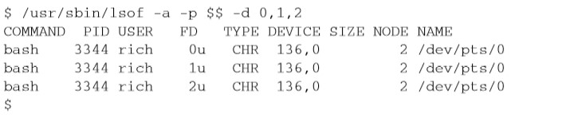

# 《Linux命令行》学习笔记（十三）

## 第15章 呈现数据

> 本章内容：
>
> - 再探重定向
> - 标准输入和输出
> - 报告错误
> - 丢弃数据
> - 创建日志文件

本章主要讲解如何将降本的输出重定向到 Linux 系统的不同位置。

### 15.1 理解输入和输出

两种输出方式：

- 在显示器屏幕上显示
- 将输出重定向到文件中

这两种都会将所有数据全部显示，然而有时候我们可以通过一些特定的命令来达到显示部分数据，存储部分数据的目的。

#### 15.1.1 标准文件描述符

> Linux用文件描述符（file descriptor）来标识每个文件对象。文件描述符是一个非负整数，可以唯一标识会话中打开 的文件。每个进程一次多可以有九个文件描述符。出于特殊目的，bash shell保留了前三个文 件描述符（0、1和2）
>
> 

**1. STDIN**

对于 shell 来说，STDIN 代表着从对应的键盘获得输入，在用户输入时处理每个字符。

如果使用重定向符号（<），Linux 会用重定向指向的文件来替换标准输入文件描述符。

**2. STDOUT**

该文件描述符代表 shell 的标准输出。对于多数 shell 来说也就是终端显示器，shell 的所有输出都会被定向到标准输出中，除非使用了输出重定向符号（>）来改变。

> 当命令生成错误消息时，shell并未将错误消息重定向到输出重定向文件。shell创建了输出重 定向文件，但错误消息却显示在了显示器屏幕上。
>
> shell对于错误消息的处理是跟普通输出分开的。如果你创建了在后台模式下运行的shell脚本，通常你必须依赖发送到日志文件的输出消息。用这种方法的话，如果出现了错误信息，这些信息是不会出现在日志文件中的。你需要换种方法来处理。 

**3. STDERR**

该描述符代表 shell 的标准错误输出。默认情况下，STDERR 会和 STDOUT 一样指向同样的地方，也就是显示器输出。如果想改变这种行为，就要人为的重定向错误。

#### 15.1.2 重定向错误

实现重定向错误有几种办法：

- 只重定向错误。将代表错误的文件描述符值 2 放在重定向符号前。

  ```shell
  ls -al notExit 2> test4
  ```

  这样的重定向正常的输出依然会发送到屏幕，但错误就会发送到指定的重定向文件中。

- 重定向错误和数据，使用两个重定向符号，将普通的输出 1 重定向到一个文件，错误的输出 2 重定向到另一个文件。

  ```shell
  ls -al notExit 2> test 1> test1
  ```

  这样就可以将脚本正常的输出和错误消息分离开了。

- 此外，还可以使用`&>`这个 bash shell 提供的特殊重定向符，类似于语法糖，可以将包括错误输出的所有输出消息重定向到一个文件里。在这个文件中，会先列出错误消息，然后再列出普通消息，方便集中浏览 debug。

  ```shell
  ls -al notExit notExit1 notExit3 &> test
  ```

### 15.2 在脚本中重定向输出

#### 15.2.1 临时重定向

可以将有意生成的错误消息单独重定向输出到`STDERR`。**当重定向输出到文件描述符时，你必须在文件描述符数字之前加一个&，且后面接数字不能带空格**

```shell
echo "This is an error message" >&2
```

由于默认情况下`STDOUT`和`STDOUT`的指向是一样的，所以正常运行脚本时可能会看不出区别，但是当用户以`./test.sh 2> errlogFile`这种形式进行重定向时，就能够感觉到错误的输出被转移了。

#### 15.2.2 永久重定向

如果有大量数据需要定向又不想每次都使用`echo`命令重定向，你可以用`exec`命令告诉 shell 在脚本执行期间重定向某个特定的文件描述符。

```shell
#!/bin/bash
exec 1>testout
exec 2>testerr
```

如上，接下来该脚本所有的正常输出都会被重定向到文件，错误输出则被重定向到另一文件。

**但要注意的是，一旦重定向了文件，就很难再回到原来的位置**。

### 15.4 在脚本中重定向输入

与重定向输出和错误一样，`exec`命令允许将 STDIN 也重定向到 Linux 系统的文件上，这样只要在脚本需要输入时（比如`read`命令），脚本就会自动到文件中读取数据，而不是请求键盘。

```shell
#!/bin/bash
exec 0< testfile
while read line
do
	echo "input：$line"
done
```

> Linux系统管理员的一项日常任务就是从日志文件中读取数据并处理。这是完成该任务最简单的办法

### 15.4 创建自己的重定向

在 shell 中最多可以有 9 个文件描述符，除了 0、1、2，其他的数字（3~8）均可作为输入或输出重定向。

#### 15.4.1 创建输出文件描述符

```shell
exec 3> testout
echo "正常输出"
echo "重定向输出到文件描述符3" >&3
```

使用这种方式可以将输出分割。

当然也可以使用`exec 3>> testout`的方式将输出追加到现有文件中而不是重新创建。

#### 15.4.2 重定向文件描述符

（PS：重定向的概念其实就是一个指针，指向文件系统的一个具体地方。）

在永久重定向之前，如果需要在某个地方恢复之前的文件描述符，就可以使用其他的文件描述符将之前的值暂存，再进行重定向。

```shell
#!/bin/bash
# 利用文件描述符 3 先将 1 指向的值存储起来
exec 3>&1
# 然后改变指针 1 的指向
exec 1> testout
echo "你的小可爱被永久重定向到了文件"
echo 1>&3
echo "你的小可爱又被重定向到了屏幕"
```

在脚本中，这是一种在脚本中临时重定向输出，然后恢复默认输出设置的常用方法。

#### 15.4.3 创建输入文件描述符

可以像永久重定向输出那样重定向输入，用于在读取文件后再将`STDIN`恢复到其原来的位置。

```shell
#!/bin/bash
exec 6<&0
exec 0< testfile
while read line
do
  echo $line
done
exec 0<&6
read -p "hi:" hi
echo $hi
```

#### 15.4.4 创建读写文件描述符

你还可以使用同一个文件描述符来对同一个文件进行读写。（PS：为啥要这么用...）

不过在这种情况下，shell 会维护一个内部指针，任何读或写都会从文件指针上次的位置开始。

```shell
#!/bin/bash
# 以 testfile 同时作为输入和输出
exec 3<> testfile
read line <&3
echo $line
echo "输出Line" >&3
```

上面的代码虽然能够输出文本原来的第一行内容，但是也会在输出的同时覆盖掉文件的所有数据。

> read命令读取了第一行数据，所以它使得文件指针指向了第二行数据的第一个字符。在 echo 语句将数据输出到文件时， 它会将数据放在文件指针的当前位置，覆盖了该位置的已有数据。 

#### 15.4.5 关闭文件描述符

使用`&-`可以关闭文件描述符。

```shell
exec 3>&-
```

上面的命令关闭了文件描述符 3。

一旦关闭了文件描述符，就不能在脚本中向它写入任何数据，否则shell会生成错误消息。 

> 在关闭文件描述符时还要注意另一件事。如果随后你在脚本中打开了同一个输出文件，shell 会用一个新文件来替换已有文件。这意味着如果你输出数据，它就会覆盖已有文件。

### 15.5 列出打开的文件描述符

`lsof`命令会列出 Linux 系统打开的所有文件描述符。但由于这是一个危险度较高的命令（它会向非系统管理员用户提供Linux系统的信息），所以 Linux 系统在默认下会隐藏该命令，`lsof`命令位于 /usr/sbin 目录，如果想要一普通用户来执行，必须通过全路径名 /usr/sbin/lsof 来引用。

该命令会产生大量的输出，会显示当前 Linux 系统上打开的每个文件的有关信息。

`lsof`命令参数最常用的有`-p`和`-d`，前者允许指定进程，后者允许指定要显示的文件描述符编号。

想要知道进程当前 PID，可以使用特殊环境变量`$$`，这是当前的 PID。`-a`选项用来对其他两个选项的结果执行 AND 运算。



上述命令指定了当前进程底下，0、1、2 文件描述符下的进程

FD 列即代表文件描述符及其访问类型（r 代表读、w 代表写、u 代表读写）。

TYPE 列代表文件类型：

- CHR 代表字符型
- BLK 代表块型
- DIR 代表目录
- REG 代表常规文件

### 15.6 阻止命令输出

在 Linux 系统上有一个文件称为 /dev/null。你重定向到该位置的任何数据都会被丢掉，不会显示。

为了避免出现错误消息，你可以选择将 STDERR 输出到该位置。

也可以在输入重定向中将 /dev/null 作为输入文件。由于 /dev/null 文件不含有任何内容，所以可以用来快速清除文件中的数据而不用删除文件再重新创建。

```shell
cat /dev/null > testfile
```

### 15.7 创建临时文件

Linux 使用`/tmp`目录来存放不需要永久保留的文件。多数 Linux 发行版在系统启动时都会自动删除`/tmp`目录下的所有文件。

同时还有一个特殊命令`mktemp`可以在目录中创建一个唯一的临时文件，该命令会将文件的读和写权限分配给文件的属主，除了 root 用户以外其他用户无法访问。

#### 15.7.1 创建本地临时文件

默认情况下，`mktemp`会在本地目录中创建一个文件。你可以指定一个文件模板名，通过在文件名末尾加上 6 个 X，可以保证文件名在目录中是唯一的。

```shell
mktemp testing.XXXXXX
# test.c0fegr
mktemp testing.XXXXXX
# test.QIRcHH
```

如上，两次创建的文件是不同的。

```shell
#!/bin/bash
tempfile=$(mktemp test.XXXXXX)
exec 3>$tempfile

echo "先将创建的临时文件保存到一个文件描述符中" >&3
echo "然后将输出的内容重定向到该文件" >&3
echo "最后输出该文件的内容后，删除该文件" >&3
# 关闭该文件描述符
exec 3>&-
# 输出
cat $tempfile
rm -f $tempfile 2> /dev/null
```

#### 15.7.2 在 /tmp 目录创建临时文件

`-t`选项会强制`mktemp`命令在 /tmp 目录中创建该文件。使用该特性时，`mktemp`命令会返回临时文件的全路径，而并非像上面一样只有文件名。

```shell
mktemp -t test.XXXXXX
# /tmp/test.zCfAxD
```

#### 15.7.3 创建临时目录

`-d`选项告诉`mktemp`命令创建一个临时目录，这样就可以用该目录进行任何需要的操作，比如创建其他的临时文件。

```shell
#!/bin/bash
tempdir=$(mktemp -d dir.XXXXXX)
cd $tempdir
tempfile1=$(mktemp temp.XXXXXX)
tempfile2=$(mktemp temp.XXXXXX)
exec 7> $tempfile1
exec 8> $tempfile2

echo "line of data for $tempfile1" >&7
echo "line of data for $tempfile2" >&8
```

比如上面这段代码就会创建一个目录并创建两个临时文件用来存储脚本的输出。

### 15.8 记录消息

`tee`命令可以将输出同时发送到显示器和日志文件，运用这个命令就可以不用输出重定向两次。

`tee`命令相当于一个 T 型接头（？？？这么形象的吗），将 STDIN 过来的数据同时发往两处。

```shell
tee filename
```

这样写就会将输出一边发送到 STDOUT，一边发送到指定的文件。

```shell
# 管道示例
who | tee testfile
# 如果想将数据追加到文件中，必须用 -a 选项
date | tee -a testfile
```

这样就可以在为用户显示输出的同时再永久保存一份输出内容了。

### 15.9 实例

```shell
#!/bin/bash
outfile='members.sql'
IFS=','
while read lname fname address city state zip
do
	# 这条语句包含一个输出追加重定向（双大于号）和一个输入追加重定向（双小于号）。
	# 其中输出重定向将 cat 命令的输出追加到 $outfile 变量指定的文件中
	# 输出重定向将 cat 命令的输入定向到待读取的文件（即 $1），会用 read 命令逐行读取
	cat >>$outfile <<EOF
	INSERT INTO members (lname, fname, address, city, state, zip) VALUES
	('$lname', '$fname', '$address', '$city', '$state', '$zip');
	EOF
# ${1} 代表第一个命令行参数，指明了待读取的数据文件，数据文件的内容为 lname,fname,address,city,state,zip 
# 列之间以逗号间隔，行之间以换行符间隔
done < ${1}	
```

上面的脚本可以把数据库数据放入电子表格中，把电子表格保存成 csv 格式。然后创建 INSERT 语句将这些语句插入到文件中。

执行完该脚本之后，就可以看到 members.sql 文件中已经有一条条的插入语句了。