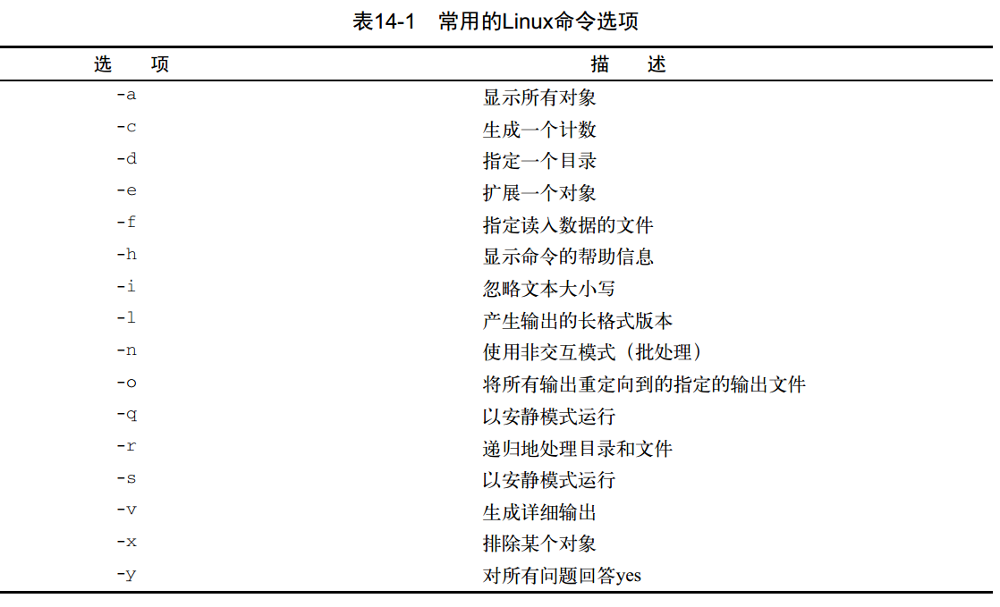

# 《Linux命令行》学习笔记（十二）

## 第14章 处理用户输入

本章将会讨论如何在你的bash shell脚本运用这些方法来从脚本用户处获得数据。

>  本章内容：
>
> - 传递参数
> - 跟踪参数
> - 移动变量
> - 处理选项
> - 将选项标准化
> - 获得用户输入

### 14.1 命令行参数

向 shell 脚本传递数据的最基本方法是使用命令行参数，如`./myshell.sh 10 30`这样。

#### 14.1.1 读取参数

bash shell 会将一些称为`位置参数`的特殊变量分配给输入到命令行中的参数。

未知参数变量是标准的数字：`$0`是程序名，`$1`是第一个参数，`$2`是第二个，以此类推到第九个`$9`。

```shell
#!/bin/bash
# 阶乘
factorial=1
for (( number = 1; number <= $1; number++ ))
do
	factorial=$[ $factorial * $number ]
done
echo "阶乘的值为$factorial"
```

如果需要输入更多的命令行参数，则每个参数之间需要用空格分开。而如果要在参数值中包含空格，必须要用引号（单引号双引号都可）。

而如果脚本需要的参数不止九个，你就需要稍微修改一下变量名，从第 10 个变量之后，就必须在变量数字周围加上花括号，如`${10}`这样来使用。

#### 14.1.2 读取脚本名

使用`$0`可以获取 shell 在命令行启动时的脚本名。

```shell
#!/bin/bash
echo "zero parameter is: $0"
```

这样当你使用`sh test.sh`来执行的话，就会输出`zero parameter is: test.sh`。

但上面的实际变量并不仅仅是脚本名，而是完整的脚本路径，如果在执行脚本时使用了相对路径或绝对路径，就会连路径本身也一起输出来。如执行`bash /home/xxx/test.sh`得到的输出就会是`zero parameter is: /home/xxx/test.sh`。

果你要编写一个根据脚本名来执行不同功能的脚本，就得做点额外工作。你得把脚本的运行路径给剥离掉，使用`basename`命令可以帮助我们返回不包含路径的脚本名。

```shell
#!bin/bash
name=$(bashname $0)
echo "script name is $name"
```

这样就可以根据脚本的名字来让控制代码的流程代码了。

#### 14.1.3 测试参数

> 当脚本认为参数变量中会有数据而实际上并没有时，脚本很有可能会产生错误消息。这种写 脚本的方法并不可取。在使用参数前一定要检查其中是否存在数据。    

```shell
#!/bin/bash
# 使用字符串命令检测中的 -n 选项，可以检测输入字符串是否为非0
if [ -n "$1" ]
then
	echo Hello $1
else
	echo "不存在"
fi
```

### 14.2 特殊参数变量

#### 14.2.1 参数统计

> 你可以统计一下命令行中输入了多少个参数，无需测试每个参数。 bash shell为此提供了一个 特殊变量。 
>
> 特殊变量`$#`含有脚本运行时携带的命令行参数的个数数量。可以在脚本中任何地方使用这个特殊变量，就跟普通变量一样。

```shell
#!/bin/bash
if [ $# -ne 2 ]
then
	# 参数数量不为 2
	echo "参数数量不为 2"
else
	echo "参数1：$1 参数2：$2"
fi
```

此外，你还可以使用`${!#}`来代表最后一个命令行参数变量。

#### 14.2.2 抓取并遍历所有数据

接下来还是两个特殊变量：`$*`和`$@`。

这两个变量都代表着所有的输入数据，不同的是`$*`会将所有输入的词当成一个单词，而`$@`则会默认进行空格分词。这也就意味着如果想用`for`循环来遍历输入，只能使用会分词的`$@`变量，下面是例子。

```shell
#!/bin/bash
for param in "$*"
do
	echo "$param"
done

for params in "$@"
do
	echo "$params"
done
```

执行上面的代码。

```shell
./test.sh ddd lsls wiwiw

# ddd lsls wiwiw
# ddd
# lsls
# wiwiw
```

### 14.3 移动变量

使用`shift`命令会默认将每个参数变量向左移动一个位置，使用后，$2 变量的值会移动到 $1 中。

这是遍历命令行参数的另一个好方法，尤其是在你不知道到底有多少参数时。你可以只操作 第一个参数，移动参数，然后继续操作第一个参数。

```shell
#!/bin/bash
while [ -n "$1" ]
do
	echo "参数为： $1"
	shift
done
```

> 使用shift命令的时候要小心。如果某个参数被移出，它的值就被丢弃了，无法再恢复。

此外也可以通过给`shift n`的方式给一个参数来指明要移动的位数。

### 14.4 处理选项

利用上面所学知识，配合使用就可以写出一套能检测到参数并做出正确处理的代码。

`./testing.sh -a test1 -b -c -d test2    `

```shell
#!/bin/bash
while [ -n "$1" ]
do
	case "$1" in
		-a) echo "识别 -a 参数并获取后面的值";;
		-b) param="$2"
			  echo "检测到 -b 选项"
			  shift;;
		-c) echo "检测到 -c 选项";;
		--) echo "检测到 -- 选项，该项之后的参数不会被识别为功能选项而会识别为值"
			  shift
			  break;;
		*)  echo "$1 不是一个选项";;
	esac
	shift
done

for param in "$@"
do
	echo "选项值为：$param"
done
```

用这些基本的特性，整个过程就能正常工作，不管按什么顺序放置选项。

#### 14.4.2 使用 getopt 命令

上面的脚本已经有了处理命令行的基本功能，但还无法实现一些常用的高级功能，比如说合并选项，当用户输入`test.sh -ab`，应该既有 -a 的功能也有 -b 的功能。

所以我们要使用`getopt`命令，它能识别命令行参数，从而在脚本中解析它们时更方便。

**1. 命令的格式**

`getopt`命令能够识别命令行参数，从而在脚本中解析它们时更加方便。

命令格式为：`getopt optstring parameters`

其中，`optstring`定义了命令行有效的选项字母和哪些选项字母需要参数值。

`getopt`命令会基于你定义的`optstring`来解析提供的参数。

```shell
getopt ab:cd -a -b test1 -cd test2 test3
# -a -b test1 -c -d -- test2 test3
```

上面的`optstring`为 ab:cd 这几个字符，这几个字符定义了四个有效的选项字母：

- `a`
- `b:`后面跟了一个冒号代表 b 选项需要一个参数值
- `c`
- `d`

然后`getopt`命令会检查提供的参数列表：-a -b test1 -cd test2 test3

命令会自动将 -cd 选项分成两个单独的选项，并插入 -- 来分隔行中的额外参数。

如果指定了不在`optstring`中的选项，`getopt`命令就会报错。可以使用`-q`来忽略这一类报错

```shell
getopt a:b -a ll -b -c
# getopt: unknown option -- c
# -a ll -b --
getopt -q a:b -a ll -b -c
# -a 'll' -b --
```

**2. 在脚本中使用 getopt**

使用`set`命令的双破折线（--）选项，会将命令行参数替换成`set`命令的命令行值，使用该命令配合`getopt`命令，就可以替换命令行的参数输入。

```shell
!/bin/bash
set -- $(getopt -q a:bcd "$@")
while [ -n "$1" ]
do
	case "$1" in
		-a) echo "识别 -a 参数并获取后面的值";;
		-b) param="$2"
			  echo "检测到 -b 选项"
			  shift;;
		-c) echo "检测到 -c 选项";;
		--) echo "检测到 -- 选项，该项之后的参数不会被识别为功能选项而会识别为值"
			  shift
			  break;;
		*)  echo "$1 不是一个选项";;
	esac
	shift
done

for param in "$@"
do
	echo "选项值为：$param"
done
```

这段代码跟上一节的很相似，只是加入了`getopt`命令来帮助格式化命令行的参数。

> **PS**:
>
> getopt 命令有一个更高级的版本叫作 getopts（注意这是复数形式）。 getopts 命令会在 本章随后部分讲到。因为这两个命令的拼写几乎一模一样，所以很容易搞混。一定要小 心！    

#### 14.4.3 使用更高级的 getopts

`getopt`命令并不擅长处理带空格和引号的参数值。它会将空格当作参数分隔符，而不是根据双引号将二者当作一个参数。

比如下面的这种调用方法，`getopt`就无法识别

```shell
getopt ab:cd -a -b test1 -cd "test2 test3" test4

# -a -b test1 -c -d -- test2 test3 test4
```

上面的命令中，getopt 就无法将 "test2 test3" 视为一个参数去识别。

为了解决这个问题，我们可以引入內建于 bash shell 中的命令`getopts`。

与 getopt 不同，前者将命令行上选项和参数处理后只生成一个输出，而 getopts 命令能够和已有的 shell 参数变量配合默契。

每次调用它时，它一次只处理命令行上检测到的一个参数。处理完所有的参数后，它会退出 并返回一个大于 0 的退出状态码。这让它非常适合用解析命令行所有参数的循环中。

命令格式如下：

```shell
getopts optstring variable
```

`optstring`类似于`getopt`中的参数。有一点不同的是如果要去掉错误消息的时候，可以在`optstring`之前加一个冒号，如下：

```shell
# 这个例子代表有 -a -b -c 三个参数，其中 b 有实参，忽略错误信息
getopts :ab:c opt
```

`getopts`命令会用到两个环境变量。如果选项需要跟一个参数值， `OPTARG`环境变量就会保存这个值。 `OPTIND`环境变量保存了参数列表中`getopts`正在处理的参数位置。这样你就能在处理完选项之后继续处理其他命令行参数了    

```shell
#!/bin/bash
while getopts :ab:c opt
do
	case "$opt" in
		a) echo "-a option";;
		b) echo "-b option, with value $OPTARG";;
		c) echo "-c option";;
		*) echo "其它参数：$opt";;
	esac
done
```

while 语句定义了 getopts 命令，指明了要查找哪些命令行选项，以及每次迭代中存储它们的变量名（opt）

注意在本例中 case 语句的用法有些不同。 getopts 命令解析命令行选项时会移除开头的单破折线，所以在 case 定义中不用单破折线。

`getopts`命令可以在参数值中包含空格，还可以将选项字母和参数值放在一起使用而不用加空格。除此之外，`getopts`还能够将命令行上的`optstring`中所有未定义到的选项统一输出成问号。

`getopts`命令知道何时停止处理选项，并将参数留给你处理。在`getopts`处理每个选项时， 它会将`OPTIND`环境变量值增一。在`getopts`完成处理时，你可以使用`shift`和`OPTIND`值来移动参数。

```shell
#!/bin/bash
while getopts :ab:cd opt
do
	case "$opt" in
	a) echo "-a Option";;
	b) echo "-b Option, value $OPTARG";;
	c) echo "-c Option";;
	d) echo "-d Option";;
	*) echo "other Option: $opt";;
	esac
done
# 移动参数
shift $[ $OPTIND - 1 ]
# 输出剩余参数
for param in "$@"
do
	echo "选项值为：$param"
done
```

上面就是一个针对输入参数较为完整的解决方案。

### 14.5 将选项标准化

> 有些字母选项在Linux世界里已经拥有了某种程度的标准含义。如果你能在shell脚本中支 持这些选项，脚本看起来能更友好一些。这样用户在使用你的脚本时就不用去查手册了。



### 14.6 获得用户的输入

有时脚本的交互性需要更强，为了能够在脚本运行时动态输入，bash shell 提供了`read`命令。

#### 14.6.1 基本的读取

```shell
!/bin/bash
echo -n "输入："
read name
echo "hello $name"
```

上面的`echo`命令使用了`-n`选项，允许脚本用户紧跟其后输入数据而不是下一行，让脚本看起来更像表单。

`read`命令还包含了`-p`选项，允许直接指定提示符。

```shell
#!/bin/bash
read -p "输入：" name
echo "hello $name"
```

`read`命令会将提示符后输入的所有数据分配给单个变量。输入的每个数据值都会分配给变量列表中的下一个变量。如果变量的数量不够，则剩下的数据就全部分配给最后一个变量。

当然，你也可以不指定变量，这样的话就只能通过特殊环境变量`REPLY`来使用输入的值，该环境变量会保存输入的所有数据。

```shell
#!/bin/bash
read -p "输入：" name
echo "hello $REPLY"
```

#### 14.6.2 超时

`read`命令的`-t`选项可以用来指定一个计时器，该选项指定了命令等待输入的秒数。当计时器过时后，`read`命令会返回一个非零退出状态码。

```shell
#!/bin/bash
if read -t 5 -p "输入名字：" name
then
	echo "Hi,$name"
else
	echo "超时辣"
fi
```

此外，也可以不对输入过程计时，而是使用`-n`参数来统计输入的字符数，只要按下相应数量的字符，`read`命令就会自动结束并将数据赋予变量。

```shell
#!/bin/bash
# 仅允许输入一个字符 -n1
read -n1 -p "请选择是否继续 [Y/N]? " answer
case $answer in
Y | y) echo
       echo "继续进行...";;
N | n) echo "再见"
       exit;;
esac
```

上面的例子中，无需按下回车键，只要输入一个字符，`read`命令就会自动进行下一步的判断。

#### 14.6.3 隐藏方式读取

有时一些保密的输入内容脚本不想让其显示在屏幕上，此时可以使用`-s`选项（实际上，数据会被显示，只是 read 命令会将文本颜色设成跟背景色一样）

```shell
#!/bin/bash
read -s -p "请输入密码：" password
```

#### 14.6.1 从文件中读取

通过`read`命令还可以用于读取文件。最常见的处理方法是**通过`cat`命令获取文件，将结果通过管道直接传给含有`read`命令的`while`命令**，这样的`read`命令每次都会从文件中读取一行文本。而当文件中没有内容时，命令就会退出并返回非零状态码。

```shell
#!/bin/bash
count=1
cat test | while read line
do
  echo "第$count行：$line"
  count=$[ $count + 1 ]
done
echo "文件读取完毕"
```

