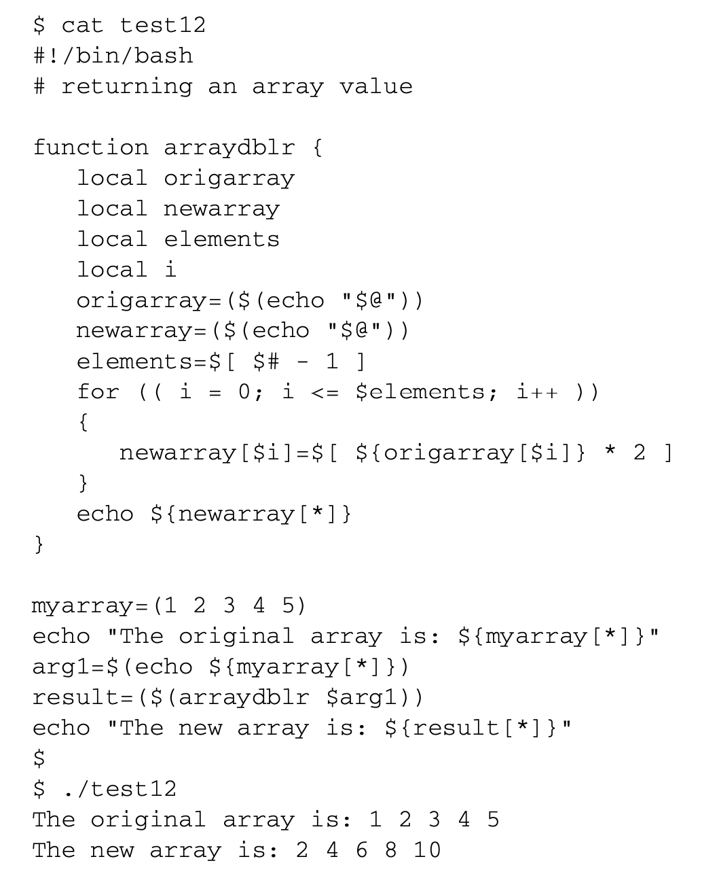

# 《Linux命令行》学习笔记（十五）

---

第三部分 高级 shell 脚本编程

---

## 第17章 创建函数

> 本章内容：
>
> - 基本的脚本函数
> - 返回值
> - 在函数中使用变量
> - 数组变量和函数
> - 函数递归
> - 创建库
> - 在命令行上使用函数

本章将会带你逐步了解如何创建自己的 shell 脚本函数，并演示如何使用他们。

### 17.1 基本的脚本函数

#### 17.1.1 创建函数

有**两种格式**可以用来在 bash shell 中创建函数。

```shell
# 方式1，使用关键字 function
function name {
	# commands
}
# 方式2，使用空括号定义
name() {
	# commands
}
```

#### 17.1.2 使用函数

只需要像其他 shell 命令一样在行中指定函数名就可以使用函数。

```shell
function func1 {
	echo "函数1"
}
count=1
while [ $count -le 5 ]
do
	# 调用函数
	func1
	count=$[ $count + 1 ]
done
echo "结束"
```

> **一定要小心，如果在函数被定义前使用函数，你会收到一条错误消息**。
>
> 此外，你也必须注意函数名。记住，函数名必须是唯一的，否则也会有问题。如果你重定义了函数， 新定义会覆盖原来函数的定义，这一切不会产生任何错误消息。

### 17.2 返回值

bash shell 会把函数当成一个小型脚本，运行结束时会返回一个退出状态吗。

#### 17.2.1 默认退出状态码

默认情况下，**函数的退出状态码事函数种最后一条命令返回的退出状态码，在函数结束后，可以用标准变量`$?`来确定函数的退出状态码**。

```shell
#!/bin/bash
func1 () {
	ls -alF 不存在的文件
	echo "hi"
}

func2 () {
	echo "hi"
	ls -alF 不存在的文件	
}

func1
echo $?
func2
echo $?
```

执行上述脚本，可以发现函数 func1 返回的状态码是 0，而 func1 的返回状态码是 1，这意味着默认情况下，你只能知道函数中最后一条命令的执行状况而无法知道函数中其他命令是否成功运行。

#### 17.2.2 使用 return 命令

`return`命令可以用来退出函数并返回特定的退出状态码。

```shell
function dbl {
	read -p "请输入一个需要被 dobule 的值：" value
	return $[ $value * 2 ]
}
dbl
echo "dobule 后的值为：$?"
```

当用这种方法从函数中返回值时，要注意两个问题：

- 必须在函数一结束就调用`$?`取返回值，如果在用`$?`变量提取函数返回值之前执行了其他命令，函数的返回值就会丢失
- 退出状态码必须是 0 ～255，如果大于这个值，就会产生错误，从而使`$?`的值变为 1
- 此外，要返回较大的整数值或者字符串值的话，你就不能用这种返回值的方法了。

#### 17.2.3 使用函数输出

可以使用`$()`这种方式来获得任何类型的函数输出，并将其保存到变量中。

```shell
#!/bin/bash
function dbl {
	read -p "输入一个值：" value
	echo $[ $value * 2 ]
}
result=$(dbl)
echo "dobule 的值为 $result"
```

新函数会用 echo 语句来显示计算的结果。该脚本会获取dbl函数的输出，而不是查看退出状态码。

> 这个例子中演示了一个不易察觉的技巧。你会注意到dbl 函数实际上输出了两条消息。read 命令输出了一条简短的消息来向用户询问输入值。bash shell脚本非常聪明，并不将其作为STDOUT 输出的一部分，并且忽略掉它。
>
> **如果你用echo语句生成这条消息来向用户查询，那么它会与输出值一起被读进shell变量中**。

### 17.3 在函数中使用变量

在函数中使用变量时，你需要注意它们的定义方式以及处理方式。

#### 17.3.1 向函数传递参数

**bash shell 会将函数当作小型脚本来对待，这意味着你可以像普通脚本那样向函数传递参数**。

```shell
# 下面的命令向 func1 函数传递了三个参数 1 2 变量value1的值
func1 1 2 $value1
```

然后函数就可以用参数环境变量，如`$#`、`$*`、`$*`、`$1`、`$2`等等来，来获得参数值了

同时由于函数使用特殊参数环境变量作为自己的参数值，因此它无法直接获取脚本在命令行中的参数值，如果要在函数中使用，则必须在调用函数时手动将其传过去。

#### 17.3.2 在函数中处理变量

shell 中的变量有两种：

- 全局变量
- 局部变量

默认情况下，你在脚本中定义的任何变量都是全局变量。在函数外定义的变量可在函数内正常访问。（PS：有点像 javascript 中不使用关键词而定义的变量，会溢出到当前作用域外）

> 但这其实很危险，尤其是如果你想在不同的 shell 脚本中使用函数的话。它要求你清清楚楚地知道函数中具体使用了哪些变量，包括那些用来计算非返回值的变量

所以我们可以使用`local`关键字来定义一个局部变量。

```shell
local temp
```

该关键字保证了变量只局限于在该函数中。这样你就能很轻松的将函数变量和脚本变量隔离开，只共享需要共享的变量。

```shell
#!/bin/bash
func1() {
	local temp=$[ $value + 5 ]
	result=$[ $temp * 2 ]
}

temp=4
value=6
func1
echo "the result is: $result"
echo "temp is: $temp"
```

如上，函数内的 temp 局部变量赋值，并不会影响到全局的变量。

### 17.4 数组的变量和函数

在函数中使用数组变量值有点麻烦，而且还需要一些特殊考虑。本节将会介绍一种方法来解决这个问题。

#### 17.4.1 向函数传递数组参数

要向函数传递数组参数，必须将数组变量的值分解成单个的值，然后将这些值作为函数参数使用。在函数内部，可以将所有的参数重新组合成一个新的变量。

```shell
#!/bin/bash
function addarray {
	local sum=0
	local newarray
	# 将所有的参数重新组合成一个新的变量
	newarray=($(echo "$@"))
	for value in ${newarray[*]}
	do
		sum=$[ $sum + $value ]
	done
	echo $sum
}
myarray=(1 2 3 4 5)
# 将数组变量的值分解成单个的值
arg1=$(echo ${myarray[*]})
# 将这些值作为函数参数使用
result=$(addarray $arg1)
echo "结果：$result"
```

> 要注意，如果将数组变量当作单个参数传递的话，并不会起作用。函数只会取数组变量的第一个值。
>
> ```shell
> myarray(1 2 3 4 5)
> test myarry
> ```

#### 17.4.2 从函数返回数组

从函数里向shell脚本传回数组变量也用类似的方法。函数用 echo 语句来按正确顺序输出单个数组值，然后脚本再将它们重新放进一个新的数组变量中。



### 17.5 函数递归

```shell
#!/bin/bash
# 计算阶乘
function factorial {
	if [ $1 -eq 1 ]
	then
		echo 1
	else
		local temp=$[ $1 - 1 ]
		# 调用自身
		local result=$(factorial $temp)
		echo $[ $result * $1 ]
	fi
}
read -p "输入需要阶乘计算的值：" value
result=$(factorial $value)
echo "阶乘结果为：$result"
```

### 17.6 创建库

bash shell允许创建函数库文件，然后在多个脚本中引用该库文件。

需要经过以下步骤：

1. 创建一个包含脚本中所需函数的公用库文件

2. 使用`source`命令来让 shell 基于当前上下文中执行命令，而不是创建一个新的 shell。source命令有个快捷的别名，称作点操作符(dot operator)。要运行库文件，可以这样写：

   ```shell
   . ./myfuncs
   ```

   这个例子假定myfuncs库文件和shell脚本位于同一目录。如果不是，你需要使用相应路径访问该文件

3. 经过上一步后，公共库中的函数就已经导入进当前 shell 作用域中了，可以在接下来的代码中使用公共库中的函数。

**PS**：个人感想，与其说这种半残废的引入方式是库文件，倒不如说是 mixin 比较合适...

### 17.7 在命令行上使用函数

> 一旦在shell中定义了函数，你就可以在整个系统中使用它了，无需担心脚本是不是在 PATH 环境变量里。重点在于让shell能够识别这些函数。

你可以在终端中直接定义函数，随后就可以将这些函数当成全局命令一样来使用。

也可以将定义好的函数放在一个文件里，在`.bashrc`文件中进行 source 操作，这样就不用每次单独定义，这些函数也能在 shell 脚本中运行。