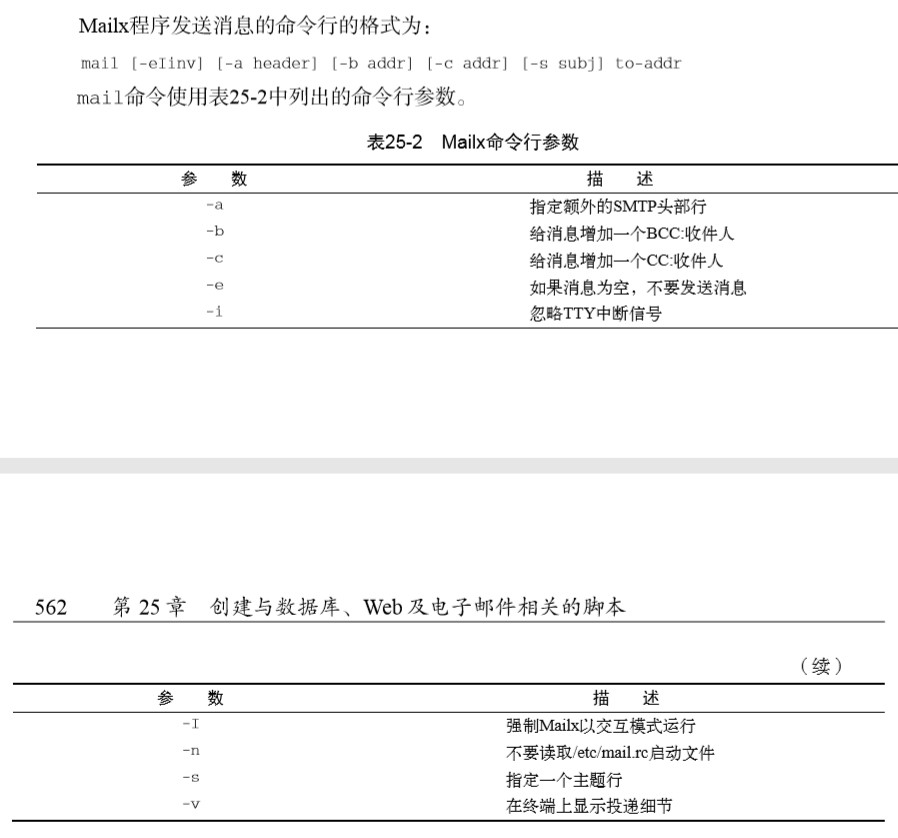

# 《Linux命令行》学习笔记（十八）

**PS：**22 章为 gawk 命令的进阶，使用不多，略过。

## 第23章 使用其他 shell

本章介绍除了 bash shell 外的其他 shell，以及介绍他们的区别。

### 23.1 dash shell

dash shell 是最简单的早期 shell —— ash 的早期优化版本，Ubuntu Linux 更是夹带私货将 sh 命令链接到了 dash 上。

与 bash shell 相比，它不具备以下性能：

- 算术运算
- test 命令
- function 命令

### 23.4 zsh shell

zsh 汲取了所有现在 shell 的设计理念并保留了扩展空间，为程序员创造了一个无所不能的高级 shell。

**PS**：缺点是配置比较繁琐，推荐使用 oh my zsh 自动安装工具来进行自动安装和配置。

---

第四部分 创建实用的脚本

---

## 第24章 编写简单的脚本实用工具

> 本章内容：
>
> - 自动备份
> - 管理用户账户
> - 监测磁盘空间

`tar`命令是个归档命令（虽然现在大多都用来压缩），可以用于将某些文件夹进行定时的归档和备份。

### 24.2 管理用户账户

管理用户账户绝不仅仅是添加、修改和删除账户，你还得考虑安全问题、保留工作的需求以 及对账户的精确管理。

#### 24.2.1 需要的功能

- 获得正确的待删除用户账户名
- 杀死正在系统上运行的属于该账户的进程
- 确认系统中属于该账户的所有文件
- 删除该用户账户

```shell
#!/bin/bash
function get_answer {
    unset ANSWER
    ASK_COUNT=0
    # 变量 ANSWER 长度是否大于 0
    while [ -z "$ANSWER" ]
    do
    	ASK_COUNT=$[ $ASK_COUNT + 1 ]
    	case $ASK_COUNT in
    	2)
    		echo
    	esac
    	echo
    	# 变量 LINE2 长度是否为 0
    	if [ -n "$LINE2" ]
    	then
    		echo $LINE1
    		echo -e $LINE2" \c"
    	else
    		echo -e $LINE1" \c"
    	fi
    	# 60 秒时间读取变量
    	read -t 60 ANSWER
    done
    unset LINE1
    unset LINE2
}
LINE1="请输入该用户账号"
LINE2="你想删除的账号"
get_answer

# 调用函数用于处理 yes/no 回答
function process_answer {
    case $ANSWER in
    	y|Y|YES|yes|Yes|yEs|yeS|YEs|yES )
    	;;
    	*)
    		echo
    		echo $EXIT_LINE1
    		echo $EXIT_LINE2
    		echo
    		exit
    	;;
    esac
    unset EXIT_LINE1
    unset EXIT_LINE2
}
EXIT_LINE1="非确认回答"
EXIT_LINE2="退出脚本"
process_answer
```

### 24.3 监测磁盘空间

要用到的是`du`命令，能够显示出单个文件和目录的磁盘使用情况。定时执行该命令重定向到一个文件中，使用 cron 表定时执行，就可以定期浏览磁盘的使用情况了。

代码略

## 第25章 创建与数据库、Web 及电子邮件相关的脚本

### 25.1 MySQL 数据库

> shell 脚本的问题之一是持久性数据。你可以将所有信息都保存在shell脚本变量中，但脚本运行结束后，这些变量就不存在了。有时你会希望脚本能够将数据保存下来以备后用。
>
> 过去，使用 shell 脚本存储和提取数据需要创建一个文件，从其中读取数据、解析数据，然后 将数据存回到该文件中。在文件中搜索数据意味着要读取文件中的每一条记录进行查找。现在由于数据库非常流行，将 shell 脚本和有专业水准的开源数据库对接起来非常容易。Linux 中流行的开源数据库是 MySQL。

#### 25.1.1 使用 MySQL

绝大多数Linux发行版在其软件仓库中都含有MySQL服务器和客户端软件包，可以方便的使用 yum 或 apt 等安装工具进行安装。

**1. 连接到服务器**

mysql 客户端允许你通过用户账户和密码连接到网络中任何地方的 MySQL 数据库服务器。

```shell
mysql -u root -p
```

上面的命令意味着使用用户名 root 登录数据库，`-p`参数会在接下来告诉 mysql 程序提示输入登录用户输入密码。

**2. mysql 命令**

使用 sql 语言和特定的 mysql 命令来进行数据库的操作。

详情略，涉及相关可以直接去看 sql 教程。

#### 25.1.2 在脚本中使用数据库

**1.  登录到服务器**

没有人会想把数据库密码直接写到脚本里面，这时候我们可以借助 mysql 程序使用的 $HOME/.my.cnf 文件来读取特定的启动命令和设置。

```shell
cat .my.cnf
# [client]
# password = test


# 还可以通过 chmod 命令将文本限制为只能当前用户读取
chmod 400 .my.cnf
```

这样就不用再在 shell 脚本中写密码了。

**2. 向服务器发送命令**

```shell
#!/bin/bash
MYSQL=$(which mysql)
$MYSQL mytest -u test << EOF
show tables;
select * from employees where salary > 4000;
EOF
```

**3. 输出格式化信息**

-s（silent）选项用于禁止输出列标题和格式化符号，。-B 选项指定 mysql 程序工作在批处理模式运行。

```shell
#!/bin/bash
MYSQL=$(which mysql)
dbs=$($MYSQL mytest -u test -Bse 'show')
for db in $dbs
do
	echo $db
done
```

### 25.2 使用 Web

可以使用 Lynx 命令工具对页面进行下载和解析，用于简单的爬虫用途。

### 25.3 使用电子邮件

可用来从 shell 脚本中发送电子邮件的主要工具是 Mailx 程序。不仅可以用它进行交互读取和发送信息，还可以用命令行参数指定如何发送消息。



```shell
echo "test Message" | mailx -s "Test Message" rich
```

