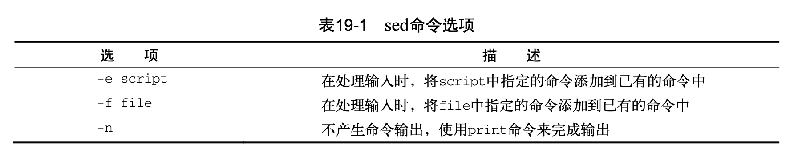

# 《Linux命令行》学习笔记（十六）

## 第18章 图形化桌面环境中的脚本编程

> 有很多与脚本用户交互的方式并不依赖read和echo语句。 本章将会深入介绍一些可以让交互式脚本更友好的方法，这样它们看起来就不那么古板了。

PS：本章内容不会深入阅读。

#### 18.1.5 使用 select 命令

`select`命令只需要一条命令句可以创建出菜单，然后获取输入的答案并自动处理，命令格式如下：

```shell
select variable in list
do
	# commands
done
```

`list`参数是由空格分隔的文本选项列表，这些列表构成了整个菜单。

`select`语句中的所有内容必须作为一行出现，在使用select命令时，记住，存储在变量中的结果值是整个文本字符串而不是跟菜单选项相关联的数字。文本字符串值才是你要在case语句中进行比较的内容。

以下是例子：

```shell
#!/bin/bash
select option in "hi" "wow" "now"
do
  case $option in
  "hi")
    echo "hi"
    break;;
  "wow")
    echo "hi wow"
    break;;
  "now")
    echo "nowdd"
    break;;
  *)
    clear
    echo "nonononono";;
  esac
 done
```

使用：

```shell
sh ./testSelect.sh
1) hi
2) wow
3) now
#? 1
hi
```

## 第19章 初识sed和gawk

> 本章内容：
>
> - 学习 sed 编辑器
> - gawk 编辑器入门
> - sed 编辑器基础

仅靠shell脚本命令来处理文本文件的内容有点勉为其难。如果想在shell脚本中处理任何类型的数据，你得熟悉 Linux 中的`sed`和`gawk`工具。这两个工具能够极大简化需要进行的数据处理任务。

### 19.1 文本处理

当需要处理文本文件却又不想动用 vim 这样的交互式文本编辑器的时候，Linux 提供了 sed 和 gawk 这两个命令行编辑器给用户使用。

#### 19.1.1 sed 编辑器

`sed`编辑器被称作流编辑器（stream editor），和普通的交互式文本编辑器恰好相反，流编辑器会在编辑器处理数据之前基于预先提供的一组规则来编辑数据流。

sed 编辑器会执行下列操作：

- 一次从输入中读取一行数据
- 根据所提供的编辑器命令匹配数据
- 按照命令修改流中的数据
- 将新的命令输出到 STDOUT

在流编辑器处理完流中的所有数据行后，它就会终止。由于命令是按顺序逐行给出的，sed 编辑器只需对数据流进行一遍处理就可以完成编辑操作。这使得 sed 编辑器要比交互式编辑器快得多，你可以快速完成对数据的自动修改

`sed`命令格式如下：

```shell
sed options script file
```

还可以加入下列选项修改`sed`命令的行为



以下是 sed 编辑器的一些基本命令：

1. s 替换命令

   ```shell
   echo "This is a test" | sed 's/test/big test/'
   ```

   该例子使用了 sed 中的 s 命令，该命令会用斜线间指定的第二个文本字符串来替换第一个文本字符串模式。如上面的命令是用`big test`替换了`test`（有点像 vim 中的替换）

2. 使用多个命令

   ```shell
   sed -e 's/test/bigtest/; s/dog/cat/' test.txt
   ```

   如上，使用`-e`参数可以将多个命令都作用到文件的每行数据上，命令之间必须用分号隔开，如果不想用分号的话，也可以通过 shell 自带的换行提示符来分割命令，此外，在多个命令用`{}`号括起来也能达到`-e`的同等效果。

   如下：

   ```shell
   echo "hahaha ddd wow" | sed -e '
   > s/haha/ee/
   > s/ddd/dd/'
   # eeha dd wow
   
   # 使用 {} 号
   echo "hahaha ddd wow" | sed '{s/haha/ee/
   > s/ddd/dd/}'
   # eeha dd wow
   ```

3. 从文件中读取命令

   ```shell
   cat script1.sed
   # s/brown/green/
   # s/fox/elephant/
   # s/dog/cat/
   sed -f script1.sed data.txt
   ```

   如上，可以把命令存在一个文件中，然后使用`-f`参数来读取。

   > 我们很容易就会把sed编辑器脚本文件与bash shell脚本文件搞混。为了避免这种情况，可 以使用.sed作为sed脚本文件的扩展名。

#### 19.1.2 gawk 程序

> 在所有的发行版中都没有默认安装 gawk 程序，需要自行安装

**PS**：不会详细深入了解该命令

`gawk`命令让流编辑迈上了一个新的台阶，它提供了一种编程语言而不只是编辑器命令，可以提供一个类编程环境来修改和重新组织文件中的数据。

### 19.2 sed 编辑器基础

`sed`命令能够帮助你定制文本编辑行为，本节介绍一些可以集成到脚本中的基本命令和功能。

`sed`命令的 option 项基本格式如下：

`范围（1,$ OR /搜索/）+ 命令(s OR p OR d) + 命令选项（/被替换/替换项）`

#### 19.2.1  s命令：更多的替换方式

替换命令在替换多行中的文本时能正常工作，但默认情况下它只替换每行中出现的第一处。 要让替换命令能够替换一行中不同地方出现的文本必须使用替换标记（substitution flag）。替换标记会在替换命令字符串之后设置。

```shell
s/pattern/replacement/flags
```

有 4 中可用的 flags：

- 数字，表明新文本将替换第几处模式匹配的地方

  ```shell
  sed 's/test/trial/2' data.txt
  ```

  比如上面这个例子就会用 trial 替换 test，每行替换前两个 test 单词

- g，表明新文本将替换所有匹配的文本

  ```shell
  sed 's/test/trial/g' data.txt
  ```

  如上面的例子就会替换所有的 test

- p，表明原先行的内容需要打印出来

  ```shell
  # 输出替换了的行
  sed -n 's/test/trial/p' data.txt
  ```

  上面的例子中 p 选项与`-n`选项混用，`-n`选项会禁止 sed 编辑器输出，但 p 命令又会输出修改过的行。所以两个命令配合起来就会只输出被修改过的行。

- w file，将替换的结果写入到文件中

  ```shell
  sed 's/test/trial/w test.txt' data.txt
  ```

  上面的例子会将输出保存到指定文件中

> sed编辑器的正常输出是在STDOUT中，而只有那些包含匹配模式的行才会保存在指定的输出文件中

使用 sed 命令时，不仅可以使用`/`符号作为分隔符，当 / 本身作为一个字符的情况时，除了使用`\`可以进行转义之外，还可以使用`!`符号来作为分隔符，这样就更容易阅读和理解了。

```shell
# 使用 ! 作分隔符，将文本中的 /bin/bash 替换成 /bin/csh
sed 's!/bin/bash!/bin/csh!' /etc/passwd
```

#### 19.2.2 使用地址

如果只想在命令作用于特定行或某些行，则必须要用行寻址。

`sed`命令有两种形式的寻址：

- 数字形式表示区间
- 文本模式过滤出行

**1. 数字形式**

```shell
# 只修改第二行的文本
sed '2s/dog/cat/' data.txt
# 修改第二行到第三行
sed '2,3s/dog/cat/' data.txt
# 从某行开始到结尾的所有行，可以用 $ 符号
sed '2,$s/dog/cat/' data.txt
```

**2. 文本模式**

```shell
# 只修改 Liubasara 的默认 shell，下面的命令会匹配包含 Liubasara 文本的行
sed '/Liubasara/s/bash/csh' /etc/passwd
```

**3. 命令组合**

```shell
sed '2,${
> s/dog/cat/
> s/cat/dog/
> }' data.txt
```

使用花括号可以将多条命令组合在一起，sed 会处理地址行列出的每条命令。

#### 19.2.3 d命令：删除行

`s`命令不是 sed 编辑器唯一的命令，`d`命令可以用于删除文本流中的特定行

```shell
# 删除所有行
sed 'd' data.txt
# 删除第 3 行
sed '3d' data.txt
# 删除第 3 到最后一行
sed '3,$d' data.txt

```

此外，上面的模式匹配特性也适用于删除命令。

```shell
# 删除匹配到 string 的行
sed '/string/d' data.txt
# 也可以使用两个文本模式来删除某个区间内的行，如 sed /cat/,/dog/d data.txt 这样来删除匹配到 cat 和 dog 之间的行，但由于很容易出事（有多个值或者没有值），所以不推荐！
```

> 记住，sed 编辑器不会修改原始文件。你删除的行只是从 sed 编辑器的输出中消失了。原始文件仍然包含那些“删掉的”行

#### 19.2.4 i/a命令：插入和附加文本

有两个命令可以用于插入文本：

- i 命令，会在指定行前增加一个新的行
- a 命令，会在指定行后增加一个新的行

```shell
echo 'wow' | sed 'i\Test Line 1'
#Test Line 1
#wow
echo 'wow' | sed 'a\Test Line 1'
#wow
#Test Line 1
```

除此以外也可以指定行数插入，使用反斜线来分隔需要插入的多行（最后一行不需要）。

```shell
echo 'wow' | sed 'i\Test Line1\
> Test Line2\
> Test Line3'
#Test Line 1
#Test Line2
#Test Line3
#wow

# 第三行前插入
sed '3i\Test Line1\
> Test Line2\
> Test Line3' data.txt

# 数据末尾插入
sed '$a\Test Line1\
> Test Line2\
> Test Line3' data.txt
```

#### 19.2.5 c命令：修改行

change 命令允许修改数据流中整行文本的内容。

```shell
# 在第三行插入，原第三行下移
sed '3c\
> wow This is new Line' data.txt
#dog
#cat
#wow This is new Line
#cat
#dog
#cat

# 如果使用地址区间，则会用这一行文本来替换数据流中的地址区间文本
sed '2,3c\      
wow This is new Line' data.txt
#dog
#wow This is new Line
#cat
#dog
#cat
```

**PS**：要注意跟`d`命令一样，`c`命令是不会对源文件里的内容造成任何影响的。

#### 19.2.6 y命令：转换命令

`y`转换命令可以对输入的值进行单个映射并挨个单词进行替换，具体如下

```shell
echo "This 1 is a test of 1 try." | sed 'y/123/456/'
# This 4 is a test of 4 try.
```

上面的命令转换字符串中中，1 与 4 匹配，2 与 5 匹配，3 与 6 匹配，会文本行中找到的所有指定字符自动进行转换。如果输入和输出的长度不同，则sed编辑器会产生一条错误消息。

#### 19.2.7 p/l/=命令：回顾打印

有三个用于打印输出的命令：

- `p`命令：打印文本行
- `=`命令：打印行号
- `l`命令：列出行（用于看到特殊符号）

这三个命令通常与`-n`选项混用，用于禁止将默认输出输出到 STDOUT，只打印匹配文本模式的行。

```shell
# 输出第一行到第四行
sed -n '1,4p' data.txt

# 结合使用 p 命令和 s 命令，在替换之前先输出一次原文本
echo "This 1 is a test of 1 try." | sed -n '{p
> s/test/line/p}'
#This 1 is a test of 1 try.
#This 1 is a line of 1 try.

# 使用 = 号可以输出行号，可以结合 p 命令使用达到在打印内容前先打印行号的目的
echo "hahaha ddd wow" | sed -n '{=
>p}'     
#1
#hahaha ddd wow
```

#### 19.2.8 w命令：写入文件

`w`命令可以将处理后的文本写入到某个特定的文件。

> filename 可以使用相对路径或绝对路径，但不管是哪种，运行 sed 编辑器的用户都必须有文件的写权限。


> 本次阅读应至 P421 436
