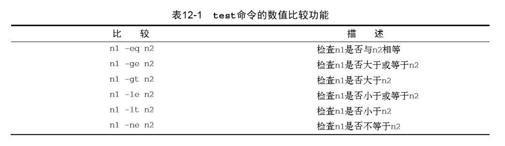
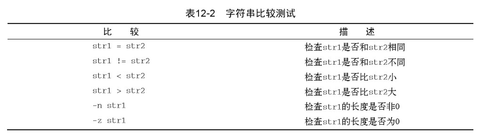
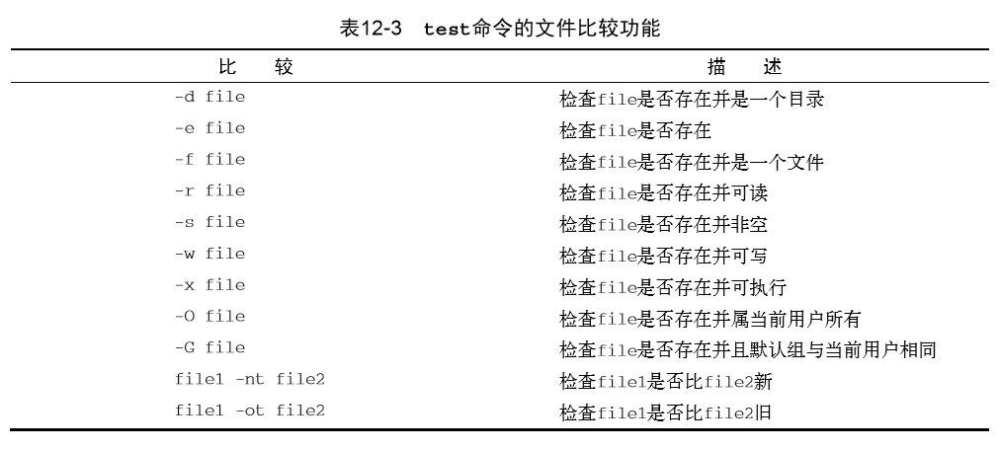
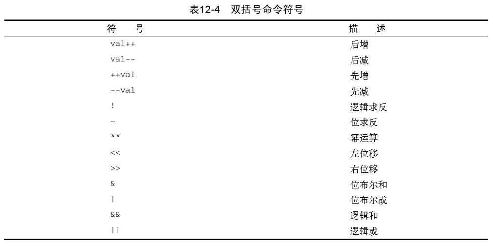

# 《Linux命令行》学习笔记（十）

## 第12章 使用结构化命令

> 许多程序要求对shell脚本中的命令施加一些逻辑流程控制。有一类命令会根据条件使脚本跳 过某些命令。这样的命令通常称为结构化命令（structured command）。 
>
> 本章内容：
>
> - if-then 语句
> - 嵌套 if 语句
> - test 命令
> - 复合条件测试
> - 使用双方括号和双括号
> - case 命令

### 12.1 使用 if-then 语句

if-then 语句有以下格式：

```shell
if command
then
	commands
fi
```

bash shell 的 if 语句后面跟的并不是 TRUE 或 FALSE，而是一个命令。

if 语句会运行 if 后面的那个命令。如果该命令的退出状态码是 0（正常结束），那么就会执行 then 后面的语句，而如果是其他的值，就不会被执行。

fi 语句用于表示 if-then 语句到此结束。

```shell
#!/bin/bash
# 成功执行脚本
if pwd
then
	echo "执行"
fi

# 错误脚本
if wrongCommnad
then
	echo "不执行"
fi
```

要注意的是上面的错误脚本依然会运行 if 后面的命令，并且生成的错误消息依然会显示在脚本的输出中。

此外 it-then 还有一种比较美观的写法

```shell
# 通过把分号放在待求值的命令尾部，就可以将then语句放在同一行上了，这样看起来更像其他编程语言中的if-then语句。 
if command; then
  commands
fi
```

### 12.2 if-then-else 语句

```shell
if command
then
	commands
else
	commands
fi
```

当if语句中的命令返回退出状态码 0 时，then部分中的命令会被执行，这跟普通的 if-then 语句一样。当 if 语句中的命令返回非零退出状态码时，bash shell 会执行 else 部分中的命令

和 then 部分一样，else 部分也可以包含多条命令。

### 12.3 嵌套  if

有时你需要检查脚本代码中的各种条件，对此可以使用嵌套的 if-then 语句。

```shell
testuser=NoSuchUser
if grep $testuser /etc/passwd
then
	echo "user $testuser exits"
else
	echo "user $testuser does not exit"
	if ls -d /home/$testuser/
	then
		echo "However, $testuser has directory"
	fi
fi
```

在脚本中使用这种嵌套 if-then 语句的问题在于代码不易阅读，很难理清逻辑流程，所以可以使用 elif 来延续 else 部分，这样就可以不用书写多个 if-then 语句了。

```shell
if command1
then
	commands
elfi command2
then
	more commands
fi
```

还可以通过在嵌套 elif 中加入一个 else 语句，处理多余的情况。

```shell
if command1
then
	commands
elfi command2
then
	more commands
else
	elsecommands
fi
```

尽管使用了elif语句的代码看起来更清晰，但是脚本的逻辑仍然会让人犯晕。在 12.7 节，你会看到如何使用 case 命令代替 if-then 语句的大量嵌套。 

### 12.4 test 命令

if-then 语句不能测试命令退出码之外的条件，如果需要，可以使用 test 命令。

> test命令提供了在if-then语句中测试不同条件的途径。如果test命令中列出的条件成立， test命令就会退出并返回退出状态码0。这样if-then语句就与其他编程语言中的if-then语句 以类似的方式工作了。如果条件不成立，test命令就会退出并返回非零的退出状态码，这使得 if-then语句不会再被执行。 

```shell
if test condition
then
	commands
fi
```

**而如果不写 test 命令的 condition 部分，它会以非零的退出状态码退出并执行 else 语句块**。

除了 test 命令以外，还可以使用方括号。

```shell
if [ condition ]
then
	commnads
fi
```

要注意上面的方括号，第一个方括号之后和第二个方括号之前必须加上一个空格，否则就会报错。

test 命令和方括号可以判断三类条件：

- 数值比较
- 字符串比较
- 文件比较

#### 12.4.1 数值比较



要记住的是bash shell只能处理整数，如果上面的比较中出现浮点数，shell 会直接报错。

```shell
test 1 -eq 1.55
# -bash: test: 1.55: 期待整数表达式
```

#### 12.4.2 字符串比较



在比较字符串的相等性时，比较测试会将所有的标点和大小写情况都考虑在内。

此外，`-n`和`-z`参数可以检查一个变量是否含有数据。

`-n`用于判断变量的长度是否为**非0**。

`-z`用于判断变量的长度是否为0。要注意如果一个变量并未在 shell 中定义过，那么它的长度也算作 0。

PS：感觉字符串大小的比较不太实用，在此略过....

#### 12.4.3 文件比较

文件比较是 shell 中最为强大，也是用得最多的比较形式。它允许你**测试 Linux 文件系统上文件和目录的状态**。



其中用得比较多的是：

- `-d`检查目录是否存在

- `-e`检查对象是否存在，用于文件和目录

- `-f`如果要确定指定对象为文件，则需要使用`-f`来比较
  ```shell
    #!/bin/bash
    item_name=$HOME
    echo  
    echo "The item being checked: $item_name"
    echo   
    # 检查路径是否为文件
    if [ -e $item_name ]
    then
        echo "$item_name 存在"
        echo "但他是文件吗？"
        echo  
        if [ -f $item_name ]
        then
            echo "$item_name 是一个文件"
         else
            echo "$item_name 不是一个文件"
         fi
     else
        echo "$item_name 文件不存在"
     fi
  ```

    上面的脚本会检测一个文件是否存在，以及是否是一个文件对象。

- `-s`可以检查文件是否为空，当`-s`比较成功时，说明文件中有数据

- `-w`会判断用户对文件是否有可写权限，`-x`会判断是否有执行权限

- `-O`会判断用户是否为文件的属主

- `-nt`判定一个文件是否比另一个文件新，`-ot`判断文件是否比另一个文件旧，判断标准是文件的日期。这两个命令可以用于编写软件更新脚本和安装脚本。

### 12.5 复合条件测试

可以使用`[ condition1 ] && [ condition2 ]`和`[ condition1 ] || [ condition2 ]`来对进行条件组合。

### 12.6 if-then 的高级特性

#### 12.6.1 使用双括号

`(( expression ))`这种格式的命令可以使用比起`test`命令更多的其他运算符。



可以在`if`语句中使用双括号命令，也可以在脚本的普通命令中使用来进行赋值。

```shell
#!/bin/bash
val=10
if (( $val1 ** 2 > 90 ))
then
	(( val2 = $val ** 2 ))
	echo "val 为 $val，val2 为 $val2"
fi
```

#### 12.6.2 使用双方括号

`[[ expression ]]`这种形式用于针对字符串的比较。

双方括号里的`expression`使用了`test`命令中的标准字符串比较，还可以使用正则表达式来匹配字符串值。

```shell
if [[ $USER == r* ]]
then
	echo "hello"
else
	echo "你是谁？"
fi
```

上面脚本中的双等于号会把右边的字符串（r*）视为一个模式，并应用模式匹配规则。

> 注意，不需要将双括号中表达式里的大于号转义。这是双括号命令提供的另一个高级特性

### 12.7 case 命令

`case`命令会将指定的变量与不同模式进行比较，从而简化 if-then-else 的操作。

可以通过竖线操作符（|）在一行中分隔出多个模式。星号会捕获所有与已知模式不匹配的值。

```shell
case $USER in
testUser | liubasara)
	echo "你好"
testing)
	echo "你也好"
*)
	echo "你谁？"
```


> 阅读至P255 270