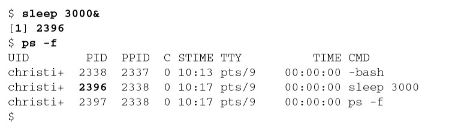

# 《Linux命令行》学习笔记（四）

## 第 5 章 理解 shell

`shell`是一个时刻都在运行的复杂交互式程序，本章会专注于了解如何创建子 shell 以及父 shell 与子 shell 之间的关系。

> 本章内容
>
> - 探究shell的类型
> - 理解shell的父/子关系
> - 别出心裁的子shell用法
> - 探究内建的shell命令 

### 5.1 shell 的类型

系统启动什么样的 shell 程序取决于个人的用户 ID 配置，/etc/passwd 文件第 7 个字段列出了默认的 shell 程序，如下，用户 Christine 使用 GNU bash shell 作为自己的默认 shell 程序：

```shell
cat /etc/passwd
# Christine:x:501:501:Christine B:/home/Christine:/bin/bash
```

> 第1章对各种shell有一个简单的描述。如果你想进一步学习GNU bash shell之外的shell，第 23章提供了更多的相关信息

你经常会看到某些发行版使用软链接将默认的系统 shell 设置成 bash shell，如下：

```shell
ls -l /bin/sh
# lrwxrwxrwx. 1 root root 4 Mar 18 15:05 /bin/sh -> bash
```

但在某些版本上，默认 shell 并不是 bash，比如 Ubuntu 的默认 shell 就是 dash shell。

### 5.2 shell 的父子关系

用于登录某个虚拟控制器终端或在 GUI 中运行终端仿真器时所启动的默认的交互 shell，是一个父 shell。本书到目前为止都是父 shell 提供 CLI 提示符，然后等待命令输入。

使用`ps -f`命令可以看到父子进程之间的联系。


或者使用`ps -forest`可以看到它们之间的嵌套结构。


使用`exit`命令可以退出子 shell 或登出当前虚拟控制台终端。

#### 5.2.1 进程列表

就算不使用 bash shell 命令或是 shell 脚本，你也可以通过进程列表来生成子 shell，只需要在命令之间加入分号并用括号框柱即可。


$BASH_SUBSHELL 环境变量的作用是计算子 shell 的数量，默认为 0，此时其输出为 1，说明确实生成了子 shell。

> 采用子shell的成本不菲，会明显拖慢 处理速度。在交互式的CLI shell会话中，子shell同样存在问题。它并非真正的多进程处理，因为终端控制着子shell的I/O。 

#### 5.2.2 别出心裁的子 shell 用法

在交互式 shell 中，一个高效的子 shell 用法就是使用后台模式。

**1. 探索后台模式**

后台模式中运行命令可以在处理命令的同时让出 CLI，以供他用。比如`sleep`命令就用到了后台模式。

`sleep`命令接收一个参数，该参数是你希望进程等待（睡眠）的秒数。这个命令在脚本中常用于引入一段时间的暂停。命令`sleep 10`会将会话暂停 10 秒钟。然后返回 shell CLI 提示符。

要将命令置于后台模式，可以在命令末尾加上字符`&`。把`sleep`命令置于后台模式就可以让我们看到`sleep`命令的详情。



sleep 命令会在后台睡眠 3000 秒。当其被置入后台时，可以看到显示的进程 PID 和命令进入后台时所显示的 PID 都是一样的 2396。

除了`ps`命令，还可以用`jobs`命令来显示所有用户的后台运行进程。

```shell
jobs
# [1]+  Running                 sleep 3000 &
```

`jobs`命令除了在方括号中显示出作业号，还会显示作业的当前状态以及对应的命令。

利用`-l`参数，还能够看到命令的 PID 号。

一旦后台作业完成，就会显示出结束状态。

```shell
# [1]+  Done                 sleep 3000 & 
```

**PS**：`&`符号配合`nohup`命令，可以方便的将一些脚本放到后台不挂断运行，非常好用。

```shell
nohup [command] &
```

**2. 将进程列表置入后台**

配合使用进程列表和`&`符号可以让命令在生成的子 shell 中后台运行。这样**既可以在子 shell 中进行繁重的处理工作，同时也不会让子 shell 的 I/O 受制于终端**。

```shell
(tar -cf Rich.tar /home/rich; tar -cf My.tar /home/christine)&
# [3] 2423
```

**3. 协程**

将进程列表置入后台模式并不是子 shell 在 CLI 中仅有的创造性用法。协程也可以同时做两件事，即在后台生成一个子 shell，并在这个子 shell 中执行命令。

要进行协程处理，可以使用`coproc`命令。

```shell
coproc sleep 10
```

协程基本就是创建 shell 以后将命令置入后台模式。

使用`jobs`命令可以看到协程的处理状态。

```shell
jobs
# [1]+  Running                 coproc COPROC sleep 10 & 
```

上面的 COPROC 是协程命令给进程起的名字。你也可以使用命令的扩展语法自己来设置这个名字。

```shell
coproc My_Job { sleep 10; }
# [1] 2570
jobs
# [1]+  Running                 coproc My_Job { sleep 10; } & 
```

如上协程的名字被设置成 My_Job。要注意这里的扩展语法，**第一个花括号（{）、闭花括号（}）命令之间必须要有一个空格，且命令必须保证用分号结束**。

> 记住，生成子shell的成本不低，而且速度还慢。创建嵌套子shell更是火上浇油！ 

### 5.3 理解 shell 的内建命令

内建命令和非内建命令的操作方式大不相同。

#### 5.3.1 外部命令

外部命令，有时也被称为文件系统命令，是存在于 bash shell 之外的程序。它们并不是 shell 程序的一部分。外部命令程序通常位于 /bin、/usr/bin、/sbin 或 /usr/bin 中。

比如说`ps`就是一个外部命令，你可以使用`which`或者`type`命令来找到它。

```shell
which ps
# /bin/ps
type -a ps
# ps is /bin/ps
```

当外部命令执行时，会创建出一个子进程。这种操作被称为衍生（forking）。

当进程必须执行衍生操作时，它需要花费时间来进行新子进程的环境设置。所以说外部命令多少还是有代价的。

> 就算衍生出子进程或是创建了子shell，你仍然可以通过发送信号与其沟通，这一点无论是 在命令行还是在脚本编写中都是极其有用的。发送信号（signaling）使得进程间可以通过 信号进行通信。信号及其发送会在第16章中讲到。

#### 5.3.2 内建命令

内建命令是作为 shell 工具组成部分而存在的命令，不需要借助外部程序文件来运行。

可以通过`type`命令来了解某个命令是否是内建的。

```shell
type cd
# cd is a shell builtin
```

内建命令既不需要通过衍生出子进程来执行，也不需要打开程序文件，所以执行速度更快，效率也更高。

但要注意的是有些命令既有内建命令也有外部命令，如`echo`和`pwd`。要查看命令的不同实现，可以使用`type`命令的`-a`选项。

```shell
type -a echo
# echo is a shell builtin 
# echo is /bin/echo
```

> 对于有多种实现的命令，如果想要使用其外部命令实现，直接指明对应的文件就可以了。 例如，要使用外部命令pwd，可以输入/bin/pwd

**1. 使用 history 命令**

history 命令是一个很有用的内建命令。可以用该命令追踪并唤回你用过的命令。

输入`!!`时，bash 会自动执行上一条命令。

命令历史记录被保存在隐藏文件 .bash_history 中，位于用户的主目录中。（PS：bash 命令的历史记录是先存在内存中，当 shell 退出时才会被写入到历史文件中。）

使用`history -a`命令可以强制将当前内存中的命令历史记录写入。

使用`history -n`命令可以强制刷新 .bash_history，更新终端会话的历史记录。

**2. 命令别名**

`alias`内建命令允许你为常用的命令创建另一个名称，将输入减少到最低。

使用`alias -p`可以查看当前可用的别名。

```shell
alias -p
# alias egrep='egrep --color=auto'
# alias fgrep='fgrep --color=auto'
# alias grep='grep --color=auto'
# alias l='ls -CF'
# alias ll='ls -alF'
# alias ls='ls --color=auto'
```

可以使用`alias`命令创建属于自己的别名

```shell
alias li='ls -li'
```

PS：如果不在环境变玲文件中设置，该别名只能在当前 shell 中使用。

