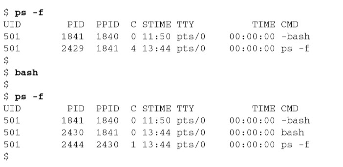
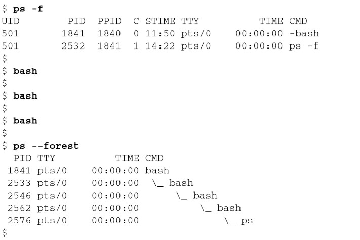
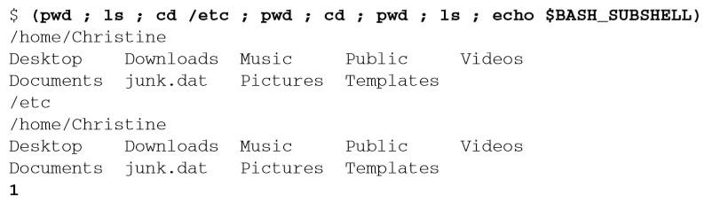

# 《Linux命令行》学习笔记（四）

## 第 5 章 理解 shell

`shell`是一个时刻都在运行的复杂交互式程序，本章会专注于了解如何创建子 shell 以及父 shell 与子 shell 之间的关系。

> 本章内容
>
> - 探究shell的类型
> - 理解shell的父/子关系
> - 别出心裁的子shell用法
> - 探究内建的shell命令 

### 5.1 shell 的类型

系统启动什么样的 shell 程序取决于个人的用户 ID 配置，/etc/passwd 文件第 7 个字段列出了默认的 shell 程序，如下，用户 Christine 使用 GNU bash shell 作为自己的默认 shell 程序：

```shell
cat /etc/passwd
# Christine:x:501:501:Christine B:/home/Christine:/bin/bash
```

> 第1章对各种shell有一个简单的描述。如果你想进一步学习GNU bash shell之外的shell，第 23章提供了更多的相关信息

你经常会看到某些发行版使用软链接将默认的系统 shell 设置成 bash shell，如下：

```shell
ls -l /bin/sh
# lrwxrwxrwx. 1 root root 4 Mar 18 15:05 /bin/sh -> bash
```

但在某些版本上，默认 shell 并不是 bash，比如 Ubuntu 的默认 shell 就是 dash shell。

### 5.2 shell 的父子关系

用于登录某个虚拟控制器终端或在 GUI 中运行终端仿真器时所启动的默认的交互 shell，是一个父 shell。本书到目前为止都是父 shell 提供 CLI 提示符，然后等待命令输入。

使用`ps -f`命令可以看到父子进程之间的联系。



或者使用`ps -forest`可以看到它们之间的嵌套结构。



使用`exit`命令可以退出子 shell 或登出当前虚拟控制台终端。

#### 5.2.1 进程列表

就算不使用 bash shell 命令或是 shell 脚本，你也可以通过进程列表来生成子 shell，只需要在命令之间加入分号并用括号框柱即可。



$BASH_SUBSHELL 环境变量的作用是计算子 shell 的数量，默认为 0，此时其输出为 1，说明确实生成了子 shell。

> 采用子shell的成本不菲，会明显拖慢 处理速度。在交互式的CLI shell会话中，子shell同样存在问题。它并非真正的多进程处理，因为终端控制着子shell的I/O。 

#### 5.2.2 别出心裁的子 shell 用法


> 阅读至 P93 108