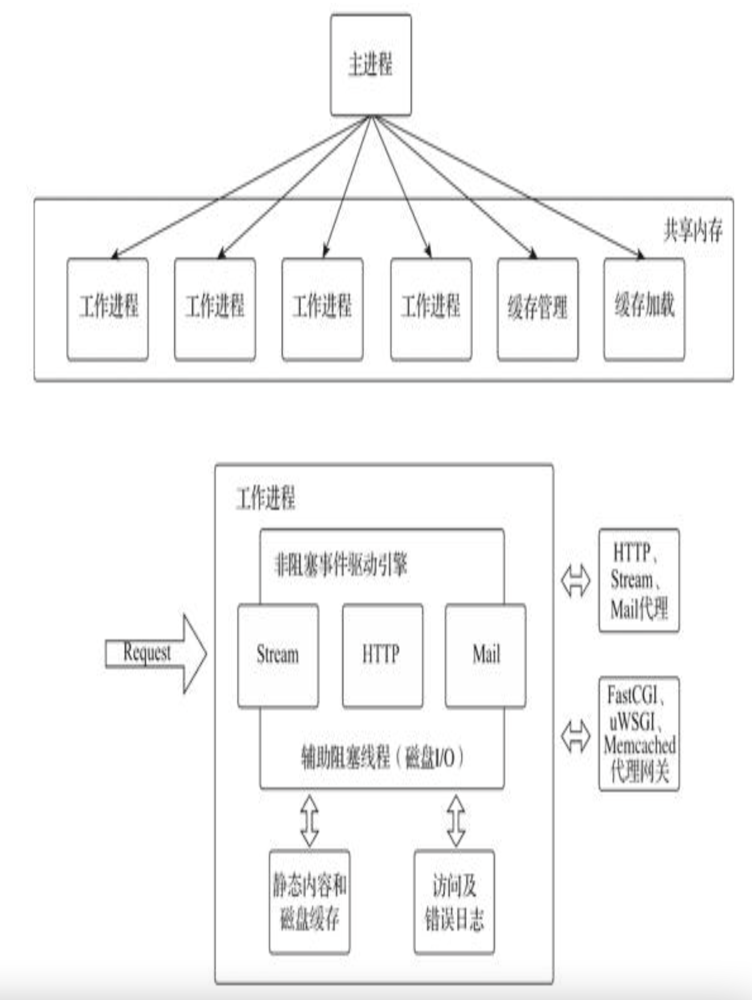
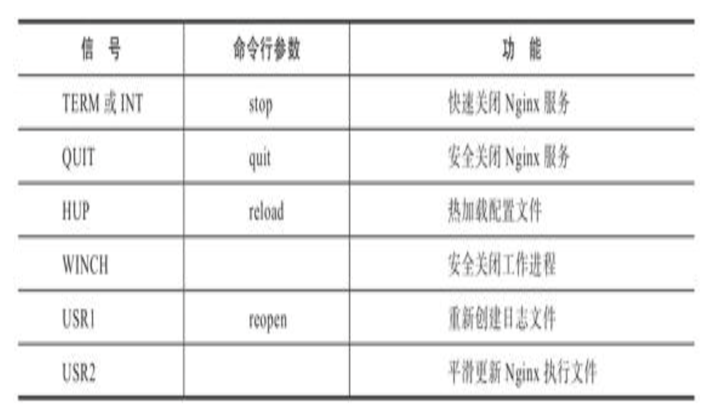
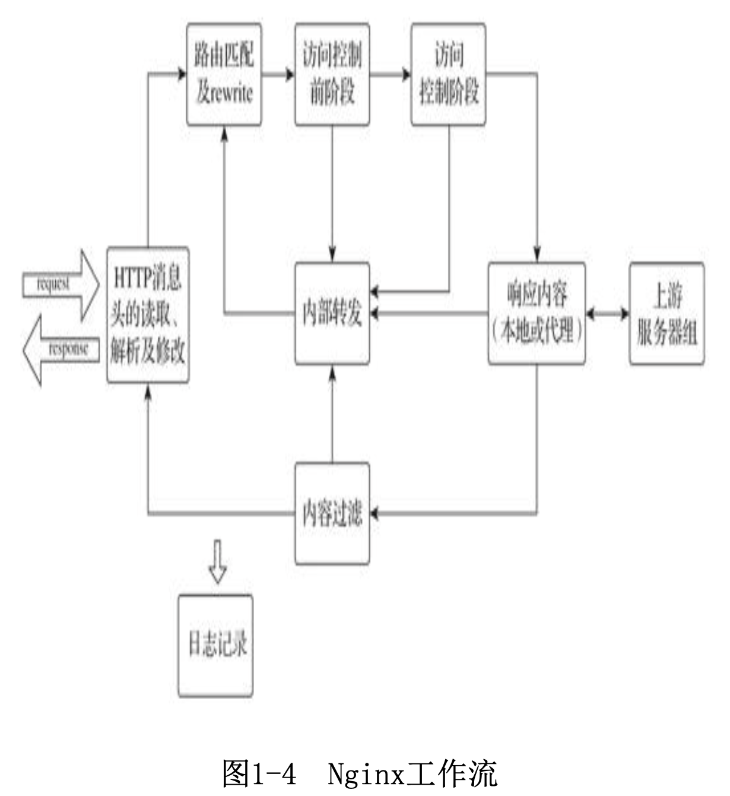
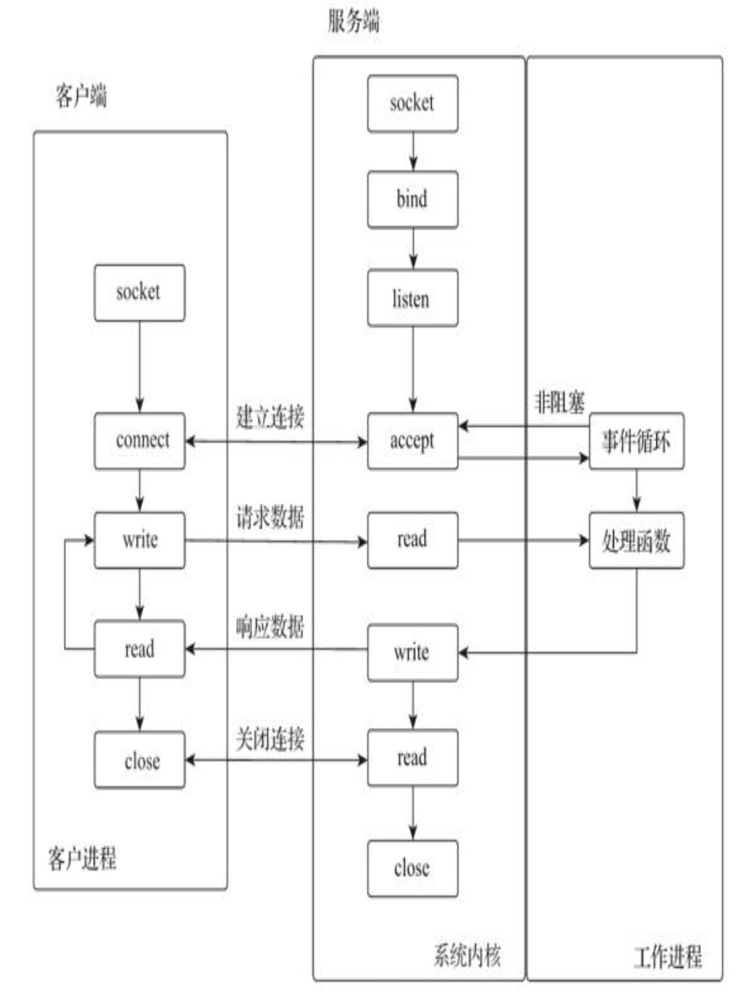
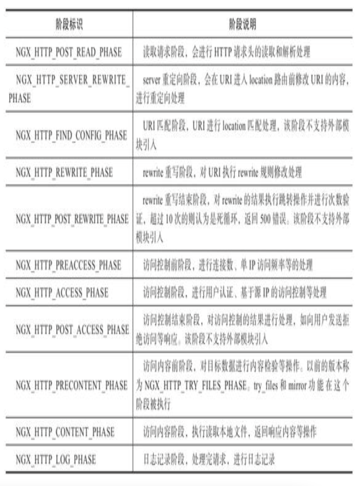
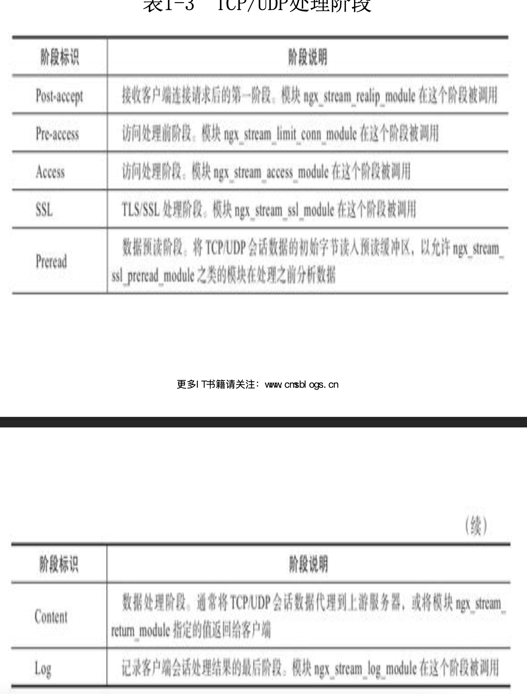
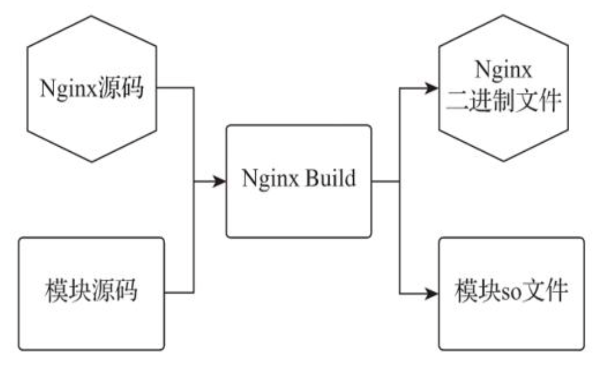

# 《Nginx应用与运维实战》学习笔记（1）

> 资料下载地址:
>
> [百度网盘](https://pan.baidu.com/s/1v8iF4U2X2W-YE8GY2pNqmg)
>
> 提取码: pnh6
>
> **本资料仅用于学习交流，如有能力请到各大销售渠道支持正版 !**

## 前言

Nginx 作为一款开源的 Web 服务器软件，因其具有性能稳定，高并发、低内存耗用、高性能的处理能力等特点，被广泛应用到国内外个互联网厂商的实际生产架构中。

基于其开源版本衍生出来的 OpenResty 和淘宝的 Tengine 等软件也根据自身需求提供了优秀的扩展功能，满足了云计算、微服务等各种技术的应用需求，并在实际生产环境中得到了广泛应用。其中，OpenResty 将 Lua 语言以模块的方式嵌入 Nginx 中，极大地扩展了 Nginx 的可编程性，降低了 Nginx 功能扩展的难度，给 Nginx 用户的日常使用带来了极大的便利。

作为一款 Web 服务器软件，Nginx 实现了以下功能：

- Web 服务器的基本功能，用户通过简单的配置指令就可以快速完成 Web 服务器的构建
- 支持 TCP/UDP、HTTP、HTTP/2、gRPC、FastCGI、SCGI、uWSGI、WebDAV 等协议的处理，并实现了相应通信协议的请求解析、长连接、代理转发、负载均衡、会话保持等在互联网架构中的常用功能。
- 高并发能力，采用的固定数量多进程模型、事件驱动处理机制、工作流处理方式以及模块化架构等软件开发设计，已成为高并发服务软件开发的典范。

Nginx 的用户只有理解了 Nginx 的各项指令参数的功用，才能熟练对 Nginx 的各种功能进行灵活组合使其发挥最高性能，进而在实际工作中解决各种问题。

鉴于以上原因，本书分别从 Nginx 介绍、应用实战、运维管理以及 Kubernetes 和微服务的应用集成 4 个部分来介绍 Nginx 的特点以及运维管理实战经验。

本书分为四个部分：

1. Nginx 介绍（1-4 章）
2. 应用实战（5-8 章）
3. 运维管理（9-11 章）
4. Nginx 与 Kubernetes、微服务的应用集成（12-13 章）

## 第 1 章 Nginx 概述

Nginx 是一个高性能的反向代理和 Web 服务器软件，最初由俄罗斯人开发，第一个版本发布于 2004 年，具有但不限于以下特性：

- 系统资源消耗低
- 运行稳定
- 具有高性能的并发处理能力

由于这些特性，直至 2019 年，Nginx 的市场占有率已经超过 Apache 4.89%，并有望在未来占有更多的市场份额。

### 1.1 Nginx 的不同版本

官方目前有 Nginx 开源版和 Nginx Plus 商业版两个版本。商业版除了开源版本的全部功能之外，还提供一些独有的企业级功能。

此外，Nginx 在国内也存在一些由国内企业进行改进的开源版本，分别是由淘宝技术团队维护的 Tengine 项目和由章亦春发起的 OpenResty 项目。

#### 1.1.1 开源版 Nginx

截止至本书写作时，Nginx 开源版本已经更新到 1.17.2 版本（PS：截止至本笔记，nginx 最新版本为：2022-01-25 nginx-1.21.6 mainline version has been released.）

在 Web 技术架构的不断迭代过程中，各种分离式思想成为主流，比如将访问入口和 Web 服务器分离，将 Web 服务器和动态脚本解析器分开、将 Web 功能不断拆分成微服务等等。Nginx 不仅提供了 Web 服务器的功能，还极大满足了这一主流架构的需求，并提供了如下的应用特性：

1. 访问路由

   大型网站的请求量早已不是单一 Web 服务器可以支撑的了，目前大型网站的通用应用架构一般是：单一入口，但将访问请求分配到不同的业务功能服务器集群。而 Nginx 可以通过访问路径、URL 关键字、客户端 IP、灰度分流等多种手段实现访问路由分配。

2. 反向代理

   就反向代理功能而言，Nginx 本身并不产生响应数据，只是应用自身的**异步非阻塞事件驱动架构**，从而高效，稳定地将请求反向代理给后端的目标应用的服务器，并把响应数据返回给客户端。其不仅可以代理 HTTP 协议，还支持 HTTPS、HTTP/2、FastCGI、uWSGI、SCGI、gRPGC 及 TCP/UDP 等目前大部分协议的反向代理。

3. 负载均衡

   Nginx 在反向代理的基础上，集合了自身的上游（upstream）模块，支持多种负载均衡算法，使得后端服务器可以非常方便地进行横向扩展，从而有效提升应用的处理能力，使得整体应用架构可以轻松应对高并发的应用场景。

4. 内容缓存

   动态处理与静态内容分离式架构优化的主要手段之一，Nginx 的内容缓存技术可以实现如下功能：

   - 预置静态文件的告诉缓存
   - 对应用响应的动态结果进行缓存，从而对响应结果变化不大的应用提供更高速的响应能力

5. 可编程

   Nginx 模块化的代码架构为其提供了高度可定制的特性，但可以用 C 语言开发 Nginx 模块来满足自身需求的用户只是少数。因此，Nginx 在开发之初就具备了使用 Perl 脚本语言实现功能增强的能力。Nginx 对 JavaScript 语言以及第三方模块对 Lua 语言的支持，使得其可编程能力更强。

Nginx 开源版有 mainline（主线分支，版本号的第二位永远是奇数） 和 stable（稳定分支，版本号的第二位永远是偶数） 两个分支，截止本书写作时，mainliine 的最新版本为 1.17.2，stable 的最新版本为 1.16.1。

#### 1.1.2 商业版 Nginx Plus

Nginx Plus 是 2013 年开始推出的商业版本，在开源版本的基础上增加了使用户对 Nginx 的管理和监控更轻松的功能，并始终基于最新版本的 Nginx 开源版主线分支，包含一些封闭源代码特性和功能，比如：实时活动监视数据、通过 API 配置上游服务器负载平衡和主动健康检测、支持 K8S 集群控制、流媒体自适应串流，流媒体带宽控制支持等等。

#### 1.1.3 分支版本 Tengine

Tengine 是淘宝团队发起的对于 Nginx 的二次开发项目，在开源版 Nginx 以及诸多三方模块的基础上，针对高并发需求进行了二次开发，添加了很多针对互联网网站中需要的特性。

#### 1.1.4 扩展版本 OpenResty

OpenResty 是基于 Nginx 开源版本的扩展版本，开始于 2007 年 10 月，最早是为雅虎中国搜索部门开发的项目，后面由章亦春进行开发和维护，目前主要由 OpenResty 软件基金会和 OpenResty Inc 公司提供支持。

OpenResty 利用 Nginx 的模块特性，使得 Nginx 支持 Lua 语言的脚本编程，使得开源版本 Nginx 的可编程性得到大大增强。

OpenResty 内部继承了大量精良的 Lua 库、第三方模块以及大多数依赖项，以便搭建能够处理高并发，扩展性极高的动态 Web 应用、Web 服务和动态网管，并通过汇聚各种设计精良的 Nginx 模块，将其变成了一个强大的通用 Web 应用平台。通过充分利用 Nginx 的非阻塞 IO 模型，不仅对 HTTP 客户端请求，还对远程后端如 MySQL、PostgreSQL、Memcached 及 Redis 等都进行了一致的高性能响应。

### 1.2 Nginx 源码架构浅析

Nginx 的低资源消耗、高稳定、高性能的并发处理能力，得益于它的代码架构中的以下几个亮点：

- 采用多进程模型，使得自身具有低资源消耗的特性

- 以事件驱动的，异步非阻塞多进程请求处理模型，实现了高性能的并发处理能力，让每个连接的请求可以在 Nginx 中以工作流的方式得到快速处理。 

Nginx 支持在多种操作系统下部署运行，本书仅以 Linux 系统平台为例进行介绍。

#### 1.2.1 多进程模型

Nginx 采用固定数量的多进程模型，由一个主进程和数量与 CPU 核数相同的工作进程协同处理各种事件，不需要进行进程切换，依旧不会产生由于进程切换引起的资源消耗问题。

其中，主进程负责工作进程的配置加载，启动停止等操作。而工作进程负责处理具体请求。每个工作进程处理多个连接，每个连接由一个工作进程全权处理。



其中，多个工作进程间通过共享内存来共享数据和信息。

**1. 信号**

信号（signal）又称为软中断信号，可以通过调用系统的 kill 命令来发送信号实现进程通信。Nginx 系统中，主进程负责监听外部信号，实现对进程的热加载、平滑重启以及安全关闭等操作的响应。

Nginx 可以接收的信号如下：



在 Linux 下可以通过 kill 命令发送信号指令：

```shell
kill -HUP 'cat nginx.pid'
```

也可以通过 nginx -s 命令行实现信号指令的发送：

```shell
nginx -s reload
```

**2. 频道**

频道（channel）是 Nginx 主进程向工作进程传递信号操作的通信方式。其原理是应用 socketpair 方法，使用本机的 socket 方式实现进程间的通信。

主进程发送频道消息，工作进程接收频道消息并执行相应操作。二者之间由一个事件引擎（如 epoll）进行驱动，使用接收频道消息的套接字进行注册。

**3. 共享内存**

Liunx 操作系统下允许多个进程访问同一个内存地址。用户可以在配置文件中配置共享内存名称和大小，定义不同的共享内存块供 Nginx 不同的功能使用，然后由 Nginx 通过 slab 机制将这些定义的共享内存进行内部统一划分和管理。

**4. 进程调度**

Nginx 中，每个工作进程都继承了主进程的监听套接字（Socket），所有工作进程都会共享相同的监听套接字，但是多个工作进程，同一时间只能由一个工作进程接收网络连接，为了使它们能够协调工作，工作进程有如下几种调度方式：

- 无调度模式，所有进程抢着与客户端建立连接，最终只有一个能够成功，会瞬间产生大量的资源消耗，就是所谓的惊群现象。

- 互斥锁模式，每个工作进程周期性地争抢互斥锁，争抢到的工作进程则拥有接收  HTTP 建立连接事件的处理权，而其他工作进程则继续周期性地轮询互斥锁的状态。该模式在大量 HTTP 短连接的情况下会很好地避免资源消耗的后果，但在长连接 HTTP 的情况下，该机制会将压力集中在少数进程上，从而导致负载分布不均。

- 套接字分片（Socket Sharding）

  由内核提供的一种分配制度，允许有内核来决定哪个工作进程的套接字监听可以接收连接。该功能需要在配置 listen 指令的时候启用 reuseport 参数。

上面几种模式中，由于 Nginx 很少会有空闲的工作进程，出现惊群现象的影响不大，所以 Nginx 的默认调度模式是无调度模式。而套接字分片模式则因为是内核层面的调度机制，因此性能最好。

**5. 事件驱动**

事件驱动程序设计（Event Driven Programming）是一种程序设计模型。代码架构通常是预先设计一个事件循环方法，再由这个事件循环方法不断地检查当前要处理的信息，并根据这些信息触发事件函数，而未被处理的时间会放在事件队列中等待处理。

事件驱动模型的重点就在于事件处理的弹性和异步化。

#### 1.2.2 工作流机制

Nginx 处理客户端请求的工作流：



HTTP 阶段工作流：



请求在不同阶段由功能模块进行数据处理，如果处理结果异常或结束则将结果返回客户端，否则进入下一阶段。

**1. HTTP 处理阶段**

其中 HTTP 请求的处理过程可分为 11 个阶段，如下表所示：



**2. TCP/UDP 处理阶段**

TCP/UDP 会话共经历 7 个处理阶段。如下表：



#### 1.2.3 模块化

Nginx 的模块代码包括核心模块和功能模块两个部分：

- 核心模块负责维护进程的运行、内存以及事件的管理；
- 功能模块则负责具体功能应用的实现，包括路由分配、内容过滤等操作。

**1. 模块分类**

- 核心模块

- 事件模块

- HTTP 模块

- Mail 模块

- Stream 模块。提供 TCP/UDP 会话的代理和负载相关功能

- 第三方模块，非 Nginx 官方开发的功能模块

- 动态模块，早期的 Nginx 通过编译配置选项`--with_module`和`--without-module`来决定要编译哪些模块，然后将所有模块与核心模块一起编译到同一个二进制文件中。这是一种静态加载模块的方式。从 1.9.11 版本以后，Nginx 开始支持动态加载模块功能，当编译配置选项中含有`=dynamic`选项，则表示支持动态模块加载。如下：

  ```shell
  ./configure --with-http_xslt_module=dynamic
  ```

  编译后，模块文件将会以 so 扩展文件的形式独立存储于 Nginx 的 modules 文件夹中。

  

  Nginx 还在编译配置选项中添加了`--with-compat`选项，用于兼容动态模块中引入的某些结构字段由于在编译阶段被 nginx 编译器舍弃掉了（PS：个人理解，tree-shaking）而出现报错的情况。

  ```shell
  ./configure --with-compat --with-http_xslt_module=dynamic
  ```

  在配置文件中使用 load_module 指令来加载动态模块：

  ```ini
  load_module "modules/ngx_http_xslt_filter_module.so";
  ```


