# 《Nginx应用与运维实战》学习笔记（2）

## 第2章 Nginx编译及部署

本书采用 CentOS 64 位 7.2 版本，软件使用 CentOS 官方提供 yum 源依赖库提供的版本。

本章包含以下内容：

- Nginx 编译前操作系统环境准备
- Nginx 1.17.2 版本编译配置参数详解及编译
- Tengine 2.3.1 版本编译配置参数详解及编译
- OpenRestry 1.13.6.2 版本编译配置参数详解及编译
- Nginx 的 Docker 镜像构建及运行

### 2.1 编译环境准备

#### 2.1.1 操作系统

1. 系统服务安装

   ```shell
   yum -y install epel-release
   # 安装扩展工具包yum源
   yum install net-tools wget nscd lsof
   # 安装工具
   ```

2. DNS 缓存

   打开 NSCD 服务可以缓存 DNS，提高域名解析的响应速度

   ```shell
   systemctl start nscd.service # 启动NSCD服务
   systemctl enable nscd.service
   ```

3. 修改文件打开数限制

   操作系统默认单进程最大打开文件数为 1024，为实现高并发，可以把该数目调味 65536。

   ```shell
   # *号表示所用用户
   echo "* soft nofile 65536\n* hard nofile 65536" >>limits.conf
   
   # OR
   cat <<EOF > limits.conf
   heredoc> * soft nofile 65536
   heredoc> * hard nofile 65536
   heredoc> EOF
   ```

#### 2.1.2 Linux 内核参数

Linux 系统是通过 proc 文件系统实现访问内核内部数据结构以及改变内核参数的，proc 文件系统挂载在 /proc 目录下面，是一个伪文件系统。可以通过改变 /proc/sys 目录下文件中的值对内核参数进行修改。目录与内核参数类别对照如下所示：

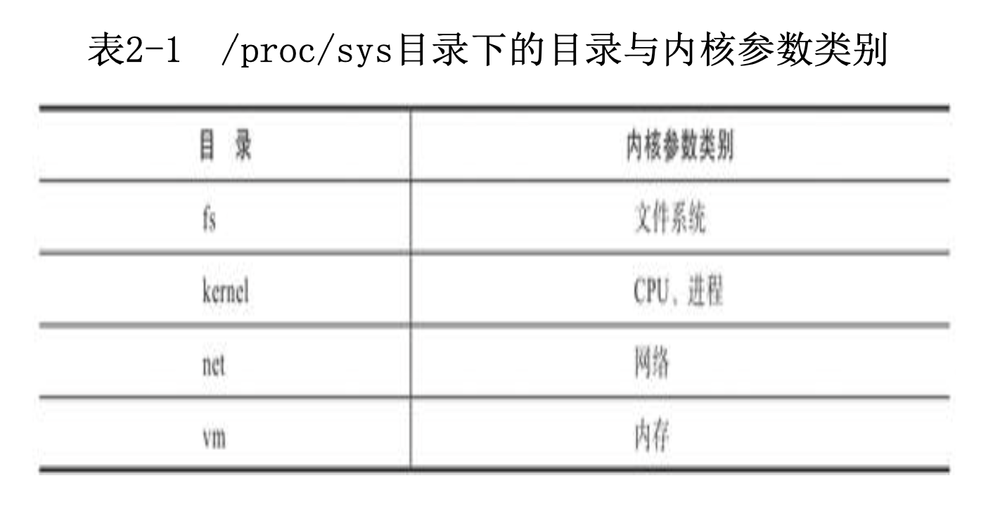

在 linux 下，所有的设备都被看作文件来进行操作。而建立的网络连接数同样受限于操作系统的最大打开文件数，该限制默认会是系统内存的 10%，称为系统级限制，可以使用`sysctl -a | grep fs.file-max`命令来查看。同时内核对单进程的最大打开文件数量也做了默认值处理，一般是 1024，使用`ulimit -n`命令可以查看，称为用户级限制。

Nginx 是一款 Web 服务器软件，而系统层面的网络优化可以提升 HTTP 数据传输的效率，HTTP 协议又基于 TCP/IP 通信协议传递数据，TCP（三次握手）及相关术语的说明如下：

- SYN：建立连接标识
- ACK：确认接收标识
- FIN：关闭连接标识
- seq：当前数据包编号，接收端会通过该编号将多个数据包拼接为完整的数据
- ack：确认号，为上个数据包的编号+1

**TCP 三次握手**

TCP 建立连接的具体流程与说明如下（TCP 三次握手详解）：

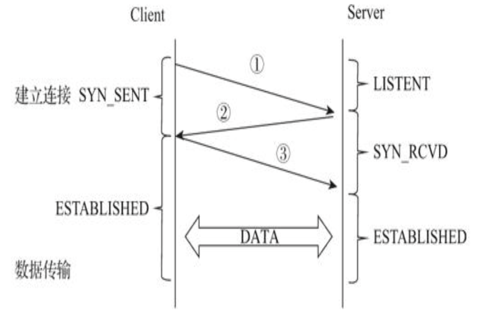

1. Client -> Server

   请求报文：SYN=1，初始编号 seq=x

   status

   - client: SYN_SENT
   - server：LISTENT

2. Server -> Client

   确认报文：SYN=1，ACK=1，确认号 ack=x+1，初始编号 seq=y

   status

   - client: SYN_SENT
   - server: SYN_RCVD

3. Client -> Server

   确认报文：ACK=1，确认号 ack=y+1，编号 seq=x+1

   status

   - client: ESTABLISHED
   - server: SYN_RCVD

4. SERVER

   收到报文，握手成功，并与 Client 实现数据传输

   status

   - client：ESTABLISHED
   - server：ESTABLISHED

**TCP 四次挥手**

数据传输完毕后，TCP 关闭流程如下（TCP 四次挥手详解）：

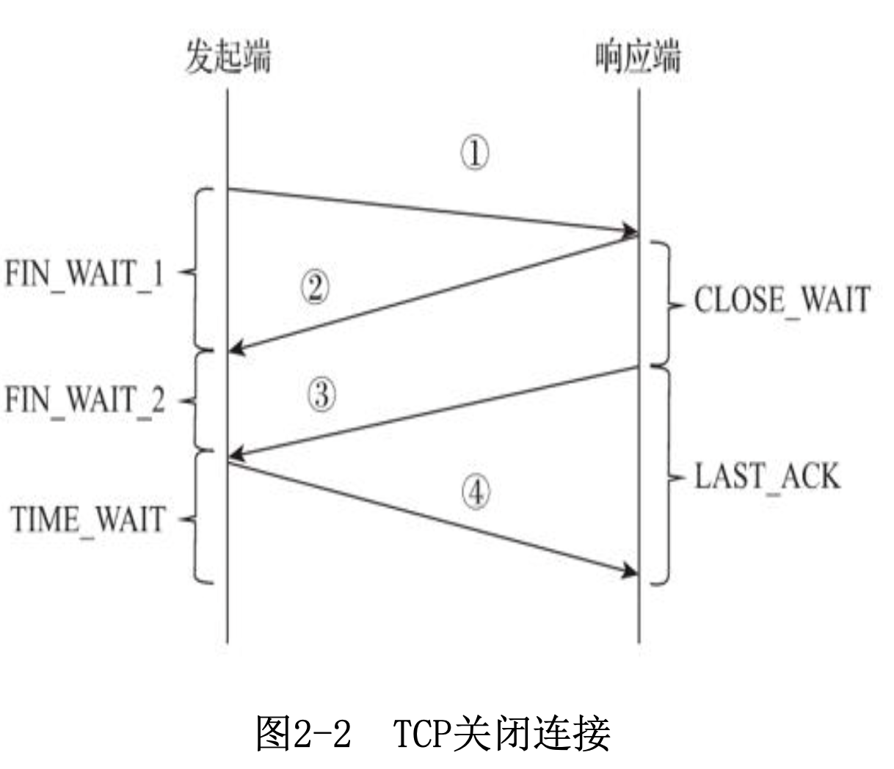

1. 发起端 -> 响应端

   关闭报文：FIN=1，编号 seq=u

   status

   - 发起端：FIN_WAIT_1
   - 响应端：无

2. 响应端 -> 发起端

   确认报文：ACK=1，确认号 ack=u+1，编号 seq=v

   status

   - 发起端：FIN_WAIT_1
   - 响应端：CLOSE_WAIT

3. 发起端等待，等待响应端的连接释放报文

   status

   - 发起端：FIN_WAIT_2
   - 响应端：CLOSE_WAIT

4. 响应端 -> 发起端

   连接释放报文：FIN=1，ACK=1，编号 seq=w，确认号 ack=u+1

   status

   - 发起端：FIN_WAIT_2
   - 响应端：LAST_ACK

5. 发起端 -> 响应端，在等待 2 倍MSL（Maximun Segment Lifetime）时间后关闭连接释放资源。

   确认报文：ACK=1，确认号 ack=w+1，seq=u+1（第一步发送的下一个报文）

   status

   - 发起端：TIME_WAIT
   - 响应端：LAST_ACK

6. 响应端收到报文，关闭连接释放资源

7. PS：有时发起端也可以在第一步中发送 reset 报文给响应端，无需经过后三步直接关闭连接。

关闭连接的动作不限于 Client 和 Server，不同角色都可以作为发起端，来主动发起关闭连接的请求。

### 2.2 Nginx 源码编译

#### 2.2.1 Nginx 源码获取

直接通过官网即可下载到源码。

```shell
mkdir -p /opt/data/source
cd /opt/data/source
wget http://nginx.org/download/nginx-1.17.4.tar.gz
tar zxmf nginx-1.17.4.tar.gz
```

#### 2.2.2 编译配置参数

编译 Nginx 源码之前首先需要通过编译配置命令`configure`进行编译配置，该命令常用配置参数如下表：

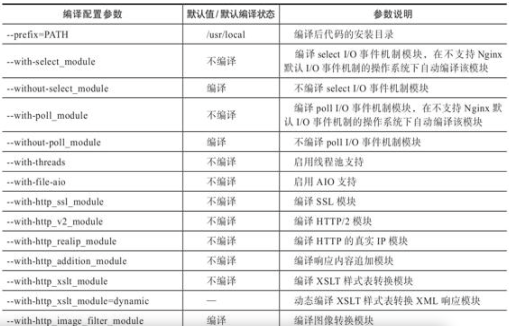


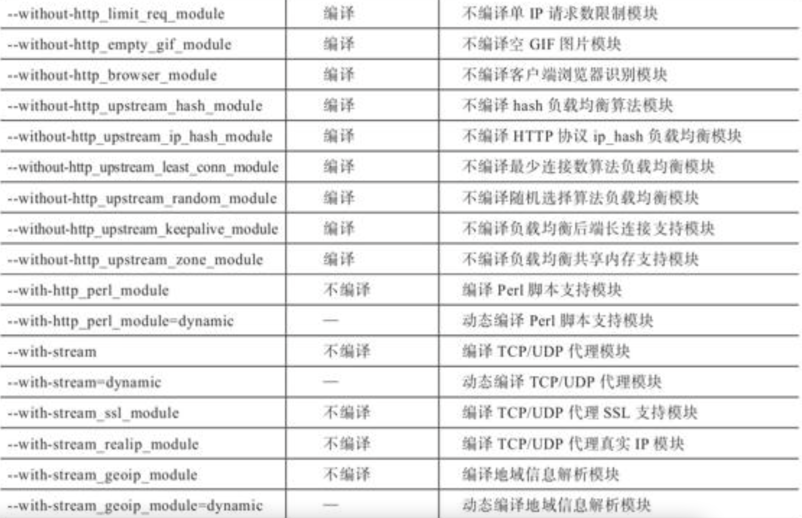


对于上表，有以下几点说明：

- TCMalloc 是谷歌开源的一个内存管理分配器，要优于 Glibc 的 malloc 内存管理分配器。
- upstream 指的是被代理服务器组的 Nginx 内部表示，通常称为上游服务器
- 开启 pcre JIT 支持，可以提升处理正则表达式的速度

如上表所示，带`--with`前缀的编译配置参数的模块都不会被默认编译。相反，具有带`--without`前缀的编译配置参数的模块都会被默认编译。

除了上述配置参数以外，也可以通过`./configure --help`帮助命令来获得更多的编译配置参数。

#### 2.2.3 代码编译

安装编译工具以及依赖库，脚本如下：

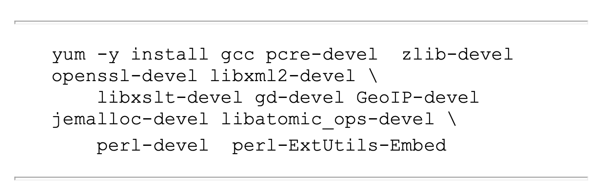

编译所有功能模块，脚本如下：

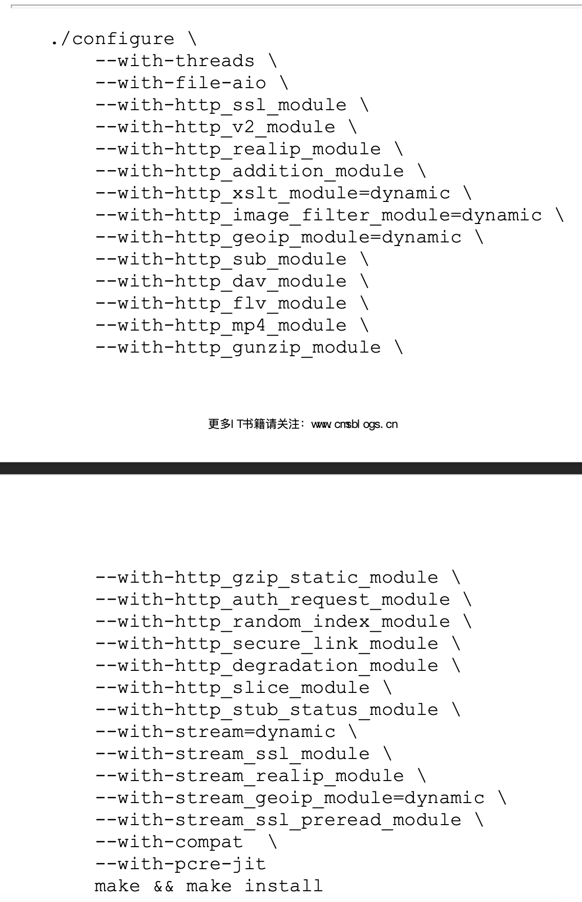

实际使用时可根据具体的需求灵活调整参数配置，编译后，默认安装目录为`/sur/local/nginx`

#### 2.2.4 添加第三方模块

Nginx 的功能以模块方式存在，有两种添加第三方功能模块的方法：

- 添加第三方静态模块：

  ```shell
  ./configure --add-module=../ngx_http_proxy_connect_module
  ```

- 添加第三方动态模块：

  ```shell
  ./configure --add-dynamic-module=../ngx_http_proxy_connect_module --with-compat
  ```

如此就可以在执行`make`命令的时候同步编译这些模块了。

### 2.3 Tengine 源码编译

源码获取：

```shell
mkdir -p /opt/data/source
cd /opt/data/source
wget http://tengine.taobao.org/download/tengine-2.3.2.tar.gz
tar zxmf tengine-2.3.2.tar.gz
```

相较 Nginx 开源版 Tengine 新增的参数：

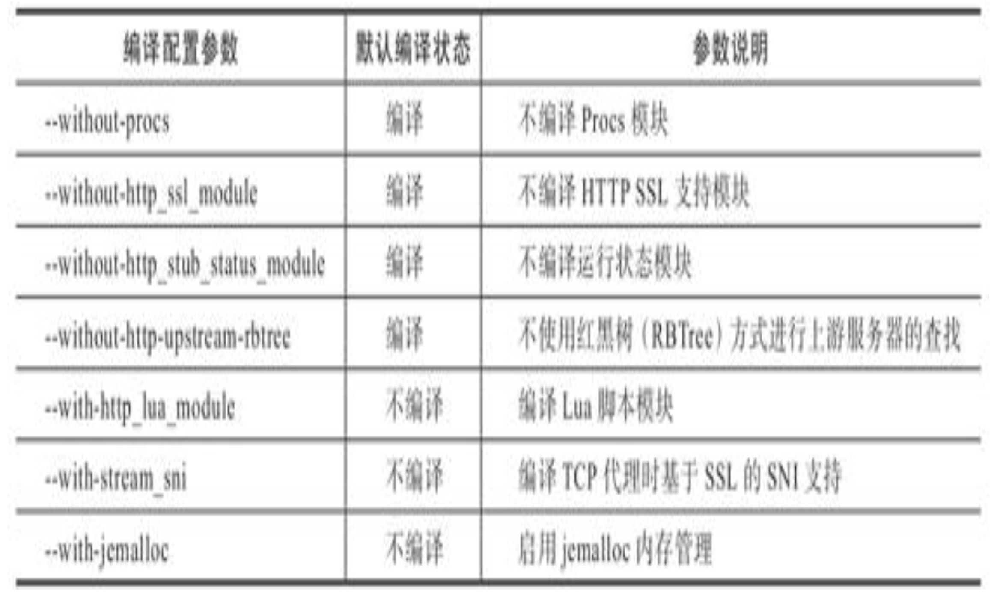

其中，jemalloc 是 Facebook 开源的一个内存分配管理器。

代码编译：

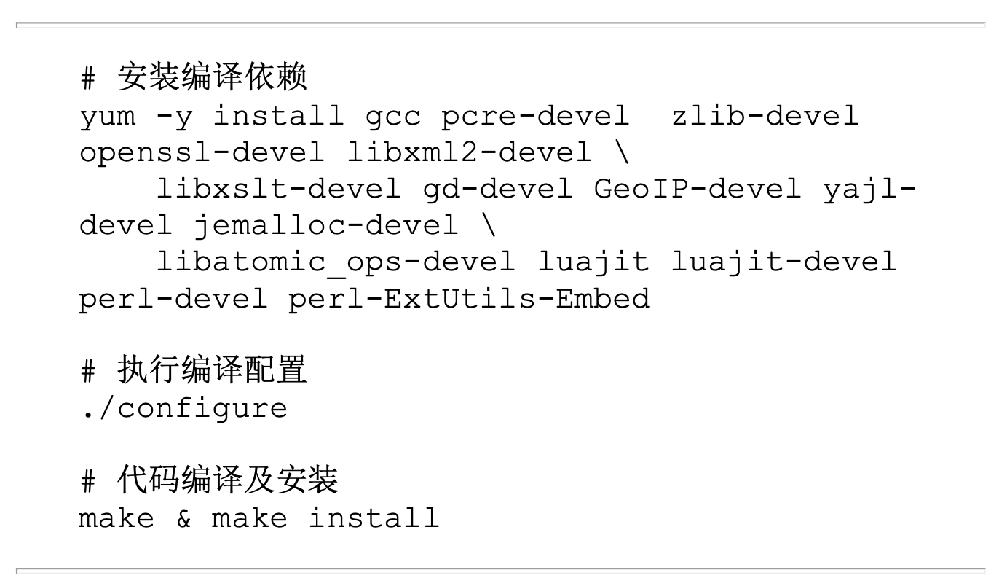

推荐安装 LuaJIT，是 Lua 语言的高效版本，编译完成后默认安装目录为`/usr/local/nginx`

Tengine 集成的三方模块，需要用户自己通过`--add-module`进行选择：


Tengine 编译完成后，可使用`nginx -m`命令查看所有已经加载的模块，带有 static 标识是静态编译的，而 shared 标识是动态编译的。

### 2.4 OpenResty 源码编译

源码获取：

```shell
mkdir -p /opt/data/source
cd /opt/data/source
wget https://openresty.org/download/openresty-1.15.8.2.tar.gz
tar zxmf openresty-1.15.8.2.tar.gz
```

#### 2.4.2 编译参数配置

OpenResty 是 Nginx 的扩展版，其编译配置参数也有清晰地区分，分为原有编译配置和扩展配置两部分，扩展部分参数如下：


关于上面的参数，有几点要说明的是：

- 扩展的功能模块是被默认编译的
- DTrace 是基于系统底层的性能监控技术，可以监控函数级别的内存，CPU 性能数据。

#### 2.4.3 代码编译

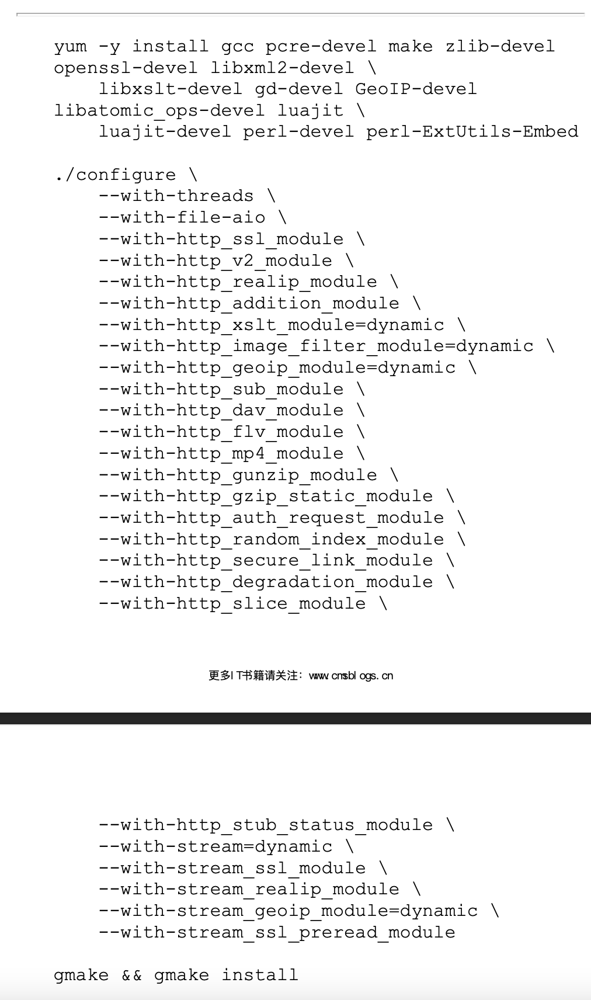

编译完成后，openresty 默认安装于 /usr/local/openresty 下，Nginx 则安装于 /usr/local/openresty/nginx 下。

#### 2.4.4 OpenResty 集成的模块

OpenResty 既支持直接在配置文件中，通过 OpenResty 定义的指令区域直接编写 Lua 语法命令，也可以通过引用方式调用外部的 Lua 脚本文件。OpenResty 提供了很多实用的 Nginx 模块和 Lua 支持库，具体如下：

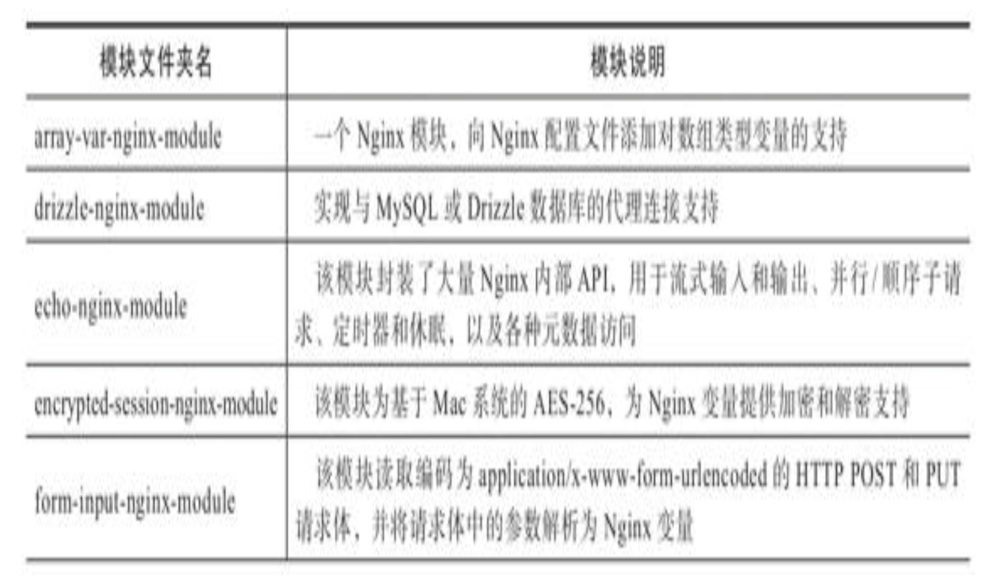


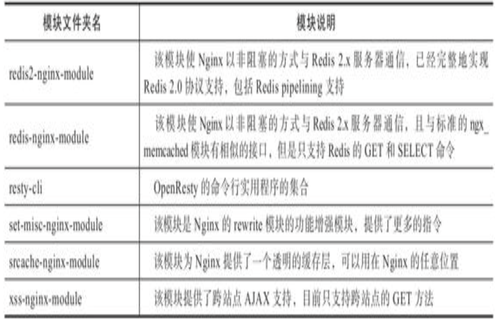

### 2.5 Nginx 部署

#### 2.5.1 环境配置

编译成功后，建议把 Nginx 执行文件的路径添加到环境变量中，使用如下命令：

```shell
cat >/etc/profile.d/nginx.sh << EOF
PATH=$PATH:/usr/local/nginx/sbin
EOF
source /etc/profile
```

对于 OpenResty，为了保持跟 Nginx 的一致性，可以将 Nginx 目录软链接到 /usr/local 目录下：

```shell
ln -s /usr/local/openresty/nginx /usr/local/nginx
```

在 CentOS 中，配置文件通常在 /etc 目录下建议将 Nginx 的 conf 目录软链接到 /etc 目录下。

```shell
ln -s /usr/local/nginx/conf /etc/nginx
```

#### 2.5.2 命令行参数

通过`-h`参数可以获取 Nginx 命令行的执行参数：

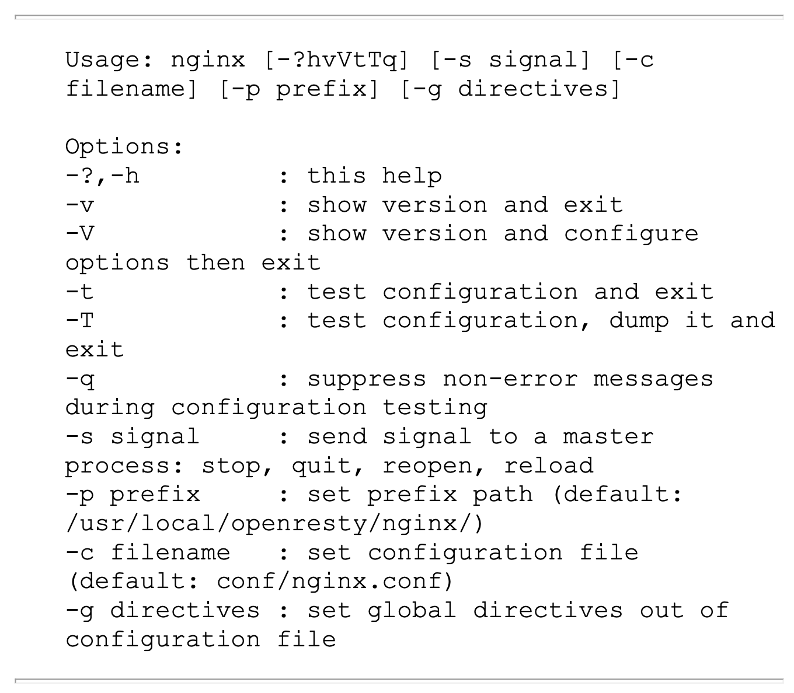

上述代码中，主要参数解释如下：

- -v：显示执行文件的版本信息
- -V：显示Nginx执行文件的版本信息和编译配置参数
- -t：进行配置文件语法检查，测试配置文件有效性
- -T：在进行配置文件语法检查的同时，输出所有有效的配置内容
- -q：在测试配置文件语法检查时，不输出非错误的信息
- -s：发送信号给 Nginx 主进程，信号可分为以下4个：
  - stop：快速关闭
  - quit：正常关闭
  - reopen：重新打开日志文件
  - reload：重新加载配置文件，启动一个加载新的配置文件的 Worker Process 并关闭旧的配置文件的工作进程。
- -p：执行 Nginx 的执行目录，默认为编译时的安装目录 /usr/local/nginx
- -c：指定 nginx.conf 文件的位置，默认为 conf/nginx.conf
- -g：通过外部传参，来指定配置文件中的全局指令

具体应用示例如下：

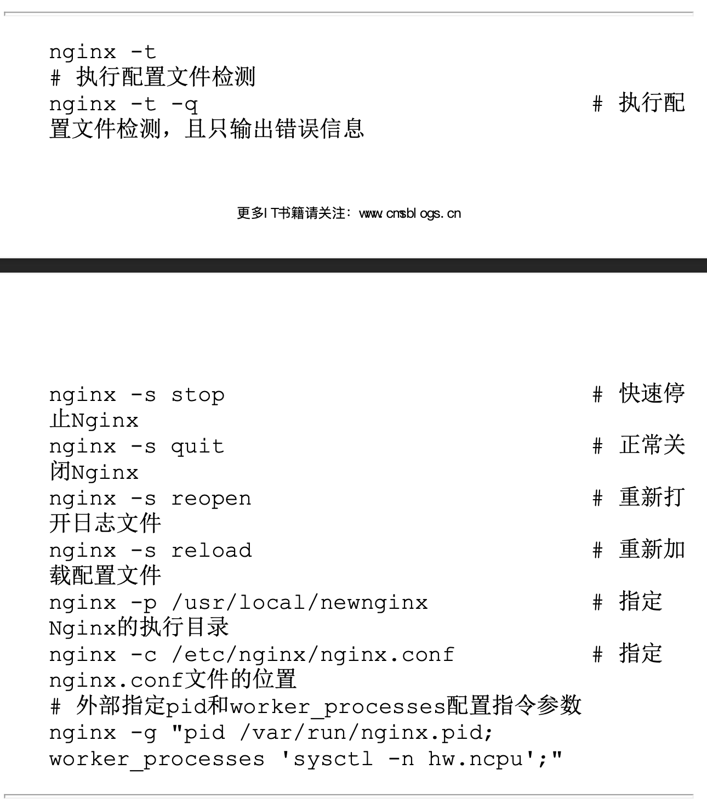

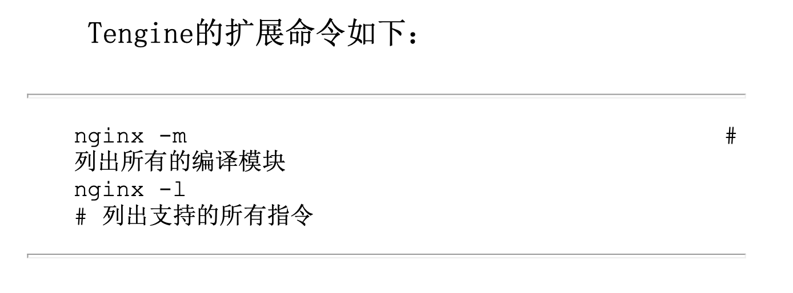

#### 2.5.3 注册系统服务

可以在 CentOS 中将 Nginx 手动注册为系统服务 systemd，随后就可以用系统自带的 systemctl 工具进行管理。

详细步骤命令如下：

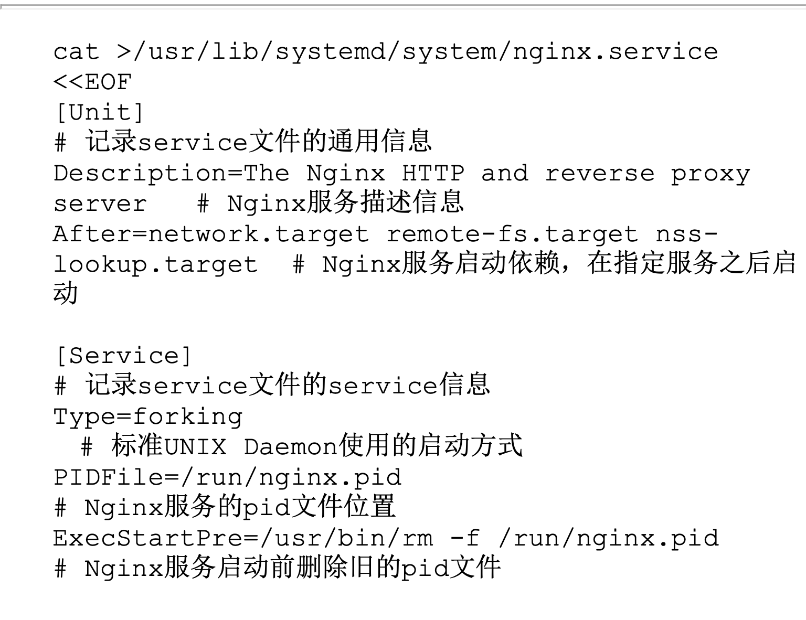

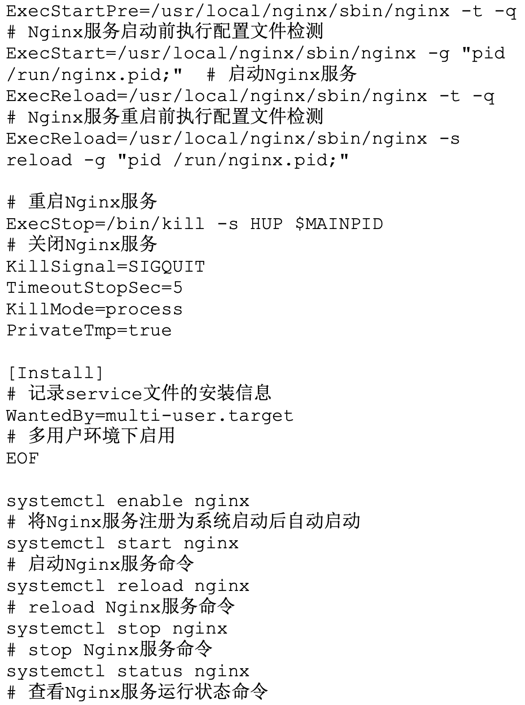

### 2.6 Nginx 的 Docker 容器化部署

1. Centos 下 Docker 安装：

   ```shell
   # 安装yum工具
   yum install -y yum-utils
   # 安装Docker官方yum源
   yum-config-manager --add-repo https://download.docker.com/linux/centos/docker -ce.repo
   # 安装Docker及docker-compose应用
   yum install -y docker-ce docker-compose
   # 设置Docker服务开机自启动
   systemctl enable docker
   # 启动Docker服务
   systemctl start docker
   ```

2. Nginx 镜像 Dockerfile 脚本（基础镜像选用CentOS 7，Nginx选用Nginx的扩展版本OpenResty 1.15.8.2）：

   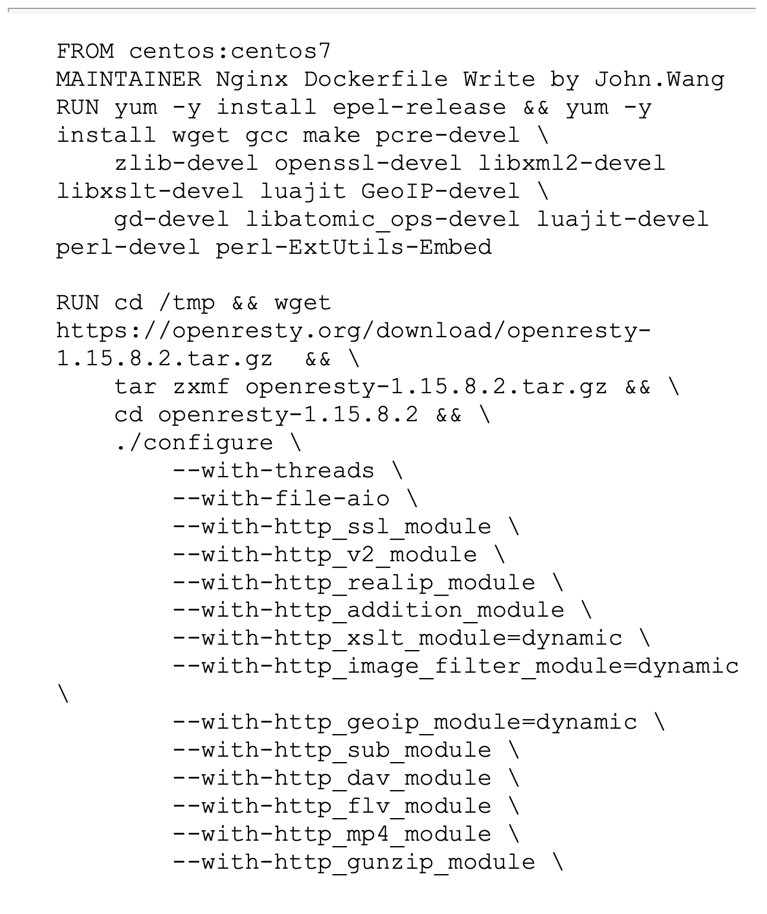

   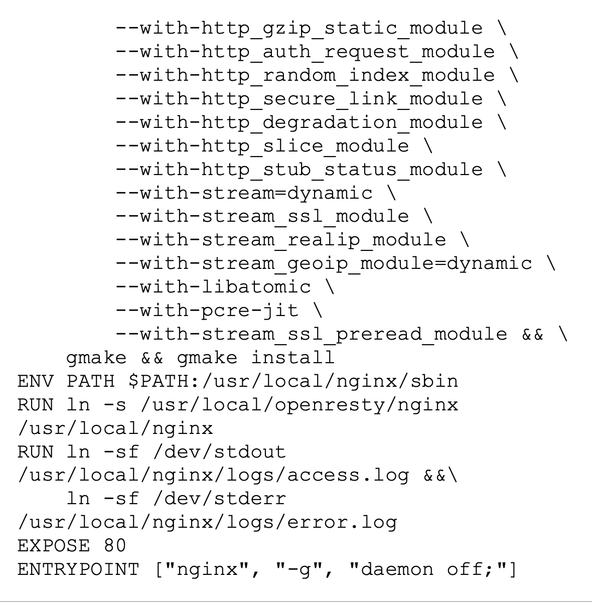

   随后在同一目录下执行构建命令：

   ```shell
   docker build -t nginx:v1.0 .
   ```

3. Nginx Docker 运行：

   ```shell
   docker run --name nginx -p 80:80 -d nginx:v1.0
   ```
   
   若是需要配置文件持久化下，则将配置文件挂载到 volume 并运行：
   
   ```shell
   mkdir -p /opt/data/apps/nginx/
   docker cp nginx:/usr/local/nginx/conf/opt/data/apps/nginx/
   docker stop nginx
   docker rm nginx
   docker run --name nginx -h nginx -p 80:80 -v /opt/data/apps/nginx/conf:/usr/local/nginx/conf -d nginx:v1.0
   ```
   
   亦或是使用 docker-compose 进行容器编排：
   
   ```yaml
   # docker-compose.yaml
   nginx:
     image: nginx:v1.0
     restart: always
     container_name: nginx
     hostname: 'nginx'
     ports:
     	- 80:80
     volumes:
     	- '/opt/data/apps/nginx/conf:/usr/local/nginx/conf'
   ```

