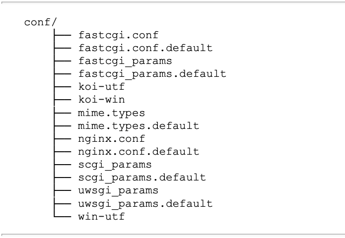

# 《Nginx应用与运维实战》学习笔记（3）

## 第3章 Nginx核心配置指令

作为一款高性能 HTTP 服务器软件，Nginx 的核心功能就是应对 HTTP 请求的处理。Nginx 提供了多种配置指令，让用户可以根据实际的软硬件及使用场景场景进行灵活配置。

Nginx 的配置指令可以按照在代码中的分布，分为两大类：

- 核心配置指令
  - 事件核心配置，主要用于 Nginx 的运行管理，以及事件驱动架构相关的配置指令
  - HTTP 核心配置，主要用于配置：客户端从发起 HTTP 请求、完成 HTTP 请求处理、返回处理结果，到关闭 HTTP 连接的完整过程，其中的各个处理方法都可以通过配置指令进行配置。
- 模块配置指令：指在每个 Nginx 模块中对所在模块的操作方法进行配置的指令。

本章主要介绍的核心配置指令会涉及如下内容：

- Nginx 配置文件（nginx.conf）的结构解析
- Nginx 事件核心配置指令详解
- Nginx HTTP 核心配置指令详解

### 3.1 Nginx 配置文件解析

Nginx 默认编译安装后，配置文件都会保存在 /usr/local/nginx/conf 目录下。nginx 默认的主配置文件是 nginx.conf，这也是 Nginx 唯一的默认配置入口。

以 .default 为扩展名的文件的文件是 Nginx 配置文件的样例文件。各配置文件的说明如下：

- fastcgi_params：Nginx 在配置 FastCGI 代理服务时根据该文件的配置向 FastCGI 服务器传递变量。该配置文件现在已经由 fastcgi.conf 代替。
- fastcgi.conf：为了规范配置指令 SCRIPT_FILENAME 的用法，引入 FastCGI 变量传递配置。
- mime.types：MIME 类型映射表，Nginx 会根据服务端文件后缀名在映射关系中获取所属的文件类型，并且将文件类型添加到 HTTP 消息头字段 “Content-Type” 中。
- nginx.conf：Nginx 默认的配置入口文件。
- scgi_params：Nginx 在配置 SCGI 代理服务器时根据该文件向服务器传递变量。
- uwsgi_params：Nginx 在配置 uWSGI 代理服务器时根据该文件向服务器传递变量。
- koi-utf、koi-win、win-utf：这 3 个文件是 KOI8-R 编码转换的映射文件，因为 Nginx 的作者是俄罗斯人，在 Unicode 流行之前，KOI8-R 是使用最为广泛的俄语编码。

#### 3.1.2 配置文件结构

> 本次阅读至 128 下次阅读应至 P168