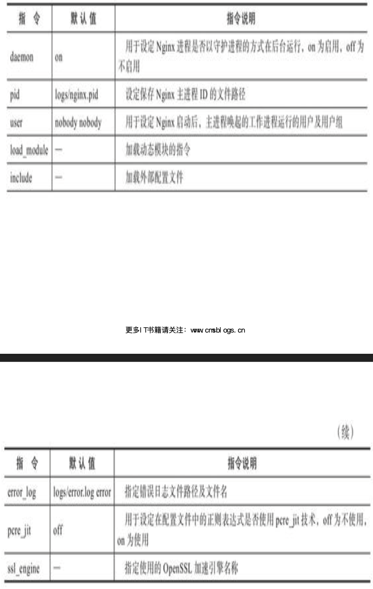

# 《Nginx应用与运维实战》学习笔记（3）

## 第3章 Nginx核心配置指令

作为一款高性能 HTTP 服务器软件，Nginx 的核心功能就是应对 HTTP 请求的处理。Nginx 提供了多种配置指令，让用户可以根据实际的软硬件及使用场景场景进行灵活配置。

Nginx 的配置指令可以按照在代码中的分布，分为两大类：

- 核心配置指令
  - 事件核心配置，主要用于 Nginx 的运行管理，以及事件驱动架构相关的配置指令
  - HTTP 核心配置，主要用于配置：客户端从发起 HTTP 请求、完成 HTTP 请求处理、返回处理结果，到关闭 HTTP 连接的完整过程，其中的各个处理方法都可以通过配置指令进行配置。
- 模块配置指令：指在每个 Nginx 模块中对所在模块的操作方法进行配置的指令。

本章主要介绍的核心配置指令会涉及如下内容：

- Nginx 配置文件（nginx.conf）的结构解析
- Nginx 事件核心配置指令详解
- Nginx HTTP 核心配置指令详解

### 3.1 Nginx 配置文件解析

Nginx 默认编译安装后，配置文件都会保存在 /usr/local/nginx/conf 目录下。nginx 默认的主配置文件是 nginx.conf，这也是 Nginx 唯一的默认配置入口。


以 .default 为扩展名的文件的文件是 Nginx 配置文件的样例文件。各配置文件的说明如下：

- fastcgi_params：Nginx 在配置 FastCGI 代理服务时根据该文件的配置向 FastCGI 服务器传递变量。该配置文件现在已经由 fastcgi.conf 代替。
- fastcgi.conf：为了规范配置指令 SCRIPT_FILENAME 的用法，引入 FastCGI 变量传递配置。
- mime.types：MIME 类型映射表，Nginx 会根据服务端文件后缀名在映射关系中获取所属的文件类型，并且将文件类型添加到 HTTP 消息头字段 “Content-Type” 中。
- nginx.conf：Nginx 默认的配置入口文件。
- scgi_params：Nginx 在配置 SCGI 代理服务器时根据该文件向服务器传递变量。
- uwsgi_params：Nginx 在配置 uWSGI 代理服务器时根据该文件向服务器传递变量。
- koi-utf、koi-win、win-utf：这 3 个文件是 KOI8-R 编码转换的映射文件，因为 Nginx 的作者是俄罗斯人，在 Unicode 流行之前，KOI8-R 是使用最为广泛的俄语编码。

#### 3.1.2 配置文件结构

Nginx 配置文件内有几个名词定义：

- 配置指令：在配置文件中，由 Nginx 约定的内部固定字符串，Nginx 官方将其称为 directive。指令是 Nginx 中功能配置的最基本元素，Nginx 的每个功能配置都是通过多个不同的指令组合来实现的。
- 配置指令值：每个配置指令都有对应的内容来表示该指令的控制参数。指令值可以是字符串、数字或变量等多种类型。
- 配置指令语句：指令与指令值组合构成的指令语句。一条指令语句可以包含多个配置指令值，每条指令语句都要用`;`作为语句结束的标识符。
- 配置指令域：配置文件 nginx.conf 中的上方，没有其他指令域的区域被称为配置全局域，简称全局域。

Nginx 的常见配置指令域如表 3-1 所示：


打开系统默认的 nginx.conf 文件，可以看到整个文件的结构如下：

```nginx
user nginx;
# 只启动一个工作进程
worker_processes 1;

error_log /var/log/nginx/error.log notice;
pid /var/run/nginx.pid;


events {
    # 每个工作进程的最大连接为 1024
    worker_connections 1024;
}


http {
    # 引入 MIME 类型映射表文件
    include /etc/nginx/mime.types;
    # 全局默认映射类型为 application/octet-stream
    default_type application/octet-stream;

    log_format main
        '$remote_addr - $remote_user [$time_local] "$request" '
        '$status $body_bytes_sent "$http_referer" '
        '"$http_user_agent" "$http_x_forwarded_for"';

    access_log /var/log/nginx/access.log main;
    
    # 启用零复制机制
    sendfile on;
    #tcp_nopush     on;

    # 保持连接超时时间为 65s
    keepalive_timeout 65; 

    #gzip  on;

    server {
        # 监听80端口的网络连接请求
        listen 80;
        listen [::]:80;
        # 虚拟主机名为localhost
        server_name localhost;

        location / {
            root /usr/share/nginx/html;
            index index.html index.htm;
        }

        error_page 500 502 503 504 /50x.html;
        location = /50x.html {
            root /usr/share/nginx/html;
        }
    }
  	# include /etc/nginx/conf.d/*.conf;
}
```

由上述配置文件可以看出，配置文件中的指令和指令值是以 key-value 的形式书写的。各指令域中的共用范围逐层被上层指令域限定，各指令域匹配的顺序是由外到内的。包含在最内层的指令将对外层同名指令值进行覆盖，并以最内层指令配置为最终生效配置。

- 写在全局域的指令是 Nginx 配置文件的核心指令，是对 Nginx 自身软件运行进行配置的指令。
- 写在 events 中的部分为事件指令域
- 写在 http 中的部分为 HTTP 指令域
  - server 指令域被包含于 http 指令域中
    - location 指令域被包含于 server 指令域中

编写 Nginx 配置文件时，为了便于维护，会把一些指令或指令域写在外部文件中，再通过 include 指令引入 nginx.conf 主配置文件中。例如，配置文件中把写有 types 指令域的 mime.types 文件引用到 http 指令域中，此时要注意使用的是 nginx.conf 文件的相对路径。

#### 3.1.3 配置文件中的计量单位

在 Nginx 配置文件中有很多与容量、时间相关的指令值，Nginx 配置文件有如下规范：

1. 容量单位（最小单位为字节 B）示例如下：

   ```txt
   512
   1k 或 1K
   10m 或 10M
   1g 或 1G
   ```

2. 时间单位（最小单位为毫秒）示例如下：

   ```txt
   10ms # 10毫秒
   30s # 30秒
   2m # 2分钟
   5h # 5小时
   1h 30m # 1小时30分钟
   6d # 6天
   3w # 3周
   5M # 5个月
   2y # 2年
   ```

#### 3.1.4 配置文件中的哈希表

Nginx 使用哈希表加速对 Nginx 配置中常量的处理，如 server 中的主机名、types 中的 MIME 类型映射表、请求头属性字段等数据集合。由于数据的复杂性，会可能出现哈希冲突的情况，Nginx 引入了哈希桶机制，把相同关键码的哈希建存在一个哈希桶定义的存储空间中，然后再进行二次计算来获取相应的值。

Linux 系统下查看 CPU 缓存行的指令如下：

```shell
cat /proc/cpuinfo | grep cache_alignment
```

### 3.2 Nginx 的进程核心配置指令

Nginx 的进程核心配置指令包含在 Nginx 核心代码及事件管理模块中，可分为四个部分：

- 进程管理
- 进程调优
- 进程调试
- 事件处理

#### 3.2.1 进程管理

Nginx 在运行时，用户可以对其运行方式、动态加载模块、日志输出等使用其内建的基础配置指令进行配置。进程管理指令如下：



其中，pcre_jit 需要 Nginx 在配置编译时加上`--with-pcre-jit`参数，而 error_log 的日志级别可以为如下值：debug、info、notice、warn、error、crit、alert、emerg。

在 Linux 系统中，可以使用如下命令查看 OpenSSL 加速引擎信息：

```shell
openssl engine -t
```

#### 3.2.2 进程调优

Nginx 是按照事件驱动架构设计的。每个外部请求都会以事件的形式被工作进程（Worker Process）响应，并发完成各种功能的操作处理。

在实际应用场景中，用户需要按照自己的硬件、操作系统或应用场景需求的侧重点进行配置调整。调优指令如下所示：

1. 指令：thread_pool 线程池指令

   说明：线程池配置指令。使用线程池机制时，通过配置该指令，可以在因读取文件和发送文件而引发阻塞的场景中提升 Nginx 读取和发送文件的处理性能。

   作用域：main

   默认值：`thread_pool default threads=32 max_queue=65536`

   配置文件中的配置样例如下：`thread_pool pool_1 threads=16`

   具体参数如下：

   - thread_pool 可以编写在 http 指令域中
   - threads 参数定义了线程池的线程数
   - max_queue 参数制定了等待队列中的最大任务书，在线程池中的所有线程都处于繁忙状态时，新任务就会进入等待队列。该值最大任务数为 65536
   - 线程池指令需要在编译配置时增加`--with-threads`参数

2. 指令：timer_resolution 定时器方案指令

   说明：Nginx 中的处理事件超时管理方案有两种：一种是设定一个定时器，过一段时间对所有的超时事件进行一次扫描。另一种是先计算出距离当前事件最近的将要发生超时事件的时间，等待这个时间后再去进行一次超时检测。默认配置下会使用第二种检测方案，该方案在硬件 IO 场景比较多的场景下，会导致频繁调用时间函数从而导致性能问题。此时可以采用第一个方案，让 Nginx 的内置定时器进行周期检测，无需调用时间函数 gettimeofday 更新时间，从而减少资源消耗。当然，在调用时间函数引发的资源消耗不大的场景中可以不设定该指令。
   
   作用域：main
   
   默认值：-
   
   配置样例：`timer_solution 100ms`
   
3. 指令：worker_priority 工作进程优先级指令

   说明：该指令的指令值取值范围是 -20~19，通过该指令可以设定工作进程在 Linux 系统中的优先级（nice 值），数值越小，优先级越高，获得的 CPU 时间就越多，配置后，可以通过如下命令查看：

   ```shell
   ps axo command,pid,ni | grep nginx | grep -v
   ```

   作用域：main

   默认值：0

   配置样例：`worker_priority -5`

4. 指令：worker_process 工作进程数指令

   说明：通过该指令可以手动设置工作进程的数量，该指令也支持 auto 指令值，让 Nginx 进行自行分配

   作用域：main

   默认值：1

   可配置值：number 或 auto

   配置样例：`worker_processes auto`

5. 指令：worker_cpu_affinity 工作进程CPU绑定指令

   说明：该指令可以手动进行工作进程与 CPU 的绑定，使得每个进程均可固定在一个 CPU 上运行，也可以通过设定 auto 让 Nginx 自行分配。

   作用域：main

   默认值：-

   可配置选项：cpumark 或 auto

   配置样例：

   ```nginx
   worker_process 8;
   worker_cpu_affinity 00000001 00000010 00000100 00001000 00010000 00100000 01000000 10000000;
   ```

   上面的指令值是用 CPU 掩码来表示的。

   工作进程 CPU 绑定指令仅适用于 FreeBSD 和 Linux 操作系统。

6. 指令：worker_rlimitt_nofile 工作进程开文件数指令

   说明：设置 Nginx 所有工作进程同时打开文件的最大数量，默认为系统的文件打开数。

   作用域：main

   默认值：-

   配置样例：`worker_rlimit_nofile 65536;`

7. 指令：worker_shutdown_timeout 工作进程关闭等待时间指令

   说明：设置 Nginx 正常关闭工作进程的超时时间。当超过这个时间时，Nginx 主进程将会关闭工作进程。

   作用域：main

   默认值：-

   配置样例：`worker_shutdown_timeout 10s;`

8. 指令：lock_file 设置互斥锁文件指令

   说明：设置互斥锁文件指令，在开启 accept_mutex 进程调度模式或使用共享内存的场景下。需要用到互斥锁机制。而在不支持原子操作，无法通过共享内存实现互斥锁的场景下，需要通过该指令来制定一个互斥锁文件。

   作用域：main

   默认值：logs/nginx.lock

   配置样例：`lock_file logs/nginx.lock`

#### 3.2.3 进程调试

当 Nginx 调整配置或发生异常时，用户可以使用下列指令来对内存中各状态机，变量等数据内容进行调试：

1. 指令：master_process 主进程指令

   说明：设定为 off 时，Nginx 将只运行一个主进程来管理所有请求，从而更方便 debug。设置为 on 时，Nginx 会默认以一个主进程管理多个工作进程的方式处理请求。

   作用域：main

   默认值：on

   可配置选项：on/off

   配置样例：`master_process off;`

2. 指令：debug_points 调试点控制指令

   作用域：main

   默认值：-

   可配置选项：stop 或 abort

   说明：指令用于调试点的控制，为 stop 时，执行到内部调试点时会发出 SIGSTOP 信号，方便用户进行调试；为 abort 时则会停止进程并创建 corefile

   配置样例：`debug_points stop;`

3. 指令：working_directory 工作目录指令

   作用域：main

   默认值：-

   说明：该指令用于设定工作进程保存崩溃文件的目录，让 Nginx 在程序崩溃时在该指令值的目录中写入崩溃文件。对于崩溃的 log 文件可以使用工具 objdump、GDB 进行文件分析。

   配置样例：`working_directory logs`

4. 指令：worker_rlimit_core 调试文件大小指令

   作用域：main

   默认值：-

   说明：该指令是崩溃文件大小的设置指令。

   配置样例：`worker_rlimit_core 800m;`

#### 3.2.4 事件处理

Nginx 的事件处理指令在 events 指令域中，具体指令如下：

1. 指令：worker_connections 工作进程并发数指令

   作用域：events

   默认值：512

   说明：每个 Nginx 工作进程可处理并发连接的最大数。Linux 系统下，每个网络连接都将打开一个文件描述符，Nginx 可以处理的并发连接数受限于操作系统的最大打开文件数，而所有工作进程并发数也受到 worker_rlimit_nofile 指令值的限制。

   配置样例：

   ```nginx
   events {
     workder_connections 65535;
   }
   ```

2. 指令：use 事件处理机制选择指令

   作用域：events

   默认值：-

   说明：通过该指令选择一种高效的事件处理机制模型。Nginx 支持的事件模型有 select、poll、kqueue、epoll、/dev/poll、eventport

   配置样例：

   ```nginx
   events {
     use epoll;
   }
   ```

3. 指令：accept_mutex 互斥锁指令

   作用域：events

   默认值：off

   可配置选项：on 或 off

   说明：设置是否启用互斥锁模式的进程调度，在 Nginx 1.11.3 之前，互斥锁指令是默认开启的。

   配置样例：

   ```nginx
   events {
     accept_mutex on;
   }
   ```

4. 指令：accept_mutex_delay 互斥锁等待时间指令

   作用域：events

   默认值：500ms

   说明：通过该指令可以将抢锁等待时间设置为一个较短的时间，以提高进程争抢互斥锁的频率。

   配置样例：

   ```nginx
   events {
     accept_mutex_delay 300ms;
   }
   ```

5. 指令：mulit_accept 多请求支持指令

   作用域：events

   默认值：off

   可配置选项：on 或 off

   说明：默认情况下，每个工作进程只接受一个新连接。如果开启该指令，每个工作进程都会接受所有的新连接

   配置样例：

   ```nginx
   events {
     multi_accept on;
   }
   ```

6. 指令：worker_aio_requests

   作用域：events

   默认值：32

   说明：用于设置在 epoll 事件模式下，使用 AIO 时，单个工作进程未完成异步 I/O 操作的最大数

   配置样例如下：

   ```nginx
   events {
     worker_aio_requests 128;
   }
   ```

7. 指令：debug_connection

   作用域：events

   默认值：off

   可配置选项：address 或 CIDR 或 unix

   说明：对指定的客户端连接开启调试日志，该指令需要 Nginx 编译时通过`--with-debug`参数开启。

   配置样例：

   ```nginx
   events {
     debug_connection 127.0.0.1;
     debug_connection localhost;
     debug_connection 192.0.2.0/24;
     debug_connection ::1;
     debug_connection 2001:0db8::/32;
     debug_connection unix:;
   }
   ```

#### 3.2.5 核心指令配置样例

```nginx
daemon on;
# 以守护进程的方式运行Nginx
pid logs/nginx.pid;
# 主进程ID记录在logs/nginx.pid中
user nobody nobody;
# 工作进程运行用户为nobody
load_module "modules/ngx_http_xslt_filter_module.so";
# 加载动态模块ngx_http_xslt_

# filter_module.so
error_log logs/error.log debug;
# 错误日志输出级别为debug
pcre_jit on;
# 启用pcre_jit技术
thread_pool default threads=32 max_queue=65536;
# 线程池的线程数为32，等待队列中的最大 任务数为65536
timer_resolution 100ms;
# 定时器周期为100毫秒
worker_priority -5;
# 工作进程系统优先级为-5
worker_processes auto;
# 工作进程数由Nginx自动调整
worker_cpu_affinity auto;
# 工作进程的CPU绑定由Nginx自动调整
worker_rlimit_nofile 65535;
# 所有工作进程的最大连接数是65535
worker_shutdown_timeout 10s;
# 工作进程关闭等待时间是10秒
lock_file logs/nginx.lock;
# 互斥锁文件的位置是logs/nginx.lock
working_directory logs
# 工作进程工作目录是logs
debug_points stop;
# 调试点模式为stop
worker_rlimit_core 800m;
# 崩溃文件大小为800MB

events {
  worker_connections 65535;
  # 每个工作进程的最大连接数是65535
  use epoll;
  # 指定事件模型为epoll
  accept_mutex on;
  # 启用互斥锁模式的进程调度
  accept_mutex_delay 300ms;
  # 互斥锁模式下进程等待时间为300毫秒
  multi_accept on;
  # 启用支持多连接
  worker_aio_requests 128;
  # 完成异步操作最大数为128
  debug_connection 192.0.2.0/24;
  # 调试指定连接的IP地址和端口是192.0.2.0/24
}
```

