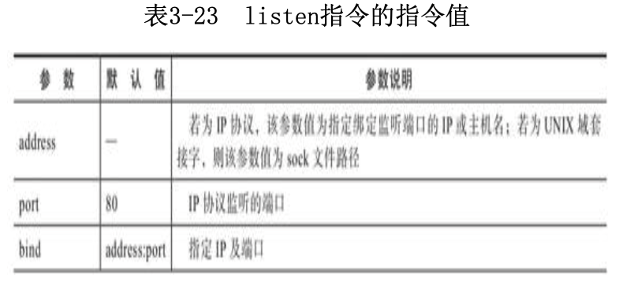
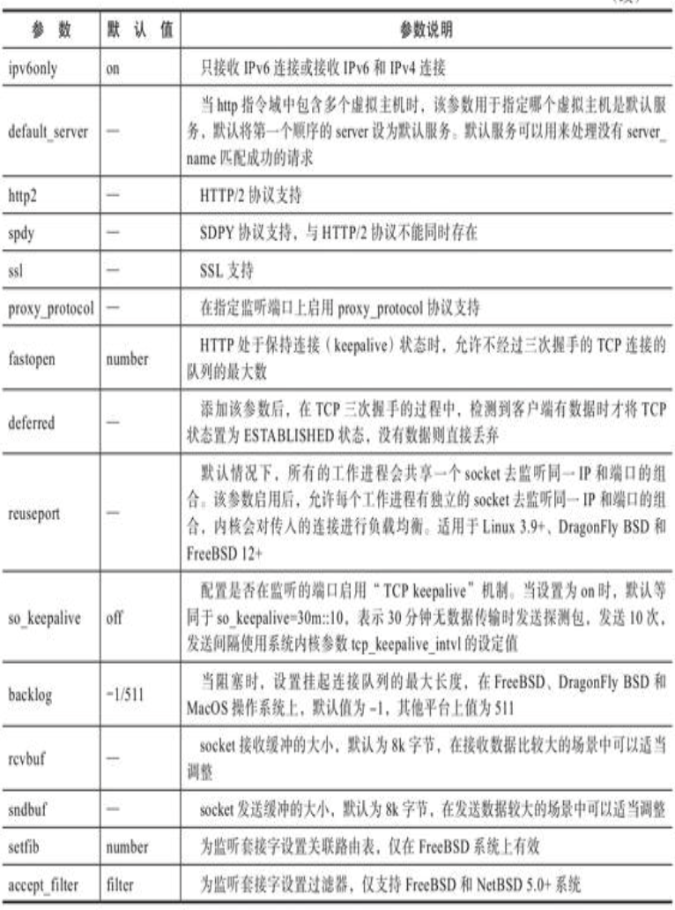

# 《Nginx应用与运维实战》学习笔记（4）

## 第3章 Nginx核心配置指令

### 3.3 HTTP核心配置指令

Nginx 最核心的功能就是处理 HTTP 请求，按照 HTTP 请求处理闭环流程模型，分为以下几步：

- 客户端发起 HTTP 请求，服务端解析 HTTP 请求头
- 服务端根据 HTTP 请求头中访问的 URI 与本地路径文件进行匹配，进行读数据或写数据的操作
- 服务端返回处理结果并断开 HTTP 连接

根据该流程，可以将 Nginx 的 HTTP 核心配置指令进行如下分类：

- 初始化服务
- HTTP 请求解析处理
- 访问路由 location
- 访问重写 rewrite
- 访问控制
- 数据处理
- 关闭连接
- 日志记录

#### 3.3.1 初始化服务

初始化服务指令包括：与 HTTP 虚拟主机服务的建立、端口监听及监听方式等服务初始化有关的配置指令。

1. 指令：listen 端口监听指令

   作用域：server

   默认值：以 root 用户运行时监听 80 端口，非 root 用户运行时监听 8000 端口

   说明：Nginx 通过 listen 指令监听网络请求，可以是 IP 协议的形式，也可以是 UNIX 域套接字，listen 指令的指令值针对监听方式提供了丰富的参数，可以使用的指令值如下：

   

   

   配置样例：

   ```nginx
   http {
     server {
       # 监听 127.0.0.1 的 8000 端口
       listen 127.0.0.1:8000;
       # 监听 127.0.0.1 的默认 8 0端口(root权限)
       listen 127.0.0.1;
       # 监听本机所有IP的8000端口
       listen 8000;
       # 监听本机所有IP的8000端口
       listen *:8000;
       # 监听 locahost 的 8000 端口
       listen localhost:8000;
       # 监听IPv6的回环IP的默认80端口(root权限)
       listen [::]:8000;
       # 监听域套接字文件
       listen unix:/var/run/nginx.sock;
       # 监听本机 8000 端口
       # 当前服务是 http 指令域的主服务
       # 开启 fastopen 功能并限定最大队列树为 30
       # 拒绝空数据连接
       # 工作进程共享 socket 这个监听接口
       # 请求阻塞时挂起队列数是1024个
       # 当socket为保持连接时，开启状态检测功能
       listen *:8000
         default_server
         fastopen=30
         deferred
         reuseport
         backlog=1024
         so_keepalive=on;
     }
   }
   ```

2. 指令：keepalive_disable 关闭保持连接指令

   作用域：http、server、location

   默认值：msie6

   说明：对指令的浏览器关闭保持连接机制，如果指令值为 none，则对所有的浏览器开启保持连接机制。保持连接机制可以使得同一客户端的多个 HTTP 请求复用 TCP 连接，降低服务器资源消耗。

   配置样例：

   ```nginx
   http {
     keeplive_disable none;
   }
   ```

3. 指令：keepalive_requests 保持连接复用请求数指令

   作用域：http、server、location

   默认值：100

   说明：同一 TCP 连接克服用的最大 HTTP 请求数，超过该数值以后将会关闭 TCP 连接

   配置样例：

   ```nginx
   http {
     keepalive_requests 1000;
   }
   ```

4. 指令：keepalive_timeout 保持连接超时指令

   作用域：http、server、location

   默认值：75s

   说明：TCP 连接内持续没有数据传输的最大时间，超过时间则关闭连接。该值的设定需要根据具体的场景来考虑。

   配置样例：

   ```nginx
   http {
     keepalive_timeout 75s;
   }
   ```

5. 指令：tcp_nodelay 保持连接时最快发数据指令

   作用域：http、server、location

   默认值：on

   说明：当 HTTP 处于连接状态，SSL，无缓冲代理、WebSocket 代理时，默认开启该指令，该指令允许小数据包发送，适用于延时敏感、小数据包的场景。当该指令为 off，数据包需要在缓存中达到一定量值才能发送。

   配置样例：

   ```nginx
   http {
     tcp_nodelay off;
   }
   ```

6. 指令：resolver 域名解析服务器指令

   作用域：http、server、location

   默认值：-

   说明：用于指定域名解析服务器（DNS）地址，解析服务器可以将 upstream 主机组中的主机域名解析为 IP 地址并让 Nginx 缓存解析结果。默认缓存时间时解析响应中的 TTL 值，可以通过 valid 参数进行调整，设置缓存解析结果的时间。

   指令值参数：

   - valid：设置缓存解析结果的时间
   - ipv6：默认配置下，Nginx 将在解析域名的同时查找 IPV4 和 IPV6 地址，设置 ipv6=off 可以关闭 IPV6 地址的查找。
   - status_zone：仅商业版本有效，设置收集指定区域请求和响应的 DNS 服务器统计信息

   配置样例：

   ```nginx
   http {
     resolver 127.0.0.1 [::1]:5353 valid=30s;
   }
   ```

7. 指令：resolver_timeout 域名解析超时指令

   作用域：http、server、location

   默认值：30s

   说明：设置进行域名解析时的超时时间

   配置样例：

   ```nginx
   http {
     resolver_timeout 5s;
   }
   ```

8. 指令：server_name 主机名指令

   作用域：server

   默认值：-

   说明：设定所在 server 指令域的主机名，当 server_name 的指令值有多个主机名时，第一个主机名为首主机名。

   配置样例：

   ```nginx
   http {
     server {
       # 泛域名的使用
       server_name example.com .example.com;
       # 多个后缀域名的使用(匹配 .com/.net 等等后缀)
       server_name www.example.;
       # 正则表达式匹配
       server_name www.example.com ~^www.example.com$;
       
       # 正则匹配变量的场景
       server_name ~^(www\.)?(.+)$;
       location / {
         root /sites/$2;
       }
       
       # 正则匹配为变量的场景
       server_name ~^(www\.)?(?<domain>.+)$;
       location / {
         root /sites/$domain;
       }
     }
   }
   ```

9. 指令：server_names_hash_max_size 主机名哈希表最大值指令

   作用域：http、server、location

   默认值：512

   说明：主机名的哈希表最大存储大小，当域名较多时，可使用该指令增加存储大小

   配置样例：

   ```nginx
   http {
     server_name_hash_max_size 1024;
   }
   ```

10. 指令：server_names_hash_bucket_size 主机名哈希桶最大值指令

    作用域：http、server、location

    默认值：-

    说明：哈希桶的大小默认与 CPU 缓存的大小一致，有 32、64、128 三个值，该值也适用于增加主机名的存储空间

    配置样例：

    ```nginx
    http {
      server_names_hash_bucket_size 128;
    }
    ```

11. 指令：variables_hash_max_size 变量哈希表最大值指令

    作用域：http

    默认值：512

    说明：Nginx 变量哈希表的最大存储大小

    配置样例：

    ```nginx
    http {
        variables_hash_max_size 1024;
    }

12. 指令：variables_hash_bucket_size 变量哈希桶最大值指令

    作用域：http

    默认值：64

    说明：变量哈希桶的最大存储大小

    配置样例：

    ```nginx
    http {
        variables_hash_bucket_size 128;
    }
    ```

#### 3.3.2 HTTP 请求处理

标准 HTTP 请求从开始到结束包括请求报文，响应报文。

请求报文由请求行、请求头、请求体组成。常见的响应报文包括响应行、响应头、响应体三个部分。

Nginx 接收 HTTP 请求后，处理相关的配置指令如下所示：

1. 指令：ignore_invalid_headers 忽略请求头无效属性指令

   作用域：http、server

   默认值：on

   指令值选项：on 或 off

   说明：忽略请求头中的无效属性字段（有效的属性字段是由**英文字符，数字和连接符组成**，不符合此标准的属性名均为无效属性），当指令值为 on 时，会对这些无效的属性名称进行过滤（PS：书中关于这里的说法反了）。

   配置样例：

   ```nginx
   http {
     ignore_invalid_headers off;
   }
   ```

2. 指令：underscores_in_headers 请求头中下划线连接属性名指令

   作用域：http、server

   默认值：off

   指令值选项：on 或 off

   说明：Nginx 官方并不推荐在请求头中采用下划线方式，因此 `_` 被认为是无效连接符。若启用该指令，`_`会被认为是有效的连接符。

   配置样例：

   ```nginx
   http {
     underscores_in_headers on;
   }
   ```

3. 指令：client_header_buffer_size 请求头缓冲区大小指令

   作用域：http, server

   默认值：1k

   说明：设置存放读取客户端请求头的缓冲区大小，默认值为 1K（B），当请求头的数据因为 cookie 过长等其他原因超过设定大小，会按照 large_client_header_buffers 的指令配置进行处理。

   配置样例：

   ```nginx
   http {
     client_header_buffer_size 2k;
   }
   ```

4. 指令：large_client_header_buffers 超大请求头缓冲区大小指令

   作用域：http，server

   默认值：4 8k

   说明：当请求头大小超过 client_header_buffer_size 之后，会将超出的部分转移到该缓冲区。默认第一次可以分配到 8KB 的缓冲区块，**请求行**如果超过这个大小会返回 414 错误。**请求头**会分为 4 次转移到该缓冲区中，如果超过了 4 次，会返回 400 错误。

   配置样例：

   ```nginx
   http {
     # 意思是 8KB 缓冲区，可以转移 10 次
     large_client_header_buffers 10 8k;
   }
   ```

5. 指令：client_header_timeout 请求头超时指令

   作用域：http、server

   默认值：60s

   说明：读取客户端请求头的最大超时时间

   配置样例：

   ```nginx
   http {
     client_header_timeout 180s;
   }
   ```

6. 指令：request_pool_size 请求头内存池大小指令

   作用域：http、server

   默认值：4k

   说明：Nginx 开始处理请求时，会为每个请求分配 4k 大小的内存池，以减少内核对小块内存的分配次数，在 HTTP 请求结束后再收回。（官方文档中说明该指令对性能的提升作用很小，不建议调整）

   ```nginx
   http {
     request_pool_size 4k;
   }
   ```

7. 指令：client_max_body_size 请求体大小指令

   作用域：http、server、location

   默认值：1m

   说明：HTTP 请求时，请求体的最大值限制。当请求头的属性 Content-Length 大小超过指令配置时，返回状态码 408。当指令值为 0 时，表示没有限制。

   配置样例：

   ```nginx
   http {
     client_max_body_size 100m;
   }
   ```

8. 指令：client_body_buffer_size 请求体缓冲区大小指令

   作用域：http、server、location

   默认值：32 位系统下 8KB，64 位系统下 16KB

   说明：设置读取客户请求体的缓冲区大小。如果请求体超过了该设定值，会按照 client_body_in_single_buffer 指令的配置全部写入到 client_body_temp_path 指定的文件中。

   配置样例：

   ```nginx
   http {
     request_pool_size 4k;
   }
   ```

9. 指令：client_body_in_single_buffer 请求体写入缓冲区指令

   作用域：http、server、location

   默认值：off

   说明：将完整的请求体存储在单个缓冲区中，当缓冲区大小不足时，会写入到 client_body_temp_path 设定的文件中。推荐在使用 $request_body 时启用该指令。

   配置样例：

   ```nginx
   http {
     client_body_in_single_buffer 4k;
   }
   ```

10. 指令：client_body_in_file_only 请求体写入文件指令

    作用域：http、server、location

    默认值：off

    指令值选项：off 或 clean 或 on

    说明：启用该指令后会禁用缓冲区，请求体会直接被写入 client_body_temp_path 指令设定的文件中。指令值为 on 时，HTTP 请求结束后临时文件会被保留。指令值为 clean 时，HTTP 请求结束后临时文件会被删除。

    配置样例：

    ```nginx
    http {
      client_body_in_file_only on;
    }
    ```

11. 指令：cliient_body_temp_path 请求体临时文件目录指令

    作用域：http、server、location

    默认值：client_body_temp_path cliient_body_temp

    说明：请求体被写入文件的临时目录。默认值由编译时 configure 的配置参数`--http-proxy-temp-path`决定，没有参数指定时，即为 Nginx 安装目录的 client_body_temp 文件夹。

    配置样例：

    ```nginx
    http {
      client_body_temp_path /tmp/nginx/client_temp1 2;
    }
    ```

12. 指令：client_body_timeout 请求体超时指令

    作用域：http、server、location

    默认值：60s

    说明：当 HTTP 请求建立连接以后，客户端在超过设定时间仍为发送请求体内容到服务端，Nginx 就会认为请求体超时，将返回响应状态码 408。

    配置样例：

    ```nginx
    http {
      client_body_timeout 120s;
    }
    ```

13. 指令：if_modified_since 文件修改判断指令

    作用域：http、server、location

    默认值：exact

    指令值选项：off 或 exact 或 before

    说明：在请求体中存在 if_modified_since 时，关闭或设置客户端文件修改时间的服务端校验功能。

    - 当指令值为 off 时，忽略请求头中 if_modified_since 属性的处理，关闭 Nginx 服务端的校验功能
    - 当指令值为 exact 时，与被请求文件的修改时间作精确匹配，即，如果完全相等则认为客户端缓存有效，返回 304 状态码
    - 当指令值为 before 时，当被请求文件的修改时间小于 if_modified_since 属性字段中设定的时间，就认为缓存有效，返回 304 状态码。

    配置样例：

    ```nginx
    http {
      if_modified_since before;
    }
    ```

14. 指令：etag 实体标签指令

    作用域：http、server、location

    默认值：on

    指令值选项：on 或 off

    说明：etag 用于在响应头中返回，与请求头中的 If-None-Match 属性值相对应，如果该值未被修改，则返回 304 状态码，否则返回最新的文件内容。

    配置样例：

    ```nginx
    http {
      etag off;
    }
    ```

15. 指令：max_ranges 范围请求的最大值指令

    作用域：http、server、location

    默认值：-

    说明：默认为不限制大小，当客户端以 byte-range 方式获取数据请求时，该指令限定了允许的最大值，当指令值为 0，则关闭以 byte-range 方式获取数据的功能。该指令可在断点续传等场景中使用。

    配置样例：

    ```nginx
    http {
      max_ranges 1024;
    }
    ```

16. 指令：types 文件类型指令集

    作用域：http、server、location

    默认值：-

    说明：被请求文件扩展名与 MIME 类型映射表

    配置样例：

    ```nginx
    types {
      application/octet-stream yaml;
    }
    
    # 将匹配路径的所有文件指定为MIME类型
    location /download/ {
      types        { }
      default_type application/octet-stream;
    }
    ```

17. 指令：types_hash_bucket_size 文件类型哈希桶大小指令

    作用域：http、server、location

    默认值：-

    说明：设定 MIME 类型哈希桶的大小，默认值与 CPU 缓存行的大小一致，有 32、64、128 这三个值。

    配置样例：

    ```nginx
    http {
      types_hash_bucket_size 64;
    }
    ```

18. 指令：error_page 错误跳转指令

    作用域：http、server、location

    默认值：-

    说明：当 HTTP 请求发生错误时，可以根据该状态码定义一个返回的页面或者执行跳转

    配置样例：

    ```nginx
    http {
      error_page 404 /404.html;
      error_page 500 502 503 504 /50x.html;
    }
    ```

    可设定为一个 location 的内部访问：

    ```nginx
    http {
      error_page 404 = @fallback;
      location @fallback {
        proxy_pass http://backend;
      }
    }
    ```

    响应状态码也可以通过“=response”语法进行修改：

    ```nginx
    http {
      error_page 404 =200 /empty.gif;
    }
    ```

19. 指令：recursive_error_pages 多级错误跳转指令


> 本次阅读至 204 下次阅读应至 P224

