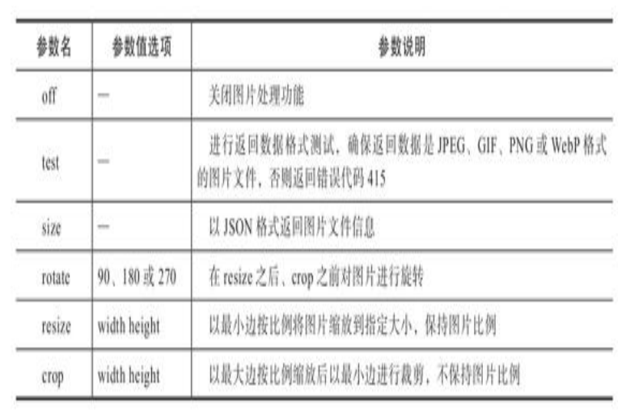

# 《Nginx应用与运维实战》学习笔记（8）

## 第 4 章 Nginx HTTP 模块详解

### 4.3　数据处理功能模块

当用户请求没有明确指定请求的文件名称时，Nginx 可以根据设定，返回默认数据。实现这一功能的包含以下三个模块：

- ngx_http_index_module
- ngx_http_random_index_module
- ngx_http_autoindex_module

常用指令如下所示：

1. 指令：index 首页指令

   作用域：http、server、location

   默认值：index index.html

   说明：设置 HTTP 服务器的默认首页。当指令值为多个文件时，会按照从左到右的顺序依次查找，找对对应文件后将结束查找。

   配置样例：

   ```nginx
   location / {
     index index.$geo.html index.html;
   }
   ```

2. 指令：random_index 随机首页指令

   作用域：location

   默认值：off

   指令值可选项：on 或 off

   说明：随机读取文件目录下的文件内容作为首页内容。

   - 该指令的执行优先级高于 index 指令
   - 文件目录中的隐藏文件将被忽略

   配置样例：

   ```nginx
   http {
     root /opt/nginx-web/html;
     location / {
       random_index on;
     }
   }
   ```

3. 指令：autoindex 自动首页指令

   作用域：http、server、location

   默认值：off

   指令值可选项：on 或 off

   说明：自动创建目录文件列表为目录首页

4. 指令：autoindex_format 自动首页格式指令

   作用域：http、server、location

   默认值：html

   指令值选项：html 或 xml 或 json 或 jsonp

   说明：设置 HTTP 服务器的自动首页文件格式

5. 指令：autoindex_exact_size 自动首页文件大小指令

   作用域：http、server、location

   默认值：on

   指令值选项：on 或 off

   说明：设置 HTTP 服务器的自动首页显示文件大小。默认文件大小单位为 Byte，当指令值为 off 时，将根据文件大小自动换算为 KB 或者 MB 或者 GB 的单位大小。

6. 指令：autoindex_localtime 自动首页时间指令

   作用域：http、server、location

   默认值：off

   可选值：on 或 off

   说明：按照服务器时间显示文件时间。默认显示的文件时间为 GMT 时间。当指令值为 on 时，显示的文件时间为服务器时间。

配置样例：

```nginx
location / {
  autoindex on;
  autoindex_format html;
  autoindex_exact_size off;
  autoindex_localtime on;
}
```

#### 4.3.2 图片处理

模块名称：ngx_http_image_filter_module

该模块可以对 JPEG、GIF、PNG 或 WebP 格式的图片文件进行动态旋转，比例缩放以及裁剪。该模块的内置指令如下所示：

1. 指令：image_filter 图片处理指令

   作用域：location

   默认值：off

   指令说明：设置图片处理功能是否启用及处理方式

   指令值可用参数：

   

2. 指令：image_filter_buffer  图片处理缓冲区指令

   作用域：http、server、location

   默认值：1m

   说明：设置图片处理缓冲区的大小，超过设定值将返回错误代码 415

3. 指令：image_filter_jpeg_quality  JPEG图片质量指令

   作用域：http、server、location

   默认值：75

   说明：设置对 JPEG 图片进行压缩时的质量比例，范围是 1~100，值越小代表图像质量越低，传输数据也越小。官方推荐的最大值为 95。

4. 指令：image_filter_webp_quality WebP图片质量指令

   默认值：80，其余上同

5. 指令：image_filter_transparency  图片背景指令

   作用域：http、server、location

   默认值：on

   可选项：on、off、always

   说明：设置 GIF 或 PNG-8 格式的图片处理时，是否保持背景的透明度。PNG 图片中的 alpha 通道的透明背景不受影响。

6. 指令：image_filter_sharpen 图片锐化指令

   作用域：http、server、location

   默认值：0

   说明：设置是否对图片进行锐化处理，指令值可以超过 100

7. 指令：image_filter_interlace

   作用域：http、server、location

   默认值：off

   可选值：on 或 off

   说明：将图片转换为交错格式输出。对于 JPEG 图片将转换为渐进式格式。

8. 指令：empty_gif  空图片指令

   作用域：location

   默认值：-

   说明：返回一个单像素的 GIF 透明图片。ngx_http_empty_gif_module 模块将在内存中创建一个单像素的 GIF 透明图片。

配置样例：

```nginx
http {
  upstream img1 {
    server 192.168.2.145:8080;
  }
  server {
    listen 8083;
    server_name image.nginxtest.org;
    index index.html index.htm index.php;
    # 设置图片处理缓冲区大小为20MB
    image_filter_buffer 20M;
    # 对图片进行150%的锐化处理
    image_filter_sharpen 150;
    # JPEG图片的压缩比为70%
    image_filter_jpeg_quality 70;
    # 对GIF及PNG图片去掉透明背景
    image_filter_transparency off;
    # 将输出图片转换为交错格式
    image_filter_interlace on;

    location / {
      root /opt/nginx-web;
    }

    # 比例缩放图片尺寸file_100x100.jpg
    location ~* .*_(\d+)x(\d+)\.(JPG|jpg|gif|png|PNG)$ {
      # 缩放图片的宽
      set $img_width $1;
      # 缩放图片的高
      set $img_height $2;
      rewrite ^(.*)_\d+x\d+.(JPG|jpg|gif|png|PNG)$ /images$1.$2 break;
      image_filter resize $img_width $img_height;
      proxy_pass http://img1;
    }

    # 比例缩放图片尺寸并压缩file_100x100_80.jpg
    location ~* .*_(\d+)x(\d+)_(\d+)\.(JPG|jpg|gif|png|PNG)$ {
      # 缩放图片的宽
      set $img_width $1;
      # 缩放图片的高
      set $img_height $2;
      # 图片的质量
      set $img_quality $3;
      rewrite ^(.*)_\d+x\d+_\d+.(JPG|jpg|gif|png|PNG)$ /images$1.$2 break;
      image_filter resize $img_width$img_height;
      image_filter_jpeg_quality $img_quality;
      proxy_pass http://img1;
    }
    # 比例缩放图片尺寸并旋转file_100x100__90.jpg
    location ~* .*_(\d+)x(\d+)__(\d+)\.(JPG|jpg|gif|png|PNG)$ {
      # 缩放图片的宽
      set $img_width $1;
      # 缩放图片的高
      set $img_height $2;
      # 旋转参数
      set $img_rotate $3;
      rewrite ^(.*)_\d+x\d+__\d+.(JPG|jpg|gif|png|PNG)$ /images$1.$2 break;
      image_filter resize $img_width $img_height ;
      image_filter rotate $img_rotate ;
      proxy_pass http://img1;
    }

    # 裁剪图片尺寸file_100x100_crop.jpg
    location ~* .*_(\d+)x(\d+)_crop\.(JPG|jpg|gif|png|PNG)$ {
      # 裁剪图片的宽
      set $img_width $1;
      # 裁剪图片的高
      set $img_height $2;
      rewrite ^(.*)_\d+x\d+_crop.(JPG|jpg|gif|png|PNG)$ /images$1.$2 break;
      image_filter crop $img_width
      $img_height;
      proxy_pass http://img1;
    }

    location = /_.gif {
      empty_gif;
    }
  }
}
```

#### 4.3.3 响应处理

模块：ngx_http_headers_module

该模块允许用户在 HTTP 响应头中添加 Expires、Cache-Control 以及自定义属性字段。内置指令如下：

1. 指令：add_header 添加字段指令

   作用域：http、server、location、if in location

   默认值：-

   指令说明：当响应状态码为 200、201、204、206、301、302、303、304、307 或 308 时，向 HTTP 响应头中添加指定属性字段及字段值，字段值可以是变量

2. 指令：add_trailer 尾添加字段指令

   作用域：http、server、location、if in location

   默认值：-

   说明：当响应状态码为 200、201、204、206、301、302、303、304、307 或 308 时，向 HTTP 响应体尾部添加指定属性字段及字段值，字段值可以是变量。可以通过 HTTP 响应体尾部的数据，对响应的数据进行完整性校验、数字签名或是请求处理后的状态传递。

   指令格式：`add_trailer name value [always]`

3. 指令：expires 缓存时间指令

   作用域：http、server、location、if in location

   默认值：off

   可选项：时间或 epoch 或 max 或 off

   说明：当响应状态码为 200、201、204、206、301、302、303、304、307 或 308 时，对响应头中的 Expires 和 Cache-Control 进行添加或编辑操作。

   - 当指令值为 时间 时，既可以是正值也可以是负值，Expires 的值为当前与指令值的时间之和。当指令值的时间为正或者为 0，Cache-Control 的值为指令值的时间。当该指令值的时间为负时，Cache-Control 的值为 no-cache。
   - 当指令值为时间内，可用前缀`@`指定一个绝对时间，表示在当天的指定时间生效。
   - 当指令值为 epoch 时，Expires 的值为`Thu, 01 Jan 1970 00:00:01 GMT`，Cache-Control 的值为 no-chace
   - 当指令值为 max 时，Expires 的值为`Thu, 31 Dec 2037 23:55:55 GMT`，Cache-Control 的值为 10 年
   - 当指令值为 off 时，不对响应头中的属性字段 Expires 和 Cache-Control 进行任何操作。

   配置样例：

   ```nginx
   http {
     # 根据 $content_type 的值，对变量 $expires 进行赋值
     map $content_type $expires {
       # 默认不修改Expires和Cache-Control的值
       default off;
       #application/pdf类型为42天
       application/pdf 42d;
       # 图片类型为 max
       ~image/ max;
     }
     server {
       # 设置Expires的值为当前时间之后的24小时，Cache-Control的值为24小时
       expires 24h;
       # 编辑Expires的值增加24小时，Cache-Control的值增加24小时
       expires modified +24h;
       # 设置Expires的值为当前日的15点，Cache-Control的值为当前时间到当前日15点的时间差
       expires @15h;
       # 根据变量$expires的内容设置缓存时间
       expires $expires;
       add_header Cache-Control no-cache;
       add_trailer X-Always $host always;
     }
   }
   ```


模块：ngx_http_charset_module

该模块在响应头的属性字段“Content-Type”添加指定的字符集，同时还可以进行字符集转换。字符集转换有如下限制：

- 只能从服务端到客户端进行单向转换。
- 只能单字节字符集进行转换或在单字节字符集与 UTF-8 之间进行转换

模块的指令如下：

1. 指令：charset 字符集指令

   作用域：http、server、location、if in location

   默认值：off

   说明：设置字符集编码指令，若与 source_charset 指令的字符集编码不一致，则进行转换

2. 指令：source_charset 源字符集指令

   作用域：http、server、location、if in location

   默认值：-

   说明：定义响应的原始编码

3. 指令：charset_map 字符集映射指令

   作用域：http

   默认值：-

   说明：设置字符集转换映射表

4. 指令：charset_types 字符集MIME类型指令

   作用域：http、server、location

   默认值：text/html text/xml text/plain text/vnd,wap,wml application/javascript application/rss+xml

   说明：指定进行字符集处理的 MIME 类型

5. 指令：override_charset 字符集代理转换指令

   作用域：http、server、location、if in location

   默认值：off

   可选项：on 或 off

   说明：当被代理服务器或 FastCGI、uWSGI、SCGI、gRPC 服务器返回响应头中的 Content-Type 字段带有字符集时，是否进行字符集格式转换处理。如果启用转换，则对接收的相应数据，按照响应头中字符集编码进行转换。

#### 4.3.4 数据修改

模块：ngx_http_addition_module

该模块可以在响应数据的前面或后面添加文本。该模块需要在编译时配置`--with-http_addition_module`。该模块的内置配置指令如下所示：

1. 指令：add_before_body 响应数据前添加指令

   作用域：http、server、location

   默认值：-

   说明：将指令值子请求的响应文本添加到当前请求的响应结果前。当指令值为空时，表示取消上一层指令域中该指令的设置。

2. 指令：add_after_body 响应数据后添加指令

   作用域：http、server、location

   默认值：-

   说明：将指令值子请求的响应文本添加到当前请求的响应结果后。当指令值为空时，表示取消上一层指令域中该指令的设置。

3. 指令：addition_types 响应数据类型指令

   作用域：http、server、location

   默认值：addition_types text/html

   说明：允许添加附加文本的相应数据的 MIME 类型。当指令值为 * 时，表示所有 MIME 类型。

配置样例如下：

```nginx
server {
  listen 8081;
  server_name localhost;
  charset utf-8;
  root /opt/nginx-web/html;
  location / {
    # 在响应数据前添加/_head.html的响应数据
    add_before_body /_head.html;
    # 在响应数据后添加/_footer.html的响应数据
    add_after_body /_footer.html;
    index index.html;
  }
}
```


模块：ngx_http_sub_module

该模块可以通过内建的指令，将相应数据中的字符串替换成指定的字符串。该模块需要在编译时配置`--with-http_sub_module`，其内置指令如下所示：

1. 指令：sub_filter  字符串替换指令

   作用域：http、server、location

   默认值：-

   说明：指定被替换的字符串和新字符串，忽略大小写

2. 


> 本次阅读至 371 下次阅读应至 P381