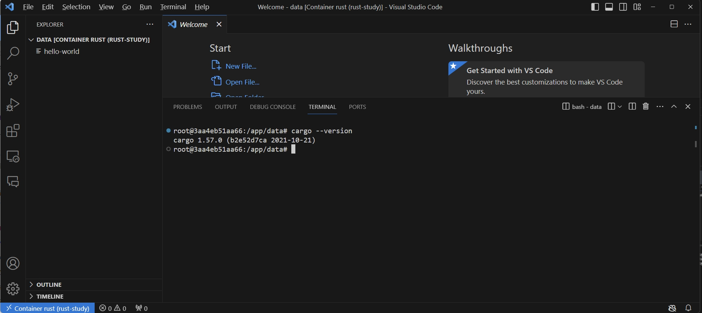

# 《RustCourse》学习笔记（1）

> 资料地址:
>
> https://github.com/sunface/rust-course
>
> **本资料仅用于自学记录，请到官方网站查看最新更新章节!**

## 第1章 Rust语言基础学习

### 1.1 安装环境

使用 rustup 教程：https://course.rs/first-try/installation.html

> 个人更建议在学习阶段不要往自己的电脑乱装环境浪费时间，可以用 Docker 镜像配合 VsCode 进行开发，下面是个人的一点经验：
>
> 1. 安装 docker，并且拉取 rust 镜像。（默认镜像是基于 Debian 12 的）
>
>    ```shell
>    docker pull rust
>    ```
>
> 2. 启动容器并挂载。
>
>    ```shell
>    docker run -dit --name rust-study -v d:/dockerInfo/rust-study/volume:/app/data rust
>    docker exec -it rust-study bash
>    root@3aa4eb51aa66: cd /app/data/ && touch hello-world
>    ```
>
>    查看硬盘目录是否挂载成功。
>
> 3. 使用 Vscode 安装 Docker 插件以及 Dev Container 插件以后连接到现有容器中
>
>    
>
>    
>
>    

### 1.2 推荐使用 vscode 作为 IDE

推荐使用 vscode 并安装 rust-analyzer 插件，rust-analyzer 插件在第一次打开 Rust 项目时，需要安装一些依赖。当插件使用默认设置时，每一次保存代码，都会进行一次重新编译，这个时候注意不要再在终端运行`cargo run`等命令进行编译，否则会提示当前文件夹已锁定。

> （可以手动设置`rust-analyzer.cargo.buildScripts.rebuildOnSave`为 false(笔者安装时该项已默认为 false)）

### 1.3 认识 Cargo

使用 cargo 创建项目：

```shell
cargo new helloWorld --bin
```

现在的 cargo 版本可以无需`--bin`参数，默认就会创建一个 bin 类型的项目。Rust 项目主要分成两个类型：

- bin：可运行的项目
- lib：依赖库项目

有两种方式可以运行项目：

1. `cargo run`
2. 手动编译和运行项目

`cargo run`会首先对项目进行编译，然后再运行，因此实际上等同于运行了两个指令：`cargo build`和`./target/debug/helloworld`。

默认情况下打包运行，rust 会在 debug 模式下运行，这种模式下代码编译速度会很快，因为编译器不会针对代码做任何的优化。

可以添加`--release`参数来进行编译高性能的程序。

- `cargo run --release`
- `cargo build --release && ./target/release/helloWorld`

#### cargo check

`cargo check`命令会快速的检查一下代码能否编译通过，能节省大量的编译时间。

> Rust 虽然编译速度还行，但是还是不能与 Go 语言相提并论，因为 Rust 需要做很多复杂的编译优化和语言特性解析，甚至连如何优化编译速度都成了一门学问: [优化编译速度](https://course.rs/profiling/compiler/speed-up.html)。

#### Cargo.toml 和 Cargo.lock

- Cargo.toml 是项目数据的描述文件，存储了项目的所有元配置信息。
- Cargo.lock 文件是一份依赖的详细清单，如果你的项目是一个 bin 项目，请上传 Ccargo.lock，如果是一个依赖库项目，请把它添加到 .gitignore 中

#### package 配置段落

`[package]`项中记录了项目的描述信息。

```toml
[package]
# 项目名称
name = "hello-world"
# 定义当前版本
version = "0.1.0"
# 使用的 Rust 大版本
edition = "2021"
```

#### 定义项目依赖

`[dependencies]`项中记录了外部依赖库的各种依赖项：

- 基于 Rust 官方仓库`crates.io`，通过版本说明来描述
- 基于项目源代码的 git 仓库地址，通过 URL 来描述
- 基于本地项目的绝对路径或者相对路径，通过类 Unix 模式的路径来描述

具体写法如下：

```toml
[dependencies]
rand = "0.3"
hammer = { version = "0.5.0"}
color = { git = "https://github.com/bjz/color-rs" }
geometry = { path = "crates/geometry" }
```

### 1.4 不仅仅是 Hello World

```rust
fn greet_world() {
    let southern_germany = "Grüß Gott!";
    let chinese = "世界，你好";
    let english = "World, hello";
    let regions = [southern_germany, chinese, english];
    for region in regions.iter() {
        println!("{}", &region);
    }
}
fn main() {
    greet_world();
}
```

- Rust 原生支持 UTF-8 编码的字符串
- `println!`后面的`!`在 Rust 中是一个`宏操作符`，使用`{}`来做输出占位符
- Rust 的集合类型不能直接进行循环，而需要变成迭代器，这里是通过`.iter()`方法，在 2021 大版本以后，也支持直接写`for region in regions`，因为 for 会隐式将 regions 转换成迭代器。

#### RUST 语言初印象

```rust
fn main() {
    let penguin_data =
        "\
    common name,length (cm)
    Little penguin,33
    Yellow-eyed penguin,65
    Fiordland penguin,60
    Invalid,data
    ";

    let records = penguin_data.lines();

    for (i, record) in records.enumerate() {
        if i == 0 || record.trim().len() == 0 {
            continue;
        }

        // 声明一个 fields 变量，类型是 Vec
        // Vec 是 vector 的缩写，是一个可伸缩的集合类型，可以认为是一个动态数组
        // <_>表示 Vec 中的元素类型由编译器自行推断，在很多场景下，都会帮我们省却不少功夫
        let fields: Vec<_> = record
            .split(',')
            .map(|field| field.trim())
            .collect();
        if cfg!(debug_assertions) {
            // 输出到标准错误输出
            eprintln!("debug: {:?} -> {:?}", record, fields);
        }

        let name = fields[0];
        
        // 1. 尝试把 fields[1] 的值转换为 f32 类型的浮点数，如果成功，则把 f32 值赋给 length 变量
        //
        // 2. if let 是一个匹配表达式，用来从=右边的结果中，匹配出 length 的值：
        //   1）当=右边的表达式执行成功，则会返回一个 Ok(f32) 的类型，若失败，则会返回一个 Err(e) 类型，if let 的作用就是仅匹配 Ok 也就是成功的情况，如果是错误，就直接忽略
        //   2）同时 if let 还会做一次解构匹配，通过 Ok(length) 去匹配右边的 Ok(f32)，最终把相应的 f32 值赋给 length
        //
        // 3. 当然你也可以忽略成功的情况，用 if let Err(e) = fields[1].parse::<f32>() {...}匹配出错误，然后打印出来，但是没啥卵用
        if let Ok(length) = fields[1].parse::<f32>() {
            // 输出到标准输出
            println!("{}, {}cm", name, length);
        }
    }
}

```

### 1.5 下载依赖太慢了

#### 修改 Rust 的下载镜像为国内的镜像地址

为了使用`crates.io`之外的注册服务，我们需要对`$HOME/.cargo/config.toml`($CARGO_HOME 下)的文件进行配置，添加新的服务提供商，有两种方式可以实现：增加新的镜像地址和覆盖默认的镜像地址。

#### 新增镜像地址

在 `$HOME/.cargo/config.toml` （如果文件不存在则手动创建一个）中添加以下内容：

```toml
[registries]
ustc = { index = "https://mirrors.ustc.edu.cn/crates.io-index/" }
[source.ustc]
registry = "sparse+https://mirrors.ustc.edu.cn/crates.io-index/"
```

在`Cargo.toml`中可以使用以下方式引入：

```toml
[dependencies]
time = { registry = "ustc" }
```

此外还可以选择字节跳动的镜像服务：

```toml
[source.crates-io]
replace-with = 'rsproxy'

[source.rsproxy]
registry = "https://rsproxy.cn/crates.io-index"

# 稀疏索引，要求 cargo >= 1.68
[source.rsproxy-sparse]
registry = "sparse+https://rsproxy.cn/index/"

[registries.rsproxy]
index = "https://rsproxy.cn/crates.io-index"

[net]
git-fetch-with-cli = true
```

#### 覆盖默认的镜像地址

**这种方式不用修改源码，更推荐**，它是直接使用新注册服务来替代默认的 crates.io。

在`$HOME/.cargo/config.toml`添加以下内容：

```toml
[source.crates-io]
replace-with = 'ustc'

[source.ustc]
registry = "git://mirrors.ustc.edu.cn/crates.io-index"
```


