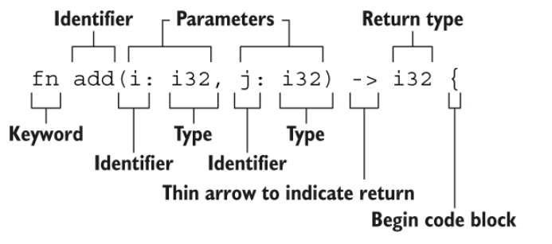

# 《RustCourse》学习笔记（2）

## 第2章 Rust基本概念

### 2.2 基本类型

#### 2.2.2 字符、布尔、单元类型

**字符**

字符类型（char）类型可以理解为英文中的字幕，中文中的汉字。Rust 的字符不仅仅是`ASCII`，所有的`Unicode`值都可以作为 Rust 字符，包括单个的中文、日文、韩文、emoji 等等，都是合法的字符类型。字符类型和`Unicode`都是 4 个字节编码。

和一些语言不同，Rust 的字符只能用`''`来表示，`""`是留给字符串的。

```rust
fn main() {
    let c = 'z';
    let z = 'ℤ';
    let g = '国';
    let heart_eyed_cat = '😻';
}
```

**布尔（bool）**

Rust 中的布尔类型有两个可能的值：true 和 false。布尔值占用内存的大小为 1 个字节。

**单元类型**

单元类型就是`()`，唯一的值也是`()`，比如`fn main()`函数的返回值类型就是单元类型。返回单元类型的函数与无返回值函数并不是一个概念，Rust 对于没有返回值的函数有单独的定义：`发散函数(diverge function)`。

常见的`println!()`的返回值也是单元类型，再比如可以用`()`作为 map 的值，这表示我们不关注具体的值，只关心它对应的`key`。这个值也不会占用任何内存。

#### 2.2.3 语句和表达式

> Rust 的函数体是由一系列语句组成，最后由一个表达式来返回值，例如：
>
> ```rust
> fn add_with_extra(x: i32, y: i32) -> i32 {
>     let x = x + 1; // 语句
>     let y = y + 5; // 语句
>     x + y // 表达式
> }
> ```

在 Rust 中，`语句`是不会有返回值的，因此在 rust 中，不能这么写：`let b = (let a = 8);`

在 Rust 中，`表达式`会进行求值，并返回一个值。换句话说，只要能返回值的操作，它就是表达式。如果表达式不反悔任何值，则会隐式地返回一个`()`。

```rust
fn main() {
    assert_eq!(ret_unit_type(), ())
}

fn ret_unit_type() {
    let x = 1;
    // if 语句块也是一个表达式，因此可以用于赋值，也可以直接返回
    // 类似三元运算符，在Rust里我们可以这样写
    let y = if x % 2 == 1 {
        "odd"
    } else {
        "even"
    };
    // 或者写成一行
    let z = if x % 2 == 1 { "odd" } else { "even" };
}
```

#### 2.2.4 函数

```rust
fn add(i: i32, j: i32) -> i32 {
   i + j
 }
```

- 函数名和变量名使用[蛇形命名法(snake case)](https://course.rs/practice/naming.html)，例如 `fn add_two() -> {}`
- 函数的位置可以随便放，Rust 不关心我们在哪里定义了函数，只要有定义即可
- 每个函数参数都需要标注类型



**Rust 中的特殊返回类型**

**无返回值`()`**

单元类型是一个零长度的元组，用于表达一个函数没有返回值。既可以显式返回，也可以默认的隐式定义。

> 例如下面的 `report` 函数会隐式返回一个 `()`：
>
> ```rust
> use std::fmt::Debug;
> 
> fn report<T: Debug>(item: T) {
>   println!("{:?}", item);
> 
> }
> ```
>
> 与上面的函数返回值相同，但是下面的函数显式的返回了 `()`：
>
> ```rust
> fn clear(text: &mut String) -> () {
>   *text = String::from("");
> }
> ```

**永不返回的发散函数`!`**

> 当用 `!` 作函数返回类型的时候，表示该函数永不返回( diverge function )，特别的，这种语法往往用做会导致程序崩溃的函数：
>
> ```rust
> fn dead_end() -> ! {
>   panic!("你已经到了穷途末路，崩溃吧！");
> }
> ```
>
> 下面的函数创建了一个无限循环，该循环永不跳出，因此函数也永不返回：
>
> ```rust
> fn forever() -> ! {
>   loop {
>     //...
>   };
> }
> ```

### 2.3 所有权和借用

在以往，内存安全几乎都是通过 GC（Garbage Collect：自动垃圾回收）的方式实现，但是 GC 会引来性能、内存占用以及 Stop the world 的问题，在高性能场景和系统编程上是不可接受的。因此 Rust 采用了与众不同的方式：**所有权系统**。

#### 2.3.1 所有权

在计算机语言演变的过程中，如何从内存中申请空间来存放程序的运行内容，如何释放空间，一直是重点难题，在不断演变的过程中，出现了三种流派：

- 垃圾回收机制（GC）：在程序运行时不断寻找不再使用的内存，典型代表：GO、JAVA
- 手动管理内存的分配和释放：在程序中，通过函数调用的方式来申请和释放内存，典型代表：C++
- 通过所有权来管理内存：编译器在编译时会根据一系列规则进行检查

Rust 选择了第三种路，这种检查只发生在编译器，因此在程序运行期间，不会有任何性能上的损失。

在本章，我们将通过`字符串`来引导讲解所有权的相关知识。

**一段不安全的代码**

下面是一段 C 语言的代码：

```c
int* foo() {
    int a;          // 变量a的作用域开始
    a = 100;
    char *c = "xyz";   // 变量c的作用域开始
    return &a;
} // 变量a和c的作用域结束
```


