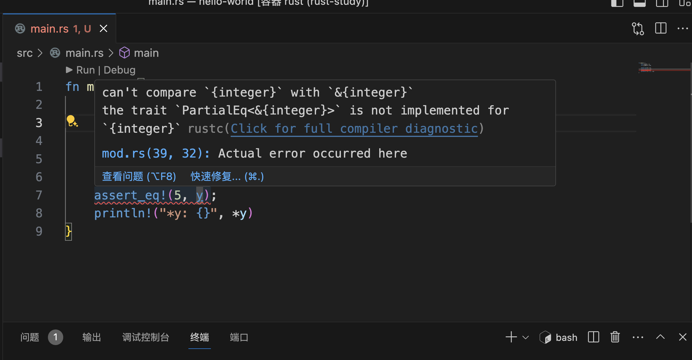
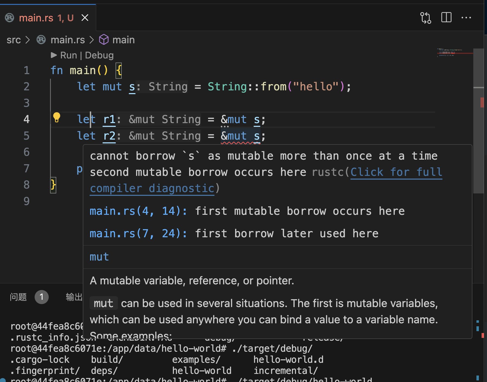
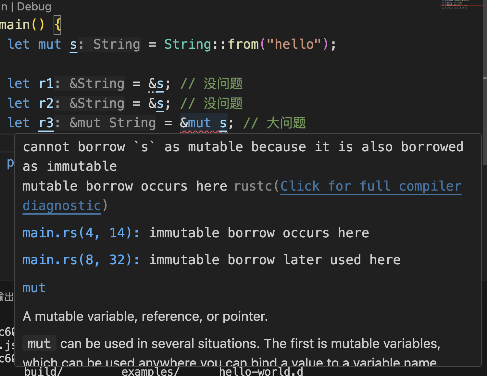
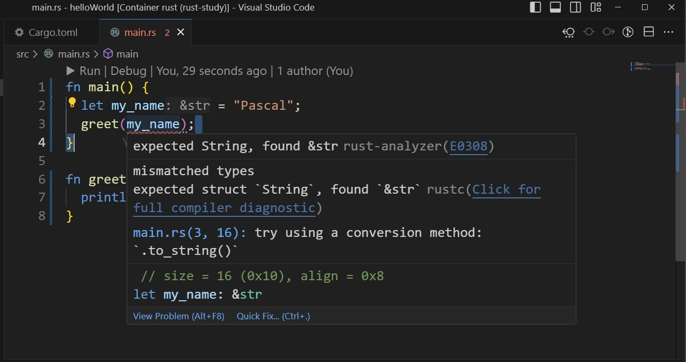
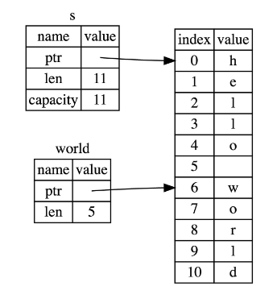
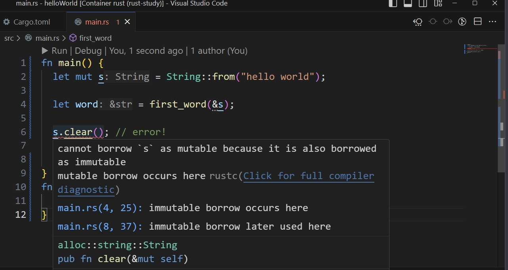

# 《RustCourse》学习笔记（4）

## 第2章 Rust基本概念

### 2.3 所有权和借用

#### 2.3.2 引用与借用

> https://course.rs/basic/ownership/borrowing.html

如果仅仅支持通过转移所有权的方式获取一个值，程序会变得很复杂。Rust 因此通过`借用（Borrowing）`这个概念来获取变量的引用。

##### 引用与解引用

常规引用是一个指针类型，引用可以使用`&`符号，解引用可以使用`*`符号，如下：

```rust
fn main() {
    let x = 5;
    let y = &x;

    assert_eq!(5, x);
    assert_eq!(5, *y);
}
```

而如果不使用解引用，就会报错：

```rust
assert_eq!(5, y)
```



因此，在函数的使用时，可以用传递引用来代替传递所有权的变量。

```rust
fn main() {
    let s1 = String::from("hello");

    let len = calculate_length(&s1);

    println!("The length of '{}' is {}.", s1, len);
}

fn calculate_length(s: &String) -> usize {
    s.len()
}
```

这样就可以无需像上一章一样，先通过函数参数传入所有权，再通过函数返回来传出所有权，代码更加简洁。

正如变量默认不可变一样，引用指向的值也是默认不可变的。

如果要改变引用变量的值，可以使用可变引用。

##### 可变引用

创建可变引用的语法是：`&mut s`。示例如下：

```rust
fn main() {
    let mut s = String::from("hello");

    change(&mut s);
}

fn change(some_string: &mut String) {
    some_string.push_str(", world");
}
```

##### 注意：同一个作用域，特定数据只能有一个可变引用

否则会报错：

```rust
fn main() {
    let mut s = String::from("hello");

    let r1 = &mut s;
    let r2 = &mut s;

    println!("{}, {}", r1, r2);
}

```



> 这种限制的好处就是使 Rust 在编译期就避免数据竞争，数据竞争可由以下行为造成：
>
> - 两个或更多的指针同时访问同一数据
> - 至少有一个指针被用来写入数据
> - 没有同步数据访问的机制

很多时候，使用大括号可以手动限制变量的作用域，这样就可以在同一个函数内使用多个可变引用。

```rust
fn main() {
    let mut s = String::from("hello");

    {
        let r1 = &mut s;
    } // r1 在这里离开了作用域，所以我们完全可以创建一个新的引用

    let r2 = &mut s;
}

```

##### 注意：可变引用与不可变引用不能同时存在

这是因为正在使用不可变引用的时候，不会希望这个引用在某个时刻突然改变了，因此，下面的这段代码会报错：

```rust
fn main() {
    let mut s = String::from("hello");

    let r1 = &s; // 没问题
    let r2 = &s; // 没问题
    let r3 = &mut s; // 大问题

    println!("{}, {}, and {}", r1, r2, r3);
}
```

（个人理解：这个地方会报错是因为同时使用了不可变引用和可变引用。如果声明了可变引用之后，之前的不可变引用没有再被使用过，在新的编译器下应该是可行的。也就是如果是这样的话，是不会报错的：

```rust
fn main() {
    let mut s = String::from("hello");

    let r1 = &s; // 没问题
    let r2 = &s; // 没问题
  	println!("{}, {}", r1, r2);
    let r3 = &mut s; // 大问题

    println!(", and {}", r3);
}
```

）



> 注意，引用的作用域 `s` 从创建开始，一直持续到它最后一次使用的地方，这个跟变量的作用域有所不同，变量的作用域从创建持续到某一个花括号 `}`
>
> Rust 的编译器一直在优化，早期的时候，引用的作用域跟变量作用域是一致的，这对日常使用带来了很大的困扰，你必须非常小心的去安排可变、不可变变量的借用，免得无法通过编译，例如以下代码：
>
> ```rust
> fn main() {
>    let mut s = String::from("hello");
> 
>     let r1 = &s;
>     let r2 = &s;
>     println!("{} and {}", r1, r2);
>     // 新编译器中，r1,r2作用域在这里结束
> 
>     let r3 = &mut s;
>     println!("{}", r3);
> } // 老编译器中，r1、r2、r3作用域在这里结束
>   // 新编译器中，r3作用域在这里结束
> ```
>
> 在老版本的编译器中（Rust 1.31 前），将会报错，因为 `r1` 和 `r2` 的作用域在花括号 `}` 处结束，那么 `r3` 的借用就会触发 **无法同时借用可变和不可变**的规则。
>
> 但是在新的编译器中，该代码将顺利通过，因为 **引用作用域的结束位置从花括号变成最后一次使用的位置**，因此 `r1` 借用和 `r2` 借用在 `println!` 后，就结束了，此时 `r3` 可以顺利借用到可变引用。
>
> 对于这种编译器优化行为，Rust 专门起了一个名字 —— **Non-Lexical Lifetimes(NLL)**，专门用于找到某个引用在作用域(`}`)结束前就不再被使用的代码位置。

##### 悬垂引用（Dangling References）

悬垂引用的意思是指针指向某个值以后，但是这个值的内存被释放掉了，而指向这个内存区域的指针却永远存在。

Rust 通过编译器的所有权判定，可以保证这种错误永远不存在于可编译的代码中。

```rust
fn main() {
    let reference_to_nothing = dangle();
}

fn dangle() -> &String { // dangle 返回一个字符串的引用

    let s = String::from("hello"); // s 是一个新字符串

    &s // 返回字符串 s 的引用
} // 这里 s 离开作用域并被丢弃。其内存被释放。
  // 危险！

```

报错信息如下：

```txt
error[E0106]: missing lifetime specifier
 --> src/main.rs:5:16
  |
5 | fn dangle() -> &String {
  |                ^ expected named lifetime parameter
  |
  = help: this function's return type contains a borrowed value, but there is no value for it to be borrowed from
help: consider using the `'static` lifetime
  |
5 | fn dangle() -> &'static String {
  |                ~~~~~~~~
```

> 因为 `s` 是在 `dangle` 函数内创建的，当 `dangle` 的代码执行完毕后，`s` 将被释放，但是此时我们又尝试去返回它的引用。这意味着这个引用会指向一个无效的 `String`

所以，最好的解决方法是直接返回 String，**把 String 的所有权转移给外面的调用者**。

```rust
fn no_dangle() -> String {
    let s = String::from("hello");

    s
}
```

##### 借用引用规则总结

> 总的来说，借用规则如下：
>
> - 同一时刻，你只能拥有要么一个可变引用, 要么任意多个不可变引用
> - 引用必须总是有效的

### 2.4 复合类型

复合类型是由其他类型组合而成的，最典型的结构体是`struct`和枚举`enum`。

```rust
#![allow(unused_variables)]
type File = String;

fn open(f: &mut File) -> bool {
    true
}
fn close(f: &mut File) -> bool {
    true
}

#[allow(dead_code)]
fn read(f: &mut File, save_to: &mut Vec<u8>) -> ! {
    unimplemented!()
}

fn main() {
    let mut f1 = File::from("f1.txt");
    open(&mut f1);
    //read(&mut f1, &mut vec![]);
    close(&mut f1);
}
```

> 在这个阶段我们需要排除一些编译器噪音（Rust 在编译的时候会扫描代码，变量声明后未使用会以 `warning` 警告的形式进行提示），引入 `#![allow(unused_variables)]` 属性标记，该标记会告诉编译器忽略未使用的变量，不要抛出 `warning` 警告。
>
> `read` 函数也非常有趣，它返回一个 `!` 类型，这个表明该函数是一个发散函数，不会返回任何值，包括 `()`。`unimplemented!()` 告诉编译器该函数尚未实现，`unimplemented!()` 标记通常意味着我们期望快速完成主要代码，回头再通过搜索这些标记来完成次要代码，类似的标记还有 `todo!()`，当代码执行到这种未实现的地方时，程序会直接报错。你可以反注释 `read(&mut f1, &mut vec![]);` 这行，然后再观察下结果。
>
> 同时，从代码设计角度来看，关于文件操作的类型和函数应该组织在一起，散落得到处都是，是难以管理和使用的。而且通过 `open(&mut f1)` 进行调用，也远没有使用 `f1.open()` 来调用好，这就体现出了只使用基本类型的局限性：**无法从更高的抽象层次去简化代码**。
>
> 接下来，我们将引入一个高级数据结构 —— 结构体 `struct`，来看看复合类型是怎样更好的解决这类问题。 开始之前，先来看看 Rust 的重点也是难点：字符串 `String` 和 `&str`。

#### 2.4.1 字符串与切片

##### 2.4.1.1 字符串

在其他语言中，字符串往往十分简单，然而在 Rust 中则不一样，比如下面这段简单的代码：

```rust
fn main() {
  let my_name = "Pascal";
  greet(my_name);
}

fn greet(name: String) {
  println!("Hello, {}!", name);
}
```



`greet`函数明明需要一个`String`类型的字符串，为什么传入的却是一个`&str`类型呢？

原因是字符串字面量并不是一个字符串类型，而是一个“切片”，即`&str`，该切片指向了程序可执行文件中的某个点。这也是为什么在 rust 的语言层面上，字符串字面量是不可变的，因为`&str`实际上是一个**不可变引用**。

##### 2.4.1.2 切片（slice）

切片允许你引用集合中部分连续的元素序列，而不是引用整个集合。对于字符串而言，切片就是`String`类型中某一部分的引用，使用方括号来表示即**[开始索引..终止索引]**：

```rust
let s = String::from("hello world");

let hello = &s[0..5];
let world = &s[6..11];
```



除了明确索引位置的用法以外，还可以这样写：

```rust
let s = String::from("hello");
// 以下两个是等效的
let slice = &s[0..2];
let slice = &s[..2];

// 同样的，如果你的切片想要包含 String 的最后一个字节，则可以这样使用
let s = String::from("hello");
let len = s.len();
let slice = &s[4..len];
let slice = &s[4..];

// 也可以截取完整的 String 切片
let s = String::from("hello");
let len = s.len();
let slice = &s[0..len];
let slice = &s[..];
```

> 在对字符串使用切片语法时需要格外小心，切片的索引必须落在字符之间的边界位置，也就是 UTF-8 字符的边界，例如中文在 UTF-8 中占用三个字节，下面的代码就会崩溃：
>
> ```rust
>  let s = "中国人";
>  let a = &s[0..2];
>  println!("{}",a);
> ```
>
> 因为我们只取 `s` 字符串的前两个字节，但是本例中每个汉字占用三个字节，因此没有落在边界处，也就是连 `中` 字都取不完整，此时程序会直接崩溃退出，如果改成 `&s[0..3]`，则可以正常通过编译。 因此，当你需要对字符串做切片索引操作时，需要格外小心这一点, 关于该如何操作 UTF-8 字符串，参见[这里](https://course.rs/basic/compound-type/string-slice.html#操作-utf-8-字符串)。

```rust
fn main() {
    let mut s = String::from("hello world");

    let word = first_word(&s);

    s.clear(); // error!

    println!("the first word is: {}", word);
}
fn first_word(s: &String) -> &str {
    &s[..1]
}
```

上面的代码会报错：



这是因为`s.clear`会需要一个可变借用，所以无法在可变借用以后再使用不可变借用，因此编译无法通过。

##### 2.4.1.3 什么是字符串？

Rust 中的字符是 Unicode 类型，因此每个字符占据 4 个字节内存空间。但是字符串不一样，字符串是 UTF-8 编码，也就是字符串中的字符所占的字节数是变化的（1-4个）。

Rust 在语言级别只有一种字符串类型：`str`，通常以`&str`字符串切片的形式存在。

除此以外，还有多种不同用途的字符串类型，使用最广的是`String`类型，这是一个 UTF-8 编码，可增长，可改变且具有所有权的字符串。

除了 String 类型的字符串，Rust 的标准库还提供了其他类型的字符，例如`OsString`,`OsStr`，`CsString`和`CsStr`等等。

> 注意到这些名字都以 `String` 或者 `Str` 结尾了吗？它们分别对应的是具有所有权和被借用的变量。

##### 2.4.1.4 String 与 &str 的转换

从`&str`类型生成`String`类型的操作：

- `String::from("hello,world")`
- `"hello,world".to_string()`

将`String`类型转为`&str`类型：

```rust
fn main() {
    let s = String::from("hello,world!");
    say_hello(&s);
    say_hello(&s[..]);
    say_hello(s.as_str());
}

fn say_hello(s: &str) {
    println!("{}", s);
}
```

> 实际上这种灵活用法是因为 `deref` 隐式强制转换，具体我们会在 [`Deref` 特征](https://course.rs/advance/smart-pointer/deref.html)进行详细讲解。

##### 2.4.1.5/6/7 字符串索引/字符串切片/操作字符串

Rust **不允许**通过索引去查找字符串，即不允许通过下面的形式使用代码：

```rust
   let s1 = String::from("hello");
   let h = s1[0];
```

同时，**字符串切片也是非常危险的操作**，因为切片的索引是通过字节来进行的，无法保证索引的字节刚好落到字符的边界上，比如说下面的索引没有落在边界上（落在了`中`字符的内部），程序就会直接崩溃。

```rust
let hello = "中国人";

let s = &hello[0..2];
```


下面介绍字符串类型 String 的修改添加删除等常用方法：

- 追加：在字符串尾部可以使用`push()`方法追加字符`char`，也可以使用`push_str()`方法追加字符串字面量。
- 插入：使用`insert()`方法或`insert_str`方法。
- 替换
  - replace/replacen 方法：该方法返回一个新的字符串，而不是操作原来的字符串。replacen 的第三个参数用于表示替换的个数。
  - replace_range 方法：该方法仅适用于 String 类型，直接操作原来的字符串，不会返回新的字符串。
- 删除（**该方法是直接操作原来的字符串，不会返回新的字符串。该方法需要使用 `mut` 关键字修饰**）
  - pop()
  - remove()
  - truncate()：删除字符串从指定位置开始到结尾的全部字符
  - clear()
- 连接
  - 使用 + 或 += 连接字符串
  - 使用`format!`连接字符串，与`print!`用法类似

##### 2.4.1.8 字符串转义

可以通过转义的方式`\`输出 ASCII 和 Unicode 字符

##### 2.4.1.9 操作 UTF-8 字符串

如果你想要以 Unicode 字符的方式遍历字符串，最好的办法是使用 `chars` 方法。

而如果要以字符串的底层字节数进行遍历，可以使用`bytes`方法。

```rust
for c in "中国人".chars() {
    println!("{}", c);
}

for b in "中国人".bytes() {
    println!("{}", b);
}
```

**获取子串**

> 可以考虑尝试下这个库：[utf8_slice](https://crates.io/crates/utf8_slice)。

##### 2.4.1.10 字符串深度剖析

> 与其它系统编程语言的 `free` 函数相同，Rust 也提供了一个释放内存的函数： `drop`，但是不同的是，其它语言要手动调用 `free` 来释放每一个变量占用的内存，而 Rust 则在变量离开作用域时，自动调用 `drop` 函数。


