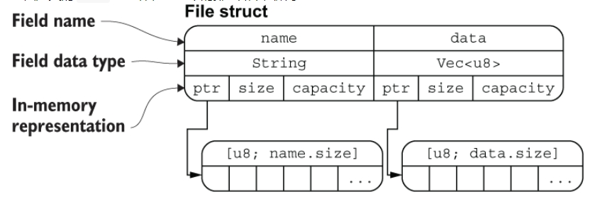
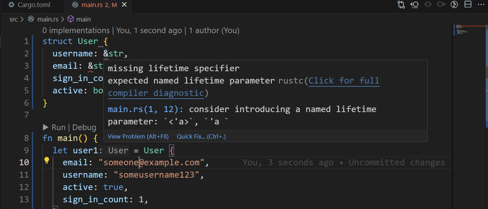

# 《RustCourse》学习笔记（5）

## 第2章 Rust基本概念

### 2.4 复合类型

#### 2.4.2 元组

> https://course.rs/basic/compound-type/tuple.html

元组是复合类型，可以由多个类型组合到一起，它的长度是固定的，元素的顺序也是固定的。

创建一个元组：

```rust
fn main() {
    let tup: (i32, f64, u8) = (500, 6.4, 1);
}
```

##### 2.4.2.1/2.4.2.2/2.4.2.3 用模式匹配解构元组/用.来访问元组/元组的使用示例

```rust
fn main() {
    let tup = (500, 6.4, 1);

    let (x, y, z) = tup;

    println!("The value of y is: {}", y);
}
```

和其它语言的数组、字符串一样，元组的索引从 0 开始，可以直接用`.`来访问

```rust
fn main() {
    let x: (i32, f64, u8) = (500, 6.4, 1);

    let five_hundred = x.0;

    let six_point_four = x.1;

    let one = x.2;
}
```

元组在函数返回值场景很常用，例如下面的代码，可以使用元组返回多个值。

```rust
fn main() {
    let s1 = String::from("hello");

    let (s2, len) = calculate_length(s1);

    println!("The length of '{}' is {}.", s2, len);
}

fn calculate_length(s: String) -> (String, usize) {
    let length = s.len(); // len() 返回字符串的长度

    (s, length)
}
```

> 有一个说法，`()`作为类型，是0个元素的Tuple，这种类型的值只有一个，恰好也是`()`

#### 2.4.3 结构体

结构体`struct`是一种复合数据结构，其他语言也有类似的数据结构，比如`object`、`record`等等。

##### 2.4.3.1 结构体语法

一个结构体由几部分组成：

- 通过关键字`struct`定义
- 一个清晰明确的结构体`名称`
- 几个有名字的结构体`字段`

比如下面的结构体：

```rust
// 该结构体名称是 User，拥有 4 个字段，且每个字段都有对应的字段名及类型声明，例如 username 代表了用户名，是一个可变的 String 类型。
struct User {
  active: bool,
  username: String,
  email: String,
  sign_in_count: u64,
}

// 创建结构体示例：
let user1 = User {
  email: String::from("someone@example.com"),
  username: String::from("someusername123"),
  active: true,
  sign_in_count: 1,
};
```

> 注意：
>
> 1. 初始化实例时，**每个字段**都需要进行初始化
> 2. 初始化时的字段顺序**不需要**和结构体定义时的顺序一致

通过`.`操作符即可访问结构体内部的字段值和修改他们。

```rust
let mut user1 = User {
  email: String::from("someone@example.com"),
  username: String::from("someusername123"),
  active: true,
  sign_in_count: 1,
};

user1.email = String::from("anotheremail@example.com");
```

> 注意：必须要将结构体实例声明为可变的，才能修改其中的字段，Rust 不支持将某个结构体某个字段标记为可变。


**简化结构体创建**，酷似 TypeScript：

```rust
fn build_user(email: String, username: String) -> User {
  User {
    email,
    username,
    active: true,
    sign_in_count: 1,
  }
}
```


**结构体更新语法**

根据已有的结构体实例，创建新的结构体实例：

```rust
let user2 = User {
  active: user1.active,
  username: user1.username,
  email: String::from("another@example.com"),
  sign_in_count: user1.sign_in_count,
};

// 或者可以用另一种方法

/**
  因为 user2 仅仅在 email 上与 user1 不同，因此我们只需要对 email 进行赋值，剩下的通过结构体更新语法 ..user1 即可完成。
  .. 语法表明凡是我们没有显式声明的字段，全部从 user1 中自动获取。需要注意的是 ..user1 必须在结构体的尾部使用。
*/
let user2 = User {
  email: String::from("another@example.com"),
  ..user1
};
```

**注意：上面的代码中，`user1`结构体的`username`字段和`email`字段的所有权被转移了，因此，`user1`结构体实例的这两个字段不能被继续使用了**。

```rust
let user1 = User {
    email: String::from("someone@example.com"),
    username: String::from("someusername123"),
    active: true,
    sign_in_count: 1,
};
let user2 = User {
    active: user1.active,
    username: user1.username,
    email: String::from("another@example.com"),
    sign_in_count: user1.sign_in_count,
};
println!("{}", user1.active);
// 下面这行会报错
println!("{:?}", user1);
```


##### 2.4.3.2 结构体的内存排列

```rust
#[derive(Debug)]
 struct File {
   name: String,
   data: Vec<u8>,
}
```



你可以把`ptr`指针理解为 Rust 中的引用类型，File 结构体的两个字段通过这这些指针指向底层数组的内存地址。所以当该`ptr`的所有权被转移以后，将无法访问该字段。但可以正常访问其他的字段。


##### 2.4.3.3 元组结构体

结构体的字段可以没有名称，这种没有名称的结构体被称为元组结构体。

```rust
struct Color(i32, i32, i32);
struct Point(i32, i32, i32);

let black = Color(0, 0, 0);
let origin = Point(0, 0, 0);
```


##### 2.4.3.4 单元结构体

如果你定义一个类型，但是不关心该类型的内容, 只关心它的行为时，就可以使用 `单元结构体`

> GitHub Copilot: 在 Rust 中，单元结构体（Unit-like Structs）主要用于在类型系统中创建新的类型，而不需要关联任何数据。这在你需要实现特定的 trait，但不需要存储任何数据时非常有用。
>
> 在 Rust 中，trait 是一种定义共享的行为的方式。你可以将 trait 理解为其他语言中的接口。一个 trait 定义了一组方法，但不提供这些方法的实现——这些方法的实现由实现 trait 的类型提供。
>
> ```rust
> // 定义一个 trait，名为 Animal
> trait Animal {
>     // 这个 trait 有一个方法，名为 make_noise
>     fn make_noise(&self);
> }
> 
> // 定义一个结构体，名为 Dog
> struct Dog;
> 
> // 为 Dog 实现 Animal trait
> impl Animal for Dog {
>     fn make_noise(&self) {
>         println!("Woof!");
>     }
> }
> 
> // 定义一个结构体，名为 Cat
> struct Cat;
> 
> // 为 Cat 实现 Animal trait
> impl Animal for Cat {
>     fn make_noise(&self) {
>         println!("Meow!");
>     }
> }
> 
> fn main() {
>     let dog = Dog;
>     dog.make_noise();  // 输出: Woof!
> 
>     let cat = Cat;
>     cat.make_noise();  // 输出: Meow!
> }
> ```
>
> 在这个例子中，我们定义了一个 `Animal` trait，它有一个 `make_noise` 方法。然后我们定义了两个结构体：`Dog` 和 `Cat`，并为它们实现了 `Animal` trait。这意味着我们可以在 `Dog` 和 `Cat` 上调用 `make_noise` 方法。

（**个人理解**：trait 有点类似于先声明一个类型或接口，struct 有点类似于先声明一个类的名字，然后可以用`impl`关键词，去把某个类实现成这个接口的样子）


##### 2.4.3.5 结构体数据的所有权

通常情况下，结构体拥有它所有的数据，而不是从其它地方借用数据。（这也是为什么上面的例子使用了自身拥有所有权的 `String` 类型而不是基于引用的 `&str` 字符串切片类型）

如果你想在结构体中使用一个引用，就必须加上生命周期，否则就会报错。生命周期能确保结构体的作用范围要比它所借用的数据的作用范围要小。

例如：

```rust
struct User {
  username: &str,
  email: &str,
  sign_in_count: u64,
  active: bool,
}

fn main() {
  let user1 = User {
    email: "someone@example.com",
    username: "someusername123",
    active: true,
    sign_in_count: 1,
  };
}
```

会报错：



##### 2.4.3.6 使用 #[derive(Debug)] 来打印结构体的信息

打印结构体的方法总结：

- 手动实现结构体的 Display 特征，然后可以使用`println!("{}", 结构体)`，最麻烦，但是适合高度定制化场景
- 使用 #[derive(Debug)] 标记以及使用`{:?}`或`{:#?}`来输出
- 在第二点的基础上，使用`dbg!`宏来替代`println`，返回的信息更多

```rust
#[derive(Debug)]
struct Rectangle {
    width: u32,
    height: u32,
}

fn main() {
    let scale = 2;
    let rect1 = Rectangle {
        width: dbg!(30 * scale),
        height: 50,
    };

    dbg!(&rect1);
}
```

```txt
$ cargo run
[src/main.rs:10] 30 * scale = 60
[src/main.rs:14] &rect1 = Rectangle {
    width: 60,
    height: 50,
}
```

> 注意：`dbg!` 输出到标准错误输出 `stderr`，而 `println!` 输出到标准输出 `stdout`。

#### 2.4.4 枚举

rust 中的枚举有两种：

- `枚举类型`是一个类型，可能包含所有的枚举成员
- `枚举值`是枚举类型中的某个成员的实例

(个人理解：这里的意思是 A 枚举本身即是声明了一个 A 类型（这个类型放到 TypeScript 里面就是其所有成员的联合类型），而 A 枚举里面的每一个成员都是 A 类型的子类型（或者说正是他们组成了 A 类型）)

```rust
#[derive(Debug)]
enum Message {
    Quit,
    Move {
        x: i32,
        y: i32,
    },
    ChangeColor(i32, i32, i32),
}

fn main() {
    let m1 = Message::Quit;
    let m2 = Message::Move { x: 1, y: 1 };
    let m3 = Message::ChangeColor(255, 255, 0);
    print_msg(m1);
    print_msg(m2);
    print_msg(m3);
}

fn print_msg(arg: Message) {
    match arg {
        Message::Move { x, y } => {
            println!("Move in the x direction {} and in the y direction {}", x, y);
        }
        Message::Quit => {
            println!("{:?}", arg);
        }
        Message::ChangeColor(_, _, _) => {
            println!("{:?}", arg);
        }
    }
}

```

通过`::`操作符可以访问枚举类型的成员实例。

也可以为枚举成员定义其具体的类型，让他们持有不同的数据，如下：

```rust
#[derive(Debug)]
enum PokerCard {
  Spades(u8),
  Diamonds(char)
}

fn main() {
 let c1 = PokerCard::Spades(5);
 let c2 = PokerCard::Diamonds('A');
 let c3 = PokerCard::Diamonds('1');
 println!("{:?}",c1);
 println!("{:?}",c2);
 println!("{:?}",c3);
}
```

> **任何类型的数据都可以放入枚举成员中**: 例如字符串、数值、结构体甚至另一个枚举。

用枚举来代替结构体的好处是：

> 由于每个结构体都有自己的类型，因此我们无法在需要同一类型的地方进行使用，例如某个函数它的功能是接受消息并进行发送，那么用枚举的方式，就可以接收不同的消息，但是用结构体，该函数无法接受 4 个不同的结构体作为参数。
>
> 而且从代码规范角度来看，枚举的实现更简洁，代码内聚性更强，不像结构体的实现，分散在各个地方。

##### 2.4.4.1 Option 枚举值用于处理空值

Rust 与其他语言不一样，没有`null`关键字。改为使用`Option`枚举变量来表述这种结果。

> `Option` 枚举包含两个成员，一个成员表示含有值：`Some(T)`, 另一个表示没有值：`None`，定义如下：
>
> ```rust
> enum Option<T> {
>     Some(T),
>     None,
> }
> ```
>
> 其中 `T` 是泛型参数，`Some(T)`表示该枚举成员的数据类型是 `T`，换句话说，`Some` 可以包含任何类型的数据。
>
> `Option<T>` 枚举是如此有用以至于它被包含在了 [`prelude`](https://course.rs/appendix/prelude.html)（prelude 属于 Rust 标准库，Rust 会将最常用的类型、函数等提前引入其中，省得我们再手动引入）之中，你不需要将其显式引入作用域。另外，它的成员 `Some` 和 `None` 也是如此，无需使用 `Option::` 前缀就可直接使用 `Some` 和 `None`。

使用 Option 的好处是：不再担心会错误的使用一个空值，也就是可以在编译阶段就发现代码中有没有哪些地方可能会出现不应该为空而进行错误计算的代码。比如下面这段代码会报错：

```rust
let x: i8 = 5;
let y: Option<i8> = Some(5);

let sum = x + y;
```

因为它们的类型不同，在对 `Option<T>` 进行 `T` 的运算之前必须将其转换为 `T`。通常这能帮助我们捕获到空值最常见的问题之一：期望某值不为空但实际上为空的情况。

为了正确使用`Option<T>`值，需要使用`模式匹配`来根据每个枚举不同的成员来运行不同的代码，比如上面的错误代码，可以改成：通过 `match` 来处理不同 `Option` 的情况。

```rust
fn main() {
    let x = 5;
    let y = Some(5);
    println!("{:?}", plus_and_print(x, y))
}

fn plus_and_print(arg0: i32, arg1: Option<i32>) -> Option<i32> {
    match arg1 {
        Some(i) => { Some(i + arg0) }
        None => { None }
    }
}
```

#### 2.4.5 数组

> https://course.rs/basic/compound-type/array.html

在 Rust 中，最常用的数组有两种，第一种是速度很快但是长度固定的 `array`，第二种是可动态增长的但是有性能损耗的 `Vector`，在本书中，我们称 `array` 为数组，`Vector` 为动态数组。

两个数组的关系跟`$str`与`String`的关系很像。

对于 array 数组，有三要素：

- 长度固定
- 元素必须有相同的类型
- 依次线性排列

> 注意：**我们这里说的数组是 Rust 的基本类型，是固定长度的，这点与其他编程语言不同，其它编程语言的数组往往是可变长度的，与 Rust 中的动态数组 `Vector` 类似**

数组`Array`存储在栈上，性能十分优秀，与此对应动态数组`Vector`是存储在堆上的。在一些时候还需要为数组声明类型。

- 创建数组：

  ```rust
  fn main() {
    let a = [1, 2, 3, 4, 5];
    // 初始化一个某个值重复出现 N 次的数组，[类型; 长度]，即 i32 类型的元素有 5 个
    let a1: [i32; 5] = [1, 2, 3, 4, 5];
  }
  ```

- 访问数组元素

  可以通过索引的方式来访问其中的元素。如果访问的索引大于或等于数组长度，Rust 会出现`panic`，也就是程序退出并显示报错。

  > 这种就是 Rust 的安全特性之一。在很多系统编程语言中，并不会检查数组越界问题，你会访问到无效的内存地址获取到一个风马牛不相及的值，最终导致在程序逻辑上出现大问题，而且这种问题会非常难以检查。

- 数组元素为非基础类型

  **基本类型在Rust中赋值是以Copy的形式**，`let array=[3;5]`底层就是不断的Copy出来的，但很可惜复杂类型都没有深拷贝，只能一个个创建。

  ```rust
  let array = [String::from("rust is good!"),String::from("rust is good!"),String::from("rust is good!")];
  
  println!("{:#?}", array);
  
  // 如果想好看点，可以使用 from_fn 方法
  let array1: [String; 8] = std::array::from_fn(|_i| String::from("rust is good!"));
  
  println!("{:#?}", array1);
  ```

##### 2.4.5.1 数组切片

数组切片允许我们引用数组的一部分：

```rust
let a: [i32; 5] = [1, 2, 3, 4, 5];

let slice: &[i32] = &a[1..3];

assert_eq!(slice, &[2, 3]);
```

> 简单总结下切片的特点：
>
> - 切片的长度可以与数组不同，并不是固定的，而是取决于你使用时指定的起始和结束位置
> - 创建切片的代价非常小，因为切片只是针对底层数组的一个引用
> - 切片类型[T]拥有不固定的大小，而切片引用类型&[T]则具有固定的大小，因为 Rust 很多时候都需要固定大小数据类型，因此 &[T] 更有用,`&str`字符串切片也同理


综合使用数组和数组切片的例子：

```rust
fn main() {
  // 编译器自动推导出one的类型
  let one             = [1, 2, 3];
  // 显式类型标注
  let two: [u8; 3]    = [1, 2, 3];
  let blank1          = [0; 3];
  let blank2: [u8; 3] = [0; 3];

  // arrays是一个二维数组，其中每一个元素都是一个数组，元素类型是[u8; 3]
  let arrays: [[u8; 3]; 4]  = [one, two, blank1, blank2];

  // 借用arrays的元素用作循环中
  for a in &arrays {
    print!("{:?}: ", a);
    // 将a变成一个迭代器，用于循环
    // 你也可以直接用for n in a {}来进行循环
    for n in a.iter() {
      print!("\t{} + 10 = {}", n, n+10);
    }

    let mut sum = 0;
    // 0..a.len,是一个 Rust 的语法糖，其实就等于一个数组，元素是从0,1,2一直增加到到a.len-1
    for i in 0..a.len() {
      sum += a[i];
    }
    println!("\t({:?} = {})", a, sum);
  }
}
```

在实际开发中，使用最多的是数组切片[T]。


