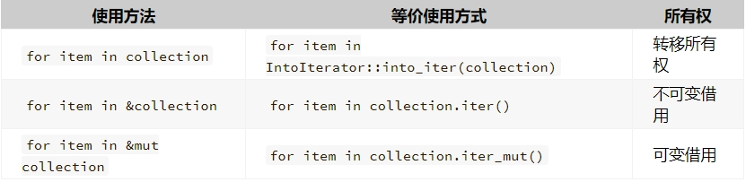

# 《RustCourse》学习笔记（6）

## 第2章 Rust基本概念

### 2.5 流程控制

> https://course.rs/basic/flow-control.html

我们可以通过循环、分支等流程控制方式，更好的实现相应的功能。

#### 2.5.1 使用 if/else/else if来做分支控制

```rust
fn main() {
  let condition = 100;

  if condition == 100 {
    // A...
  } else if condition - 1 == 98 {
    // B..
  } else {
    // C..
  }

  let number = if condition == 100 { 5 } else { 6 };
}
```

#### 2.5.2 循环控制

Rust 语言中有三种循环方式：`for`、`while`和`loop`

##### 2.5.2.1 for 循环

for 的用法跟 javascript 差不多，以下是它的普通用法：

```rust
for 元素 in 集合 {
  // 使用元素干一些你懂我不懂的事情
}

/* 循环输出一个从 1 到 5 的序列 */
for i in 1..=5 {
  println!("{}", i);
}

/* 除非你不想在后面的代码中继续使用该集合，最好使用变量的不可变引用 */
for item in &container {
  // ...
}

/* 如果想在循环中修改该元素，可以使用 `mut` 关键字 */
for item in &mut collection {
  // ...
}

/* 在循环中获取元素的索引 */
let a = [4, 3, 2, 1];
// `.iter()` 方法把 `a` 数组变成一个迭代器
for (i, v) in a.iter().enumerate() {
  println!("第{}个元素是{}", i + 1, v);
}

/* 想用 for 循环控制某个过程执行 10 次，但是又不想单独声明一个变量来控制这个流程 */
for _ in 0..10 {
  // ...
}

/* 循环索引，然后通过索引下标去访问集合，性能较差（编译器需要进行边界检查），且存在一定可能性在两次访问之间，collection 发生了变化，导致脏数据产生 */
let collection = [1, 2, 3, 4, 5];
for i in 0..collection.len() {
  let item = collection[i];
  // ...
}

/* 更安全性能也更好的做法 */
for item in collection {

}
```

**同时要注意`for`循环是为夺取变量的所有权的，除非你不想在后面的代码中继续使用该集合，最好使用变量的不可变引用**。



> 对于实现了 `copy` 特征的数组(例如 [i32; 10] )而言， `for item in arr` 并不会把 `arr` 的所有权转移，而是直接对其进行了拷贝，因此循环之后仍然可以使用 `arr` 。

由于 `for` 循环无需任何条件限制，也不需要通过索引来访问，因此是最安全也是最常用的

##### 2.5.2.2/2.5.2.3 continue/break

使用 `continue` 可以跳过当前当次的循环，开始下次的循环

使用 `break` 可以直接跳出当前整个循环，break 用于 loop 循环时，可以像 return 那样，返回一个值。

##### 2.5.2.4 while 循环

```rust
fn main() {
  let mut n = 0;

  while n <= 5  {
    println!("{}!", n);

    n = n + 1;
  }

  println!("我出来了！");
}
```

##### 2.5.2.5 loop 循环

`loop`是一个简单的无限循环，可以在内部通过`break`关键字来控制循环何时结束。

```rust
fn main() {
    let mut counter = 0;

    let result = loop {
        counter += 1;

        if counter == 10 {
            break counter * 2;
        }
    };

    println!("The result is {}", result);
}
```

> 这里有几点值得注意：
>
> - **break 可以单独使用，也可以带一个返回值**，有些类似 `return`
> - **loop 是一个表达式**，因此可以返回一个值

### 2.6 模式匹配

模式匹配经常出现在函数式编程里面，用于为复杂的类型系统提供解构能力。

#### 2.6.1 match 和 if let

最常用的匹配就是`match`和`if let`。

```rust
enum Direction {
    East,
    West,
    North,
    South,
}

fn main() {
    let dire = Direction::South;
    match dire {
        Direction::East => println!("East"),
        Direction::North | Direction::South => {
            println!("South or North");
        },
        _ => println!("West"),
    };
}
```

从以上例子可知：

- `match` 的匹配必须要穷举出所有可能，因此这里用 `_` 来代表未列出的所有可能性
- `match` 的每一个分支都必须是一个表达式，且所有分支的表达式最终返回值的类型必须相同
- **X | Y**，类似逻辑运算符 `或`，代表该分支可以匹配 `X` 也可以匹配 `Y`，只要满足一个即可

`match`跟其他语言中的`switch`非常像，`_`类似于`switch`中的`default`。

##### 2.6.1.1 match 匹配

match 的通用形式：

```rust
match target {
    模式1 => 表达式1,
    模式2 => {
        语句1;
        语句2;
        表达式2
    },
    _ => 表达式3
}
```

match 本身一个表达式，可以用来赋值，比如：

```rust
enum IpAddr {
   Ipv4,
   Ipv6
}

fn main() {
    let ip1 = IpAddr::Ipv6;
    let ip_str = match ip1 {
        IpAddr::Ipv4 => "127.0.0.1",
        _ => "::1",
    };

    println!("{}", ip_str);
}
```

此外还可以从枚举中解构出它的值：

```rust
enum Coin {
  Penny,
  Nickel,
  Dime,
  Quarter(UsState), // 25美分硬币
}

fn value_in_cents(coin: Coin) -> u8 {
  match coin {
    Coin::Penny => 1,
    Coin::Nickel => 5,
    Coin::Dime => 10,
    Coin::Quarter(state) => {
      // 返回 25 美分的值
      println!("State quarter from {:?}!", state);
      25
    },
  }
}
```

除了`_`通配符，用一个变量来承载其他情况也是可以的：

```rust
#[derive(Debug)]
enum Direction {
  East,
  West,
  North,
  South,
}

fn main() {
  let dire = Direction::South;
  match dire {
    Direction::East => println!("East"),
    other => println!("other direction: {:?}", other),
  };
}
```

##### 2.6.1.2 if let 匹配

在某些场景下，我们其实只关心**某一个值是否存在**，此时使用 `match` 就显得过于啰嗦。此时则可以使用`if let`：

```rust
let v = Some(3u8);
match v {
  Some(3) => println!("three"),
  /* 为了满足 match 表达式（穷尽性）的要求，写代码时必须在处理完这唯一的成员后加上 _ => ()，这样会增加不少无用的代码。 */
  _ => (),
}

// 上面的代码等价于
if let Some(3) = v {
  println!("three");
}
```

> **当你只要匹配一个条件，且忽略其他条件时就用 `if let` ，否则都用 `match`**

##### 2.6.1.3 matches! 宏

该宏可以将一个表达式跟模式进行匹配，然后返回匹配的结果。

```rust
enum MyEnum {
    Foo,
    Bar
}

fn main() {
  let v = vec![MyEnum::Foo,MyEnum::Bar,MyEnum::Foo];
  // 如果想对 v 进行过滤，只保留类型是 MyEnum::Foo 的元素，你可能想这么写：
  // v.iter().filter(|x| x == MyEnum::Foo);
  // 但是，实际上这行代码会报错，因为你无法将 x 直接跟一个枚举成员进行比较
  // 虽然可以使用手动 match 来完成，但实际上有更简单的方式，就是使用 match!
  v.iter().filter(|x| matches!(x, MyEnum::Foo));
}
```

> Rust 中的闭包函数（匿名函数）
>
> GitHub Copilot: 在 Rust 中，闭包是一种匿名函数，可以捕获其环境中的值。闭包的语法和能力使其在临时功能或短小的函数中非常有用。闭包的语法比函数更灵活和轻量。
>
> 闭包的定义使用一对竖线（`||`）包围输入变量，然后是一对大括号（`{}`）包围闭包的主体。这是一个简单的闭包例子：
>
> ```rust
> fn main() {
>     let add_one = |x| x + 1;
>     let five = add_one(4);
>     println!("five = {}", five);
> }
> ```
>
> 在这个例子中，`add_one` 是一个闭包，它接受一个参数 `x`，并返回 `x + 1`。然后我们调用这个闭包，传入 `4`，并打印结果。
>
> 闭包还可以捕获其环境中的值。例如：
>
> ```rust
> fn main() {
>     let x = 4;
>     let add_x = |y| y + x;
>     let eight = add_x(4);
>     println!("eight = {}", eight);
> }
> ```
>
> 在这个例子中，`add_x` 闭包捕获了其环境中的 `x` 值，并在闭包体中使用它。

再来看看更多的例子：

```rust
let foo = 'f';
/*
chatGPT：
	模式是 'A'..='Z' | 'a'..='z'，这表示一个字符范围从 'A' 到 'Z' 或者从 'a' 到 'z'。
	所以，matches!(foo, 'A'..='Z' | 'a'..='z') 会检查 foo 是否是一个英文字母（无论大小写）。如果 foo 是一个英文字母，那么这个表达式就会返回 true，否则返回 false。
*/
assert!(matches!(foo, 'A'..='Z' | 'a'..='z'));

let bar = Some(4);
/*
chatGPT：
	Some(x) if x > 2。这个模式表示一个 Option 枚举的 Some 变体，其中包含的值大于 2。
	如果 bar 是 Some(3)，那么这个表达式就会返回 true，因为 3 大于 2。如果 bar 是 Some(2)、Some(1) 或 None，那么这个表达式就会返回 false，因为这些值不匹配 Some(x) if x > 2 这个模式。
*/
assert!(matches!(bar, Some(x) if x > 2));
```


注意，使用 match 和 if let 都会导致**变量名遮蔽（即当前作用域内的变量会覆盖外部的同变量名）**，因此最好不用使用同名，避免难以理解，如下：

```rust
fn main() {
  let age = Some(30);
  println!("在匹配前，age是{:?}", age);
  match age {
    Some(x) =>  println!("匹配出来的age是{}", x),
    _ => ()
  }
  println!("在匹配后，age是{:?}", age);
}
```

#### 2.6.2 解构 Option

```rust
fn plus_one(x: Option<i32>) -> Option<i32> {
    match x {
        None => None,
        Some(i) => Some(i + 1),
    }
}

let five = Some(5);
let six = plus_one(five);
let none = plus_one(None);
```

使用`match`对于 Option 类型来说，既可以传入`Option::Some(任意值)`，也可以传入`Option::None`

#### 2.6.3 模式适用场景

所有可能用到模式匹配的地方：

- match 分支

- if let 分支以及赋值

  要注意`if let`除了能用在判断以外，也能用来赋值。

  ```rust
  if let Some(x) = some_option_value {
    	// 在这里就能安全的使用提取出来的 x 变量了
      println!("{}", x);
  }
  ```

- while let 条件循环

  与`if let`类似的结构，它允许只要模式匹配就一直进行`while`循环

  ```rust
  // Vec是动态数组
  let mut stack = Vec::new();
  
  // 向数组尾部插入元素
  stack.push(1);
  stack.push(2);
  stack.push(3);
  
  /*
    这个例子会打印出 3、2 接着是 1。pop 方法取出动态数组的最后一个元素并返回 Some(value)，如果动态数组是空的，将返回 None，对于 while 来说，只要 pop 返回 Some 就会一直不停的循环。一旦其返回 None，while 循环停止。我们可以使用 while let 来弹出栈中的每一个元素。
  
    你也可以用 loop + if let 或者 match 来实现这个功能，但是会更加啰嗦。
  */
  while let Some(top) = stack.pop() {
    println!("{}", top);
  }
  ```

- for 循环

  ```rust
  let v = vec!['a', 'b', 'c'];
  /*
  这里使用 enumerate 方法产生一个迭代器，该迭代器每次迭代会返回一个 (索引，值) 形式的元组，然后用 (index,value) 来匹配。
  */
  for (index, value) in v.iter().enumerate() {
      println!("{} is at index {}", value, index);
  }
  ```

- let 语句

  赋值（变量绑定）在 rust 中也是一种模式匹配

  ```rust
  // 模式匹配要求两边的类型必须相同，否则就会导致报错，对于元组来说，元素个数也是类型的一部分！
  let (x, y, z) = (1, 2, 3);
  ```

- 函数参数

  函数参数也是一种模式匹配，还可以在参数中匹配元组

  ```rust
  fn print_coordinates(&(x, y): &(i32, i32)) {
      println!("Current location: ({}, {})", x, y);
  }
  
  fn main() {
      let point = (3, 5);
      print_coordinates(&point);
  }
  ```

#### 2.6.4 全模式列表

> https://course.rs/basic/match-pattern/all-patterns.html
>
> 本节的目标就是把这些模式语法都罗列出来，方便大家检索查阅（模式匹配在我们的开发中会经常用到）。

以下仅列出个人觉得比较重要和难记的点：

- 单分支多模式：

  第一个分支有 **或** 选项，意味着如果 `x` 的值匹配此分支的任何一个模式，它就会运行

  ```rust
  let x = 1;
  
  match x {
      1 | 2 => println!("one or two"),
      3 => println!("three"),
      _ => println!("anything"),
  }
  ```

- 通过序列 ..= 匹配值的范围

  相比使用 `|` 运算符表达相同的意思更为方便；比如，相比于使用`1 | 2 | 3 | 4 | 5`这几个值，使用`..=`就简短得多。

  序列只允许用于数字或字符类型，原因是：它们可以连续，同时编译器在编译期可以检查该序列是否为空，字符和数字值是 Rust 中仅有的可以用于判断是否为空的类型。

  ```rust
  let x = 5;
  
  match x {
      1..=5 => println!("one through five"),
      _ => println!("something else"),
  }
  
  let y = 'c';
  
  match y {
      'a'..='j' => println!("early ASCII letter"),
      'k'..='z' => println!("late ASCII letter"),
      _ => println!("something else"),
  }
  ```

- 匹配结构体

  ```rust
  struct Point {
      x: i32,
      y: i32,
  }
  
  fn main() {
      let p = Point { x: 0, y: 7 };
  
      match p {
          Point { x, y: 0 } => println!("On the x axis at {}", x),
          Point { x: 0, y } => println!("On the y axis at {}", y),
          Point { x, y } => println!("On neither axis: ({}, {})", x, y),
      }
  }
  
  ```

- 解构枚举中的结构体

  编写一个 `match` 使用模式解构每一个内部值

  ```rust
  enum Message {
      Quit,
      Move { x: i32, y: i32 },
      Write(String),
      ChangeColor(i32, i32, i32),
  }
  
  fn main() {
      let msg = Message::ChangeColor(0, 160, 255);
  
      match msg {
          Message::Quit => {
              println!("The Quit variant has no data to destructure.")
          }
          Message::Move { x, y } => {
              println!(
                  "Move in the x direction {} and in the y direction {}",
                  x,
                  y
              );
          }
          Message::Write(text) => println!("Text message: {}", text),
          Message::ChangeColor(r, g, b) => {
              println!(
                  "Change the color to red {}, green {}, and blue {}",
                  r,
                  g,
                  b
              )
          }
      }
  }
  ```

  解构嵌套的枚举和枚举中的结构体

  ```rust
  enum Color {
     Rgb(i32, i32, i32),
     Hsv(i32, i32, i32),
  }
  
  enum Message {
      Quit,
      Move { x: i32, y: i32 },
      Write(String),
      ChangeColor(Color),
  }
  
  fn main() {
      let msg = Message::ChangeColor(Color::Hsv(0, 160, 255));
  
      match msg {
          Message::ChangeColor(Color::Rgb(r, g, b)) => {
              println!(
                  "Change the color to red {}, green {}, and blue {}",
                  r,
                  g,
                  b
              )
          }
          Message::ChangeColor(Color::Hsv(h, s, v)) => {
              println!(
                  "Change the color to hue {}, saturation {}, and value {}",
                  h,
                  s,
                  v
              )
          }
          _ => ()
      }
  }
  ```

- 解构结构体和元组

  ```rust
  struct Point {
       x: i32,
       y: i32,
   }
  
  let ((feet, inches), Point {x, y}) = ((3, 10), Point { x: 3, y: -10 });
  ```

- 解构数组

  ```rust
  // 定长数组
  let arr: [u16; 2] = [114, 514];
  let [x, y] = arr;
  
  assert_eq!(x, 114);
  assert_eq!(y, 514);
  
  // 不定长数组
  let arr: &[u16] = &[114, 514];
  
  if let [x, ..] = arr {
      assert_eq!(x, &114);
  }
  
  if let &[.., y] = arr {
      assert_eq!(y, 514);
  }
  
  let arr: &[u16] = &[];
  
  assert!(matches!(arr, [..]));
  assert!(!matches!(arr, [x, ..]));
  ```

- 使用下划线可以用来忽略值，如果不使用单纯的下划线，也可以使用以下划线为开头的变量名。

  > 注意, 只使用 `_` 和使用以下划线开头的名称有些微妙的不同：比如 **`_x` 仍会将值绑定到变量（即会获取变量的所有权），而 `_` 则完全不会绑定**。

  ```rust
  // 会报错
  let s = Some(String::from("Hello!"));
  
  if let Some(_s) = s {
      println!("found a string");
  }
  
  println!("{:?}", s);
  ```

  ```rust
  // 不会报错
  let s = Some(String::from("Hello!"));
  
  if let Some(_) = s {
      println!("found a string");
  }
  
  println!("{:?}", s);
  ```

- 用`..`忽略剩余值

  ```rust
  fn main() {
      let numbers = (2, 4, 8, 16, 32);
  
      match numbers {
          (first, .., last) => {
              println!("Some numbers: {}, {}", first, last);
          },
      }
  }
  ```

  > 但是注意：每个元组模式只能使用一个 `..`，比如下面的代码会报错
  >
  > ```rust
  > match numbers {
  >   (.., second, ..) => {
  >     println!("Some numbers: {}", second)
  >   },
  > }
  > /*
  > error: `..` can only be used once per tuple pattern // 每个元组模式只能使用一个 `..`
  >  --> src/main.rs:5:22
  >   |
  > 5 |         (.., second, ..) => {
  >   |          --          ^^ can only be used once per tuple pattern
  >   |          |
  >   |          previously used here // 上一次使用在这里
  > 
  > error: could not compile `world_hello` due to previous error              ^^
  > */
  > ```

- 匹配的额外条件`if`

  **匹配守卫**（*match guard*）是一个位于 `match` 分支模式之后的额外 `if` 条件，它能为分支模式提供更进一步的匹配条件。

  ```rust
  fn main() {
      let num = Some(4);
  
      match num {
          Some(x) if x < 5 => println!("less than five: {}", x),
          Some(x) => println!("{}", x),
          None => (),
      }
  }
  ```

- @ 绑定

  使用`@`可以做到在**匹配中**既绑定一个新变量，同时解构旧变量。（Rust 1.56 以后可以做到，在之前只能做到解构以后绑定）

  ```rust
  // 解构以后绑定
  enum Message {
      Hello { id: i32 },
  }
  
  let msg = Message::Hello { id: 5 };
  
  match msg {
      Message::Hello { id: id_variable @ 3..=7 } => {
          println!("Found an id in range: {}", id_variable)
      },
      Message::Hello { id: 10..=12 } => {
          println!("Found an id in another range")
      },
      Message::Hello { id } => {
          println!("Found some other id: {}", id)
      },
  }
  ```

  ```rust
  // 既解构，又绑定
  #[derive(Debug)]
  struct Point {
    x: i32,
    y: i32,
  }
  
  fn main() {
    // 绑定新变量 `p`，同时对 `Point` 进行解构
    let p @ Point {x: px, y: py } = Point {x: 10, y: 23};
    println!("x: {}, y: {}", px, py);
    println!("{:?}", p);
  
  
    let point = Point {x: 10, y: 5};
    if let p @ Point {x: 10, y} = point {
      println!("x is 10 and y is {} in {:?}", y, p);
    } else {
      println!("x was not 10 :(");
    }
  }
  
  /* 一个更简单的例子 */
  fn main() {
      #[derive(Debug)]
      struct Point {
          x: i32,
          y: i32,
      }
  
      let ((feet, inches), xx @ Point { x, y }) = ((3, 10), Point { x: 3, y: -10 });
      println!("feet: {}, inches: {}, xx: {:?}, x: {}, y: {},", feet, inches, xx, x, y)
  }
  ```

  

  


