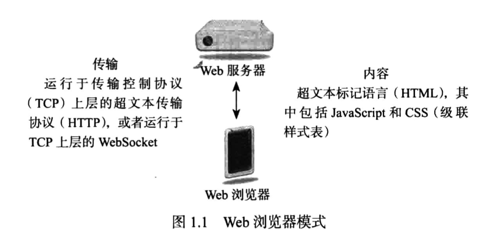
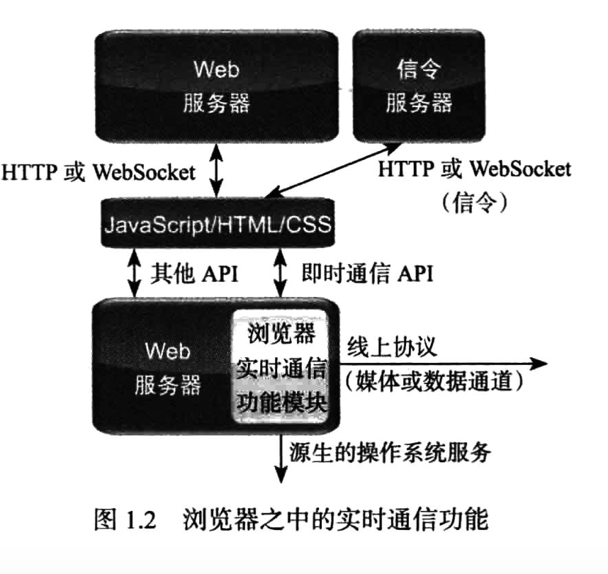
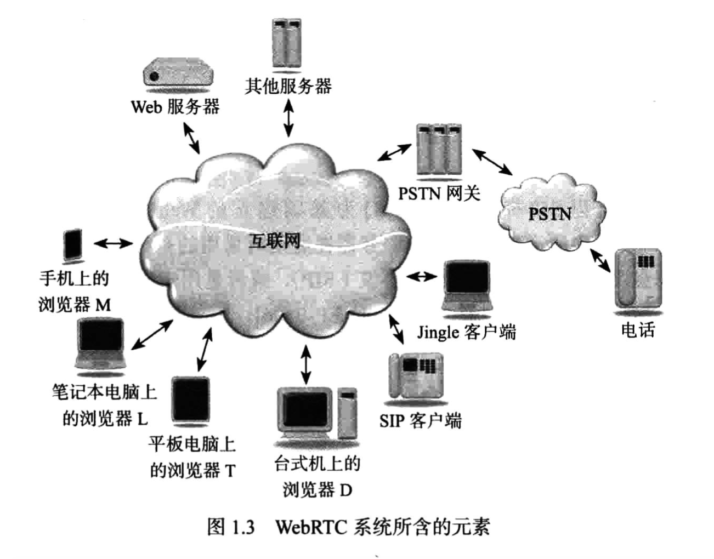
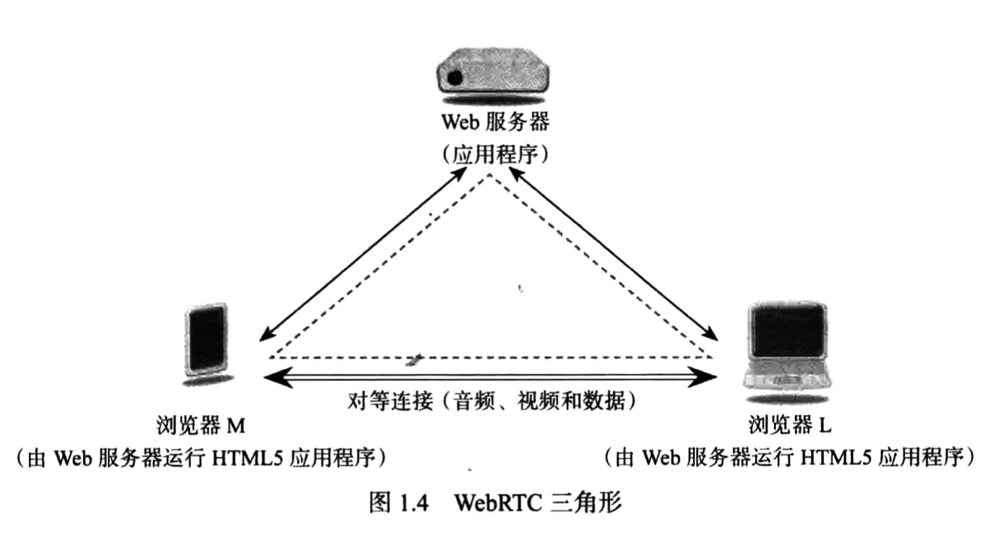
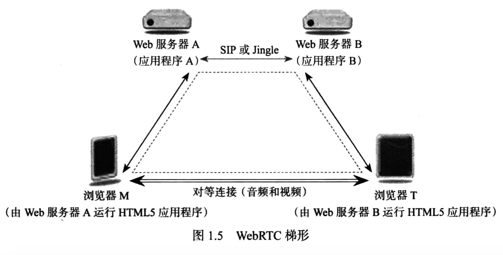
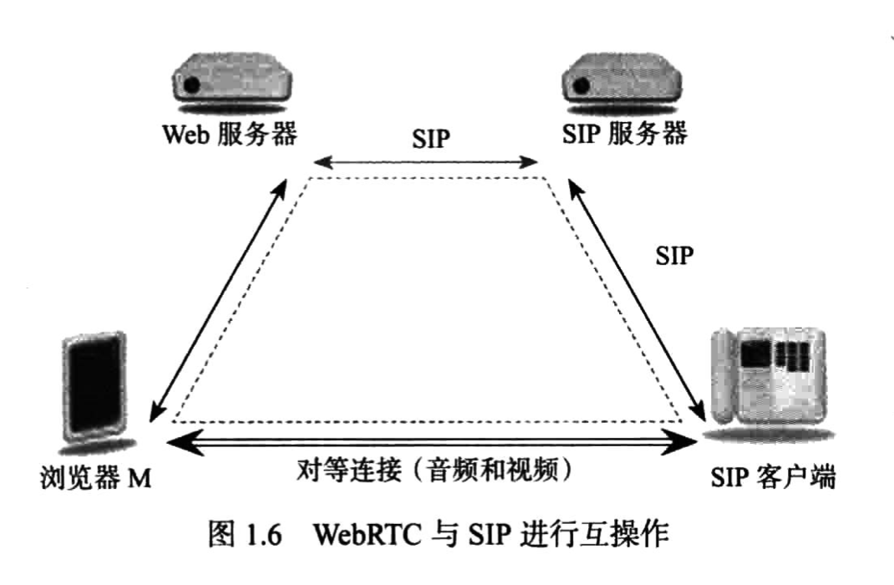
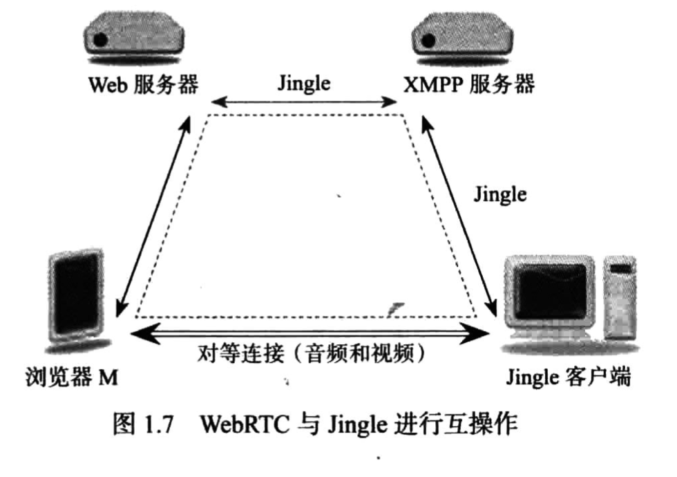
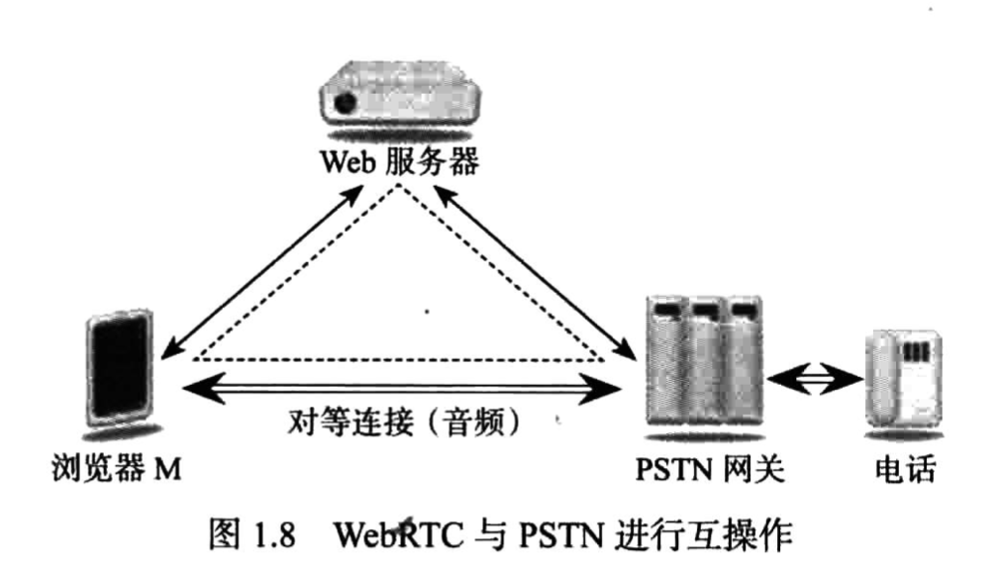

# WebRTC权威指南学习笔记（1）

> 资料下载地址:
>
> [百度网盘](https://pan.baidu.com/s/1c_lgO6C9EKRpJ-YMK4vjTg)
>
> 提取码: jweh
>
> **本资料仅用于学习交流，如有能力请到各大销售渠道支持正版 !**

## 第1章 Web实时通信技术介绍

Web 实时通信技术（Web Real-Time Communication，WebRTC）为浏览器增加了新的功能，使得浏览器能够直接与其他浏览器交互，从而形成包括三角模式和梯形模式在内的体系结构。

### 1.1 WebRTC 介绍

WebRTC 旨在将实时通信功能引入到所有浏览器中，并通过标准的 HTML5 标签和 JavaScript API 使得这些功能可为 Web 开发者所用，且无需安装任何额外的软件或者插件。而要得到所有的浏览器支持，就必须为 WebRTC 制定相关标准。

#### 1.1.1 Web 浏览模式

Web 浏览器的传输模式如上图所示，考虑到 WebRTC 能利用任何 Web 传输，本书将不讨论连接细节以及连接时使用的是 HTTP 还是 WebSocket。

#### 1.1.2 浏览器中的实时通信功能

实时通信技术的独特性质和要求，决定了增加该功能和实现该功能的标准化绝非易事。实时通信功能通过标准 API 与 Web 应用程序交互，并使用浏览器与操作系统通信。

WebRTC 增加了一个新特点，即浏览器与浏览器之间的交互（所谓“对等连接”）。在此类交互中，一个浏览器之中的实时通信功能使用线上（on the wire）标准协议（非 HTTP），与另一个浏览器或网络电话（VoIP）或视频应用程序之中的实时通信功能进行通信。虽然使用 TCP 传输 Web 流量，但浏览器之间的线上协议也可以使用其他的传输协议，如 UDP。

WebRTC 的另一个新特点是提供信令服务器，该服务器在浏览器和对等连接另一端之间提供信令通道。

#### 1.1.3 WebRTC 系统所包含的元素

WebRTC 支持上述所有设备之间的通信。

#### 1.1.4 WebRTC 三角形

最常见的情形可能是两个浏览器都在运行从同一个 Web 服务器中下载的同一个 WebRTC Web 应用程序，这三者之间就会形成一个 WebRTC 三角形。

虽然有时会将浏览器与服务器之间的连接称作信令，但信令在 WebRTC 中并未实现标准化，它只是被视作应用程序的一部分，可以通过不同的通信协议传送到处理信令的 Web 服务器中。

#### 1.1.5 WebRTC 梯形

可以使用以 SIP（会话启动协议）梯形为基础建立的 WebRTC 梯形结构。在第 5 章将对此进行探讨。

#### 1.1.6 WebRTC 和会话启动协议 SIP

Web 服务器有一个内置的 SIP 信令网关，浏览器与 SIP 客户端之间可以通过此网管来交换呼叫，建立信息。这会直接在浏览器和 SIP 客户端之间形成媒体流。

#### 1.1.7 WebRTC 与 Jingle

Web 服务器具有一个内置的 可扩展消息现场（XMPP，也称作 Jabber） 协议服务器。该内置服务器通过另一个 XMPP 服务器与 Jingle 客户端进行通信。

#### 1.1.8 WebRTC 与公共交换电话网

WebRTC 与公共交换电话网（PSTN）进行互操作。PSTN 网关是纯音频媒体流的终结点，负责将 PSTN 电话呼叫与媒体连接。在 Web 服务器与 PSTN 网关之间需要有某种形式的信令，可以是 SIP，也可以是主/从控制协议。

浏览器并不会获取电话号码或加入 PSTN，而是由互联网通信服务为用户分配一个电话号码，用户则可以使用 WebRTC 来访问该服务，这样拨叫该电话号码时就可以由 Web 服务器通知到浏览器，浏览器就会发出“铃响声”。

应答呼叫时则会通过 PSTN 呼叫方相连的互联网建立语音会话。

### 1.2 WebRTC 中的多种媒体流

> 本次阅读至 P6 1.2 WebRTC 中的多种媒体流 25