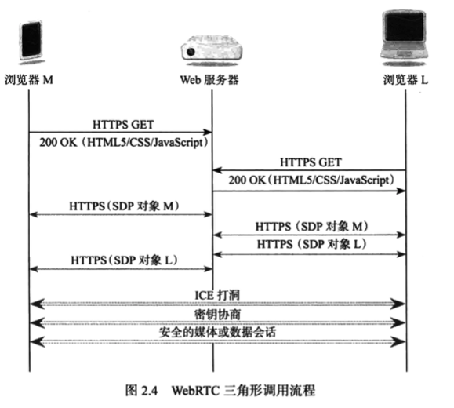

# WebRTC权威指南学习笔记（2）

## 第2章 如何使用 WebRTC

WebRTC 只需要少数几个步骤即可建立媒体会话。本章将大体介绍如何建立 WebRTC 对话，会话期间可执行哪些操作，以及如何关闭会话等。

### 2.1 建立 WebRTC 会话

建立 WebRTC 需要四个主要步骤：

1. 获取本地媒体

   最常见的是使用`getUserMedia()`方法，此方法可用于获取单个本地 MediaStream。在获取一个或多个媒体流之后，可使用 MediaStream API 将它们组合到所需要的流中。为保护隐私，浏览器会在请求用户许可后，才批准 Web 应用程序访问用户的麦克风或摄像头。

2. 在浏览器和对等端（其他浏览器或终端）之间建立连接

   RTCPeerConnection API 是 WebRTC 的核心，用于在两个对等端之间建立连接。建立次连接需要一个新的 RTCPeerConnection 对象，该构造函数方法需要传入一个配置对象，用于配置 ICE 和 NAT 和防火墙。

3. 将媒体和数据通道关联至该连接

   建立连接后，可将任意数量的本地媒体流关联到对等连接，以通过该连接发送至远端浏览器。也可以将任意数量的远端媒体流发送至对等连接的本地端。

4. 交换会话描述

   当从本地端或远程端发出添加或删除媒体的请求时，可请求浏览器生成相应的 RTCSessionDescription 对象，用于表示通过对等连接传输的所有媒体集合。当两个对等连接的浏览器交换完 RTCSessionDescription 对象后，即可建立媒体或数据会话，两个浏览器将开始配置 NAT 打洞。NAT 完毕后即可开始协商密钥，确保媒体会话的安全。最后才会开始媒体或数据会话。

#### 2.1.4 关闭连接

对等连接中，任何一端的浏览器都可以关闭连接。应用程序可以通过对 RTCPeerConnection 对象调用`close()`来指示连接已使用完毕。

### 2.2 WebRTC 联网和交互示例

#### 2.2.1 在 WebRTC 三角形中建立会话

#### 2.2.2 在 WebRTC 梯形中建立会话

这种模式不单局限于浏览器之间，将 Web 服务器 B 替换成特定的服务器，就可以支持上面提到的 SIP 终端、Jingle 终端、SIP 电话终端等设备的通信。

### 2.3 WebRTC 伪代码示例

略，在本书接下来的几个章节中，将会构建一个没有限制且真实可运行的代码示例。

## 第 3 章 本地媒体

本章介绍 WebRTC 的媒体模型以及如何获取和控制本地媒体。后续章节将介绍如何在对等端之间传输媒体。

### 3.1 WebRTC 中的媒体

#### 3.1.1 轨道

MediaStreamTrack 是 WebRTC 中的基本媒体单元。该轨道代表一种设备或录制内容（称为“源”）可返回的单一类型的媒体。但个立体声生源或者 6 声道环绕声音频信号均可以被视为一个轨道（尽管它们都由多个音频声道构成）。

每个轨道都有一个源与之关联，WebRTC 并不能直接访问或者控制源，**对源一切的控制都要通过轨道实施**。轨道不仅可以是来自源的原始媒体，还可能是浏览器提供的经过转换的版本。例如：轨道可以代表由摄像头以较高本机分辨率录制的视频的低采样率版本。

#### 3.1.2 流

MediaStream 是 MediaStreamTrack 对象的集合。有两种方式用于创建这些媒体流对象：

- 通过从现有 MediaStream 中复制轨道来请求对本地媒体的访问
- 使用对等连接来接收新的流

目前请求和访问本地媒体只有一种方式：调用`getUserMedia()`方法。

通过 MediaStream 构造函数可从现有的 MediaStream 对象的轨道“复制”到新的 MediaStream 对象中。

无论 MediaStream 对象是如何创建的，**其中所有的轨道都将会在呈现时进行同步，流中的各个轨道并未排序，任何添加重复轨道的尝试都将被忽略，而且没有任何提示**。

每个轨道都有一个 ID，因此对于通过对等连接发送的 MediaStream，可通过在调用`getAudioTracks()`或`getVideoTracks()`后检查 ID，甚至通过`getTrackById()`直接请求轨道来对轨道进行拼合。

### 3.2 捕获本地媒体

> 本地阅读至 P31 3.2 捕获本地媒体 50