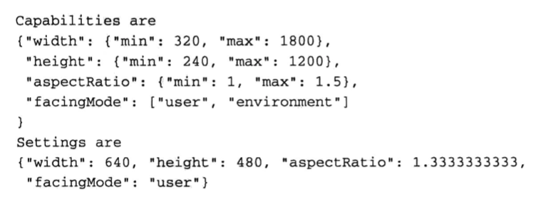

# WebRTC权威指南学习笔记（2）

## 第2章 如何使用 WebRTC

WebRTC 只需要少数几个步骤即可建立媒体会话。本章将大体介绍如何建立 WebRTC 对话，会话期间可执行哪些操作，以及如何关闭会话等。

### 2.1 建立 WebRTC 会话

建立 WebRTC 需要四个主要步骤：

1. 获取本地媒体

   最常见的是使用`getUserMedia()`方法，此方法可用于获取单个本地 MediaStream。在获取一个或多个媒体流之后，可使用 MediaStream API 将它们组合到所需要的流中。为保护隐私，浏览器会在请求用户许可后，才批准 Web 应用程序访问用户的麦克风或摄像头。

2. 在浏览器和对等端（其他浏览器或终端）之间建立连接

   RTCPeerConnection API 是 WebRTC 的核心，用于在两个对等端之间建立连接。建立次连接需要一个新的 RTCPeerConnection 对象，该构造函数方法需要传入一个配置对象，用于配置 ICE 和 NAT 和防火墙。

3. 将媒体和数据通道关联至该连接

   建立连接后，可将任意数量的本地媒体流关联到对等连接，以通过该连接发送至远端浏览器。也可以将任意数量的远端媒体流发送至对等连接的本地端。

4. 交换会话描述

   当从本地端或远程端发出添加或删除媒体的请求时，可请求浏览器生成相应的 RTCSessionDescription 对象，用于表示通过对等连接传输的所有媒体集合。当两个对等连接的浏览器交换完 RTCSessionDescription 对象后，即可建立媒体或数据会话，两个浏览器将开始配置 NAT 打洞。NAT 完毕后即可开始协商密钥，确保媒体会话的安全。最后才会开始媒体或数据会话。


#### 2.1.4 关闭连接

对等连接中，任何一端的浏览器都可以关闭连接。应用程序可以通过对 RTCPeerConnection 对象调用`close()`来指示连接已使用完毕。

### 2.2 WebRTC 联网和交互示例


#### 2.2.1 在 WebRTC 三角形中建立会话


#### 2.2.2 在 WebRTC 梯形中建立会话


这种模式不单局限于浏览器之间，将 Web 服务器 B 替换成特定的服务器，就可以支持上面提到的 SIP 终端、Jingle 终端、SIP 电话终端等设备的通信。

### 2.3 WebRTC 伪代码示例

略，在本书接下来的几个章节中，将会构建一个没有限制且真实可运行的代码示例。

## 第 3 章 本地媒体

本章介绍 WebRTC 的媒体模型以及如何获取和控制本地媒体。后续章节将介绍如何在对等端之间传输媒体。

### 3.1 WebRTC 中的媒体

#### 3.1.1 轨道

MediaStreamTrack 是 WebRTC 中的基本媒体单元。该轨道代表一种设备或录制内容（称为“源”）可返回的单一类型的媒体。但个立体声生源或者 6 声道环绕声音频信号均可以被视为一个轨道（尽管它们都由多个音频声道构成）。

每个轨道都有一个源与之关联，WebRTC 并不能直接访问或者控制源，**对源一切的控制都要通过轨道实施**。轨道不仅可以是来自源的原始媒体，还可能是浏览器提供的经过转换的版本。例如：轨道可以代表由摄像头以较高本机分辨率录制的视频的低采样率版本。

#### 3.1.2 流

MediaStream 是 MediaStreamTrack 对象的集合。有两种方式用于创建这些媒体流对象：

- 通过从现有 MediaStream 中复制轨道来请求对本地媒体的访问
- 使用对等连接来接收新的流

目前请求和访问本地媒体只有一种方式：调用`getUserMedia()`方法。

通过 MediaStream 构造函数可从现有的 MediaStream 对象的轨道“复制”到新的 MediaStream 对象中。

无论 MediaStream 对象是如何创建的，**其中所有的轨道都将会在呈现时进行同步，流中的各个轨道并未排序，任何添加重复轨道的尝试都将被忽略，而且没有任何提示**。

每个轨道都有一个 ID，因此对于通过对等连接发送的 MediaStream，可通过在调用`getAudioTracks()`或`getVideoTracks()`后检查 ID，甚至通过`getTrackById()`直接请求轨道来对轨道进行拼合。

### 3.2 捕获本地媒体

WebRTC 定义了一个新的 JavaScript 方法，专门用于对本地媒体的访问：

```javascript
// 音频和视频进行访问的回调方法
function gotUserMedia(s) {
  var myVideoElement = getElementById('myvideoelement')
  // 通过视频元素播放捕获的 MediaStream
  myVideoElement.srcObject = s
}
function didntGetUserMedia(s) {
  console.log(s)
}
// 请求对音频和视频进行访问
getUserMedia({ audio: true, video: true}, gotUserMedia, didntGetUserMedia)
```

getUserMeida 方法本身并不会返回值，而是通过回调方法来返回流，只有在成功获取请求的媒体后，才会调用该回调，否则将会调用 error 回调。

上面的事例显示了 WebRTC 提供的一项新功能——添加至媒体元素用于直接赋值的 srcObject 属性。在此之前，开发者一般会使用`URL.createObjectURL`这个方法来基于 MediaStream 创建 Blob URL，该 URL 可赋予标签元素 src 属性。遗憾的是，使用 Blob URL 终归会存在某些问题，所以现在规范决定为媒体元素定义新的 srcObject 属性。任何 MediaStream 对象均可直接赋予此属性。

### 3.3 媒体选择和控制

虽然 WebRTC API 不能直接控制源，但依然可以通过约束来选择源并控制其属性。

```javascript
// 假设你已经获得了访问本地视频摄像头的权限
var t // 用于承载轨道
function gotUserMedia(s) {
  t = (s.getVideoTracks())[0]
  // 获取当前功能
  console.log(JSON.stringify(t.getCapabilities()))
  // 设置约束
  var constraints = {
    mandatory: { aspectRatio: 1.3333333 },
    optional: [
      { width: { min: 640 } },
      { height: { max: 400 } }
    ]
  }
  function successCB () {
    console.log(JSON.stringify(t.getSettings()))
  }
  t.applyConstraints(constraints, successCB, failureCB)
}
// 请求对视频进行访问
getUserMedia({ video: true }, gotUserMedia, didntGetUsermedia)
```

这可能会在控制台输出以下内容：



可约束的属性氛围两种类型：枚举属性火范围属性。调用`getCapabilities()`将返回一个对象，包含所有可约束的属性，以及对其可赋予的值。调用`getSettings`将返回所有可约束的属性及当前的值。而调用`applyConstraints()`方法可用于影响可约束属性的设置。

### 3.5 可运行的本地媒体代码示例

在这个简单的 WebRTC 示例中，会首先建造一个 Web 服务器和单个 HTML 页面。对于 Web 服务器，将对其添加代码来实施信令通道。

代码的大体文件目录结构如下：


#### 3.5.1 Web 服务器

WebRTC 应用程序与普通的 Web 后台相比，有一个重要的属性要求：即 WebRTC 应用程序都是实时应用程序，并且能够支持 PSTN 上的快速呼叫连接。因此如果使用 Web 服务器提供信令通道，就必须高效同步来自要通信的各个浏览器的请求。

本演示的代码基于 node 平台，将执行下列操作：

1. 加载 server.js 中的服务器代码和 log.js 中的日志代码
2. 指定将如何处理某些自定义的 URI 路径
3. 指定可处理的静态文件所在的目录
4. 启动 Web 服务器（可以使用 pm2 来进行进程守护启动）

PS： 其实就是自己实现了一个简易的 express 服务器...

```javascript
// server.js
const http = require('http')
const url = require('url')
const fs = require('fs')
const log = require('./log').log

/**
 * 设置静态文件（HTML、JS 等）的路径
 */
let serveFilePath = ''
function setServeFilePath(p) {
  serveFilePath = p
}
exports.serveFilePath = setServeFilePath

/**
 * 先从给定路径名称中删除 ... 、 ～ 和其他从安全角度而言存在问题的语法位，再向其开头添加 serveFilePath
 */
function createFilePath(pathname) {
  const components = pathname.substr(1).split('/')
  const filtered = new Array()
  let temp
  for (let i = 0, len = components.length; i< len; i++) {
    temp = components[i]
    if (temp === '..') continue // 没有上级目录
    if (temp === '') continue // 没有根目录
    temp = temp.replace(/~/g, '') // 没有用户目录
    filtered.push(temp)
  }
  return (serveFilePath + '/' + filtered.join('/'))
}

/**
 * 确定所提取的文件的内容类型
 */
function contentType(filepath) {
  const index = filepath.lastIndexOf('.')
  if (index >= 0) {
    switch (filepath.substr(index + 1)) {
      case 'html': return 'text/html'
      case 'js': return 'application/javascript'
      case 'css': return 'text/css'
      case 'txt': return 'text/plain'
      default: return 'text/html'
    }
  }
  return 'text/html'
}

/**
 * 如果没有为请求定义处理程序，返回 404
 */
function noHandlerErr(pathname, res) {
  log('No Request handler found for ' + pathname)
  res.writeHead(404, { 'Content-Type': 'text/plain' })
  res.write('404 Not Found')
  res.end()
}

/**
 * 确认非文件的处理程序，然后执行该程序
 */
function handleCustom(handle, pathname, info) {
  if (typeof handle[pathname] === 'function') {
    handle[pathname](info)
  } else {
    noHandlerErr(pathname, info.res)
  }
}

/**
 * 打开指定文件、读取其中的内容并将这些内容发送至客户端
 */
function serveFile(filepath, info) {
  const res = info.res
  log('serving file ' + filepath)
  fs.open(filepath, 'r', function(err, fd) {
    if (err) {
      log(err.message)
      noHandlerErr(filepath, res)
      return
    }
    let readBuffer = Buffer.from({ length: 20480 })
    fs.read(fd, readBuffer, 0, 20480, 0, function(err, readBytes) {
      if (err) {
        log(err.message)
        fs.close(fd)
        noHandlerErr(filepath, res)
        return
      }
      log('just read ' + readBytes + ' bytes')
      if (readBytes > 0) {
        res.writeHead(200, { 'Content-Type': contentType(filepath) })
        res.write(readBuffer.toString('utf-8', 0, readBytes))
        res.end()
      }
    })

  })
}


/**
 * 确定请求的路径是静态文件路径，还是拥有自己的处理程序的自定义路径
 */
function route(handle, pathname, info) {
  log('About to route a request for ' + pathname)
  // 检查前导斜杠后的路径是否为可处理的现有文件
  const filepath = createFilePath(pathname)
  log('Attempting to locate ' + filepath)
  fs.stat(filepath, function(err, stats) {
    if (!err && stats.isFile()) {
      serveFile(filepath, info)
    } else {
      handleCustom(handle, pathname, info)
    }
  })
}

/**
 * 创建一个处理程序，以基于路径名称来路由请求
 */
let info = null
function start(handle, port) {
  function onRequest(req, res) {
    const urldata = url.parse(req.url, true)
    const pathname = urldata.pathname
    info = { res }
    log('request for ' + pathname + ' received')
    route(handle, pathname, info)
  }
  http.createServer(onRequest).listen(port)
  log('Server started on port ' + port)
}

exports.start = start
```

```javascript
// log.js
/**
 * 通过该模块轻松启用或禁用控制台日志记录
 */
const log = console.log

exports.log = log
```

```javascript
// index.js
const server = require('./server')
const log = require('./log').log
const port = process.argv[2] || 5001

// 返回 404
function fourohfour(info) {
  const res = info.res
  log('Request handler fourohfour was called.')
  res.writeHead(404, { 'Content-Type': 'text/plain' })
  res.write('404 Not Found')
  res.end()
}

const handle = {}
handle['/'] = fourohfour

server.serveFilePath('static')
server.start(handle, port)
```

```shell
# 监听并以守护进程形式启动 Web 服务器
$ pm2 start src/index.js --watch
```

#### 3.5.2 客户端 WebRTC 应用程序

```html
<!DOCTYPE html>
<html lang="en">
  <head>
    <meta charset="UTF-8" />
    <meta name="viewport" content="width=device-width, initial-scale=1.0" />
    <title>Document</title>
    <!-- <script src="https://webrtc.github.io/adapter/adapter.js" type="text/javascript"></script> -->
    <style>
      video {
        width: 320px;
        height: 240px;
        border: 1px solid black;
      }
      div {
        display: inline-block;
      }
    </style>
  </head>
  <body>
    <div id="setup">
      <p>WebRTC Book Demo(local media only)</p>
    </div>
    <br />
    <div style="width: 30%; vertical-align: top">
      <div>
        <video id="myVideo" autoplay="autoplay" controls muted="true"></video>
      </div>
    </div>

    <script>
      /**
       * 主例程
       **/
      let myVideoStream, myVideo

      function gotUserMedia(stream) {
        myVideoStream = stream
        // 展示我的本地视频
        myVideo.srcObject = stream
        // attachMediaStream(myVideo, myVideoStream)
      }

      function didntGetUserMedia() {
        console.log("couldn't get video")
      }
      // 获取本地媒体方法
      function getMedia() {
        // getUserMedia
        navigator.getUserMedia(
          {
            audio: true,
            video: true
          },
          gotUserMedia,
          didntGetUserMedia
        )
      }

      // 开始获取本地媒体
      window.onload = function () {
        myVideo = document.getElementById('myVideo')
        getMedia()
      }
    </script>
  </body>
</html>
```

将上面的代码保存为`static/index.html`后，就可以通过`http://127.0.0.1:5001/index.html`进行路径访问，网页会主动询问摄像头权限，点击同意后，就能看到自己的帅脸出现在 video 标签中了。


