# WebRTC权威指南学习笔记（3）

## 第4章 信令

在 WebRTC 中，信令发挥着举足轻重的作用，但由于没有实现标准化，导致缺乏统一的标准，让人感到混乱。在实践中，开发者提出并使用了多种不同的信令方案，因此了解这些方案之间的差异，将有助于开发 WebRTC 应用程序时进行不同的选择。

### 4.1 信令的作用

信令的主要作用体现在四个方面：

1. 协商媒体功能和设置
2. 标识和验证会话参与者的身份
3. 控制媒体会话、指示进度、更改会话和终止会话
4. 当会话双方同时尝试建立或更改会话时，实施双占用分解（Glare Resolution）

#### 4.1.1 为何没有建立信令标准

在 WebRTC 中，之所以没有建立信令标准，是因为让两个浏览器能够进行互操作并不需要建立信令标准（...废话）。

实际上，信令是 Web 浏览器和 Web 服务器之间的一种事物，Web 服务器可确保两个浏览器通过下载的 JavaScript 代码来利用相同的信令协议。

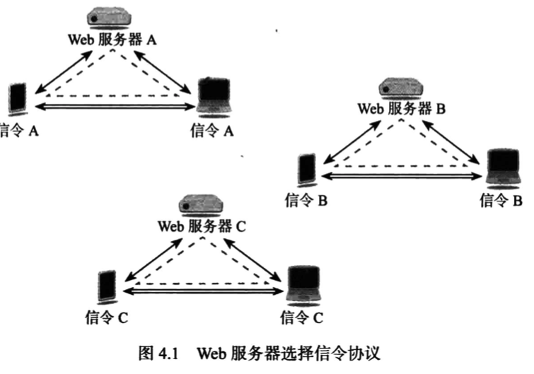

通过使用统一标准化信令协议，例如 SIP 或 Jingle，可以实现浏览器之间的互操作。

#### 4.1.2 媒体协商

WebRTC 规范包含针对“信令通道”的要求。信令最重要的功能在于，在参与对等连接的两个浏览器之间交换 SDP（Session Description Protocol，交换会话描述协议）对象。SDP 包含供浏览器中的 RTP 媒体栈配置媒体会话所需要的全部信息。

只有通过信令通道交换候选地址以后，才能进行 ICE 打洞（NAT 端口映射），因此如果没有信令功能，就无法建立对等连接。

### 4.2 信令传输

WebRTC 要求在两个浏览器之间建立双向信令通道。为此需要先来讨论信令消息的传输。

有三种方式用于传输 WebRTC 信令：HTTP、WebSocket 和数据通道。

#### 4.2.3 数据通道传输

数据通道的建立无法传输所有的 WebRTC 信令，但是，一旦建立了数据通道后，即可使用它来处理所有的信令。（翻译成人话就是：第一次数据通道的建立所使用的信令交换需要依托于 HTTP 或 WebSocket，但在建立了数据通道之后，就可以复用该通道来传输新的信令了）

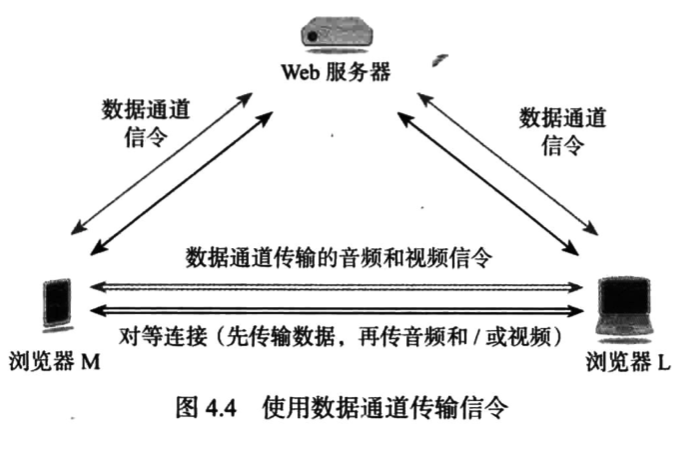

而由于第一次建立数据通道的信令负载要小得多，所以建立数据通道的信令也可以独立出来，单独做一个服务器来进行响应。

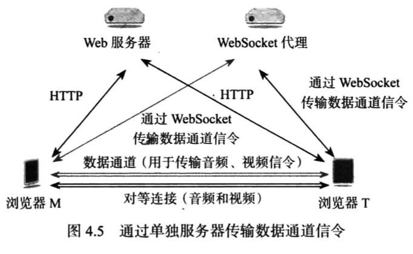

### 4.3 信令协议

WebRTC 信令协议的选择至关重要，开发人员可选择创建自己的专有信令协议，或采用 SIP、Jingle 等标准信令协议，又或者使用通过抽象化处理剥离了信令协议细节的库。

#### 4.3.1 信令状态机

信令状态机中的每一种状态，并非都需要在两个浏览器之间交换同步消息，尽管某些信令方案会导致如此。

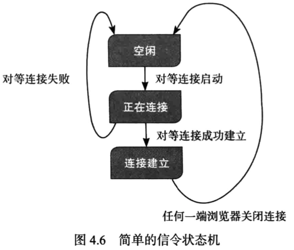

采用标准信令协议的优点在于，已存在完全定义的状态机。此外，信令消息将包含有助于路由的信息。

采用专有信令（或称为自定义信令）的优点在于，它可以非常简单，如果 WebRTC 对等连接始终仅限于两个浏览器，而不通过中间环节或者不通向 SIP 或 Jingle VoIP 或是视频终端，则适合采取这一选项。

#### 4.3.2 信令标识

为了能够让信令**标识和验证会话参与者的身份（信令的第二项作用）**，需要在服务器中设置某种路由逻辑，让 Web 服务器在两个连接之间充当代理或用于转发信息。

有两个例子可用于说明该方案：

- 使用 WebSocket 代理
- 使用 Google 应用程序引擎通道 API

如果采用的是标准的信令协议，则可以仅需极少的配置就能通过标准服务器来提供此标识功能，例如采用 SIP 信令，可通过 SIP 代理服务器执行此功能。

#### 4.3.3 HTTP 轮询

使用 HTTP 来交换信令信息，就需要每个浏览器中运行的 JavaScript 通过轮询的方式向信令服务器发送 HTTP 消息，然后让 Web 服务器作为中间代理将这些消息发送给与这个浏览器进行对等连接的另一个浏览器。（当然也可以采用轮询方式）

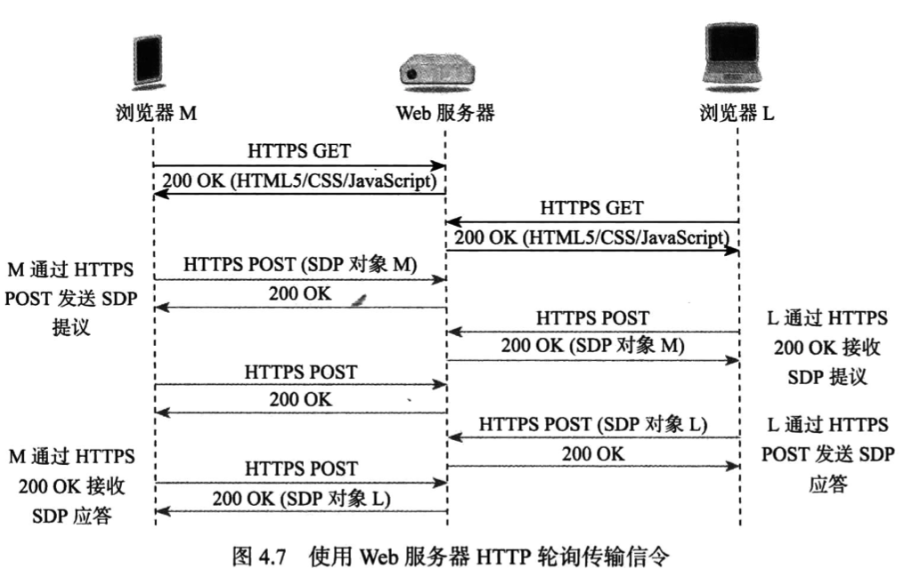

#### 4.3.4 WebSocket 代理

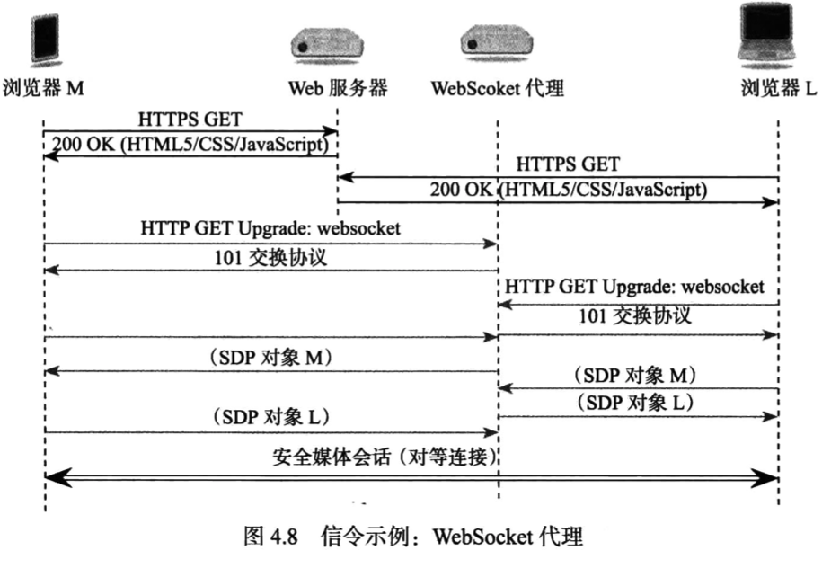

WebSocket 建立代理的方式与 HTTP 轮询的原理类似，不过由于 WebSocket 是全双工的，所以这些消息的传递可以不用像 HTTP 那样统一由浏览器发起。

以下是一些建立 WebSocket 信令通道的伪代码片段：

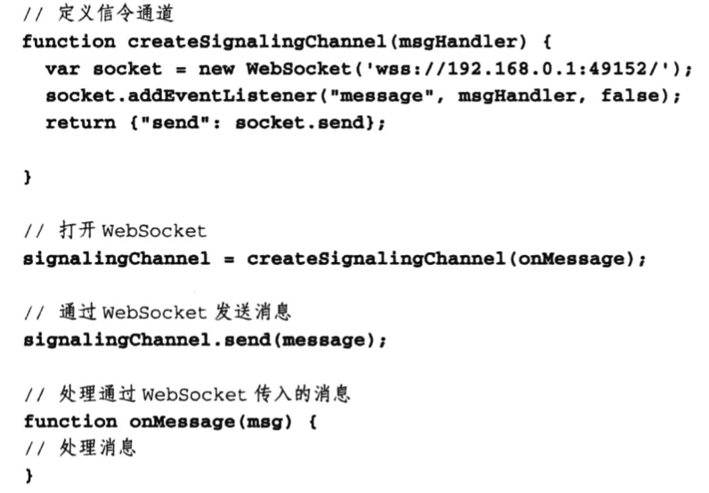

#### 4.3.5 Google 应用程序引擎通道 API

另一种常见但只适用于 Google 浏览器的方案是使用 Google 特有的引擎通道 API 作为信令通道。JavaScript 可以通过与 Google 的云服务器建立通道，使用 HTTP 长轮询（Google 将其称为 Comet 技术）技术将信息发送至客户端。所谓长轮询，就是让一个请求在一定时间内保持打开，直至服务器向客户端发送消息，才将该请求返回。

以下是实现的伪代码片段：

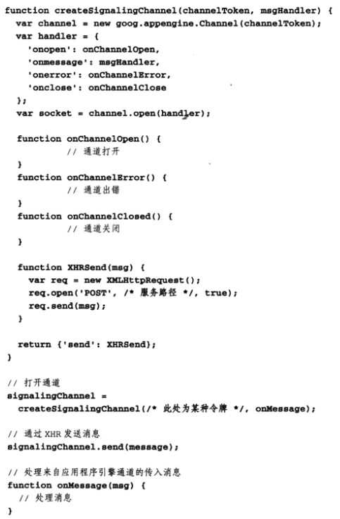

#### 4.3.6 WebSocket SIP

WebSocket SIP 是另一种方案，使用 SIP 作为信令协议。通常用于 IP 语音和视频会议系统。

在此方案中，浏览器先加载 JavaScript SIP 用户代理，然后与支持 WebSocket 传输的 SIP 代理/注册服务器建立连接，发送一条 INVITE 消息。另一端的浏览器将收到 INVITE 并生成相应的 SIP 响应，从而建立媒体会话。

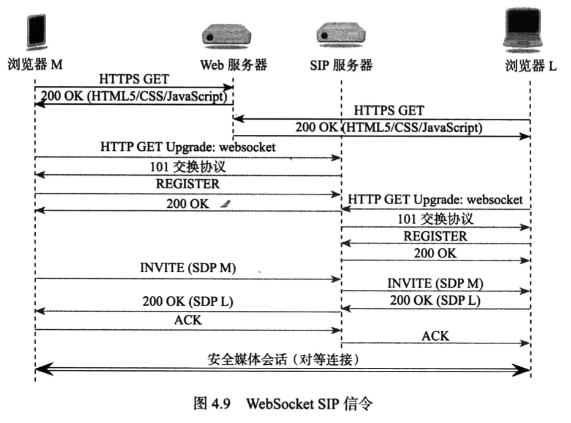

#### 4.3.8 数据通道专有信令

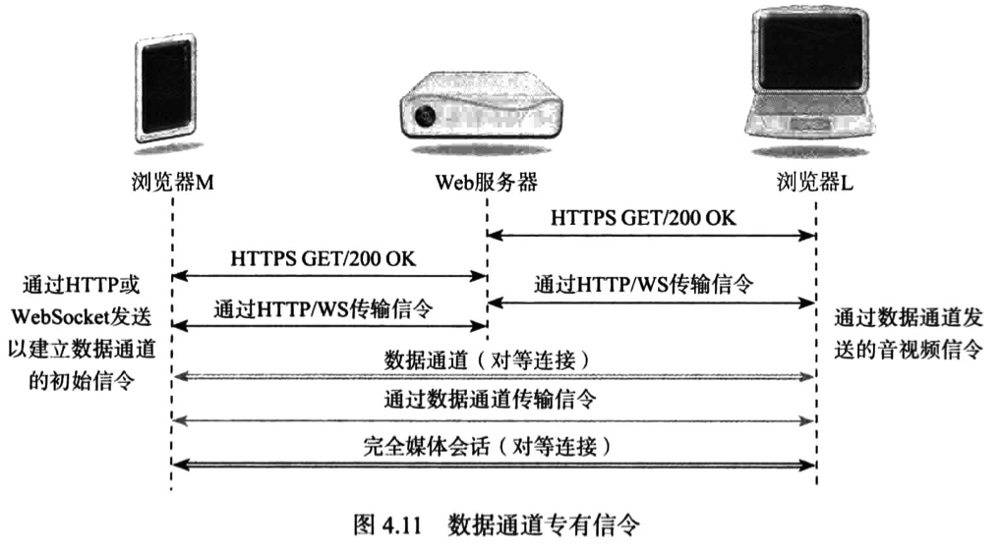

除了上图，使用数据通道构建的另一个方案是使用数据通道构建一个叠加网络，并使用该叠加网络作为信令通道。这是一种对等模式（P2P），有助于最大限度地减少对任何服务器类型的需求。建立叠加网络后，其中的任何成员都可以与其他成员交换信令消息，进而建立对等连接。

### 4.4 信令选项总结

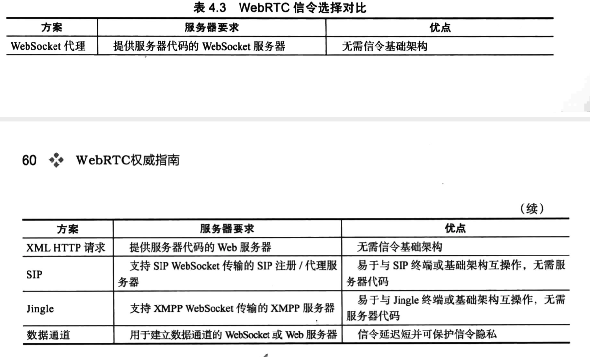

### 4.5 可运行的信令通道代码示例

接下来将使用一个对称加密的密钥来为之前的示例代码提供一个建立信令通道的手段，两个浏览器连接的步骤如下：

- 每个浏览器分别联系 Web 服务器并提供同一个密钥
- 提供该特定密钥的第一个浏览器发起新的双浏览器信令通道，并等待下一个浏览器使用同一密钥建立连接
- 建立连接后，两个浏览器将拥有一个**通过 Web 服务器代码**进行中转的信令通道。
- 断开连接后，使用该特定密钥的下一个浏览器重置该密钥的信令通道，然后重新等待下一个浏览器使用改密钥进行连接。

代码部分依旧分为三部分：通用的 Web 服务器代码、通用的信令通道代码，以及使用 WebRTC API 的客户端应用程序。

#### 4.5.1 Web 服务器

除了服务于 Web 应用程序本身以外，Web 服务器可以充当两个浏览器之间的中继信令通道，用于协商在浏览器之间传输的媒体目标。

为简化应用程序编程操作，一种便捷的做法是定义一个信令通道接口，用于公开 connect 和 send 方法，并能够针对消息的接收时间指定处理程序。

下面的示例方案采用轮询的做法，让两个提前知道同一个密钥的浏览器通过 Web 服务器进行信令交换。

```javascript
// serverXHRSignalingChannel.js
const log = require('./log').log

const connections = {}
const partner = {}
const messagesFor = {}

// 处理 xhr 请求以使用给定密钥进行连接
function connect(info) {
  const res = info.res
  const query = info.query
  let thisconnection
  /**
   * 创建一个大的随机数字，并且保证这个数字不会在服务器的存活过程中重复出现
   */
  const newID = function () {
    return Math.floor(Math.random() * 1000000000)
  }
  const connectFirstParty = function () {
    if (thisconnection.staus === 'connected') {
      // 删除配对和任何存储的消息
      delete partner[thisconnection.ids[0]]
      delete partner[thisconnection.ids[1]]
      delete messagesFor[thisconnection.ids[0]]
      delete messagesFor[thisconnection.ids[1]]
    }
    connections[query.key] = {}
    thisconnection = connections[query.key]
    thisconnection.staus = 'waiting'
    thisconnection.ids = [newID()]
    webrtcResponse({ id: thisconnection[0], status: thisconnection.status }, res)
  }
  const connectSecondParty = function () {
    thisconnection.ids[1] = newID()
    partner[thisconnection.ids[0]] = thisconnection.ids[1]
    partner[thisconnection.ids[1]] = thisconnection.ids[0]
    messagesFor[thisconnection.ids[0]] = []
    messagesFor[thisconnection.ids[1]] = []
    thisconnection.status = 'connected'
    webrtcResponse({ id: thisconnection.ids[1], status: thisconnection.status }, res)
  }
  log(`Request handler 'connect' was called.`)
  if (query && query.key) {
    thisconnection = connections[query.key] || { status: 'new' }
    if (thisconnection.status === 'waiting') {
      // 前半部分准备就绪
      connectSecondParty()
      return
    } else {
      // 必须为新连接或 connected 状态
      connectFirstParty()
      return
    }
  } else {
    webrtcError('No recognizable query key', res)
  }
}

// 对 info.postData.message 中的消息排队
// 以发送至具有 info.postData.id 中的 ID 的伙伴
function sendMessage(info) {
  log(`postData received is ***${info.postData}***`)
  const postData = JSON.parse(info.postData)
  const res = info.res

  if (typeof postData === 'undefined') {
    webrtcError('No posted data in JSON format!', res)
    return
  }
  if (typeof postData.message === 'undefined') {
    webrtcError('No message received', res)
    return
  }
  if (typeof postData.id === 'undefined') {
    webrtcError('No id received with message', res)
    return
  }
  if (typeof partner[postData.id] === 'undefined') {
    webrtcError(`Invalid id ${postData.id}`, res)
    return
  }
  if (typeof messagesFor[partner[postData.id]] === 'undefined') {
    webrtcError(`Invalid id ${postData.id}`, res)
    return
  }
  messagesFor[partner[postData.id]].push(postData.message)
  log(`Saving message ***${postData.message}*** for delivery to id ${partner[postData.id]}`)
  webrtcResponse(`Saving message ***${postData.message}*** for delivery to id ${partner[postData.id]}`, res)
}

// 排队发送 JSON 响应
function webrtcResponse(response, res) {
  log(`replying with webrtc response ${JSON.stringify(response)}`)
  res.writeHead(200, { 'Content-Type': 'application/json' })
  res.write(JSON.stringify(response))
  res.end()
}

// 发送错误作为 JSON WebRTC 响应
function webrtcError(err, res) {
  log(`replying with webrtc error: ${err}`)
  webrtcResponse({ err }, res)
}

// 返回所有排队获取 info.postData.id 的消息
function getMessages(info) {
  const postData = JSON.parse(info.postData)
  const res = info.res
  if (typeof postData === 'undefined') {
    webrtcError('No postted data in JSON format', res)
    return
  }
  if (typeof postData.id === 'undefined') {
    webrtcError('No id received on get', res)
    return
  }
  if (typeof messagesFor[postData.id] === 'undefined') {
    webrtcError(`Invalid id ${postData.id}`, res)
    return
  }
  log(`Sending message ***${JSON.stringify(messagesFor[postData.id])}*** to id ${postData.id}`)
  webrtcResponse({ msgs: messagesFor[postData.id] }, res)
  messagesFor[postData.id] = []
}

exports.connect = connect
exports.get = getMessages
exports.send = sendMessage
```

该 WebRTC 服务的代码包含三个功能：

1. connect 方法，浏览器与 WebRTC 服务器进行的第一项交互，用于为两个浏览器创建连接和校验状态，如果连接还没有中断，还会阻止传输任何其他信令
2. sendMessage 方法，用于向客户端发回一条信令的状态信息
3. getMessage 方法，用于获取信令的状态信息

此外，还需要对之前的代码进行修改，使其支持 webRTC 连接时的 POST 轮询命令。

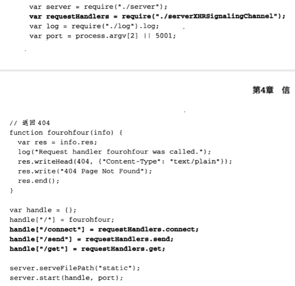

加粗部分即为新增代码。

```javascript
// server.js
/**
添加功能使得服务器能够接受通过 POST 发送的机制
使用 URL 查询的参数初始化特定的变量，返回特定的文件代码（有安全风险 ）
**/
const http = require('http')
const url = require('url')
const fs = require('fs')
const log = require('./log').log

/**
 * 设置静态文件（HTML、JS 等）的路径
 */
let serveFilePath = ''
function setServeFilePath(p) {
  serveFilePath = p
}
exports.serveFilePath = setServeFilePath

/**
 * 先从给定路径名称中删除 ... 、 ～ 和其他从安全角度而言存在问题的语法位，再向其开头添加 serveFilePath
 */
function createFilePath(pathname) {
  const components = pathname.substr(1).split('/')
  const filtered = new Array()
  let temp
  for (let i = 0, len = components.length; i< len; i++) {
    temp = components[i]
    if (temp === '..') continue // 没有上级目录
    if (temp === '') continue // 没有根目录
    temp = temp.replace(/~/g, '') // 没有用户目录
    filtered.push(temp)
  }
  return (serveFilePath + '/' + filtered.join('/'))
}

/**
 * 确定所提取的文件的内容类型
 */
function contentType(filepath) {
  const index = filepath.lastIndexOf('.')
  if (index >= 0) {
    switch (filepath.substr(index + 1)) {
      case 'html': return 'text/html'
      case 'js': return 'application/javascript'
      case 'css': return 'text/css'
      case 'txt': return 'text/plain'
      default: return 'text/html'
    }
  }
  return 'text/html'
}

/**
 * 如果没有为请求定义处理程序，返回 404
 */
function noHandlerErr(pathname, res, msg = '') {
  log('No Request handler found for ' + pathname)
  res.writeHead(404, { 'Content-Type': 'text/plain;charset=utf-8' })
  res.write('404 Not Found\n' + msg)
  res.end()
}

/**
 * 确认非文件的处理程序，然后执行该程序
 */
function handleCustom(handle, pathname, info) {
  try {
    if (typeof handle[pathname] === 'function') {
      handle[pathname](info)
    } else {
      noHandlerErr(pathname, info.res)
    }
  } catch (e) {
    noHandlerErr(pathname , info.res, `执行错误: ${e}`)
  }
  
}

// 该函数用于 HTML 文件，可讲文件中的第一个空脚本块替换为一个特定的对象
// 该对象表示请求 URI 中包含的所有查询参数
function addQuery(str, q) {
  if (q) {
    return str.replace(`<script><</script>`, `<script>var queryparams = ${JSON.stringify(q)}</script>`)
  } else {
    return str
  }
}

/**
 * 打开指定文件、读取其中的内容并将这些内容发送至客户端
 */
function serveFile(filepath, info) {
  const res = info.res
  const query = info.query
  log('serving file ' + filepath)
  fs.open(filepath, 'r', function(err, fd) {
    if (err) {
      log(err.message)
      noHandlerErr(filepath, res)
      return
    }
    let readBuffer = Buffer.from({ length: 20480 })
    fs.read(fd, readBuffer, 0, 20480, 0, function(err, readBytes) {
      if (err) {
        log(err.message)
        fs.close(fd)
        noHandlerErr(filepath, res)
        return
      }
      log('just read ' + readBytes + ' bytes')
      if (readBytes > 0) {
        res.writeHead(200, { 'Content-Type': contentType(filepath) })
        res.write(addQuery(readBuffer.toString('utf-8', 0, readBytes), query))
        res.end()
      }
    })

  })
}


/**
 * 确定请求的路径是静态文件路径，还是拥有自己的处理程序的自定义路径
 */
function route(handle, pathname, info) {
  log('About to route a request for ' + pathname)
  // 检查前导斜杠后的路径是否为可处理的现有文件
  const filepath = createFilePath(pathname)
  log('Attempting to locate ' + filepath)
  fs.stat(filepath, function(err, stats) {
    if (!err && stats.isFile()) {
      serveFile(filepath, info)
    } else {
      handleCustom(handle, pathname, info)
    }
  })
}

/**
 * 创建一个处理程序，收集通过 POST 传输的数据并基于路径名称请求路由
 */
let info = null
function start(handle, port) {
  function onRequest(req, res) {
    const urldata = url.parse(req.url, true)
    const pathname = urldata.pathname
    info = { res, query: urldata.query, postData: '' }
    log('request for ' + pathname + ' received')
    req.setEncoding('utf-8')
    req.addListener('data', function (postDataChunk) {
      info.postData += postDataChunk
      log(`Received POST data chunk ${postDataChunk}`)
    })
    req.addListener('end', function() {
      route(handle, pathname, info)
    })
    // route(handle, pathname, info)
  }
  http.createServer(onRequest).listen(port)
  log('Server started on port ' + port)
}

exports.start = start
```

#### 4.5.2.2 clientXHRSignalingChannel.js 客户端信令代码

```javascript
/**
 * 创建客户端命令，用于建立基于 XML HTTP 请求的 WebRTC 信令通道
 *
 * 此信令通道假定通过共享密钥建立双人连接
 * 每次连接尝试都会导致状态在 waiting 和 connected 之间切换
 * 这意味着如果连接已建立，而两一个浏览器尝试进行连接，将断开现有连接
 * 并且新浏览器的状态将会变成 waiting
 */
const createSignalingChannel = function (key, handlers) {
  let id
  let status
  const doNothing = function (...args) {
    console.log(args)
  }
  const initHandler = function (h) {
    return (typeof h === 'function' && h) || doNothing
  }
  const waitingHandler = initHandler(handlers.onWaiting)
  const connectedHandler = initHandler(handlers.onConnected)
  const messageHandler = initHandler(handlers.onMessage)

  // 与信令服务器建立连接
  function connect(failureCB) {
    failureCB = typeof failureCB === 'function' ? failureCB : function () {}
    // 处理连接响应，该响应应为错误或状态 connected 和 waiting
    function handler() {
      if (this.readyState === this.DONE) {
        if (this.status === 200 && this.response !== null) {
          const res = JSON.parse(this.response)
          if (res.err) {
            failureCB(`error: ${res.err}`)
            return
          }
          // 如果没有错误，则保存状态和服务器生成的 ID，然后启动异步消息轮询
          id = res.id
          status = res.status
          poll()
          // 运行用户提供的处理程序来处理 waiting 和 connected 状态
          if (status === 'waiting') {
            waitingHandler()
          } else {
            connectedHandler()
          }
          return
        } else {
          failureCB(`HTTP error: ${this.status}`)
          return
        }
      }
    }
    // 打开 XHR 并发送包含密钥的连接请求
    const client = new XMLHttpRequest()
    client.onreadystatechange = handler
    // 请求 connect 接口
    client.open('GET', `/connect?key=${key}`)
    client.send()
  }

  /**
   * poll 会在访问访问服务器之前等待 n 毫秒
   * 对于前 10 次尝试，n 为 10 毫秒；对于接下来的 10 次尝试，n 为 100 毫秒；对于后续尝试，n 为 1000 毫秒
   * 如果收到实际消息，则将 n 重置为 10 毫秒
   */
  function poll() {
    let msgs
    const pollWaitDelay = (function () {
      let delay = 10
      let counter = 1
      function reset() {
        delay = 10
        counter = 1
      }
      function increase() {
        counter += 1
        if (counter > 20) {
          delay = 1000
        } else if (counter > 10) {
          delay = 100
        }
      }
      function value() {
        return delay
      }
      return { reset, increase, value }
    })()
  }

  function get(getResponseHandler) {
    // 响应应为错误或 JSON 对象
    // 只有当是后者的时候才将其发送给用户提供的 getResponseHandler 回调函数
    function handler() {
      if (this.readyState === this.DONE) {
        if (this.status === 200 && this.response !== null) {
          const res = JSON.parse(this.response)
          if (res.err) {
            getResponseHandler(`error: ${res.err}`)
            return
          }
          getResponseHandler(res)
          return res
        } else {
          getResponseHandler(`HTTP error: ${this.status}`)
          return
        }
      }
    }
    // 打开 XHR 并针对 ID 请求消息
    const client = new XMLHttpRequest()
    client.onreadystatechange = handler
    client.open('POST', '/get')
    client.send(JSON.stringify({ id }))
  }

  // 将传入的消息放入下一个事件循环进行异步处理
  function handleMessage(msg) {
    setTimeout(function () {
      messageHandler(msg)
    }, 0)
  }

  // 定义一个立即执行的函数 getLoop，从服务器检索消息，然后将自身计划为在 pollWaitDelay.value() 毫秒后重新运行
  ;(function getLoop() {
    get(function (response) {
      let i
      const msgs = (response && response.msgs) || []
      // 如果存在消息属性，则表示已经建立连接
      if (response.msgs && status !== 'connected') {
        // 将状态切换为 connected，确认建立连接
        status = 'connected'
        connectedHandler()
      }
      if (msgs.length > 0) {
        pollWaitDelay.reset()
        for (i = 0; i < msgs.length; i++) {
          handleMessage(msgs[i])
        }
      } else {
        pollWaitDelay.increase()
      }
      // 设置计时器以便重新检查
      setTimeout(getLoop, pollWaitDelay.value())
    })
  })()

  // 通过信令通道向另一端浏览器发送消息
  function send(msg, responseHandler) {
    responseHandler = responseHandler || function () {}
    // 分析响应并发送给处理程序
    function handler() {
      if (this.readyState === this.DONE) {
        if (this.status === 200 && this.response !== null) {
          const res = JSON.parse(this.response)
          if (res.err) {
            responseHandler(`error: ${res.err}`)
            return
          }
          responseHandler(res)
          return
        } else {
          responseHandler(`HTTP error: ${this.status}`)
          return
        }
      }
    }
    // 打开 XHR 并以 JSON 字符串的形式发送 ID 和消息
    const client = new XMLHttpRequest()
    client.onreadystatechange = handler
    client.open('POST', '/send')
    const sendData = { id: id, message: msg }
    client.send(JSON.stringify(sendData))
  }

  return {
    connect,
    send
  }
}
```

上面这段客户端使用的代码用于向后端发起请求并建立信令通道，主要包含功能为：

- createSignalingChannel：接受共享密钥和一组处理程序，并定时向后端发起轮询请求，检查连接状态
- connect：用于让用户主动向服务器发起连接请求
- send：用于在建立连接以后发送消息

#### 4.5.3 客户端 WebRTC 应用程序


> 本次阅读至 P76 4.5.3 客户端 WebRTC 应用程序 95