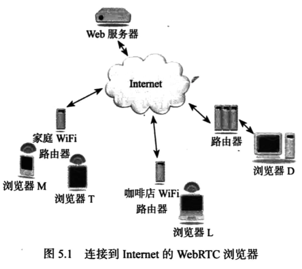
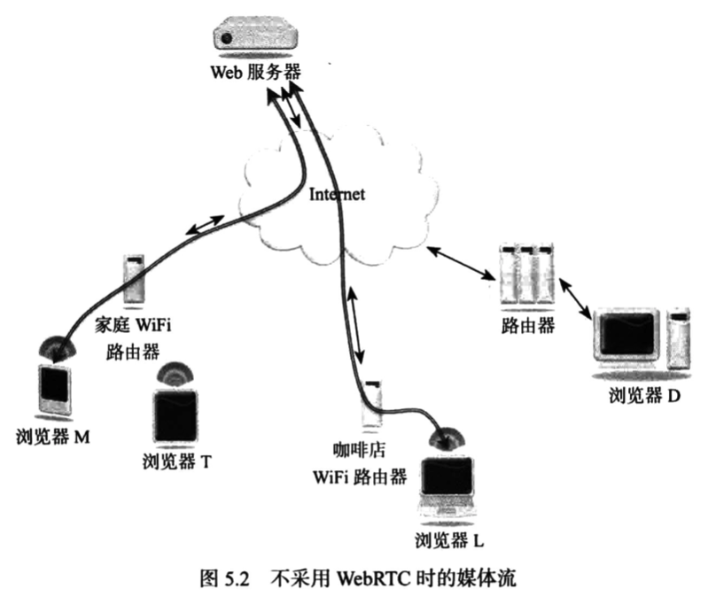
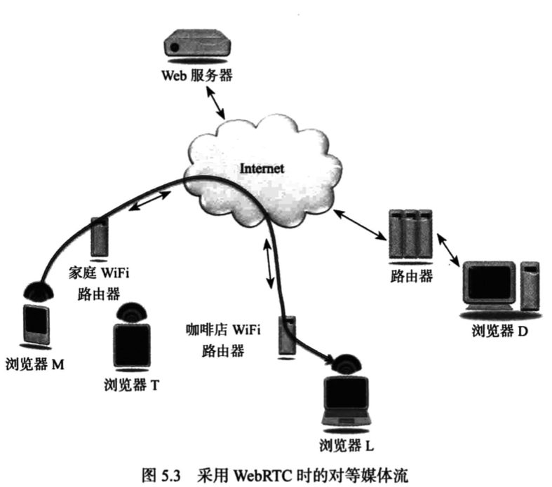
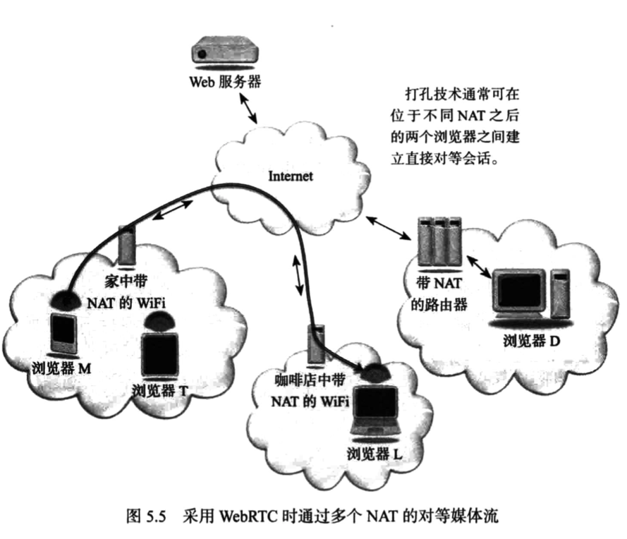

# WebRTC权威指南学习笔记（4）

## 第 5 章 对等媒体

WebRTC 采用独特的对等媒体流，其中语音、视频和数据连接都直接在两个浏览器之间建立。

遗憾的是，由于存在网络地址转换（NAT）和防火墙，对等媒体流的实施难度大大增加，需要使用特殊的协议和过程才能实现。

本章介绍的 STUN 和 TURN 服务器可用于帮助建立对等媒体。

### 5.1 WebRTC 媒体流

本章讨论媒体流时，会使用如下几种浏览器来阐释相关概念。

#### 5.1.1 不采用 WebRTC 时的媒体流

如果不使用 WebRTC 技术或插件，媒体流就必须与 Web 浏览通信遵循同一路径。换言之，媒体数据包将先从浏览器流向 Web 服务器再流向另一端的浏览器，这种情况下，高清视频流回占用大量带宽。这就限制了该体系结构的可扩展性。

#### 5.1.2 采用 WebRTC 时的媒体流

使用 WebRTC 中的 RTCPeerConnection API 帮助在浏览器之间建立对等媒体连接，可大幅降低提供实时通信服务的成本。

### 5.2 WebRTC 和网络地址转换

NAT 功能通常内置在 Internet 路由器或集线器中，用于将一个 IP 地址空间映射到另一个空间，现实世界里，其实大多浏览器都位于 NAT 之后。

NAT 功能通常内置于路由器或集线器中，用于将一个 IP 地址空间映射到另一个空间，对于 WebRTC 服务这种采用端对端或对等设计的协议和服务，就会遭到巨大的困难。

#### 5.2.1 通过多个 NAT 的对等媒体流

采用打洞技术，媒体流可以绕过 Web 服务器，直接通过多个 NAT 在两个浏览器之间流动。

#### 5.2.2 通过通用 NAT 的对等媒体流

位于同一 NAT 之后的两个浏览器之间建立媒体会话的情形下，最佳的媒体路径是保持在局域网之内，而不越入 Internet。与上一种形式一样，这同样需要打洞技术才能实现媒体流。

#### 5.2.3 私有地址和公共地址

> 本次阅读至 P92 5.2.3 私有地址和公共地址 111