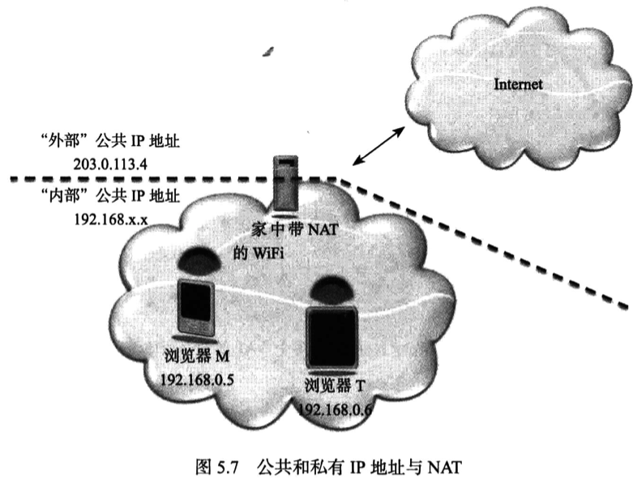
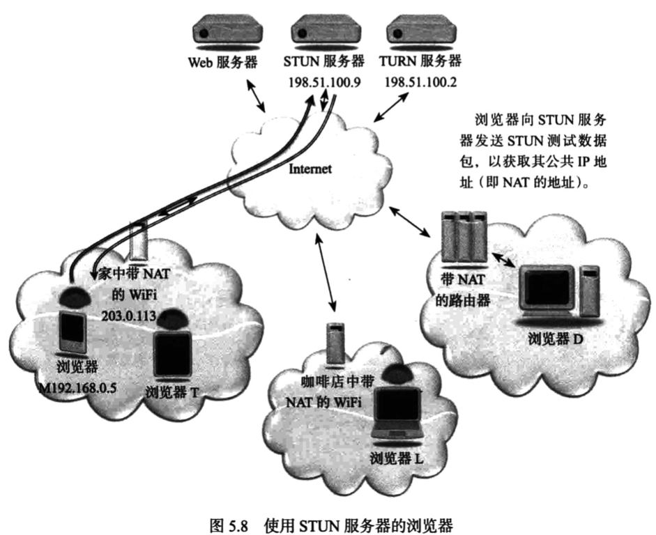
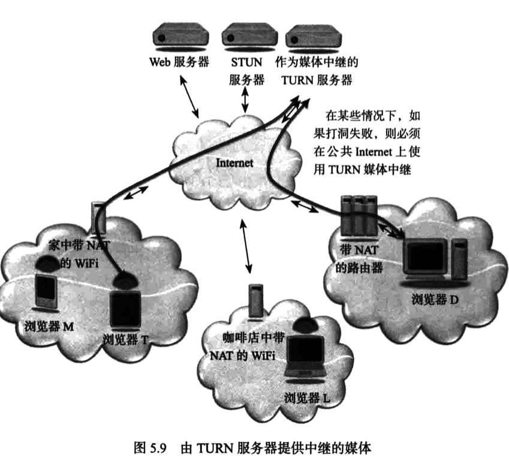
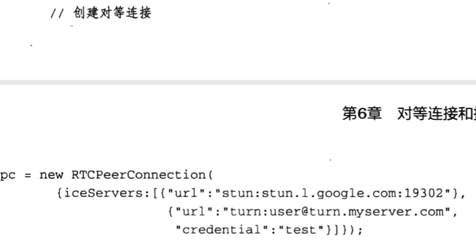
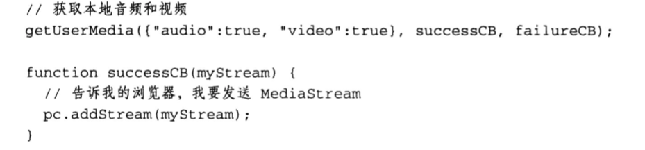
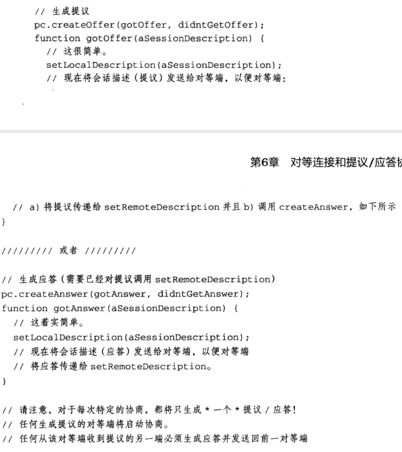

# WebRTC权威指南学习笔记（4）

## 第 5 章 对等媒体

WebRTC 采用独特的对等媒体流，其中语音、视频和数据连接都直接在两个浏览器之间建立。

遗憾的是，由于存在网络地址转换（NAT）和防火墙，对等媒体流的实施难度大大增加，需要使用特殊的协议和过程才能实现。

本章介绍的 STUN 和 TURN 服务器可用于帮助建立对等媒体。

### 5.1 WebRTC 媒体流

本章讨论媒体流时，会使用如下几种浏览器来阐释相关概念。


#### 5.1.1 不采用 WebRTC 时的媒体流

如果不使用 WebRTC 技术或插件，媒体流就必须与 Web 浏览通信遵循同一路径。换言之，媒体数据包将先从浏览器流向 Web 服务器再流向另一端的浏览器，这种情况下，高清视频流回占用大量带宽。这就限制了该体系结构的可扩展性。


#### 5.1.2 采用 WebRTC 时的媒体流


使用 WebRTC 中的 RTCPeerConnection API 帮助在浏览器之间建立对等媒体连接，可大幅降低提供实时通信服务的成本。

### 5.2 WebRTC 和网络地址转换

NAT 功能通常内置在 Internet 路由器或集线器中，用于将一个 IP 地址空间映射到另一个空间，现实世界里，其实大多浏览器都位于 NAT 之后。

NAT 功能通常内置于路由器或集线器中，用于将一个 IP 地址空间映射到另一个空间，对于 WebRTC 服务这种采用端对端或对等设计的协议和服务，就会遭到巨大的困难。

#### 5.2.1 通过多个 NAT 的对等媒体流

采用打洞技术，媒体流可以绕过 Web 服务器，直接通过多个 NAT 在两个浏览器之间流动。


#### 5.2.2 通过通用 NAT 的对等媒体流


位于同一 NAT 之后的两个浏览器之间建立媒体会话的情形下，最佳的媒体路径是保持在局域网之内，而不越入 Internet。与上一种形式一样，这同样需要打洞技术才能实现媒体流。

#### 5.2.3 私有地址和公共地址

NAT 技术普遍使用“私有地址”和“公共地址”两个术语。位于 NAT 内部的 IP 地址是私有 IP 地址，分配给 NAT 的 IP 地址的是公共 IP 地址。NAT 每次从内部向外转发数据包时，都使用公共地址。



私有 IP 地址并没有任何特殊的隐私保护特性或功能，而只是约定俗成的规矩，它们拥有特定的 IP 地址范围（192.168.x.x、10.x.x.x、172.16.x.x -- 172.31.x.x），任何人都可以在自己的网络中使用。

NAT 负责维护私有 IP 地址和端口号与外部 IP 地址和端口号之间的映射表，除此之外，还负责维护过滤器规则，规定公共 Internet 中的哪些 IP 地址和端口号可以使用这些已创建的映射。

### 5.3 STUN 服务器

STUN 是一种帮助遍历 NAT 的服务器（第 10 章介绍），全称为 NAT 会话遍历实用工具（Session Traversal Utilities for NAT，STUN）。



每个浏览器通过发送 STUN 数据包来查询 STUN 服务器，STUN 服务器会指示其在测试数据包中监测到的 IP 地址。换言之，它使用 NAT 映射的地址做出响应。对于从 STUN 服务器获取的这一 IP 地址，将与另一端的浏览器所共享。

### 5.4 TURN 服务器

TURN 服务器也称为中继型 NAT 遍历服务器（Travesal Using Relay around NAT，TURN，第 10 章介绍）。浏览器通过查询 TURN 服务器来获取媒体的中继地址。中继地址是一个公共 IP 地址，用于转发从浏览器收到的数据包，或者将收到的数据包转发给浏览器。如果两个对等端之间单纯因为 NAT 的类型而无法建立直接的对等媒体会话，则可以使用中继地址。虽然这种媒体流并不理想，但至少不会占用 Web 服务器的带宽。



### 5.5 候选项

打洞技术（第 9 章介绍）依靠将要建立的会话中的每个对等端来收集一组可通过 Internet 访问它们的潜在方式。这些 IP 地址和端口组被称为“地址候选项”，简称“候选项”。

借助 STUN 服务器，浏览器可以识别自己是否位于 NAT 之后以及该 NAT 的 IP 地址（此地址称为“反射候选项”）。

而利用 TURN 服务器，浏览器可以获取中继地址，该地址称为“中继候选项”。在 JavaScript 中，这些候选项包含在 RTCIceCandidates 对象的 candidate 属性中。

用于实现打洞的协议称为交互式连接建立（Interactive Connectivity Establishment ICE）协议（详见地 9 章）。

## 第 6 章 对等连接和提议/应答协商

WebRTC 标准定义了两组主要的功能：一是媒体捕获（navigator.getUserMedia），二是媒体传输。对等连接和提议/应答协商的概念是建立 WebRTC 对等媒体和数据的核心。本章将介绍这两个关键要素。

### 6.1 对等连接

RTCPeerConnection 接口是 WebRTC 技术的主要 API。此 API 的功能是在两个浏览器之间建立媒体和数据连接路径。虽然此 API 紧密绑定到 JavaScript 会话建立协议（JavaScript Session Establishment Protocol，JSEP）以建立媒体协商，但 JSEP 的大多数细节都由浏览器处理。

RTCPeerConnection 接口对于如何创建对等连接的定义十分琐细，但 RTCPeerConnection 接口还定义了其他几个 API：

- 数据通道创建 API
- DTMF 启用和控制 API
- 连接统计数据 API
- （用户）对等端身份确定和验证控制 API

本章只讨论对等连接和媒体协商。

RTCPeerConnection 对象的构造函授接受一个配置对象，该配置对象中最重要的是 iceServers 属性，该属性是一个服务器地址列表，用于帮助通过 NAT 和防火墙建立会话（借助 STUN 和 TURN 服务器）：



要让你的本地 MediaStream 传输至另一端的浏览器，下一步就是使用实例的 addStream 方法向你的浏览器作出指示。



该方法会通知对面的浏览器就这个流发送信息开始协商。与 addStream 相对应的是 removeStream 方法。

> 但是人们正在讨论是否有可能去掉这个方法，因为用户很少在不想移除整个对等连接的情况下移除流。

### 6.2 提议/应答协商

在介绍实现媒体流动的方法之前，需要先回顾一下提议/应答协商。

1. 首先，发起方针对药建立的媒体会话类型创建描述，以此来发起媒体会话，此过程称为“提议”，发起方使用信令通道将“提议”发送给另一方。
2. 随后，另一方予以回应，此过程称为“应答”，应答的信息包括在此会话中能够支持或使用的哪些功能特性。

提议/应答交换可确保双方都知道要发送和接收的媒体类型，以及如何正确解码和处理该媒体。

WebRTC 使用 RTCSessionDescription 对象来表示提议和应答，该对象是会话描述的容器，每个浏览器都将生成一个 RTCSessionDescription 对象，并通过信令通道从另一端的浏览器接收另一个这样的对象。

### 6.3 JavaScript 提议/应答控制

安排 提议/协商 涉及一系列编程步骤。但实际上浏览器只关注两个特定的调用：

```javascript
var pc = new RTCPeerConnection({ iceServers: [
  { url: 'stun:stun.l.google.com:19302' },
  { url: 'turn:user@trun.myserver.com', credential: 'test' }
] })
// 将我的会话描述告诉我的浏览器
pc.setLocalDescription(mySessionDescription)
// 将对等端的会话描述告诉我的浏览器
pc.setRemoteDescription(yourSessionDescription)
```

mySessionDescription 从本地浏览器描述了媒体流，换言之，该特定的会话描述可能不仅描述了希望本地发送的内容，还描述了本地希望接收的内容。

yourSessionDescription 对象从另一端浏览器的角度描述了媒体流，同样，它不仅描述了该对等端希望发送的内容，也描述了它希望接收的内容。

如果二者根据 SDP 协商规则彼此兼容，则协商成功，媒体随即可以开始流动。

由于 RTCSessionDescription 对象的语法十分复杂，而 WebRTC 的原则是向 Web 开发人员隐藏尽可能多的复杂性，所以提供了特殊的方法，用于使浏览器自动生成提议和应答（下一节会展示完整的示例代码）：



在从对等端收到提议时就可以生成应答。那何时生成提议呢？从根本上讲，只有浏览器知道何时需要新的提议/应答协商。WebRTC 提供了`negotiationneeded`事件和关联的`onnegotiationneeded`处理程序。通过定义它们可生成提议等对象。每当浏览器识别到需要进行媒体协商的变化时，就会处理该处理程序。

这些变化包括：

- 应用程序调用了 addStream()
- 远程对等端对流进行了更改
- 发生了某种媒体故障，而浏览器识别到可以通过新的协商来加以解决

> 为便于说明，本书的示例代码不会这样设置，而是采取只要通过 addStream 添加媒体并且存在可供交换提议和应答的信令通道，就从一端生成提议的方式

### 6.4 可运行的代码示例：对等连接和提议/应答协商

浏览器使用 WebRTC 的提议/应答功能加入用于对等连接和媒体协商的代码，两个浏览器通过二者之间的信令通道发送 SDP 提议和应答，以此来协商媒体连接。随后，两个浏览器将尽可能直接在双方之间发送媒体。

也就是说，这一次的修改仅位于 HTML 的客户端文件中。（仅限无需 NAT 的情况下）

**客户端 WebRTC 应用程序**


> 本次阅读至 P100 6.4 可运行的代码示例：对等连接和提议/应答协商 118