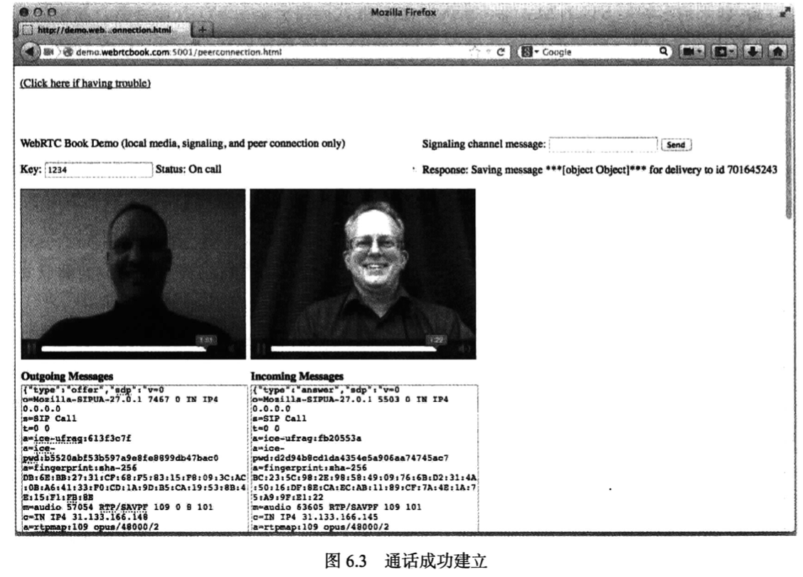

# WebRTC权威指南学习笔记（4）

## 第 5 章 对等媒体

> 本章参考资料：
>
> - [实际中的WebRTC：STUN，TURN以及信令（五）](https://webrtc.org.cn/real-world-webrtc-5/)
> - [STUN 服务器是什么](https://cloud.tencent.com/developer/article/1506063?from=information.detail.stun%E6%9C%8D%E5%8A%A1%E5%99%A8%E6%98%AF%E4%BB%80%E4%B9%88)
> - [MediaDevices.getUserMedia` undefined 的问题](https://blog.csdn.net/qq_32523587/article/details/103596511)

WebRTC 采用独特的对等媒体流，其中语音、视频和数据连接都直接在两个浏览器之间建立。

遗憾的是，由于存在网络地址转换（NAT）和防火墙，对等媒体流的实施难度大大增加，需要使用特殊的协议和过程才能实现。

本章介绍的 STUN 和 TURN 服务器可用于帮助建立对等媒体。

### 5.1 WebRTC 媒体流

本章讨论媒体流时，会使用如下几种浏览器来阐释相关概念。


#### 5.1.1 不采用 WebRTC 时的媒体流

如果不使用 WebRTC 技术或插件，媒体流就必须与 Web 浏览通信遵循同一路径。换言之，媒体数据包将先从浏览器流向 Web 服务器再流向另一端的浏览器，这种情况下，高清视频流回占用大量带宽。这就限制了该体系结构的可扩展性。


#### 5.1.2 采用 WebRTC 时的媒体流


使用 WebRTC 中的 RTCPeerConnection API 帮助在浏览器之间建立对等媒体连接，可大幅降低提供实时通信服务的成本。

### 5.2 WebRTC 和网络地址转换

NAT 功能通常内置在 Internet 路由器或集线器中，用于将一个 IP 地址空间映射到另一个空间，现实世界里，其实大多浏览器都位于 NAT 之后。

NAT 功能通常内置于路由器或集线器中，用于将一个 IP 地址空间映射到另一个空间，对于 WebRTC 服务这种采用端对端或对等设计的协议和服务，就会遭到巨大的困难。

#### 5.2.1 通过多个 NAT 的对等媒体流

采用打洞技术，媒体流可以绕过 Web 服务器，直接通过多个 NAT 在两个浏览器之间流动。


#### 5.2.2 通过通用 NAT 的对等媒体流


位于同一 NAT 之后的两个浏览器之间建立媒体会话的情形下，最佳的媒体路径是保持在局域网之内，而不越入 Internet。与上一种形式一样，这同样需要打洞技术才能实现媒体流。

#### 5.2.3 私有地址和公共地址

NAT 技术普遍使用“私有地址”和“公共地址”两个术语。位于 NAT 内部的 IP 地址是私有 IP 地址，分配给 NAT 的 IP 地址的是公共 IP 地址。NAT 每次从内部向外转发数据包时，都使用公共地址。


私有 IP 地址并没有任何特殊的隐私保护特性或功能，而只是约定俗成的规矩，它们拥有特定的 IP 地址范围（192.168.x.x、10.x.x.x、172.16.x.x -- 172.31.x.x），任何人都可以在自己的网络中使用。

NAT 负责维护私有 IP 地址和端口号与外部 IP 地址和端口号之间的映射表，除此之外，还负责维护过滤器规则，规定公共 Internet 中的哪些 IP 地址和端口号可以使用这些已创建的映射。

### 5.3 STUN 服务器

> NAT给设备提供了一个IP地址以使用专用局域网，但是这个地址不能在外部使用。由于没有公用地址，WebRTC对等端就无法进行通信。而WebRTC使用STUN来解决这个问题。
>
> STUN服务器位于公共网络上，并且有一个简单的任务：检查传入请求的IP地址（来自运行在NAT后面的应用程序），并将该地址作为响应发送回去。换句话说，应用程序使用STUN服务器从公共角度发现其IP:端口。这个过程使得WebRTC对等端为自己获得一个可公开访问的地址，然后通过信令机制将其传递给另一个对等端以建立直接链接。（实际上不同NAT工作方式都有所不同，可能有多个NAT层，但是原理是一样的）。
>
> 因为STUN服务器不需要做太多的工作或者记特别多的东西，所以相对低规格的STUN服务器就可以处理大量的请求。

STUN 是一种帮助遍历 NAT 的服务器（第 10 章介绍），全称为 NAT 会话遍历实用工具（Session Traversal Utilities for NAT，STUN）。


每个浏览器通过发送 STUN 数据包来查询 STUN 服务器，STUN 服务器会指示其在测试数据包中监测到的 IP 地址。换言之，它使用 NAT 映射的地址做出响应。对于从 STUN 服务器获取的这一 IP 地址，将与另一端的浏览器所共享。

（PS：个人理解，STUN 就是一种有能力将从私网地址发送到服务器的请求重新解析成一个公网的地址 + 端口的服务器（当然只是有一定概率能准确解析，就算解析成功了，这个地址也有可能随运营服务商的服务波动而发生变化，如何提高这个覆盖率和检测映射的公网端口，可以看[这篇资料](https://cloud.tencent.com/developer/article/1506063?from=information.detail.stun%E6%9C%8D%E5%8A%A1%E5%99%A8%E6%98%AF%E4%BB%80%E4%B9%88)））

### 5.4 TURN 服务器

TURN 服务器也称为中继型 NAT 遍历服务器（Travesal Using Relay around NAT，TURN，第 10 章介绍）。浏览器通过查询 TURN 服务器来获取媒体的中继地址。中继地址是一个公共 IP 地址，用于转发从浏览器收到的数据包，或者将收到的数据包转发给浏览器。如果两个对等端之间单纯因为 NAT 的类型而无法建立直接的对等媒体会话，则可以使用中继地址。虽然这种媒体流并不理想，但至少不会占用 Web 服务器的带宽。

> RTCPeerConnection尝试通过UDP建立对等端之间的直接通信。如果失败的话，RTCPeerConnection就会使用TCP进行连接。如果使用TCP还失败的话，可以用TURN服务器作为后备，在终端之间转发数据。
>
> TURN服务器具有公共地址，因此即使对等端位于防火墙或代理之后也可以与其他人联系。TURN服务器有一个概念上来讲简单的任务—中继数据流—但是与STUN服务器不同的是，他们会消耗大量的带宽。换句话说，TURN服务器需要更加的强大。


### 5.5 候选项

打洞技术（第 9 章介绍）依靠将要建立的会话中的每个对等端来收集一组可通过 Internet 访问它们的潜在方式。这些 IP 地址和端口组被称为“地址候选项”，简称“候选项”。

借助 STUN 服务器，浏览器可以识别自己是否位于 NAT 之后以及该 NAT 的 IP 地址（此地址称为“反射候选项”）。

而利用 TURN 服务器，浏览器可以获取中继地址，该地址称为“中继候选项”。在 JavaScript 中，这些候选项包含在 RTCIceCandidates 对象的 candidate 属性中。

用于实现打洞的协议称为交互式连接建立（Interactive Connectivity Establishment ICE）协议（详见地 9 章）。

## 第 6 章 对等连接和提议/应答协商

WebRTC 标准定义了两组主要的功能：一是媒体捕获（navigator.getUserMedia），二是媒体传输。对等连接和提议/应答协商的概念是建立 WebRTC 对等媒体和数据的核心。本章将介绍这两个关键要素。

### 6.1 对等连接

RTCPeerConnection 接口是 WebRTC 技术的主要 API。此 API 的功能是在两个浏览器之间建立媒体和数据连接路径。虽然此 API 紧密绑定到 JavaScript 会话建立协议（JavaScript Session Establishment Protocol，JSEP）以建立媒体协商，但 JSEP 的大多数细节都由浏览器处理。

RTCPeerConnection 接口对于如何创建对等连接的定义十分琐细，但 RTCPeerConnection 接口还定义了其他几个 API：

- 数据通道创建 API
- DTMF 启用和控制 API
- 连接统计数据 API
- （用户）对等端身份确定和验证控制 API

本章只讨论对等连接和媒体协商。

RTCPeerConnection 对象的构造函授接受一个配置对象，该配置对象中最重要的是 iceServers 属性，该属性是一个服务器地址列表，用于帮助通过 NAT 和防火墙建立会话（借助 STUN 和 TURN 服务器）：


要让你的本地 MediaStream 传输至另一端的浏览器，下一步就是使用实例的 addStream 方法向你的浏览器作出指示。


该方法会通知对面的浏览器就这个流发送信息开始协商。与 addStream 相对应的是 removeStream 方法。

> 但是人们正在讨论是否有可能去掉这个方法，因为用户很少在不想移除整个对等连接的情况下移除流。

### 6.2 提议/应答协商

在介绍实现媒体流动的方法之前，需要先回顾一下提议/应答协商。

1. 首先，发起方针对药建立的媒体会话类型创建描述，以此来发起媒体会话，此过程称为“提议”，发起方使用信令通道将“提议”发送给另一方。
2. 随后，另一方予以回应，此过程称为“应答”，应答的信息包括在此会话中能够支持或使用的哪些功能特性。

提议/应答交换可确保双方都知道要发送和接收的媒体类型，以及如何正确解码和处理该媒体。

WebRTC 使用 RTCSessionDescription 对象来表示提议和应答，该对象是会话描述的容器，每个浏览器都将生成一个 RTCSessionDescription 对象，并通过信令通道从另一端的浏览器接收另一个这样的对象。

### 6.3 JavaScript 提议/应答控制

安排 提议/协商 涉及一系列编程步骤。但实际上浏览器只关注两个特定的调用：

```javascript
var pc = new RTCPeerConnection({ iceServers: [
  { url: 'stun:stun.l.google.com:19302' },
  { url: 'turn:user@trun.myserver.com', credential: 'test' }
] })
// 将我的会话描述告诉我的浏览器
pc.setLocalDescription(mySessionDescription)
// 将对等端的会话描述告诉我的浏览器
pc.setRemoteDescription(yourSessionDescription)
```

mySessionDescription 从本地浏览器描述了媒体流，换言之，该特定的会话描述可能不仅描述了希望本地发送的内容，还描述了本地希望接收的内容。

yourSessionDescription 对象从另一端浏览器的角度描述了媒体流，同样，它不仅描述了该对等端希望发送的内容，也描述了它希望接收的内容。

如果二者根据 SDP 协商规则彼此兼容，则协商成功，媒体随即可以开始流动。

由于 RTCSessionDescription 对象的语法十分复杂，而 WebRTC 的原则是向 Web 开发人员隐藏尽可能多的复杂性，所以提供了特殊的方法，用于使浏览器自动生成提议和应答（下一节会展示完整的示例代码）：


在从对等端收到提议时就可以生成应答。那何时生成提议呢？从根本上讲，只有浏览器知道何时需要新的提议/应答协商。WebRTC 提供了`negotiationneeded`事件和关联的`onnegotiationneeded`处理程序。通过定义它们可生成提议等对象。每当浏览器识别到需要进行媒体协商的变化时，就会处理该处理程序。

这些变化包括：

- 应用程序调用了 addStream()
- 远程对等端对流进行了更改
- 发生了某种媒体故障，而浏览器识别到可以通过新的协商来加以解决

> 为便于说明，本书的示例代码不会这样设置，而是采取只要通过 addStream 添加媒体并且存在可供交换提议和应答的信令通道，就从一端生成提议的方式

### 6.4 可运行的代码示例：对等连接和提议/应答协商

浏览器使用 WebRTC 的提议/应答功能加入用于对等连接和媒体协商的代码，两个浏览器通过二者之间的信令通道发送 SDP 提议和应答，以此来协商媒体连接。随后，两个浏览器将尽可能直接在双方之间发送媒体。

也就是说，这一次的修改仅位于 HTML 的客户端文件中。

**客户端 WebRTC 应用程序**

> 通过 [MediaDevices.getUserMedia()](https://developer.mozilla.org/en-US/docs/Web/API/MediaDevices/getUserMedia) 获取用户多媒体权限时，需要注意其只工作于以下三种环境：
>
> - `localhost` 域
> - 开启了 HTTPS 的域
> - 使用 `file:///` 协议打开的本地文件
>
> 其他情况下，比如在一个 `HTTP` 站点上，`navigator.mediaDevices` 的值为 `undefined`。

```html
<!DOCTYPE html>
<html lang="en">
  <head>
    <meta charset="UTF-8" />
    <meta name="viewport" content="width=device-width, initial-scale=1.0" />
    <title>Document</title>
    <!-- <script src="https://webrtc.github.io/adapter/adapter.js" type="text/javascript"></script> -->
    <style>
      video {
        width: 320px;
        height: 240px;
        border: 1px solid black;
      }
      div {
        display: inline-block;
      }
    </style>
  </head>
  <body>
    <div id="setup">
      <p>WebRTC Book Demo(local media, signaling, and peer connection only)</p>
      <p>
        Key:
        <input type="text" name="key" id="key" onkeyup="if (event.keyCode == 13) {connect(); return false;}" />
        <button id="connect" onclick="connect()">Connect</button>
        <span id="statusline"
          >Status:
        </span>
        <span id="status">Disconnected</span>
        <button id="call" onclick="call()">Call</button>
      </p>
    </div>

    <div id="scMessage" style="float: right;">
      <p>
        Signaling channel meesage:
        <input
          type="text"
          width="100%"
          name="message"
          id="message"
          onkeyup="if (event.keyCode == 13) {send(); return false;}"
        />
        <button id="send" onclick="send()">Send</button>
      </p>
      <p>Response: <span id="response"></span></p>
    </div>

    <br />
    <div style="width: 30%; vertical-align: top">
      <div>
        <video id="myVideo" autoplay="autoplay" controls muted="true"></video>
      </div>
      <p>
        <b>Outgoing Messages</b>
        <br />
        <textarea name="outmessages" id="outmessages" rows="100"></textarea>
      </p>
    </div>

    <div style="width: 30%; vertical-align: top">
      <div>
        <video id="yourVideo" autoplay="autoplay" controls></video>
      </div>
      <p>
        <b>Incoming Messages</b>
        <br />
        <textarea id="inmessages" rows="100" style="width: 100%"></textarea>
      </p>
    </div>

    <script src="clientXHRSignalingChannel.js" type="text/javascript"></script>
    <!-- 添加一个空的 script 代码块
         server.js 会在返回 html 文件之前填充该代码块
         并根据请求的 URL 定义一个名为 queryparams 的参数，用于连接 WebRTC  -->
    <script></script>
    <script>
      const statuslineE = document.getElementById('statusline')
      const statusE = document.getElementById('status')
      const sendE = document.getElementById('send')
      const connectE = document.getElementById('connect')
      const callE = document.getElementById('call')
      const scMessageE = document.getElementById('scMessage')

      /**
       * 主例程
       **/
      let signalingChannel, key, id
      let haveLocalMedia = false
      let connected = false
      let myVideoStream, myVideo
      let yourVideoStream, yourVideo

      let doNothing = function () {}
      let pc
      let constraints = {
        mandatory: {
          OfferToReceiveAudio: true,
          OfferToReceiveVideo: true
        }
      }

      /**
       * 建立信令通道
       **/
      function connect() {
        let errorCB, scHandlers, handleMsg
        // 首先，获取用于连接的密钥
        key = document.getElementById('key').value
        // 处理通过信令通道收到的所有消息
        handleMsg = function (msg) {
          // 首先整理消息并将其发布到屏幕上
          let msgE = document.getElementById('inmessages')
          let msgString = JSON.stringify(msg).replace(/\\r\\n/g, '\n')
          msgE.value = msgString + '\n' + msgE.value
          // 随后基于消息的类型执行操作
          if (msg.type === 'offer') {
            pc.setRemoteDescription(new RTCSessionDescription(msg))
            answer()
          } else if (msg.type === 'answer') {
            pc.setRemoteDescription(new RTCSessionDescription(msg))
          } else if (msg.type === 'candidate') {
            pc.addIceCandidate(
              new RTCIceCandidate({
                sdpMLineIndex: msg.mlineindex,
                candidate: msg.candidate
              })
            )
          }
        }
        // 用于信令通道的处理程序
        scHandlers = {
          onWaiting: function () {
            setStatus('Waiting')
            // 后面将使用 weWaited 执行自动调用
            weWaited = true
          },
          onConnected: function () {
            connected = true
            setStatus('Connected')
            // 等待本地媒体准备就绪
            // verifySetupDone()
            // 由于成功连接，因此建立 RTC 对等连接
            createPC()
          },
          onMessage: handleMsg
        }
        // 最后创建信令通道(createSignalingChannel 方法在 clientXHRSignalingChannel 中定义)
        signalingChannel = createSignalingChannel(key, scHandlers)
        errorCB = function (msg) {
          document.getElementById('response').innerHTML = msg
        }
        // 进行连接
        signalingChannel.connect(errorCB)
      }

      // 通过信令通道发送消息，其方式有两种：一是执行显式调用，二是通过用户点击 Send 按钮
      function send(msg) {
        const handler = function (res) {
          document.getElementById('response').innerHTML = res
          return
        }
        // 如果没有传入，则获取消息
        msg = msg || document.getElementById('message').value
        // 发布到屏幕上
        const msgE = document.getElementById('outmessages')
        const msgString = JSON.stringify(msg).replace(/\\r\\n/g, '\n')
        msgE.value = msgString + '\n' + msgE.value
        // 通过信令通道发送
        signalingChannel.send(msg, handler)
      }

      /**
       * 用于对两项异步活动的完成时间进行同步：创建信令通道、获取本地媒体
       * **/
      function verifySetupDone() {
        // 如果信令通道准备就绪，且已经获得了本地媒体，就继续处理
        if (connected && haveLocalMedia) {
          setStatus('Set up')
        }
      }

      /**
       * 用于基于应用程序的进度更改 UI
       * 通过隐藏、显示和填充各种 UI 元素
       * 并让用户大概了解浏览器建立信令通道和获取本地媒体的进度
       * **/
      function setStatus(str) {
        switch (str) {
          case 'Waiting':
            statuslineE.style.display = 'inline'
            statusE.innerHTML = 'Waiting for peer signaling connection'
            // sendE.style.display = 'none'
            // connectE.style.display = 'none'
            break
          case 'Connected':
            statusE.innerHTML = 'Peer signaling connected, waiting for local media'
            sendE.style.display = 'inline'
            // connectE.style.display = 'none'
            scMessageE.style.display = 'inline-block'
            break
          case 'Set up':
            statusE && (statusE.innerHTML = 'Peer signaling connected and local media obtained')
            break
          case 'Ready for call':
            statusE.innerHTML = 'Ready for call'
            callE.style.display = 'inline'
            break
          case 'On call':
            statusE.innerHTML = 'On call'
            // callE.style.display = 'none'
            break
          default:
            break
        }
      }

      function attachMediaStream(video, stream) {
        video.srcObject = stream
      }

      function gotUserMedia(stream) {
        myVideoStream = stream
        haveLocalMedia = true
        // 展示我的本地视频
        attachMediaStream(myVideo, myVideoStream)
        // 等待建立信令通道
        // verifySetupDone()

        // 等待 RTCPeerConnection 创建完毕
        attachMediaIfReady()
      }

      /**
       * 这些方法用于建立 RTC 对等连接 Start
       * **/
      function createPC() {
        // let stunuri = false
        let stunuri = true
        let turnuri = false
        let myfalse = function (v) {
          return v === '0' || v === 'false' || !v
        }
        let config = []
        // 基于各个参数调整配置字符串
        if (queryparams) {
          if ('stunuri' in queryparams) {
            stunuri = !myfalse(queryparams['stunuri'])
          }
          if ('turnuri' in queryparams) {
            turnuri = !myfalse(queryparams['turnuri'])
          }
        }

        if (stunuri) {
          // 这是 Google 的一台公共 STUN 服务器
          config.push({
            url: 'stun:stun.l.google.com:19302'
          })
        }

        if (turnuri) {
          if (stunuri) {
            // 使用同时具备 STUN 功能的 TURN 服务器
            config.push({
              url: 'turn:user@turn.webrtcbook.com',
              credential: 'test'
            })
          } else {
            // 仅支持 TURN 的 TURN 服务器
            config.push({
              url: 'turn:user@turn-only.webrtcbook.com',
              credential: 'test'
            })
          }
        }
        console.log(`config = ${JSON.stringify(config)}`)
        pc = new RTCPeerConnection({ iceServers: config })
        pc.onicecandidate = onIceCandidate
        pc.onaddstream = onRemoteStreamAdded
        pc.onremoveStream = onRemoteStreamRemoved
        // 等待本地媒体准备就绪
        attachMediaIfReady()
      }

      // 如果浏览器有另一个候选项，则将其发送给对等端
      function onIceCandidate(e) {
        if (e.candidate) {
          send({
            type: 'candidate',
            mlineindex: e.candidate.sdpMLineIndex,
            candidate: e.candidate.candidate
          })
        }
      }

      // 如果浏览器监测到另一端添加了媒体流，则将其显示在屏幕上
      function onRemoteStreamAdded(e) {
        yourVideoStream = e.stream
        attachMediaStream(yourVideo, yourVideoStream)
        setStatus('On call')
      }

      // 如果远程端移除该流，出于方便，不执行任何操作
      function onRemoteStreamRemoved(e) {}
      /**
       * 这些方法用于建立 RTC 对等连接 End
       * **/

      /**
       * 这些方法用于将本地媒体附加到对等连接 Start
       * **/
      // 该方法用于对两项异步活动的完成时间进行同步
      // 一是创建对等连接，二是获取本地媒体
      function attachMediaIfReady() {
        // 如果 RTCPeerConnection 已经就绪
        // 且已经获得本地媒体，则继续处理
        if (pc && haveLocalMedia) {
          attachMedia()
        }
      }

      // 该方法将我们的本地媒体流添加至对等连接
      // 请注意这不会导致任何媒体开始流动，其作用只是指示浏览器在其下一个 SDP 描述中加入此流
      function attachMedia() {
        pc.addStream(myVideoStream)
        setStatus('Ready for call')
        // 如果 URI 中 call 参数的值表示 true，则自动执行调用
        // 但还要确保已经完成了连接之前的所有步骤（提高两端已一切就绪的概率）
        if (queryparams && queryparams['call'] && !weWaited) {
          call()
        }
      }
      /**
       * 这些方法用于将本地媒体附加到对等连接 End
       * **/

      /**
       * 下面这些方法用于呼叫和应答 Start
      */

      // 为提议生成会话描述
      function call() {
        pc.createOffer(gotDescription, doNothing, constraints)
      }

      // 为应答生成会话描述
      function answer() {
        pc.createAnswer(gotDescription, doNothing, constraints)
      }

      // 一旦获取会话描述，就指示浏览器将其用作本地描述，然后发送给另一端的浏览器
      // 只有先设置了本地描述，浏览器才能发送媒体并准备从另一端接收媒体
      function gotDescription(localDesc) {
        pc.setLocalDescription(localDesc)
        send(localDesc)
      }
      /**
       * 下面这些方法用于呼叫和应答 End
      */


      function didntGetUserMedia() {
        console.log("couldn't get video")
      }
      // 获取本地媒体方法
      function getMedia() {
        // getUserMedia
        navigator.getUserMedia(
          {
            audio: true,
            video: true
          },
          gotUserMedia,
          didntGetUserMedia
        )
      }
      // 开始获取本地媒体，并自动启动信令通道
      window.onload = function () {
        // 如果 URI 中提供了密钥，则自动连接信令通道
        if (queryparams && queryparams['key']) {
          document.getElementById('key').value = queryparams['key']
          connect()
        }
        myVideo = document.getElementById('myVideo')
        yourVideo = document.getElementById('yourVideo')
        getMedia()
        // 如果建立连接, connect() 将调用 createPC()
        // 如果 createPC() 和 getMedia() 成功执行，将调用 attachMedia()
      }
    </script>
  </body>
</html>
```

在建立了信令连接之后，connect 代码会主动进行 RTCPeerConnection 的创建。

随后若点击 call 按钮，call 方法就会调用 pc.createOffer 创建对应 SDP 消息，然后就会通过信令通道传输类型为 offer 的 SDP 消息（send 方法）。

随后另一端浏览器通过信令通道触发 onMessage 事件，将消息通过`pc.setRemoteDescription`设置为远端 SDP，若类型是 offer，则说明当前浏览器为接收端，需要再发送一个类型为 answer 的 SDP 事件给提议端浏览器。

当本地描述和远程描述都设置完毕后，两个浏览器即可启动媒体并建立通话。



> PS：该代码示例只提供了一个提议和一个应答，在实际应用程序中，应利用 negotiationneeded 来处理需要重新协商媒体的情形。

