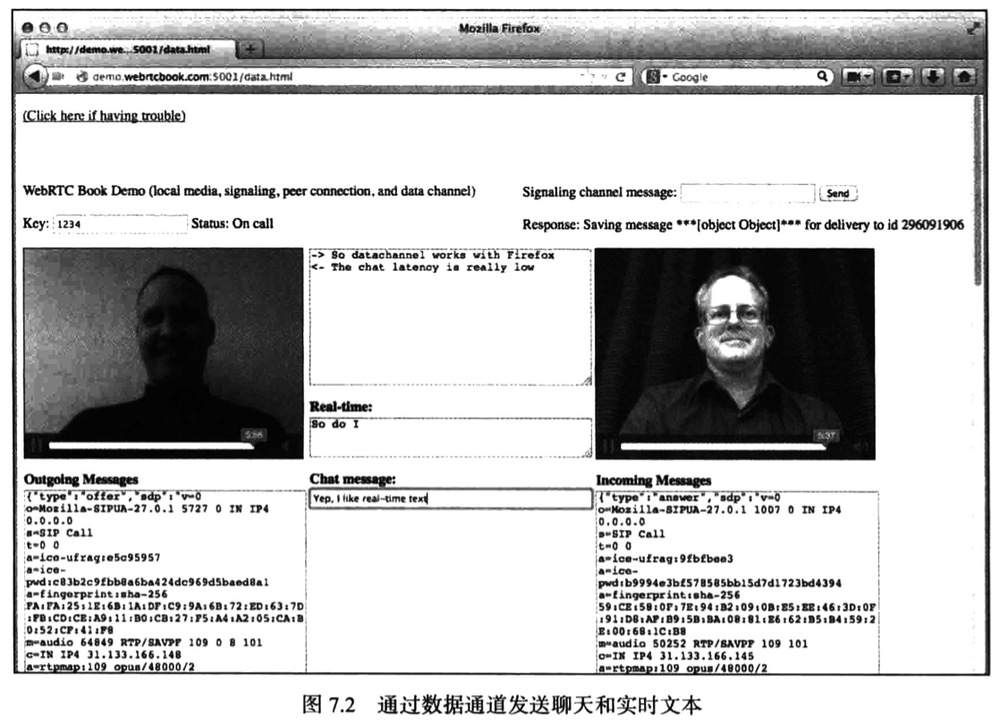

# WebRTC权威指南学习笔记（5）

## 第7章 数据通道

WebRTC 数据通道是在浏览器之间建立的一种非媒体交互连接。它为 Web 开发人员提供了一种灵活且可配置的通道，用于绕过服务器来直接交换数据。对于某些应用程序，借助采用 WebSocket 连接或 HTTP 消息的服务器传递少量数据就足以满足需要。而数据通道支持流量大、延迟低的连接，既稳定可靠，又不失灵活性。

本章将介绍数据通道、JavaScript API 以及底层协议。

### 7.1 数据通道简介

虽然有关 WebRTC 的宣传主要侧重于它对于对等媒体的支持，但其原设计师一直都希望它也支持实时数据传输。

数据通道模型基于 WebSocket 建立，具有简单且可设置的 send 方法和 onmessage 处理程序。数据通道的创建非常简单，下一节将对此进行介绍。不过与媒体不同的是，单个对等连接中的多个数据通道全都使用同一个底层流。在实际中，这意味着只需要进行一次提议/应答协商即可建立首个数据通道，之后将自动根据用于该数据通道的协议协商所有新的数据通道，因此无须在 JavaScript 级别进行额外的提议/应答交换，即可添加更多数据通道。

为数据通道提供此功能的底层协议被称为流控制传输协议（Stream Control Transport Protocol，SCTP）。

### 7.2 使用数据通道

数据通道 API 是对等连接 API 的一部分，因此只有在创建 RTCPeerConnection 实例后才能创建数据通道。

```javascript
pc = new RTCPeerConnection()
dc = pc.createDataChannel('dc1')
```

这是创建数据通道的最简便方式。新数据通道的标签将为 dc1。利用上面的简单语法创建数据通道时，将导致对等端收到 RTCDataChannelEvent，通过为对等连接设置 ondatachannel 处理程序，可在对等端处理该事件。

```javascript
pc = new RTCPeerConnection()
pc.ondatachannel = function (e) {
  dc = e.channel
}
```

此时，两个对等端之间已建立双向数据数据通道。无论数据通道通过`createDataChannel()`创建还是通过`ondatachannel`返回，现在都可以通过`send()`方法和 onmessage 处理程序来使用它。

```javascript
dc.send('I can send a text string')
dc.send(new Blob(['I can send blobs'], { type: 'text/plain' }))
dc.send(new arrayBuffer(32)) // 发送 arrayBuffer
dc.send(new uInt8Array([1, 2, 3])) // 还发送 arrayBufferViews
dc.onmessage = function (e) {
  console.log('Received message' + e.data)
}
```

数据通道的多种配置选项只能在数据通道创建之后使用，因为需要在对等端之间围绕它们进行协商。所有这些选项都作为 RTCDataChannelInit 对象的属性包括在内。

默认情况下，将创建可靠的数据通道，可靠的数据通道意味着如果有任何数据包丢失，靠着底层的传输机制就能自动找回这些数据包。但如果连接十分糟糕，且大多数数据包都没能送达，这时就需要 JavaScript 通过配置参数控制重新传输的级别。

```javascript
// 限制通道在第一次数据传输失败时重新传输数据的次数
dc = pc.createDataChannel('dc1', { maxRetransmits: 3 })
// 限制通道允许重试操作持续的毫秒数
dc = pc.createDataChannel('dc1', { maxRetransmitTime: 30 })
```

PS：注意 maxRetransmits 和 maxRetransmitTime 这两个属性是互斥的，不能同时指定两者。

由于每次发送都通过网络独立进行，不同的消息可能采用不同的路径，因此会导致最终的送达顺序不同于最初的发送顺序。默认情况下 WebRTC 数据通道将根据需要进行等待，比如需要成功收到消息 1 以后才将消息 1 和消息 2 释放给 onmessage 处理程序。

但有时消息之间彼此足够独立，顺序并不重要，此时就可以使用下面这种方法：

```javascript
// 允许在消息送达时接收它们，即使其顺序混乱也不例外
dc = pc.createDataChannel('', {ordered: false})
```

在上面的示例中，由于远程对等端并不创建数据通道，而是只接收数据通道创建的通知，这样就导致了远程对等端无法对这个数据通道进行设置。虽然远程端也可以自己调用 createChannel 来创建一个额外的双向通道，但无疑有些浪费资源。

针对这个问题，幸运的是开发者可以通过一些配置选项来创建不同类型的数据通道，并单独配置每个方向。

```javascript
// 本地对等端：创建数据通道的前半部分
properties = {negotiated: true, id: 1, maxRetransmits: 3}
dc = pc.createDataChannel("", properties)
// 运程对等端：创建数据通道的后半部分
properties = {negotiated: true, id: 1, maxRetransmits: 6}
dc = pc.createDataChannel("", properties)
```

上面的例子中创建了一个双向数据通道，允许本地浏览器向远程浏览器重新传输 3 次，并允许远程浏览器向本地重新传输 6 次。

这种创建方式有两个关键点：

- negotiated 属性：双端都必须设置为 true
- id 属性：两个对等端必须将此属性设置为同一个值，才能将两个单向数据通道关联起来。如果未设置 id 属性，浏览器将为其自动选择一个值，并通过信令通道将该 id 发送至对等端，然后让对等端使用该 id 创建数据通道。

### 7.3 可运行的数据通道代码示例

现在可以往之前的 demo 中添加最后一部分 —— 数据通道。同样，服务器和信令代码保持不变，唯一的新代码位于客户端 HTML 和 JavaScript 中。

```javascript
<!DOCTYPE html>
<html lang="en">
  <head>
    <meta charset="UTF-8" />
    <meta name="viewport" content="width=device-width, initial-scale=1.0" />
    <title>Document</title>
    <!-- <script src="https://webrtc.github.io/adapter/adapter.js" type="text/javascript"></script> -->
    <style>
      video {
        width: 320px;
        height: 240px;
        border: 1px solid black;
      }
      div {
        display: inline-block;
      }
    </style>
  </head>
  <body>
    <div id="setup">
      <p>WebRTC Book Demo(local media, signaling, and peer connection only)</p>
      <p>
        Key:
        <input type="text" name="key" id="key" onkeyup="if (event.keyCode == 13) {connect(); return false;}" />
        <button id="connect" onclick="connect()">Connect</button>
        <span id="statusline">Status: </span>
        <span id="status">Disconnected</span>
        <button id="call" onclick="call()">Call</button>
      </p>
    </div>

    <div id="scMessage" style="float: right">
      <p>
        Signaling channel meesage:
        <input
          type="text"
          width="100%"
          name="message"
          id="message"
          onkeyup="if (event.keyCode == 13) {send(); return false;}"
        />
        <button id="send" onclick="send()">Send</button>
      </p>
      <p>Response: <span id="response"></span></p>
    </div>

    <br />
    <div style="width: 30%; vertical-align: top">
      <div>
        <video id="myVideo" autoplay="autoplay" controls muted="true"></video>
      </div>
      <p>
        <b>Outgoing Messages</b>
        <br />
        <textarea name="outmessages" id="outmessages" rows="100"></textarea>
      </p>
    </div>

    <div style="width: 30%; vertical-align: top">
      <textarea id="chatbox" rows="10" style="width: 100%"></textarea>
      <p style="width: 100%">
        <b>Real-time:</b>
        <textarea id="rtt" rows="2" style="width: 100%"></textarea>
      </p>
      <p style="width: 100%">
        <b>Chat message:</b>
        <input
          type="text"
          style="width: 100%"
          name="chat"
          id="chat"
          onkeyup="sendRtt();if (event.keyCode === 13) {sendChat();return false;}"
        />
      </p>
    </div>

    <div style="width: 30%; vertical-align: top">
      <div>
        <video id="yourVideo" autoplay="autoplay" controls></video>
      </div>
      <p>
        <b>Incoming Messages</b>
        <br />
        <textarea id="inmessages" rows="100" style="width: 100%"></textarea>
      </p>
    </div>

    <script src="clientXHRSignalingChannel.js" type="text/javascript"></script>
    <!-- 添加一个空的 script 代码块
         server.js 会在返回 html 文件之前填充该代码块
         并根据请求的 URL 定义一个名为 queryparams 的参数，用于连接 WebRTC  -->
    <script></script>
    <script>
      const statuslineE = document.getElementById('statusline')
      const statusE = document.getElementById('status')
      const sendE = document.getElementById('send')
      const connectE = document.getElementById('connect')
      const callE = document.getElementById('call')
      const scMessageE = document.getElementById('scMessage')

      /**
       * 主例程
       **/
      let signalingChannel, key, id
      let haveLocalMedia = false
      let connected = false
      let myVideoStream, myVideo
      let yourVideoStream, yourVideo

      let doNothing = function () {}
      let pc, data = {}
      let constraints = {
        mandatory: {
          OfferToReceiveAudio: true,
          OfferToReceiveVideo: true
        }
      }

      /**
       * 建立信令通道
       **/
      function connect() {
        let errorCB, scHandlers, handleMsg
        // 首先，获取用于连接的密钥
        key = document.getElementById('key').value
        // 处理通过信令通道收到的所有消息
        handleMsg = function (msg) {
          // 首先整理消息并将其发布到屏幕上
          let msgE = document.getElementById('inmessages')
          let msgString = JSON.stringify(msg).replace(/\\r\\n/g, '\n')
          msgE.value = msgString + '\n' + msgE.value
          // 随后基于消息的类型执行操作
          if (msg.type === 'offer') {
            pc.setRemoteDescription(new RTCSessionDescription(msg))
            answer()
          } else if (msg.type === 'answer') {
            pc.setRemoteDescription(new RTCSessionDescription(msg))
          } else if (msg.type === 'candidate') {
            pc.addIceCandidate(
              new RTCIceCandidate({
                sdpMLineIndex: msg.mlineindex,
                candidate: msg.candidate
              })
            )
          }
        }
        // 用于信令通道的处理程序
        scHandlers = {
          onWaiting: function () {
            setStatus('Waiting')
            // 后面将使用 weWaited 执行自动调用
            weWaited = true
          },
          onConnected: function () {
            connected = true
            setStatus('Connected')
            // 等待本地媒体准备就绪
            // verifySetupDone()
            // 由于成功连接，因此建立 RTC 对等连接
            createPC()
          },
          onMessage: handleMsg
        }
        // 最后创建信令通道(createSignalingChannel 方法在 clientXHRSignalingChannel 中定义)
        signalingChannel = createSignalingChannel(key, scHandlers)
        errorCB = function (msg) {
          document.getElementById('response').innerHTML = msg
        }
        // 进行连接
        signalingChannel.connect(errorCB)
      }

      // 通过信令通道发送消息，其方式有两种：一是执行显式调用，二是通过用户点击 Send 按钮
      function send(msg) {
        const handler = function (res) {
          document.getElementById('response').innerHTML = res
          return
        }
        // 如果没有传入，则获取消息
        msg = msg || document.getElementById('message').value
        // 发布到屏幕上
        const msgE = document.getElementById('outmessages')
        const msgString = JSON.stringify(msg).replace(/\\r\\n/g, '\n')
        msgE.value = msgString + '\n' + msgE.value
        // 通过信令通道发送
        signalingChannel.send(msg, handler)
      }

      /**
       * 用于对两项异步活动的完成时间进行同步：创建信令通道、获取本地媒体
       * **/
      function verifySetupDone() {
        // 如果信令通道准备就绪，且已经获得了本地媒体，就继续处理
        if (connected && haveLocalMedia) {
          setStatus('Set up')
        }
      }

      /**
       * 用于基于应用程序的进度更改 UI
       * 通过隐藏、显示和填充各种 UI 元素
       * 并让用户大概了解浏览器建立信令通道和获取本地媒体的进度
       * **/
      function setStatus(str) {
        switch (str) {
          case 'Waiting':
            statuslineE.style.display = 'inline'
            statusE.innerHTML = 'Waiting for peer signaling connection'
            // sendE.style.display = 'none'
            // connectE.style.display = 'none'
            break
          case 'Connected':
            statusE.innerHTML = 'Peer signaling connected, waiting for local media'
            sendE.style.display = 'inline'
            // connectE.style.display = 'none'
            scMessageE.style.display = 'inline-block'
            break
          case 'Set up':
            statusE && (statusE.innerHTML = 'Peer signaling connected and local media obtained')
            break
          case 'Ready for call':
            statusE.innerHTML = 'Ready for call'
            callE.style.display = 'inline'
            break
          case 'On call':
            statusE.innerHTML = 'On call'
            // callE.style.display = 'none'
            break
          default:
            break
        }
      }

      function attachMediaStream(video, stream) {
        video.srcObject = stream
      }

      function gotUserMedia(stream) {
        myVideoStream = stream
        haveLocalMedia = true
        // 展示我的本地视频
        attachMediaStream(myVideo, myVideoStream)
        // 等待建立信令通道
        // verifySetupDone()

        // 等待 RTCPeerConnection 创建完毕
        attachMediaIfReady()
      }

      /**
       * 这些方法用于建立 RTC 对等连接 Start
       * **/
      function createPC() {
        // let stunuri = false
        let stunuri = true
        let turnuri = false
        let myfalse = function (v) {
          return v === '0' || v === 'false' || !v
        }
        let config = []
        // 基于各个参数调整配置字符串
        if (queryparams) {
          if ('stunuri' in queryparams) {
            stunuri = !myfalse(queryparams['stunuri'])
          }
          if ('turnuri' in queryparams) {
            turnuri = !myfalse(queryparams['turnuri'])
          }
        }

        if (stunuri) {
          // 这是 Google 的一台公共 STUN 服务器
          config.push({
            url: 'stun:stun.l.google.com:19302'
          })
        }

        if (turnuri) {
          if (stunuri) {
            // 使用同时具备 STUN 功能的 TURN 服务器
            config.push({
              url: 'turn:user@turn.webrtcbook.com',
              credential: 'test'
            })
          } else {
            // 仅支持 TURN 的 TURN 服务器
            config.push({
              url: 'turn:user@turn-only.webrtcbook.com',
              credential: 'test'
            })
          }
        }
        console.log(`config = ${JSON.stringify(config)}`)
        pc = new RTCPeerConnection({ iceServers: config })
        pc.onicecandidate = onIceCandidate
        pc.onaddstream = onRemoteStreamAdded
        pc.onremovestream = onRemoteStreamRemoved
        pc.ondatachannel = onDataChannelAdded
        // 等待本地媒体准备就绪
        attachMediaIfReady()
      }

      // 如果浏览器有另一个候选项，则将其发送给对等端
      function onIceCandidate(e) {
        if (e.candidate) {
          send({
            type: 'candidate',
            mlineindex: e.candidate.sdpMLineIndex,
            candidate: e.candidate.candidate
          })
        }
      }

      // 如果浏览器监测到另一端添加了媒体流，则将其显示在屏幕上
      function onRemoteStreamAdded(e) {
        yourVideoStream = e.stream
        attachMediaStream(yourVideo, yourVideoStream)
        setStatus('On call')
      }

      // 如果远程端移除该流，出于方便，不执行任何操作
      function onRemoteStreamRemoved(e) {}

      // 如果浏览器检测到另一端添加了数据通道, 则保存该数据通道、设置处理程序并发送欢迎消息
      function onDataChannelAdded(e) {
        dc = e.channel
        setupDataHandlers()
        sendChat('hello')
      }

      // 设置数据通道消息处理程序
      function setupDataHandlers() {
        data.send = function (msg) {
          msg = JSON.stringify(msg)
          console.log(`sending ${msg} over data channel`)
          dc.send(msg)
        }
        dc.onmessage = function (e) {
          let msg = JSON.parse(e.data)
          let cb = document.getElementById('chatbox')
          let rtt = document.getElementById('rtt')

          if (msg.rtt) {
            // 如果是实时文本（基于 keypress）消息，则将其显示在实时窗口中
            console.log(`received rtt of ${msg.rtt}`)
            rtt.value = msg.rtt
            msg = msg.rtt
          } else if (msg.chat) {
            // 如果是完整的消息
            // 则将其显示在聊天窗口中
            // 重置实时窗口，并强制聊天窗口滚动到最后一行
            console.log(`received chat of ${msg.chat}`)
            cb.value = `<- ${msg.chat} \n`
            rtt.value = ''
            cb.scrollTop = cb.scrollHeight
            msg = msg.chat
          } else {
            console.log(`received ${msg} on data channel`)
          }
        }
      }
      /**
       * 这些方法用于建立 RTC 对等连接 End
       * **/

      // 发送实时文本。基本而言，对于每个 keyup 事件
      // 我们都在实时消息允许范围内发送整个字符串
      // 以便在每次发生 keyup 事件时都显示相应的消息
      function sendRtt() {
        let msg = document.getElementById('chat').value
        data.send({ rtt: msg })
      }

      // 发送常规聊天消息
      // 当发生 enter keyup 事件时，就会这样处理，该事件意味着远程用户已输入完一行内容
      // 它还用于发送初始的 hello 消息
      function sendChat(msg) {
        let cb = document.getElementById('chatbox')
        let c = document.getElementById('chat')
        // 在本地显示消息、发送消息并强制聊天窗口滚动到最后一行
        msg = msg || c.value
        console.log(`sendChat(${msg})`)
        cb.value += `-> msg\n`
        data.send({ chat: msg })
        c.value = ''
        cb.scrollTop = cb.scrollHeight
      }

      /**
       * 这些方法用于将本地媒体附加到对等连接 Start
       * **/
      // 该方法用于对两项异步活动的完成时间进行同步
      // 一是创建对等连接，二是获取本地媒体
      function attachMediaIfReady() {
        // 如果 RTCPeerConnection 已经就绪
        // 且已经获得本地媒体，则继续处理
        if (pc && haveLocalMedia) {
          attachMedia()
        }
      }

      // 该方法将我们的本地媒体流添加至对等连接
      // 请注意这不会导致任何媒体开始流动，其作用只是指示浏览器在其下一个 SDP 描述中加入此流
      function attachMedia() {
        pc.addStream(myVideoStream)
        setStatus('Ready for call')
        // 如果 URI 中 call 参数的值表示 true，则自动执行调用
        // 但还要确保已经完成了连接之前的所有步骤（提高两端已一切就绪的概率）
        if (queryparams && queryparams['call'] && !weWaited) {
          call()
        }
      }
      /**
       * 这些方法用于将本地媒体附加到对等连接 End
       * **/

      /**
       * 下面这些方法用于呼叫和应答 Start
       */

      // 创建数据通道并为提议生成会话描述
      function call() {
        dc = pc.createDataChannel('chat')
        setupDataHandlers()
        pc.createOffer(gotDescription, doNothing, constraints)
      }

      // 为应答生成会话描述
      function answer() {
        pc.createAnswer(gotDescription, doNothing, constraints)
      }

      // 一旦获取会话描述，就指示浏览器将其用作本地描述，然后发送给另一端的浏览器
      // 只有先设置了本地描述，浏览器才能发送媒体并准备从另一端接收媒体
      function gotDescription(localDesc) {
        pc.setLocalDescription(localDesc)
        send(localDesc)
      }
      /**
       * 下面这些方法用于呼叫和应答 End
       */

      function didntGetUserMedia() {
        console.log("couldn't get video")
      }
      // 获取本地媒体方法
      function getMedia() {
        // getUserMedia
        navigator.getUserMedia(
          {
            audio: true,
            video: true
          },
          gotUserMedia,
          didntGetUserMedia
        )
      }
      // 开始获取本地媒体，并自动启动信令通道
      window.onload = function () {
        // 如果 URI 中提供了密钥，则自动连接信令通道
        if (queryparams && queryparams['key']) {
          document.getElementById('key').value = queryparams['key']
          connect()
        }
        myVideo = document.getElementById('myVideo')
        yourVideo = document.getElementById('yourVideo')
        getMedia()
        // 如果建立连接, connect() 将调用 createPC()
        // 如果 createPC() 和 getMedia() 成功执行，将调用 attachMedia()
      }
    </script>
  </body>
</html>
```

当按下 Enter 键时，消息会通过数据通道被发送至另一端的浏览器，并显示在其顶部的聊天历史记录窗口中。

新增的 JavaScript 代码用于声明两个新变量：一是 dc，用于承载指向实际数据通道的指针；二是 data，用于包装数据通道的方法，并能够为要发送和显示的消息设置格式。



由于数据通道的建立非常简单，而且数据通道消息送达远程对等端的速度可能快于信令通道中继的消息。因此在实际应用程序中，比较合理的处理方式可能是先建立数据通道，再使用该数据通道完成其他所有设置的信令通道。

