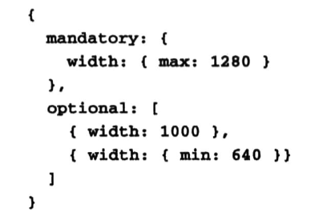

# WebRTC权威指南学习笔记（7）

## 第8章 W3C 文档（下）

### 8.3 WEBRTC 草案

接下来几节将介绍规范中重要的一些内容。

#### 8.3.1 WebRTC1.0：浏览器之间的实时通信

该文档是 WebRTC 研究工作的主要文档，私下通常称为“对等连接”草案。其中主要定义了 RTCPeerConnection 接口，并对 MediaStream 接口进行了扩展，大致内容包括：

- 核心 RTCPeerConnection 本身
- 数据 API
- DTMF API
- 统计数据 API
- 身份 API

##### 8.3.1.1 RTCPeerConnection 接口

RTCPeerConnection 接口是 WebRTC 技术的主要 API。此 API 的功能是在两个浏览器之间建立媒体连接路径。

RTCPeerConnection 对象的构造函数接收一个 RTCConfiguration 对象作为入参，该对象具有多个实用的属性：

- IceServers，可设置为服务器地址的数组，用于帮助通过 NAT 和防火墙（STUN 和 TURN 服务器）建立会话
- iceTransports，可设置为 none（无 ICE 处理）、relay（仅 TURN 服务）或 all（可接受 STUN 和 TURN），默认值为 all。
- requestIndentity：用于确定本地浏览器在哪些情况下需要获取对等端用户的身份

RTCPeerConnection 对象可以有关联的媒体流，媒体流的添加和删除分别使用`RTCPeerConnection.addStream`和`RTCPeerConnection.removeStream()`实现。但媒体流并非这些方法所创建，这些方法只是在要发送给远程对等端的流集合中添加或删除现有的本地流。

RTCPeerConnection 所触发的 SDP 会话协商由 Web 应用程序负责管理。换言之，addStream 和 removeStream 不会导致媒体开始流动或停止流动，但它们可以更改 RTCPeerConnection 对象的状态，从而引发 negotiationneeded 事件，应用程序可以通过捕获此事件，使用以下方式协商媒体：

1. 调用 createOffer()——用户代理将检查对等连接的内部状态，并生成相应的 RTCSessionDescription 对象（提议）
2. 对 RTCSessionDescription 对象调用 setLocalDescription()
3. 通过信令通道，将生成的 SDP 会话描述发送给远程对等端。

如果远程对等端是发送提议的一方，应用程序是应答方，则应该：

1. 改为调用 createAnswer() 并生成 RTCSessionDescription 对象。
2. 对 RTCSessionDescription 调用 setRemoteDescription()，完成提议/应答协商。

无论是本地端还是远程端，只要浏览器中成功应用了最终应答，实际媒体状态就会发生改变。

为何信令通道的设置和分析以及全部协商工作都交由应用程序执行呢？这种设计的主要目的是提高灵活性，有两个最大的优势：一是可以实现“缓慢型” ICE，其中 ICE 处理甚至可以在生成全部 ICE 候选项之前进行；二是能够根据需要修改 SDP。由于 SIP/SDP 互操作尚未完全实现，因此经常需要调整 SDP。

对等连接的复杂之处在于，它有两个进程：一是 ICE 进程，二是提议/应答媒体协商进程。这两个进程都有各自的状态机，提议/应答状态机由 JavaScript 进程控制，而 ICE 状态机则由浏览器控制。

由于应用程序可能需要更改 ICE 服务器集合或允许使用的传输方式，因此现在还有一个 iceUpdate() 方法，此方法与 RTCPeerConnection 构造函数接受同一个 RTCConfiguration 对象。

##### 8.3.1.2 DataChannel 接口

RTCDataChannel 接口用于在对等连接中建立双向数据通道，通过`RTCPeerConnection.createDataChannel()`方法创建。该对象接受一个 dataChannelDict 对象作为入参，通过该对象的各种属性可以控制两个主要特征：

- 通道的可靠性
- 传输顺序是否重要

创建新 RTCDataChannel 的进度由其`RTCDataChannel.readyState`属性跟踪，该属性的值包括 connecting、open、closing 和 closed。

数据通道建立后，将表现出类似 WebSocket 的行为，通过 send 方法发送数据，并能够对传入的消息设置 onmessage 处理程序。

##### 8.3.1.3 DTMF API

在连接到电话网络时，需要有一种方式能让 JavaScript 应用程序传达双音多频提示音（Dual Tone MultiFrequency DTMF）。具体而言，就是在对等连接协商媒体期间，同时发送 DTMF 数据包。这种方式就是 DTMF API，可以将 DTMF 功能与 RTCPeerConnection 所指定的 MediaStreamTrack 相关联。

此部分的创建方法为`RTCPeerConnection.createDTMFSender(MediaStreamTrack)`，随后便可通过新的 RTCDTMFSender 对象的`insertDTMF()`方法在对等连接中发送提示音。

要注意的是，DTMF 只能通过 RTCDTMFSender 插入，而不能通过原始 MediaStreamTrack 本身的任何方法直接插入。

##### 8.3.1.4 统计数据 API

该 API 用于从对等连接传输的轨道中进行统计数据，例如确定当前有多少数据包被送达。

##### 8.3.1.5 身份 API

此 API 假定浏览器已经使用声明的身份进行了配置，并配置有身份提供程序，因此如果在底层使用了 Web 身份提供程序，应该不需要 Web 应用程序执行任何操作。次 API 还为需要在提议/应答交换之前启动身份检查的应用程序提供了校验的方法。

##### 8.3.1.6 MediaStream 接口扩展项

该规范还额外扩展了 MediaStream 接口，首先每个 MediaStream 都有一个 ID 属性用于区别彼此。其次当远程端在现有 MediaStream 中进行操作，都会在本地生成相应的事件。

#### 8.3.2 媒体捕获和流

该文档用于定义从摄像头或麦克风等设备中获取本地媒体流的各种 API，在此前被称为 getusermedia 草案。

##### 8.3.2.1 getUserMedia() 方法

此 API 旨在供所有 Web 应用程序开发人员用作访问本地媒体的主要 API。

此规范最近还添加了 getMediaDevices() 方法，用于取代之前的 getSourceInfos() 方法，通过这一新方法，应用程序能够获取可供自己使用的外部源和接收器的初始列表。getMediaDevices 带有一个回调，该回调将一个 MediaDeviceInfo 对象作为入参，包含以下属性：

- deviceId：每一个不同的输入输出都有一个独立的 deviceId
- kind(指示音频/视频和输入/输出)
- label
- groupId：同一组输入和输出将拥有同一个 groupId

##### 8.3.2.2 设置、功能和约束

关于 getUserMedia() 的 contraints 参数，可以通过约束来选择和控制轨道，能够让应用程序提前指示不能接受哪些特定的轨道。比如说像下面的约束对象，就可以要求视频轨道的宽度尽量正好为 1000 像素，如果不能满足，则宽度至少应大于或等于 640，且绝对不得超过 1280 像素。

##### 8.3.2.3 MediaStream 接口

该接口用于创建表示媒体数据流的对象。

##### 8.3.2.4 MediaStreamTrack 接口

MediaStreamTrack 代表单个设备或录制内容可返回的单一类型的媒体。在此前并没有办法直接创建 MediaStreamTrack，但是后来规范定义了 AudioMediaStreamTrack 和 VideoMediaStreamTrack 子类，可以使用这二者的构造函数来创建这一对象。

#### 8.3.3 MediaStream 捕获情形

该文档会定义有关媒体捕获和媒体流的要求与使用情形。

### 8.4 相关工作

除了上面的文档外，还有一些方面则尚未纳入草案，以下将简要介绍这些内容：

- MediaStream 录制 API 规范

- 图像捕获 API

- future

  将所有 API 取消回调（`createOffer(gotSDP(), didntGetSdp())`）的使用方式而改为使用 future 的语法形式（`createOffer().done(gotSDP(), didntGetSDP())`）

- 媒体隐私

- MediaStream 的非活动状态

